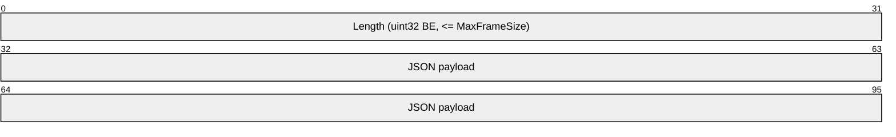
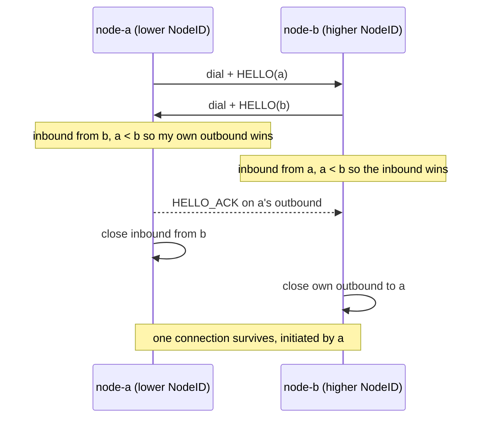
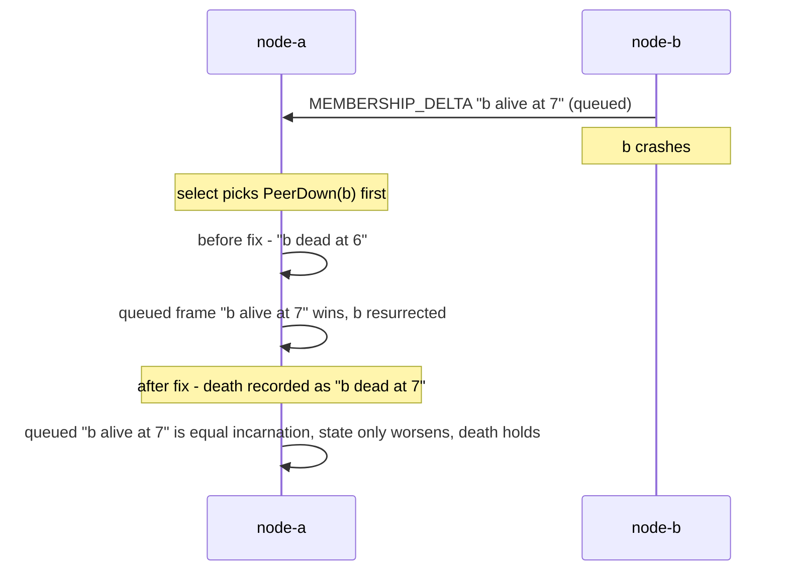
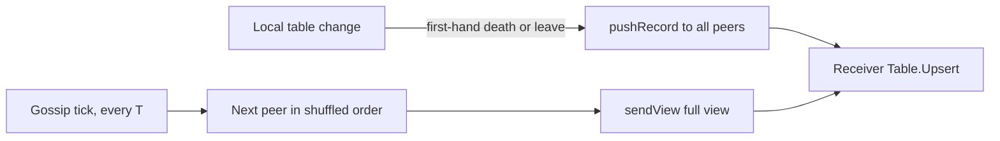
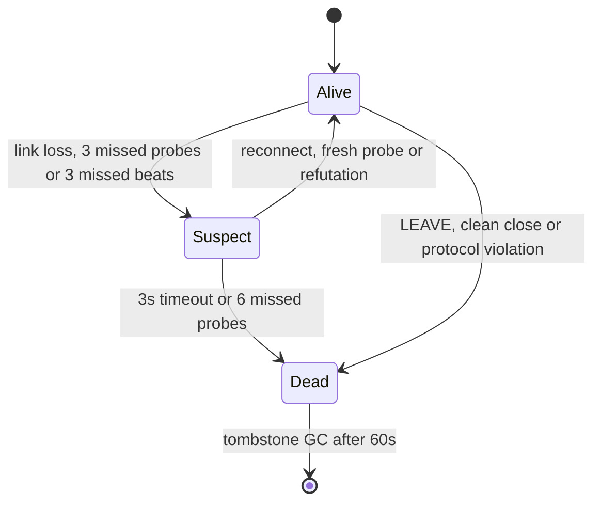
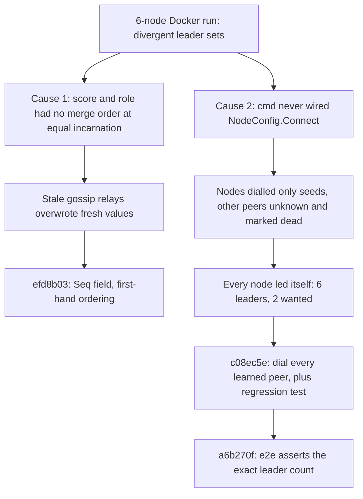

# Engineering Worklog

Append-only. Newest entries at the bottom. Every entry records who executed the work, what was
decided, what was rejected, why, and which concepts entered the syllabus as a result.

---

## 2026-09-16 -- Phase 1 -- Environment, Scaffolding & Curriculum Initialisation

### 1.1 Module and repository skeleton
**Agent:** `system-architect` (planning) -> direct execution
**Decision:** `go mod init swarm-net`; Go 1.27 toolchain; standard `cmd/` + `pkg/` layout; git
initialised.

**Alternatives evaluated:**
- *`internal/` instead of `pkg/`* -- `internal/` is the idiomatic choice for a binary-only module and
  would enforce that nothing outside imports these packages. **Rejected**: this repository's primary
  audience is readers, and `internal/` signals "not your business" to exactly the people we want
  reading it. The import-guard benefit is worth less than the invitation.
- *Flat single package* -- **Rejected**: the package seams are where the teaching happens. See
  [Repository Layout](/architecture/repo-layout).

### 1.2 Package boundaries fixed
**Agent:** `system-architect`
**Decision:** Five library packages with a strictly acyclic downward dependency graph:
`cmd` -> `cluster`/`telemetry` -> `health`/`network` -> `protocol`. `pkg/protocol` imports nothing
local.

**Rationale:** Each package gets one reason to change. The critical constraint is that `pkg/cluster`
never learns byte-level detail and `pkg/network` never learns message meaning -- otherwise the
`HealthStrategy` pluggability the brief demands becomes a refactor rather than an injection.

**Alternative rejected:** folding `health` into `cluster` as a single file. A strategy living beside
its only consumer reliably grows a dependency on that consumer's internals; separating it makes the
extension point real rather than aspirational.

### 1.3 Subagent definitions
**Agent:** direct execution
**Decision:** Four agents written to `.claude/agents/`: `system-architect`, `doc-educator`,
`go-engineer`, `sim-engineer`. Each carries explicit hard rules, not just a role description --
notably "no production code" for the architect and "never assume a `Read` returns a whole message"
for the engineer.

**Note:** agent definitions are loaded at session start, so the four roles were executed within this
session by direct delegation to general-purpose workers carrying the `doc-educator` brief verbatim.
From the next session onward they are addressable by name.

### 1.4 Documentation framework
**Agent:** `doc-educator`
**Decision:** VitePress 1.x, local search provider, sidebar grouped as
Start Here / Architecture / Concepts (three sub-groups) / -- with a Distributed Systems Theory group
created empty, to be filled in Phases 3 and 4.

**Alternatives evaluated:** Docusaurus (heavier, React-based, unnecessary for a docs-only site);
raw Markdown in the repo with no site (loses navigation and search, which is most of the value when
the curriculum crosses twenty pages). VitePress wins on zero-config Markdown fidelity and because
the Go build never depends on Node.

### 1.5 First Concept Discovery pass
**Agent:** `doc-educator`

Audit question: *given that Phase 2 and 3 will implement a framed TCP protocol with goroutine-driven
peer connections inside containers, what must an engineer understand before a single line of it
makes sense?*

Concepts identified and added to the syllabus:

| Page | Why it was nominated |
|---|---|
| `concepts/tcp-sockets-and-the-kernel` | Everything sits on the socket lifecycle. Accept queues, buffer sizing, TIME_WAIT and half-open sockets are all load-bearing for a swarm that kills containers on purpose. |
| `concepts/stream-framing` | The single most common source of bugs in hand-rolled TCP protocols. Also the direct prerequisite for the Phase 2 serialisation decision. |
| `concepts/nonblocking-io-and-epoll` | Explains why one-goroutine-per-connection is affordable at all, and what the runtime is hiding. |
| `concepts/docker-bridge-networking` | The mesh's discovery mechanism *is* the user-defined bridge's DNS. Container IP churn after a restart is a real failure mode for a cached peer table. |
| `concepts/go-scheduler-gmp` | Heartbeat timing is scheduler timing. A GC pause or a starved P looks exactly like a slow peer. |
| `concepts/go-netpoller` | The bridge between the epoll page and the Go code. Also where read deadlines come from -- the only safe way to bound a network read. |
| `concepts/csp-channels-and-memory-model` | The membership table is written by heartbeat goroutines and read by telemetry. That is a data race unless the memory model is understood, not guessed at. |
| `concepts/context-cancellation` | Cancellation, shutdown and failure detection are three different things. Fusing them causes a cancelled probe to be miscounted as a missed heartbeat -- a self-inflicted failover. |

### 1.6 Syllabus backlog nominated during the first pass

The authoring agents nominated further concepts while writing. Recorded here so the backlog is a
decision record rather than a memory. None are written yet; the phase column is when they become
blocking rather than merely useful.

| Nominated concept | Why | Needed by |
|---|---|---|
| Failure detectors: the impossibility of distinguishing slow from dead | FLP, Chandra-Toueg unreliable detectors, phi-accrual vs fixed K-missed-beats. $K$ is currently an unjustified constant. | Phase 4 |
| Heartbeat interval, jitter & the thundering herd | Every node probing on the same tick produces correlated spikes that themselves cause false-positive failures. | Phase 4 |
| Split-brain, quorum, and why `ceil(N*threshold)` is not consensus | The docs must be candid that this election gives up Raft-like safety, and say exactly what it gives up. | Phase 3 |
| Latency measurement as a statistic | Coordinated omission, tail vs mean, EWMA lag. Determines whether `LatencyHealthStrategy` elects *good* leaders or merely lucky ones. | Phase 2 |
| Backoff, retry & connection storms | Synchronised redial after a leader dies is a self-inflicted DDoS on the survivors. | Phase 4 |
| Monotonic vs wall clocks in Go | `time.Time`'s embedded monotonic reading, what survives serialisation, NTP step. Small page, high bug-prevention value. | Phase 2 |
| Go timers and the per-P timer heap | `Ticker` never fires early but can fire very late -- underpins every heartbeat timing claim already made. | Phase 4 |
| Backpressure & bounded queues | An unbounded send channel in front of a stalled socket is an OOM primitive; needs explicit per-frame-class drop policy. | Phase 3 |
| cgroups v2, CPU quota & throttling | Throttling presents as multi-millisecond latency cliffs, which latency-based election will read as peer sickness. | Phase 5 |
| The Go GC and tail latency | The other half of "why did this heartbeat arrive 30 ms late". | Phase 4 |
| Graceful shutdown & teardown ordering | FIN vs RST, SO_LINGER, draining an accept loop -- relevant the moment chaos controls start killing containers. | Phase 5 |
| Edge-triggered epoll vs a framing decoder | ET requires draining to `EAGAIN`, which interacts badly with a decoder that stops at a message boundary. | Phase 3 |
| WebSocket framing & the HTTP upgrade | The dashboard transport, hand-rolled or otherwise. | Phase 5 |
| The race detector in practice | What it can and cannot observe, and why a clean run is not a proof. | Phase 4 |
| Structured concurrency: WaitGroup, joins & goroutine ownership | Every spawned goroutine needs a named owner and a join. The spawn side is covered; the join side is not. | Phase 4 |
| Goroutine leak detection & pprof in practice | Reading `goroutine?debug=2`, mapping park states to root causes, leak-checked tests. Several pages point at symptoms that need this to diagnose. | Phase 4 |
| Backpressure & load shedding policy | What a dropped telemetry sample means versus a dropped heartbeat. Currently spread across pages with no home. | Phase 3 |
| Socket error taxonomy in Go | `ECONNREFUSED` vs `ETIMEDOUT` vs `ECONNRESET` vs `EOF` vs deadline-exceeded -- which are health signals and which are start-up noise. Recurs everywhere; needs one canonical page to link to. | Phase 3 |
| Kernel TCP timers & retry schedules | `tcp_syn_retries`, `tcp_retries2`, keepalive, `TCP_USER_TIMEOUT`. This knob set decides how fast failover *can* be, independent of our own $K$. | Phase 4 |
| IP identity vs node identity | IPAM recycling means a restarted node can inherit a dead peer's address. A distributed-systems problem wearing a Docker costume; belongs in `architecture/`. | Phase 3 |
| Container images & PID 1 | Exec-form `ENTRYPOINT`, signal forwarding, zombie reaping, minimal-image vs debuggability. Referenced as a commitment in the Docker page, not yet explained. | Phase 5 |

**Standing constraint recorded:** concept pages written before their code exists must not cite
`file.go:line` references. They state forward commitments instead, and are revised to cite real
locations as each phase lands. Fabricated line numbers would poison the one property that makes
this curriculum worth reading.


### 1.7 Build verification

`go build ./...` passes over the package skeleton (each `pkg/` directory carries a `doc.go` stating
its charter and its forbidden dependencies, so the layout is compiler-enforced from day one).

`npx vitepress build docs` passes with all 11 pages rendered and no dead links -- VitePress fails the
build on unresolvable internal links, so the cross-links between concept pages are verified, not
assumed.

One fix was needed: `config.js` uses ESM `import`, which requires `"type": "module"` in
`package.json`. The alternative -- renaming to `config.mts` -- was rejected because the brief names
`.vitepress/config.js` explicitly, and the package is docs-only so the module type has no bearing on
anything else.

---

## 2026-09-16 -- Phase 1 Checkpoint -- Decisions locked by the user

### 2.1 Wire format: length-prefixed JSON
**Decided:** `uint32` big-endian length prefix + JSON body.



**Rejected:** newline-delimited JSON -- no bound before the delimiter arrives, so a peer that never
sends `\n` is a one-packet OOM primitive; `bufio.Reader.ReadString` has no maximum. Also rejected:
hand-rolled binary -- schema evolution becomes manual versioning work for a saving we do not need at
this message rate.

**Binding consequences for `pkg/protocol`:**
- A `MaxFrameSize` constant is enforced *before* the payload buffer is allocated. Reading the length,
  then allocating that many bytes, then discovering it was 4 GB, is the bug this ordering exists to
  prevent.
- A frame decode error is unrecoverable on a stream: once the reader is off a frame boundary, every
  subsequent length is plausible garbage. The connection is dropped, never resynchronised.
- `TCP_NODELAY` stays on (Go's default). See
  [Stream Framing](/concepts/stream-framing) for why the Nagle/delayed-ACK interaction is a
  correctness bug in a latency-derived health model, not a performance nuisance.

### 2.2 Discovery: gossip from a seed
**Decided:** a joining node contacts a seed, receives the membership view, then propagates deltas
peer-to-peer. $N$ is genuinely dynamic -- not known at compose time.

**Rejected:** a static peer list from compose environment (simpler, but fixes $N$ at deploy time and
makes "scale the swarm live" impossible); a shared Docker network alias (Docker-specific, and the
DNS view lags real membership).

**Accepted costs, recorded honestly:**
- The seed is a bootstrap single point of failure. Mitigation: accept a *list* of seeds and treat
  reachability of any one as sufficient. The seed matters only at join time -- an established swarm
  survives seed loss.
- This materially expands Phase 3. Gossip needs a membership CRDT or versioned deltas, anti-entropy
  to repair divergence, and a decision on whether membership is eventually consistent (it is).
- Peer addresses are resolved by name at dial time and never cached. Container IP recycling after a
  chaos kill means a cached address can point at a *different, live* node -- the worst failure mode,
  because it fails silently. See [Docker Bridge Networking](/concepts/docker-bridge-networking).

### 2.3 `HealthStrategy` contract amended
**Decided:** the brief's signature is amended to carry a context, and score direction is fixed as
**lower-is-better (a cost)**.

```go
type HealthStrategy interface {
    Name() string
    EvaluateScore(ctx context.Context, target NodeAddress) (float64, error)
}
```

**Rationale for deviating from the brief:** without a context, a probe cannot be cancelled or
bounded by its caller, the deadline hides inside each implementation, and shutdown must wait out
every in-flight probe. That contradicts the deadline discipline committed to in
[The Netpoller](/concepts/go-netpoller) and
[Context & Cancellation](/concepts/context-cancellation). Lower-is-better was chosen over
higher-is-better because latency and CPU load map directly, and only capacity-style metrics need
inverting; inverting a latency near zero is numerically awkward in a way inverting free memory is not.

**Binding consequences:** `pkg/cluster` compares scores and never interprets them. A probe returning
an error is *not* a score of zero -- the distinction between "unreachable" and "excellent" must be
represented in the type, not encoded in a magic float. And per
[Context & Cancellation](/concepts/context-cancellation), a probe cancelled by shutdown must never be
counted as a missed heartbeat.

### 2.4 Election trigger: event-driven with a periodic floor
**Decided:** elect on membership change (join, or $K$-missed-beat eviction), and additionally
re-evaluate on a slow timer (~30 s) as a safety net.

**Rejected:** periodic-only (failover latency bounded below by $T$ even when death was detected
instantly); event-only (a single missed event leaves the swarm in a stale topology forever, with no
self-correction path).

**Accepted cost:** two paths into the same election routine, which must therefore be idempotent and
must produce the same result from the same membership view regardless of which path invoked it. This
is a testable property and will be tested as one. The periodic path must also not cause churn --
re-electing because a score moved by 0.3 ms is thrash, so hysteresis is required.

### 2.5 Syllabus additions triggered by these decisions

| Nominated concept | Why | Needed by |
|---|---|---|
| Gossip protocols & SWIM | The chosen discovery mechanism. Infection-style dissemination, fanout vs convergence time, piggybacked failure detection. | Phase 3 |
| Anti-entropy & eventual consistency of membership | Gossip converges; it does not agree. What that means when two nodes hold different views of $N$ at election time. | Phase 3 |
| Idempotence & hysteresis in control loops | Two triggers into one election routine, and the thrash that follows if a 0.3 ms score change can flip a leader. | Phase 4 |

---

## Open questions -- resolved 2026-09-16, retained for the record

1. **Wire serialisation and framing.** JSON over newline-delimited frames (readable with `netcat`,
   trivially debuggable, allocation-heavy) versus a length-prefixed binary envelope (bounded,
   cheap, requires tooling to inspect) versus a length-prefixed envelope carrying a JSON payload
   (the hybrid). Recommendation recorded when asked.
2. **Peer discovery.** Static seed list from compose environment versus gossip from a single seed
   versus Docker DNS round-robin on a shared network alias.
3. **`HealthStrategy` contract details.** Score direction (lower-is-better vs higher-is-better),
   normalisation, probe-failure semantics, and whether `EvaluateScore` should take a `context.Context`
   -- it must, if probes are ever to be cancellable, which means amending the interface in the brief.
4. **Election trigger.** Periodic re-evaluation versus event-driven on membership change.
5. **Split-brain policy.** What a minority partition is permitted to do.

---

## 2026-09-16 -- Phase 2 -- Wire Protocol & Pluggable Health Interface

### 3.1 Framing re-confirmed at the Phase 2 gate

**Agent:** `system-architect`

CLAUDE.md section 5 Phase 2.1 requires the framing question to be put to the user before code is
written. It had already been settled at the Phase 1 checkpoint (section 2.1), but an inherited
decision is not the same as a gate, so the trade-off was presented again in full and
confirmed explicitly. **Length-prefixed JSON stands.**

The analysis that carried it, recorded because the reasoning matters more than the verdict:

| | Delimiter (`\n`-terminated JSON) | Length-prefixed (`uint32` BE + JSON) |
|---|---|---|
| Size bound | Not known until the delimiter arrives | Known **before** any payload allocation |
| Payload coupling | Framing depends on JSON escaping newlines | Framing is payload-agnostic |
| Partial reads | `bufio` hides them, which hides the lesson | `io.ReadFull` makes them explicit |
| Bad frame | Resync is tempting and unsafe | Desync is unambiguous; drop the connection |
| Debuggability | `nc` just works | Needs a decoder |

The deciding argument was not elegance. This swarm is *designed* to have nodes `SIGKILL`ed
mid-write by the chaos controls, so a truncated frame is a routine expected event rather
than an exceptional one. Length-prefixing is the design in which that routine event has
exactly one correct response.

**Accepted cost and its mitigation.** Losing `nc` readability is a real loss for a teaching
repository. `go-engineer` was therefore tasked with `protocol.DumpStream`, an explicitly
non-production helper that renders a frame stream back into annotated, pretty-printed JSON.
The debuggability is bought back deliberately rather than mourned.

### 3.2 Contracts locked before implementation

**Agent:** `system-architect`

Per the contract-first mandate, the following were fixed *before* either implementation agent
started, so that two agents working concurrently in disjoint packages could not drift:

**Shared identity types** (`pkg/protocol/identity.go`, written directly by the architect because
both packages depend on them):

- `NodeID` -- stable, chosen at start-up, carried in every envelope, survives a restart.
- `NodeAddress` -- dialable `host:port`, **resolved at dial time and never cached as an IP**.

These are deliberately distinct types rather than two strings. A restarted container keeps its
`NodeID` and almost certainly receives a different IP; membership must track the former. Docker
recycles container IPs, so a cached address can resolve to a *different, live* container after a
chaos kill -- a failure that is silent, and therefore worse than an outright error.

**Framing invariants handed to `go-engineer` as non-negotiable:**

1. `MaxFrameSize` is checked against the decoded header **before** a byte of payload is
   allocated. This is the whole reason the format was chosen; an implementation that allocates
   first and validates second has kept the syntax and discarded the point.
2. A decode error is terminal. The connection is dropped, never resynchronised, and **no resync
   API is provided even as a convenience** -- an affordance that exists will eventually be used.
3. `io.ReadFull` for both header and payload. Never a bare `Read`.
4. A zero-length frame is a protocol violation, not a keepalive.
5. Deadlines are *not* `pkg/protocol`'s concern. The codec takes `io.Reader`/`io.Writer`, which
   keeps it unit-testable against a `bytes.Buffer`; deadline custody belongs to `pkg/network`.
   The codec documents the consequence rather than silently owning it.

**Forward-compatibility policy.** An unknown *message type* must be ignored, not fatal -- gossip
means a newer node will speak to an older one. A malformed *envelope* remains fatal. The two are
different failures and the code must not conflate them.

**Clock policy.** An envelope's timestamp is a wall-clock reading and may never be used to
compute a duration by subtracting two nodes' readings; there is no clock sync in this swarm.
Round-trip time is measured locally, by the sender, on the monotonic clock. This was written into
the envelope's doc comment rather than left to discipline.

### 3.3 `pkg/protocol` implemented

**Agent:** `go-engineer` * **Verification:** `gofmt`, `go vet`, `go test -race`, `go build ./...` all clean.
`message.go` (416), `framing.go` (392), `dump.go` (138), plus 811 lines of tests.

Decisions taken during implementation that were not dictated by the contract, recorded because
each one is a small argument rather than a preference:

- **`WriteEnvelope(*Envelope)` rather than `WriteFrame(v any)`.** An `any` parameter would let a
  caller frame a bare payload struct with no envelope, producing a frame that no `ReadFrame` can
  decode. That is a compile-time-preventable bug; leaving it to runtime bought nothing.
- **`IsProtocolViolation(err) bool` added.** The clean-close / died-mid-frame / speaking-garbage
  distinction is what the Phase 4 failover switch keys off. Centralising the classification in one
  named predicate stops it being re-derived, slightly differently, at each call site.
- **`ErrMalformedFrame` added** beyond the three sentinels the contract named. Without it,
  "peer is speaking garbage" had no sentinel at all -- only unwrapped `encoding/json` errors, which
  cannot be branched on.
- **`crypto/rand` for message IDs.** `math/rand`'s global source would hand identically-started
  containers the same sequence. A collision mis-attributes a `PONG` to the wrong `PING`, feeding a
  wrong-but-plausible RTT into leader election -- a silently wrong measurement, which is worse than
  a dropped one.
- **`nowUnixNano()` as a named function** rather than inline `time.Now().UnixNano()`, giving the
  package exactly one chokepoint where a wall-clock reading is taken and one place to carry the
  monotonic-stripping warning.
- **`DumpStream` re-implements the frame read** rather than calling `ReadFrame`, so it can display
  frames that `ReadFrame` rejects. A diagnostic that refuses to show you the broken frame is
  useless precisely when it is needed.

**One verified implementation detail worth preserving.** `json.RawMessage.UnmarshalJSON` is
`*m = append((*m)[0:0], data...)`, which copies; since the `Envelope` is freshly allocated per
`ReadFrame`, the append always allocates and the returned `Payload` never aliases the decoder's
reused scratch buffer. No explicit copy was needed. Because that is another package's internal
detail rather than a guarantee, it is pinned by `TestReadFramePayloadDoesNotAliasScratchBuffer`
rather than left as a comment. If `encoding/json` ever changes, the test fails and the fix is one
`append`.

**Anti-nomination, recorded so nobody writes it:** there is no page needed on "recovering a
desynchronised length-prefixed stream." It is impossible, no API for it exists, and if the syllabus
ever grows a page here it should be a page on why delimiters permit resync and length prefixes
do not.

### 3.4 `pkg/health` implemented

**Agent:** `go-engineer` * **Verification:** `gofmt`, `go vet`, `go test -race` all clean.
`strategy.go` (233), `latency.go` (453), plus 787 lines of tests. Imports only stdlib and
`pkg/protocol` (for `NodeAddress`), so the layering holds.

**The hard problem in this package, and how it was resolved.** Three events end a probe, and two of
them produce the *identical* `context.DeadlineExceeded` value:

| Event | Derived `ctx.Err()` | Meaning |
|---|---|---|
| Caller cancels | `context.Canceled` | Shutdown -- not evidence about the peer |
| Caller's own deadline expires | `context.DeadlineExceeded` | Caller stopped us -- not evidence |
| Our own `ProbeTimeout` expires | `context.DeadlineExceeded` | Peer too slow -- **is** evidence |

Rows 2 and 3 are indistinguishable by inspecting the returned error, so the discrimination is not
made from the error value at all. `classify` inspects the **parent** context's state: if the parent
is demonstrably still live, the only thing that can have expired is our own budget.

Two supporting decisions fall out of that:

- **`ErrProbeTimeout` deliberately does not wrap `context.DeadlineExceeded`** -- it formats the cause
  with `%v`, not `%w`. If it wrapped, `IsCancellation` would return true for a genuinely dead peer
  and **the swarm would never evict anyone**. A load-bearing *missing* `%w` cannot be protected by a
  comment, so it is pinned by `TestProbeTimeoutDoesNotWrapContextDeadline`; a future tidy-up fails
  loudly instead of quietly disabling failure detection.
- **The simultaneity race** -- caller cancels in the same instant our budget expires -- resolves in
  favour of *cancelled*. Losing one sample costs a probe interval; a false missed beat costs an
  election.

**Other decisions:**

- **`ScoreUnavailable()` is a function, not a var.** A package-level var is writable, and one stray
  assignment would turn every failed probe into that value -- most likely `0`, which reads as
  "perfect health for every dead node".
- **`Better(a, b)` added** as the single place lower-is-better is encoded. The interface signature is
  locked to `float64` by the contract, so a `type Cost float64` was unavailable; `Better` is the next
  best thing, and it handles invalid scores explicitly rather than relying on whoever writes the next
  ranking loop to remember NaN's comparison behaviour.
- **Negative durations from a `Prober` are rejected** as a failed probe. The usual cause is a
  wall-clock subtraction across an NTP step, and a negative sample folded into an EWMA would make a
  broken peer the most attractive leader in the swarm.
- **Coordinated omission is handled by splitting call result from history.** The failing *call*
  returns `(NaN, ErrUnreachable)` -- there is no valid measurement to report -- while a synthetic
  sample of `ProbeTimeout x FailurePenalty` (default 2x) is folded into the EWMA. The penalty
  *exceeds* the timeout so a peer pinned at the timeout ranks strictly worse than an honest slow peer
  that always answers, rather than tying with it.
- **Cancelled probes record nothing at all**, unlike failed probes, or every peer's score would
  degrade on every clean shutdown.
- **`sync.Mutex` + plain map, not `sync.Map`.** Every operation is a read-modify-write (load EWMA,
  blend, store) and `sync.Map` offers no atomic RMW, so it would need a per-entry mutex anyway. The
  lock is never held across a probe.
- **`Retain(keep)` alongside `Forget`.** Membership logic holds the new member set, not the diff, so
  `Retain` is the call it actually wants; the map stays bounded by live membership by construction
  rather than by the caller remembering to pair every departure with a `Forget`. The strategy runs no
  expiry timer of its own -- it has no membership knowledge, and a timer would be a second, competing
  opinion about who is in the swarm.

**`TCPConnectProber` is explicitly a Phase 2 placeholder.** Connect time measures something subtly
different from application RTT: the kernel completes the three-way handshake from the listen backlog
with **zero application involvement**, so a node in a GC pause or with a saturated scheduler still
answers a SYN in microseconds. Phase 3 replaces it with a `PING`/`PONG` round-trip over the
established mesh connection, which is the thing that actually matters for choosing a leader.

**Required call shape for `pkg/cluster`** (Phase 3 -- recorded here so it is not re-derived):

```go
score, err := strategy.EvaluateScore(ctx, peer)
switch {
case health.IsCancellation(err):
    return              // shutdown or superseded round: record nothing, elect nothing
case err != nil:
    missedBeats[peer]++ // a real statement about the peer
default:
    record(peer, score)
}
```

Ranking uses `health.Better(a, b)`, never a bare `<`. Cluster must also call `Forget`/`Retain` on
membership change, or the strategy retains an entry per address ever seen -- a slow leak, and a
source of stale scores once Docker recycles a container IP after a chaos kill.

### 3.5 Second Concept Discovery pass

**Agent:** `doc-educator` (four parallel instances) * 3,703 lines across six new pages and one revision.

The pass asked the mandated question -- *what must an engineer master to deeply understand what we
just built?* -- against the actual contents of `pkg/protocol` and `pkg/health`, not against a
prepared topic list.

| Page | Why this phase made it blocking |
|---|---|
| `stream-framing` (**revised**) | Written in Phase 1 against code that did not exist. Promoted from forward commitments to verified citations. |
| `io-reader-writer-contracts` | The `io.ReadFull` `EOF`/`ErrUnexpectedEOF` asymmetry *is* the clean-close vs died-mid-frame distinction that Phase 4 failover keys off. |
| `wire-protocol-design` | Envelope pattern, the unknown-type-ignorable / unknown-version-fatal asymmetry, correlation IDs, head-of-line blocking across the two planes. |
| `error-wrapping-and-classification` | The wrap chain is the classification API; `pkg/health` contains a load-bearing *missing* `%w`. |
| `interface-polymorphism` | Named explicitly by CLAUDE.md section 5 Phase 2.3. `HealthStrategy` is the thesis of `pkg/health`. |
| `monotonic-vs-wall-clocks` | Nominated Phase-2-blocking in section 1.6; two packages now depend on the distinction. |
| `latency-as-a-statistic` | Nominated in section 2.5. EWMA, coordinated omission, and NaN-as-a-safety-property. |

**The standing constraint held.** All 106 unique `file.go:line` citations across the documentation
set were mechanically checked against the real files. One was wrong -- a quotation in
`error-wrapping-and-classification` anchored at `strategy.go:98` when the quoted sentence sits at
`strategy.go:94` -- and was corrected. The quote itself was accurate; only the anchor had drifted.
Recorded here rather than silently fixed, because the value of the rule lies in it being seen to
be enforced. Three of the four agents also reported anchors from their briefs that had moved and
corrected them independently rather than transcribing stale numbers.

`npx vitepress build docs` renders 17 pages with no dead links. Because VitePress fails the build
on an unresolvable internal link, this is positive proof that the curriculum's cross-links resolve
-- verified, not assumed.

### 3.6 Syllabus backlog -- additions from the second pass

Merged and deduplicated across the four agents. Each row is tagged with the phase in which it
becomes blocking rather than merely desirable.

| Concept | Why it is needed | Needed by |
|---|---|---|
| TCP teardown & half-open sockets | FIN vs RST vs *nothing at all*; `CLOSE_WAIT`/`FIN_WAIT2`; why a SIGKILLed container in a torn-down netns may emit neither, and why `ESTABLISHED` is not evidence of a live peer. Asserted repeatedly across the Phase 2 pages with nowhere to point. **Highest-value gap in the set.** | Phase 3 |
| Deadlines & Go's I/O deadline model | `SetReadDeadline` is an absolute time, not a duration; `os.ErrDeadlineExceeded`; why a deadline firing mid-frame is terminal for a length-prefixed stream; idle vs whole-operation timeouts. Currently scattered across three pages' footnotes. | Phase 3 |
| Testing with adversarial fakes | `dripReader`/`chunkReader`/`headerOnlyReader` as a general technique: making an ordering invariant (validate-before-allocate) *observable to a test* rather than asserted in a comment. | Phase 3 |
| `encoding/json` mechanics | Deferred decoding, reflection and allocation profile, and the `RawMessage.UnmarshalJSON` copy contract that `pkg/protocol`'s buffer reuse depends on for correctness. | Phase 3 |
| TCP keepalive vs application failure detection | `SO_KEEPALIVE`, `tcp_keepalive_*`, `TCP_USER_TIMEOUT`, and why a per-host sysctl you do not control cannot be a protocol guarantee. | Phase 4 |
| Phi Accrual failure detectors | The sophisticated relative of the EWMA: a suspicion *level* from the distribution of inter-arrival times, rather than a boolean. What it would buy this swarm. | Phase 4 |
| Buffer reuse, escape analysis & GC pressure | Why `d.buf`/`e.buf` are retained, when reuse is safe, and how to *prove* a returned slice does not alias scratch memory. | Phase 4 |
| OOM as a protocol failure mode | cgroup v2 memory limits, the OOM killer, and why a process killed by the kernel cannot log the reason it died. | Phase 5 |

**Anti-nomination retained:** no page on recovering a desynchronised length-prefixed stream. See section 3.3.

---

## 2026-09-17 -- Phase 3 Planning -- Decisions locked, debt acknowledged

This entry is late. The Phase 3a build session was scoped to Go and forbidden from touching
`docs/`, so the decisions below were taken, acted on, and left unrecorded until now. The gap is
itself listed as debt in section 4.4. Nothing here is new to the code; it is the record catching
up with it.

### 4.1 Decisions locked with the user at the Phase 3 gate

**Agent:** `system-architect`

**Phase 3 split into 3a and 3b.** 3a is the socket mesh and the clustering engine; 3b is gossip
and anti-entropy. **Rejected:** building both in one pass. Debugging gossip on an unproven
transport means never knowing which layer is lying -- a lost delta could be a framing bug, a
dropped queue, a dead writer goroutine, or a merge-rule error, and with both layers unverified
there is no way to bisect. **Accepted cost:** 3a ships a mesh that only discovers peers via the
seed list, so a live scale-up is not exercised until 3b.

**Mesh topology: full mesh.** Every node holds one connection to every other node, `N^2/2`
connections swarm-wide. This is fine for tens of nodes, which is the design envelope; nobody is
proposing this for thousands. The property it buys is that any node can probe any node, which the
affinity rule in the brief requires: a worker must measure RTT to *every* leader to pick the
closest. **Rejected:** leader-only star (workers connect only to leaders, so a worker cannot
measure affinity across leaders it is not connected to, and a leader death severs the worker from
the swarm entirely); gossip-overlay partial mesh (each node keeps a random subset, which needs
routing so a probe can reach a non-neighbour -- an extra subsystem in a teaching system, bought
for a scale we do not target).

**Write model: per-connection writer goroutine draining two bounded queues.** One goroutine owns
the socket write side. It drains the control queue first and the data queue only when control is
empty. Control sends (`HEARTBEAT`, `PING`, `PONG`, election traffic) block briefly and then report
queue-full to the caller; data sends (`TASK`, `TELEMETRY`) are dropped on a full queue and a
counter is incremented. **Rejected:** one unbounded channel per connection (a stalled peer turns
the channel into an OOM primitive, per the backpressure nomination in section 1.6); direct
synchronous writes from the caller (a stalled peer's kernel send buffer fills, `Write` blocks, and
the blocked goroutine is whichever one called `Send` -- which is the election loop). The invariant
this preserves: **a dead peer cannot stall the election loop.** **Accepted cost:** a caller that
gets queue-full on a control frame has to decide what that means, and the answer differs by
message -- a dropped `PONG` costs the peer one RTT sample, a dropped election result costs a
round. That policy lives in `pkg/cluster`, not in `pkg/network`, and is owed as part of the
backpressure page.

**Split-brain policy: AP.** Any partition elects leaders. A node that can see fewer than a
majority of its last-known swarm size marks itself *degraded* and says so in telemetry, but it
keeps serving and keeps electing. There is no consensus algorithm. **Rejected:** minority
partition halts (CP behaviour -- correct for a database, wrong for a drone swarm where a
partitioned group of nodes with no leader is a group of nodes that has stopped coordinating);
Raft-style term-and-log agreement (heavyweight, and this system does not replicate a log that
needs linearisable agreement; it replicates a roster and a task ledger where the losing side of a
merge can be re-issued). **Stated plainly:** this is not Raft. Two partitions will each hold
leaders with overlapping worker rosters, and on heal the incarnation rule in `Table.Upsert`
decides whose view wins per node, not whose view was "right". The documentation must say exactly
what is given up. A page `architecture/why-not-consensus` is owed and is tracked in section 4.4.

**Simultaneous-dial tie-break: lower `NodeID` wins.** When two nodes dial each other in the same
instant, both end up with two connections to the same peer. The connection *initiated by* the
lower `NodeID` is kept; the other is closed by whichever side notices. Deterministic from
information both sides already hold after `HELLO`, so it needs no extra round trip and no
coordinator. **Rejected:** keep-the-first-established (racy -- "first" differs per side, so both
sides may keep different connections and both get closed); random (non-deterministic, unrepeatable
in tests).



**`TCPConnectProber` replaced by `MeshProber`.** The Phase 2 placeholder measured the kernel
three-way handshake, which completes from the listen backlog with zero application involvement.
A node in a GC pause, or with a starved scheduler, still answers a `SYN` in microseconds and would
be elected leader while comatose. `MeshProber` sends `PING` over the established mesh connection
and times the `PONG`, so the measurement includes the peer's reader goroutine, its scheduler, and
its writer queue -- the things a leader actually needs to be fast at. **Rejected:** keeping the
handshake prober with a heavier weighting on missed heartbeats (still elects the comatose node
first, and only corrects after $K$ misses). The `Prober` seam in `pkg/health` was designed for
exactly this swap, so `pkg/cluster` is untouched by it.

### 4.2 Decisions locked with the user for Phases 4 and 5

**Agent:** `system-architect`

Taken on 2026-09-17, ahead of their phases, because each one shapes a Phase 3 contract.

| Decision | Choice | Rejected | Accepted cost |
|---|---|---|---|
| WebSocket library | `github.com/coder/websocket` (formerly `nhooyr.io/websocket`) | `golang.org/x/net/websocket` (unmaintained API, no context support); hand-rolled RFC 6455 | One external dependency, against the stdlib-first rule. A hand-rolled server is ~250 lines of masking and close-handshake code that teaches nothing this curriculum needs. |
| Chaos controls | In-process, via a `CHAOS` control message from the Control Center: `kill` exits the process so Compose restarts it as a new incarnation, `delay` adds artificial latency to `PONG` and `HEARTBEAT` replies, `clear` removes it | Mounting the Docker socket into the Control Center | `kill` is cooperative, so it cannot simulate a node that is wedged and ignoring messages. The Docker-socket route was rejected because it is a privileged mount, Docker-only, and breaks the plain `go run` path. |
| Replication content | Leaders replicate term + attached-worker roster + a bounded task ledger to workers via a `STATE_SYNC` full snapshot. On promotion, the worker's last snapshot becomes the new leader's ledger and pending tasks are re-issued once | Roster-only | In-flight task bookkeeping survives failover at the cost of at-least-once task delivery: a task completed between the last snapshot and the failover will be re-issued. Roster-only was rejected because it loses that bookkeeping outright. |
| Gossip design (3b) | Push `MEMBERSHIP_DELTA` to all connected peers on every local table change, plus periodic anti-entropy: the full view sent as a delta to one random peer per interval. Merge is the existing incarnation rule in `Table.Upsert`, so a full view is just a large delta | A CRDT beyond incarnation numbers; SWIM-style piggybacking on heartbeats | Convergence is eventual, not bounded. Push-on-change gives fast propagation in the common case; anti-entropy repairs the case where a push was dropped by the data queue. No new merge machinery. |
| Control Center topology | Every node dials the Control Center (`SWARM_CONTROL_CENTER` env), completes `HELLO`, then sends periodic `TELEMETRY`. Tasks flow CC -> leaders -> attached workers; results flow back up the same path | CC dials nodes (needs CC to know addresses, which is the gossip problem again); CC as a mesh member (couples the coordinator to election) | The CC is a hub for telemetry and a single point of task ingress. Its loss stops new tasks but not the swarm: election and heartbeats never traverse it. |

### 4.3 Two defects found by tests during the 3a partial build

**Agent:** `go-engineer` * **Verification:** both pinned by named tests, `go test -race` clean.

Both were found by tests, not by review, and in both cases that was not luck: the defect was in
a branch that reads correctly and only misbehaves under scheduling the reader cannot see.

**1. `Conn.Send` accepted frames after `Close`.** `Send` offered the frame to its queue inside a
`select` that also watched the done channel. Go's `select` picks *at random* among ready cases,
so once done was closed and the queue had space, the send case won roughly half the time and a
closed connection reported success for bytes that could never be written. Review passes over
this because the `select` looks like the textbook shutdown idiom, and it is -- the idiom just
does not promise priority. **Fix:** an explicit closed-check before the frame is offered to any
queue, so a definitely-closed connection rejects deterministically with `ErrConnClosed`.
**Pinned by** `TestCloseIsIdempotentAndUnblocksEverything` in `pkg/network/conn_test.go`, which
asserts `ErrConnClosed` after `Close`. A single run would pass half the time; the test caught it
because it ran under `-race` and `-count` in the hardening pass and flaked.

**2. A role change could resurrect a dead node.** In `Table.Upsert`, a record arriving at *equal*
incarnation with a different role took the "apply the whole record" branch, and the whole record
carried the sender's stale `alive` state. A late `MEMBERSHIP_DELTA` saying "node-x is now a
leader" from a peer that had not yet heard node-x was dead would flip node-x back to alive at the
same incarnation, violating the rule that state at equal incarnation only worsens. Review misses
this because the role-change branch is about roles and nobody reads it as touching liveness.
**Fix:** clamp state first, then compare role and address, so the state monotonicity rule is
applied before any other field is considered. **Pinned by**
`TestRoleChangeCannotResurrectADeadNode` and `TestAtEqualIncarnationStateOnlyWorsens` in
`pkg/cluster/member_test.go`; the test exists because the invariant was written down as a
sentence in the plan and the engineer turned every sentence into a test.

**Recorded because it is the argument for the test-coverage rule.** Neither defect would have
produced a wrong answer often enough to be noticed in a demo. Both would have surfaced in
production as an unexplained election of a dead node.

### 4.4 Documentation debt acknowledged

Carried from `STATE.md` so it is in the decision record, not only in a handover note.

| Debt | Status | Owed by |
|---|---|---|
| No Phase 3 worklog entry | **Paid** by this entry. Sections 4.1 and 4.2 record the decisions, 4.3 the defects. | -- |
| `architecture/why-not-consensus` -- the honest Raft/Paxos comparison promised by `docs/architecture/overview.md`, stating exactly what the AP policy in 4.1 gives up | Not written | `doc-educator`, before the Phase 3 review gate |
| Concept pages written before `pkg/network` and `pkg/cluster` existed still state forward commitments rather than `file.go:NN` citations | Not promoted. The standing constraint from section 1.6 holds: every citation is verified with `grep -n` at the moment it is written. | `doc-educator`, after 3a lands and the files stop moving |
| `TCPConnectProber` is still the default prober, and it measures the wrong thing (see 4.1) | `MeshProber` not yet written. Until it lands, any election is driven by kernel handshake time rather than application responsiveness. | `go-engineer`, 3a |

### 4.5 Syllabus additions triggered by these decisions

Nominated for `doc-educator`. Rows already in the backlog (sections 1.6, 2.5, 3.6) are not
repeated; these are new.

| Nominated concept | Why | Needed by |
|---|---|---|
| CAP in practice: what an AP membership service actually promises | The split-brain policy in 4.1 is an AP choice made deliberately. The page must explain availability under partition, degraded mode, and why "both sides elect" is the intended behaviour and not a bug. Pairs with `why-not-consensus`. | Phase 3 |
| Symmetry breaking in distributed protocols | The lower-`NodeID` tie-break is one instance of a general pattern: resolving a symmetric race using information both sides already hold. Also underlies leader ranking ties. | Phase 3 |
| `select` fairness and shutdown ordering | Defect 1 in 4.3. Random case selection is documented behaviour, and the idiom that looks like it gives priority to a done channel does not. | Phase 3 |
| Monotonic merge rules and the incarnation number | Defect 2 in 4.3. Why a merge must apply the monotone field first, and why "state only worsens at equal incarnation" is the whole correctness argument for gossip in 3b. | Phase 3 |
| At-least-once task delivery and idempotent re-issue | The replication choice in 4.2 re-issues pending tasks on promotion. What a worker must do to make a duplicate harmless. | Phase 4 |
| Cooperative vs uncooperative failure injection | The `CHAOS` message can kill and delay but cannot wedge. What that leaves untested, and how a reader would test it outside Compose. | Phase 5 |

---

## 2026-09-17 -- Phase 3a close-out and Phase 3b -- Gossip & Anti-Entropy

Two sessions of work recorded in one entry. The first hardened Phase 3a and audited it under a
"no documentation writes" constraint, so `STATE.md` carried the record in the meantime. The second
fixed the audit findings and built Phase 3b. Earlier entries are not edited; corrections to them
are in section 5.5.

### 5.1 Phase 3a complete, and the hardening pass

**Agent:** `go-engineer`

Phase 3a (socket mesh and clustering engine) merged as `d1d94cc`. The hardening commits that
followed, merged as `05680c9`:

| Commit | What | Why it matters |
|---|---|---|
| `7684686` | `ci.yml`: gofmt, vet, `go test -race -count=2` | The Go suite had no CI gate. `deploy.yml` only built the docs. |
| `c1da135` | `FuzzDecodeFrame` | First fuzz target. The frame decoder is the one parser that reads bytes from untrusted peers. |
| `fc63794`, `b52e2be` | Framing and membership merge benchmarks | First benchmarks. They set the baseline 3b was measured against. |
| `6a6b523` | `Snapshot` 4 -> 1 allocs, `Leaders` 1.4-1.7x faster, `Size()` stops allocating | Anti-entropy calls these on every round. |
| `f9e3b29` | HIGH-1 fix (section 5.2) | -- |
| `cfece07`, `f0923d5` | `STATE.md` deleted, then restored | Deleted to make this worklog the only status record. Restored once the no-docs constraint froze the worklog: a stale single record is worse than two honest ones. |

**Baseline worth remembering:** `Table.Upsert` is zero-allocation and flat at 85-99 ns/op from
n=10 to n=1000. The steady-state anti-entropy merge is a mutex plus a map lookup.

### 5.2 Read-only audit of Phase 3a

**Agent:** `system-architect` (audit), `go-engineer` (fixes)

| Finding | Severity | Status |
|---|---|---|
| Unmeasurable node reports the best score | HIGH-1 | Fixed `f9e3b29`, regression tests `7f5af55` |
| A death loses the merge to a queued refutation | HIGH-2 | Fixed `2cc3060` |
| Poisoned peer keeps its connection but stays dead | MEDIUM-1 | **Open**, deferred by the user |
| `n.local` / `n.missed` never pruned | MEDIUM-2 | Fixed `610a210` |
| Refutation incarnation can overflow | unfiled | Fixed `c9c7dd9` |

**HIGH-1.** `selfScore` returned 0 when a node had peers but could measure none of them. Scores
are lower-is-better, so a blind node claimed to be the healthiest in the swarm and could displace
a healthy leader. `7f5af55` pins the two scenarios: a blind newcomer with the lowest ID must not
displace the incumbent, and an all-blind swarm falls back to lowest alive ID with no node holding
a score of 0.

**HIGH-2.** `SetState` recorded a death at the member's *current* incarnation. A refutation
already queued behind the crash carried a *higher* incarnation, so it won the merge and
resurrected a dead node. Nothing then buried it: turning missed probes into a death is Phase 4.



Under anti-entropy this would have been permanent: every node holding "alive at 7" re-asserts it
each round and wins each time. That is why HIGH-2 blocked 3b.

**Fix:** a transition to `StateDead` bumps the incarnation by one (`NextIncarnation`).

**Accepted cost:** a peer that was partitioned but stayed alive reconnects at its old incarnation.
That is now lower than its death record, so the handshake (`Table.Revive`) no longer revives it.
It heals through refutation instead: the full view sent on `PeerUp` contains its death, it bumps
past it and announces itself. One extra round trip, and the rule stays simple: only the node
itself can overturn its own death.

**MEDIUM-1.** A peer marked dead by `payloadOrPoison` keeps its TCP connection. A payload decode
failure is a framing success, so no `PeerDown`/`PeerUp` pair follows, and `Revive` never runs. The
peer stays invisible while a healthy connection to it is open. Reachable through version skew.
Deferred by the user. **Expected mitigation from 3b:** the poisoned peer's own gossip carries its
own record, and if it ever sees its death it refutes. This is untested and is not a fix.

**MEDIUM-2.** Per-peer score maps were never pruned, so `selfScore` took a median over peers that
had left, forever. `membershipChanged` now prunes both maps to the alive set, and
`applyProbeRound` drops results for peers that died mid-round.

**Incarnation overflow.** `refuteIfNeeded` set the node's incarnation to a peer-supplied value plus
one. A record at `math.MaxInt64` wrapped it negative, after which the node lost every merge about
itself. `NextIncarnation` now saturates. **Residual:** a death recorded at `MaxInt64` cannot be
refuted, because nothing can outrank it. Needs a corrupt or hostile peer, and 3a has no
authentication, so it is logged as debt (5.6), not fixed.

### 5.3 Decisions locked with the user

**Agent:** `system-architect`

| Decision | Choice | Rejected | Reasoning |
|---|---|---|---|
| `LEAVE` handling | Record a death, not a delete. Implemented as `markLeft` (`edb713f`), also used for a clean-close `PeerDown` | `Table.Remove` | A deleted record has no incarnation left to defend. The next full view from any peer re-inserts the departed node as alive. `markLeft` bypasses `markDead` on purpose: a goodbye is a fact, so Phase 4 suspicion must not apply. |
| Gossip peer selection | Shuffled round-robin, k=1, ~2s | One uniform random peer (4.2) | **Amends section 4.2.** A shuffled walk reaches every alive peer once per N rounds, so repair is bounded by $N \times T$. Uniform picks give only an expected bound, with a long tail where one peer is skipped for many rounds. |
| 3b scope | Dissemination and repair only | Adding suspicion and indirect probing | Suspicion changes how deaths are created, which is Phase 4's failure-detector work. Mixing both means a convergence bug cannot be pinned to one layer (same argument as the 3a/3b split in 4.1). |
| MEDIUM-1 | Deferred | Fix now | User's call. See 5.2. |

With $N = 10$ and $T = 2$ s, every peer has heard every other peer's full view within 20 s, even
if every push was dropped.

### 5.4 Phase 3b build

**Agent:** `go-engineer`



| Commit | What | Key choice |
|---|---|---|
| `a983c1a` | Gossip ticker and `gossipRound` | Full view to one peer per tick, reusing `sendView`. The permutation is redrawn when exhausted, and early **only when the alive set changes**. The table version is the cheap trigger, but it moves on every score report, and redrawing on each one would keep resetting the cursor and break the N-round bound. `Shuffle` is an injectable seam. |
| `c01ec88` | `pushRecord` for first-hand deaths and leaves | Local deaths were never broadcast before this. Relayed changes are **not** re-pushed: in a full mesh a broadcast already reached everyone, and push-on-receipt costs $N^2$ frames per change. Anti-entropy repairs whatever a push loses. |
| `cd3e6e4` | Convergence tests over real nodes | Dropped death push repaired, HIGH-2 interleaving under gossip, lost self-announcement repaired, and two nodes that never talk converging through a third. |
| `b048c37` | `SWARM_GOSSIP_INTERVAL` / `-gossip-interval` | Default 2s, validated like the other durations. The real-socket tests run gossip at 50ms over TCP. |
| `4012bf2` | Linear delta handling | See below. |

**Test harness race found.** The `quiesce` helper judged a node idle by queue length. That reads 0
while a loop is still handling a frame it already dequeued. Gossip is the first thing that
produces a frame *after* `FakeClock.Advance` returns, which exposed it. `quiesce` now repeats
passes until one delivers no new frame.

**Perf trap paid (`4012bf2`).** `handleMembershipDelta` took a fresh `Snapshot` per record. Under
anti-entropy every delta is a full view, so the receive path was $O(N^2 \log N)$ on the single
event loop. Hoisting the snapshot out of the loop was not enough on its own, because `View.Get`
is a linear scan, which still leaves $O(N^2)$. The fix also looks roles up by binary search over the
ID-sorted snapshot. `View.Get` stays linear, since it cannot assume an arbitrary `View` is sorted.

| n | before | after |
|---|---|---|
| 1000 | 125 ms, 57 MB, 1000 allocs | 212 us, 57 KB, 1 alloc |

Side effect: records in one delta now see roles as they stood before the delta. That is the more
correct reading.

**Open question from `STATE.md`, answered: does anti-entropy repair roles?** Partly.

- **Repaired:** the sender's own role. A full view includes the sender's record about itself, and
  receivers trust a role when `rec.ID == from`. A lost `announceSelf` is repaired by the sender's
  next gossip round to that peer. Pinned in `cd3e6e4`.
- **Not repaired:** relayed roles. A role about a third node is ignored by design, so if
  node-c's announcement never reached node-a directly, gossip from node-b does not fix it. It is
  fixed by node-c's own gossip round to node-a, within $N \times T$.

### 5.5 Corrections to section 4.4

**Agent:** `system-architect`

The 4.4 debt table is stale in two rows. It is left as written; this is the correction.

| 4.4 row | Stated | Actual |
|---|---|---|
| `architecture/why-not-consensus` | Not written | **Paid.** `docs/architecture/why-not-consensus.md` exists. |
| `MeshProber` | Not yet written, `TCPConnectProber` is the default | **Paid.** `pkg/network/prober.go` defines it and `cmd/swarm-node/main.go` wires it in. |

### 5.6 New debt and Phase 4 items

**Agent:** `system-architect`

| Item | Why it matters | Owner, phase |
|---|---|---|
| Death records (tombstones) are never garbage-collected | Every departed node stays in every full view forever. Each gossip round grows with churn, not with swarm size. GC must not reopen HIGH-2: drop a tombstone too early and a stale "alive" record resurrects the node. | `go-engineer`, Phase 4 |
| MEDIUM-1 | See 5.2. Deferred by the user. | Phase 4, pending user decision |
| Dead at `MaxInt64` cannot be refuted | See 5.2. Needs a bound on accepted incarnations, or authentication. | Phase 4 or later |
| Concept pages cite stale line numbers and describe mechanisms we do not ship (`StateSuspect` is never assigned) | Misleads readers. | `doc-educator`, in progress |
| `README.md` and `docs/index.md` said "Phase 1 of 5" | **Paid** alongside this entry. | -- |

### 5.7 Syllabus additions

**Agent:** `doc-educator` (authoring), nominated by `system-architect`

| Nominated concept | Why | Needed by |
|---|---|---|
| Monotonic merge and the incarnation number | Already nominated in 4.5. HIGH-2 makes it concrete: why a death must bump the incarnation, and why only the node itself may overturn its death. **Being written now.** | Phase 3 |
| Tombstones and garbage collection in gossip | 5.6. Why deleted records resurrect, how long a tombstone must live, and how that bound relates to $N \times T$. | Phase 4 |

---

## 2026-09-17 -- Phases 4 and 5 -- Failure Detection, Replication, Control Center

This entry covers `d464ac0..a6b270f`. Both phases were built at the same time against one
contract, then merged and verified together in Docker. Earlier entries are not edited.

### 6.1 Process decision: autonomous, parallel execution

**Agent:** `system-architect`

**Decision (user, 2026-09-17):** run Phases 4 and 5 autonomously, with no phase-gate reviews.
Parallel subagents each work in their own git worktree, and the lead merges their work.

| Option | Failure mode it invites | Outcome |
|---|---|---|
| Sequential phases, with a user gate after each (CLAUDE.md section 6) | Slow. Phase 5 sits idle until Phase 4 is done. | Waived by the user for these two phases |
| Parallel agents in one checkout | Agents overwrite each other's files (seen in session 3) | Rejected |
| Parallel agents in worktrees, one written contract | Integration bugs stay hidden until the merge | **Chosen** |

**Accepted cost:** bugs that sit between the two halves only show up after the merge. Section 6.6
describes exactly that.

### 6.2 The contract

**Agent:** `system-architect`

- `6694871`: compile-checked stubs in `pkg/cluster/control.go` (`SubmitTask`, `OnTaskResult`,
  `SetChaosDelay`, `Status`, `Executor`).
- `b31dd33`: `docs/architecture/control-plane.md` fixes the wire and HTTP surface: the node -> CC
  TCP links, the three task kinds, the REST paths and the WebSocket JSON.
- `bb6956d`: the only wire addition. `TaskRecord` gains `Kind` and `Body` (both `omitempty`).
  A promoted leader cannot re-issue a task it knows only by ID.

### 6.3 Phase 4 -- failure detection and heartbeats

**Agent:** `go-engineer`



| Decision | Choice | Rejected | Reasoning / accepted cost |
|---|---|---|---|
| Suspicion (`ac36fbd`) | `SuspectAfter` 3, `DeadAfter` 6, `SuspicionTimeout` 3s | Death on the first miss (Phase 3 behaviour) | A death bumps the incarnation, so a brief outage would cost a refutation and two re-elections. Cost: a real crash is confirmed after 3s, not at once. |
| Link loss | Marks the peer suspect, not dead | Ignoring resets and waiting for probes | A reset is the fastest signal. Workers leave the leader at once, and the pool's redial lands inside the 3s window. |
| Who confirms a suspicion | Only the node that raised it first-hand | Also confirming relayed suspicions | One node's bad link must not kill a healthy peer across the whole swarm. |
| Suspect leader (`9e85f40`) | Keeps its seat in `Elect` | Replacing it on doubt | Replacing on doubt means two re-elections for every lost packet. Workers already avoid the suspect, so only the promotion waits. |
| Heartbeats (`dc62692`) | Every 500ms, 3 misses allowed | Reusing probes | The reader goroutine sends PONGs, so a stuck event loop still answers them. The loop itself sends beats. |
| Terms | Lamport-style: adopt a higher term seen in a beat or ack | Dropping beats with an older term | Each node's term counts the leader changes it has seen, so healthy nodes can disagree. Dropping those beats would make workers abandon healthy leaders. An older beat is acked with the newer term instead. |
| Tombstone GC (`b3f6616`) | Remove a death 60s after this node first sees it. Drop a relayed tombstone for a member this node does not hold. | Keeping tombstones forever (5.6) | Views grow with swarm size, not with churn. Cost: 60s covers $(2N-1) \times T$ only up to $N \approx 15$ at $T = 2$ s. Past that, a stale record can bring back a dead node as a ghost, which is then detected and killed again. |

### 6.4 Phase 4 -- replication and tasks

**Agent:** `go-engineer`

| Decision | Choice | Rejected | Reasoning / accepted cost |
|---|---|---|---|
| Snapshot (`69ab6d3`) | A full `STATE_SYNC` snapshot after each change, re-sent every 2s, ordered by (Term, Version) | Deltas | Applying a snapshot twice is harmless, and the next one repairs a lost one. Cost: the bytes sent grow with the ledger. |
| Ledger | Holds at most 500 records. Completed records are evicted first. | No limit | If every record is pending, the oldest task is dropped with a warning. |
| Large bodies | Bodies over 1KiB are not replicated | Replicating every body | Keeps snapshots under the frame limit. Cost: such a task runs, but cannot be re-issued after failover. |
| Routing (`ab5d13d`) | The leader assigns tasks round-robin to its workers, and runs a task itself if no worker is reachable. A worker forwards to its leader, and a forwarded task is never forwarded again. | The CC picks the worker | The CC does not know the clusters. Forwarding only once rules out loops. |
| Load | At most 256 tasks run at once per node. Any task past that fails at once with `busy`. | No limit on goroutines | Tasks are dropped under load, not queued. |
| Re-issue | At-least-once, on three paths: promotion, a dead worker, a demoted leader's hand-off. `e63dd28` adds one more: workers left without a leader forward their copy's pending tasks to the next leader. | Exactly-once | Exactly-once needs consensus (see `why-not-consensus`). Duplicates are harmless, because the CC keeps the first result for each `task_id`. |
| Executor (`19c2d3d`) | `echo`, `sleep`, `hash`. `sleep` waits on the injected Clock. | `time.Sleep` | Tests stay deterministic under `FakeClock`. |

### 6.5 Phase 5 -- Control Center, dashboard, deployment

**Agent:** `go-engineer` (Go), `sim-engineer` (infra, frontend)

**Go:** `pkg/telemetry` (the node uplink), `pkg/controlcenter` (single-writer hub, node server,
HTTP and WebSocket) and `cmd/control-center`. The WebSocket library is `github.com/coder/websocket`
(chosen in 4.2).

Deviations from the contract. All were agreed and recorded in `control-plane.md` (`b69e048`).

| Deviation | Rejected | Why |
|---|---|---|
| The CC answers `HELLO` itself | Reusing `network.Pool` | The Pool gossips `KnownPeers`, so the CC would leak node addresses and act like a mesh member. |
| The CC sends `PING` every 5s | Relying on node telemetry | Otherwise the CC never sends anything on the link, and the node's read deadline would close it. |
| The node announces incarnation 0 on the CC link | Its real incarnation | If the CC address points at a mesh node by mistake, that node's pool rejects the older link and the real mesh link survives. |
| JSON `{"error"}` bodies with 400, 404, 503 | Plain-text errors | Scripts only have to parse one shape. |

**Infra:** a vanilla JS dashboard (`0fba1cb`), a multi-stage alpine `Dockerfile` with `node` and
`control-center` targets (`2e785e7`), and `docker-compose.yml`. Each replica gets its identity
from a reverse DNS lookup of its own IP (`deploy/node-entrypoint.sh`). Also `scripts/e2e.sh`
(`b30fb9c`) and a CI docker job (`8b7b762`).

**Fixes found in Docker:**

| Commit | Defect | Fix |
|---|---|---|
| `68707bb` | Compose runs the mesh with a 5s idle timeout, and the uplink used the same value. A 5s ping that arrived slightly late closed a healthy CC link. | The uplink uses `max(mesh, 15s)`, three keep-alive periods. |
| `af1b2b4` | The CC gives HTTP 5s to drain on SIGTERM, but Compose killed it sooner. | `stop_grace_period: 10s`. |

### 6.6 The convergence bug: two root causes

**Agent:** `go-engineer` (cause 1), `system-architect` as lead (cause 2)

In a 6-node Docker run, nodes held different leader sets.



**Cause 1 (`efd8b03`).** At equal incarnation, `Upsert` accepted any score, so the last value to
arrive won. Anti-entropy keeps relaying old views, so the disagreement never healed. Fix: a
per-member `Seq` that only the member itself bumps. Role and score are taken only from a newer
`Seq`, whoever relays them. A new deterministic simulator (`converge_test.go`) that reorders
frames across links found this. The same commit fixed four related defects:

- Hysteresis was 0 in production. It now defaults to 0.5.
- JOIN ping-pong. A worker now answers at most 3 rejections per probe round.
- A stale `JOIN_ACK` could re-point a worker's leader. It is now ignored.
- Orphaned attachments. A worker now voids its attachment when its leader steps down.

**Cause 2 (`c08ec5e`).** This bug dates back to Phase 3a. The Pool records addresses learned from
HELLO and gossip, but does not dial them. Only `NodeConfig.Connect` does, and `cmd` never set it.
Under Compose, every node was connected only to `seed`, a star instead of a mesh.

**Why it stayed hidden for two phases:**

- Loopback tests advertised port-0 addresses, which cannot be dialled anyway. So no test needed
  nodes to dial learned peers.
- `e2e.sh` checked for at least one leader. A node that leads itself counts as attached, so a run
  with 6 leaders still passed.

**Lesson:** assert the exact formula, not a lower bound. `e2e.sh` now requires exactly
$\max(1, \lceil N \times threshold \rceil)$ leaders.

### 6.7 CI and docs-site incident

**Agent:** `sim-engineer`

| Symptom | Root cause | Fix |
|---|---|---|
| The deployed site was blank | No VitePress `base`, so assets were served from `/assets/...` and returned 404 under `/swarm-communication/` | `51a7829`: `base` defaults to `/swarm-communication/` (override with `DOCS_BASE`), plus `.nojekyll` |
| Math pages logged "Hydration completed but contains mismatches" | `markdown-it-mathjax3` was added with `md.use()`, so Vue did not recognise the `mjx-` tags | `e7872ac`: VitePress `markdown.math: true` |
| `npm ci` failed in CI | The lockfile lacked `jsdom@30`, and jsdom 30 crashes on Node 20 (open item 1 in the previous `STATE.md`) | `37cc49c` regenerated the lockfile, `b85e5c2` moved CI to Node 22 |

The site is live at <https://aditya-jyoti.github.io/swarm-communication/>.

### 6.8 Verification

**Agent:** `system-architect`

| Check | Result |
|---|---|
| Docker e2e (`scripts/e2e.sh`, seed + 5 nodes) | 2 of 2 leaders. Failover took about 1s after `docker kill` stopped a leader. Task batches finished before and after. |
| Simulator (`f3e5a5e`), 16 seeds | After a leader crash, every seed converges at exactly +3s (the suspicion timeout) and stays stable for 20s. Every outstanding task is reported. |
| Chaos `delay` | The node shows as degraded |
| Chaos `kill` | The node exits, Compose restarts it, and it rejoins with a new incarnation |
| `hash` task | The output is the correct SHA-256 |

### 6.9 Open items

**Agent:** `system-architect`

| Item | Status |
|---|---|
| `TestSimultaneousDialLowerInitiatorWinsWhenItLandsFirst` times out at `-cpu 1` (seen on CI) | **OPEN** at the time of writing. Closed in 6.11. |
| MEDIUM-1 (5.2) | Open, deferred by the user |
| A death recorded at `MaxInt64` cannot be refuted | Open |
| Task bodies over 1KiB cannot be re-issued after failover | Accepted cost (6.4) |
| Tasks fail with `busy` when 256 are already running | Accepted cost (6.4) |
| The 60s tombstone TTL is only safe up to $N \approx 15$ at the default gossip interval | Accepted cost (6.3). The TTL should grow with $N$. |
| The CC is a single point of task ingress | Accepted in 4.2. The swarm keeps running without it. |

### 6.10 Syllabus additions

**Agent:** `doc-educator` (authoring), nominated by `system-architect`

Pages in `docs/architecture` and `docs/concepts` that no earlier syllabus table lists:

| Page | Why | Status |
|---|---|---|
| `architecture/control-plane` | The Phase 4/5 contract (6.2) | Written |
| `architecture/control-center` | The hub, node server and dashboard API (6.5) | Written |
| `architecture/running-the-swarm` | Compose, scaling, chaos, e2e | Written |
| `concepts/websocket-framing-and-upgrade` | The dashboard feed | Written |
| `concepts/container-images-and-pid-1` | The multi-stage image, and signals inside containers | Written |
| `concepts/graceful-shutdown-and-teardown-ordering` | `af1b2b4`, and the order in which the CC shuts down | Written |
| `concepts/cooperative-vs-uncooperative-failure-injection` | Nominated in 4.5 | Written |

Newly nominated in this phase:

| Concept | Why |
|---|---|
| Per-member sequence numbers for fields that are not monotone | Cause 1 in 6.6: why `Seq` is needed alongside the incarnation |
| Testing what you deploy | Cause 2 in 6.6: undialable test addresses and lower-bound assertions hid a star topology |

### 6.11 The flaky simultaneous-dial test: a lost wake-up

**Agent:** `go-engineer` * **Verification:** 18,000 runs at `-cpu 1,2,4` pinned to 2 loaded
cores, 0 failures (was about 1 in 250).

The timeout was not the dial logic being slow. At the moment of failure every map the waiter
watched was already empty, and the waiter was still parked in `sync.Cond.Wait`: a lost wake-up.
`untrackPending` in `pkg/network/pool.go` removed a socket from `pending` without
`p.changed.Broadcast()`. On most paths a later claim release broadcasts and hides the gap. A
HELLO rejected by the lower-NodeID tie-break takes no claim, so the removal was the only state
change and nobody was woken.

**Fix (`1aa504d`):** broadcast on every mutation of `pending`, and list every field the
condition variable covers next to its declaration. **Pinned by**
`TestRejectedInboundHandshakeWakesStateWaiters`, which fails deterministically without the
broadcast. `waitState` now dumps pool state and all goroutines on timeout.

Four test-side races were found by the same stress run and fixed (`4b1d53b`, `ce633f2`,
`15d44ac`, `ca861fc`): a gate released before the dial reached it, an `Err()` check racing
the accept loop's exit, `net.Pipe` failing `SetReadDeadline` once either end closed, and a
one-slot event buffer filled by a PeerUp the test did not wait for.

**Lesson recorded:** a `sync.Cond` is only as correct as the list of writers that broadcast.
Default `GOMAXPROCS` on an 8-core machine never showed this; a 2-core CI runner did.
