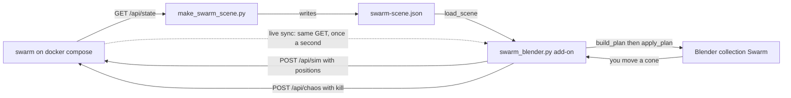
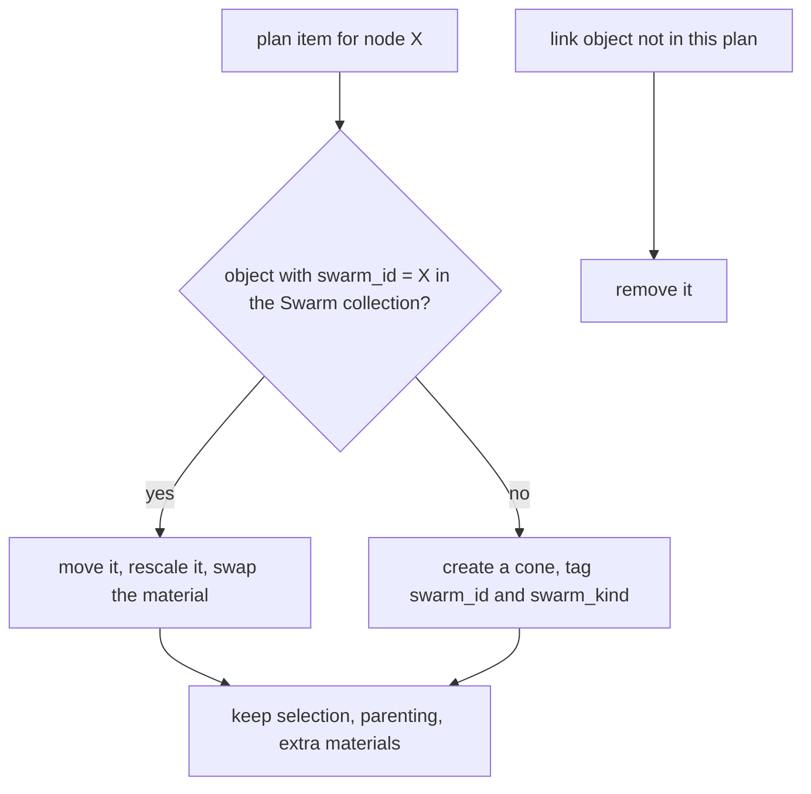
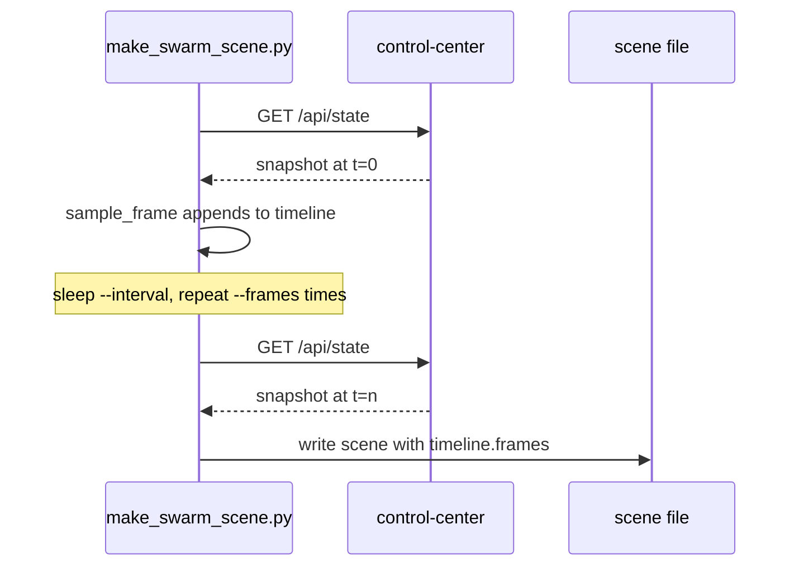
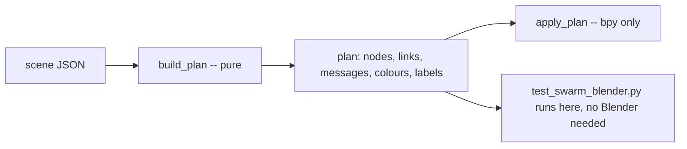

# Blender Scene Tooling

The dashboard draws the swarm in a canvas. The Blender tooling exports the same swarm as
a 3D scene you can light, render and animate -- and edit, with the edits landing back in
the running swarm.

Two files do the work:

| File | Role |
|---|---|
| `blender/make_swarm_scene.py` | Generator. `GET /api/state` -> `swarm-scene.json`. Plain Python 3, no dependencies. |
| `blender/swarm_blender.py` | Blender 4.x add-on plus a headless CLI. Builds the scene, polls for changes, pushes edits back. |
| `blender/swarm-scene.json` | A committed example, generated from a real 6-node swarm. |
| `blender/test_swarm_blender.py` | 26 tests of the half that does not need Blender. |

## 1. The pipeline



The dotted arrow and the solid one are the **same** endpoint. A scene file is a
reproducible snapshot; a URL is the live feed. `load_scene` in `blender/swarm_blender.py`
accepts either, and converts raw `/api/state` by importing the generator.

### One implementation of the format

The add-on does not re-derive the schema. `scene_from_state` puts the add-on's own
directory on `sys.path` and calls `make_swarm_scene.build_scene`. There is deliberately
**no `/api/scene` endpoint in Go and no copy in JavaScript**: a second implementation is a
second thing to keep in step, and it drifts silently. See
[One Implementation of a Schema](/concepts/one-implementation-of-a-schema).

The one fallback is `_minimal_scene`, used when only `swarm_blender.py` was installed as
an add-on and the generator is not on disk. It produces positions and nothing else -- no
links, no clusters -- so a degraded scene is obvious rather than subtly wrong.

## 2. Coordinates: units are the truth, metres are a rendering

The swarm speaks an abstract cube, `0..100` on each axis (`backend/pkg/geo/geo.go`).
Blender speaks metres, Z up. Every node carries both.

```json
"position_units": { "x": 21.8508, "y": 81.1883, "z": 38.9394 },
"location_m": [ -562.9848, 623.7667, 778.7872 ]
```

With $S = 100$ units per side and $k =$ `world.metres_per_unit`:

$$x_m = (x_u - S/2) \times k, \quad y_m = (y_u - S/2) \times k, \quad z_m = z_u \times k$$

X and Y are centred, so the space straddles the world origin and a camera orbits it
naturally. Z is **not** centred: it stays a height, so a node at `z = 0` sits on the
ground plane instead of half a kilometre under it.

The inverse, used when you push an edit back:

$$x_u = \mathrm{clamp}\!\left(\frac{x_m}{k} + \frac{S}{2},\ 0,\ S\right), \quad
z_u = \mathrm{clamp}\!\left(\frac{z_m}{k},\ 0,\ S\right)$$

`to_metres` in `blender/make_swarm_scene.py` is the forward direction,
`positions_payload` in `blender/swarm_blender.py` is the exact inverse, and
`test_metres_convert_back_to_the_units_they_came_from` pins the round trip. The clamp is
there because the backend clamps anyway (`geo.Params.Clamp`); clamping in the add-on keeps
the viewport honest about where the node actually went.

Check the example above: $(-562.9848 / 20) + 50 = 21.8508$.

### Which direction is real

| You do this | What happens |
|---|---|
| Move a dashboard slider | The swarm moves the node, re-measures latency, re-groups. Blender follows on the next poll. |
| Move a cone and press **Push positions** | `POST /api/sim`. Same effect -- the swarm re-groups for real. |
| Press **Kill selected node** | `POST /api/chaos`. The node stays dead; `docker compose up -d` brings it back. |
| Edit `location_m` in the JSON by hand | Only the render moves. The swarm never sees it. |

Editing is bidirectional, but there is one source of truth: `position_units`. `location_m`
is derived from it and is regenerated on every sync.

## 3. The scene file, section by section

Every section carries a `_doc` string, so the format explains itself when you open it
without this page.

| Section | What it holds |
|---|---|
| `schema` | `"swarm-scene/1"`. The add-on rejects anything else. |
| `meta` | When, from where, node and leader counts, `sim_version`. |
| `world` | `size_units`, `metres_per_unit`, `size_m`, `up_axis`, `fps`. |
| `sim` | The live latency model: `base_ms`, `per_unit_ms`, `jitter_ms`, `max_delay_ms`, overrides. |
| `clusters` | One entry per leader: its members and the colour they share. |
| `nodes` | Both coordinate systems, role, state, colours, telemetry. |
| `links` | Distance in units and metres, measured RTT, predicted one-way delay, `kind`. |
| `messages` | Per-link traffic by type, with a colour and a flight time. |
| `tasks` | The last 25 tasks. |
| `legend` | The dashboard's colour keys, so a render and the web UI agree. |
| `write_back` | The exact requests that change the running swarm. |
| `blender` | Render hints: mesh, sizes, what to draw, the sync URL. Safe to edit. |
| `timeline` | Only with `--frames`. One stripped snapshot per sample. |

### nodes

```json
{
  "id": "seed",
  "object_name": "Node_seed",
  "role": "worker",
  "state": "alive",
  "connected": true,
  "leader": "swarm-net-node-5",
  "cluster_colour": [0.95, 0.45, 0.25, 1.0],
  "state_colour": [0.85, 0.87, 0.9, 1.0],
  "position_units": { "x": 21.8508, "y": 81.1883, "z": 38.9394 },
  "location_m": [-562.9848, 623.7667, 778.7872],
  "telemetry": { "term": 8, "ledger_size": 0, "dropped": 0, "degraded": false,
                 "threshold": 0.3, "hysteresis": 0.5, "last_seen_ms": 701 }
}
```

- A node that is `alive` but not `connected` to the Control Center is rewritten to
  `disconnected`, so "I cannot see it" and "it is fine" never look the same.
- `node_colour` (pure core) picks the **cluster** colour for a healthy node and the
  **state** colour otherwise: "what is wrong with me" beats "whose cluster am I in".
- Leaders are drawn 1.6x larger. Size, not only colour, so a greyscale render still reads.
- A `dead` or `killed` node is marked `grounded` and is rotated 90 degrees: a crash, not a
  hovering corpse.

### links: measured versus predicted

```json
{ "from": "seed", "to": "swarm-net-node-1", "kind": "peer",
  "distance_units": 74.905, "distance_m": 1498.109,
  "rtt_ms": 152.015, "predicted_one_way_ms": 151.061 }
```

`rtt_ms` is what the prober actually measured. `predicted_one_way_ms` is what the model
asks for, with jitter at its mean:

$$\hat{t}_{oneway} = \min\left(base + d \times perUnit + \frac{jitter}{2},\ maxDelay\right)$$

With the committed scene's model ($base = 1$, $perUnit = 2$, $jitter = 0.5$) and
$d = 74.905$:

$$1 + 74.905 \times 2 + 0.25 = 151.06\ \mathrm{ms}$$

against 152.0 ms measured. The two are close because **only the responder delays its
PONG** (`MeshProber.SetPeerDelay` in `backend/pkg/network/prober.go`). A round trip is
therefore about *one* one-way delay plus real network time, not two. The ~1 ms gap is the
container-to-container hop and a jitter draw above the mean.

Neither number is derived from the other, on purpose. Storing both makes the model
falsifiable: if the gap grows, either the emulator is not being applied or something real
is slow. See [Network Emulation](/concepts/network-emulation).

`kind` is `cluster` for a worker-to-its-leader link and `peer` for the rest of the mesh.
The add-on draws only `cluster` links by default (`blender.draw_links`), because a full
mesh of $N(N-1)/2$ tubes hides the structure it is meant to show.

### blender hints

```json
"blender": { "collection": "Swarm", "node_mesh": "cone", "node_size_m": 12.0,
             "label_nodes": true, "draw_links": "cluster", "draw_ground_grid": true,
             "animate_messages": true,
             "sync": { "mode": "poll", "url": "http://127.0.0.1:8080/api/state",
                       "interval_s": 1.0 } }
```

These change the render, never the swarm. `draw_links` takes `cluster`, `all` or `none`.

## 4. Quick start

The swarm must be running.

```bash
docker compose up -d --build
python3 blender/make_swarm_scene.py           # -> blender/swarm-scene.json
```

```
wrote blender/swarm-scene.json: 6 nodes, 2 leaders, 15 links
```

Options:

| Flag | Default | Meaning |
|---|---|---|
| `--url` | `http://127.0.0.1:8080` | dashboard base URL |
| `--out` | `blender/swarm-scene.json` | output file, `-` for stdout |
| `--scale` | `20` | metres per swarm unit |
| `--frames` | `0` | samples to record as a `timeline` |
| `--interval` | `1.0` | seconds between samples |

In Blender 4.x:

1. `Edit > Preferences > Add-ons > Install...`, pick `blender/swarm_blender.py`, tick
   **Swarm Net**.
2. Press `N` in the 3D viewport, open the **Swarm** tab.
3. Set **Source** to the scene file, or straight to `http://127.0.0.1:8080/api/state`.
4. **Load / update** builds it. **Start live sync** follows the swarm every second.

Headless, without installing:

```bash
blender --python blender/swarm_blender.py -- --scene blender/swarm-scene.json
blender -b --python blender/swarm_blender.py -- --scene blender/swarm-scene.json --render /tmp/swarm.png
```

## 5. Update, not rebuild

Live sync re-applies a plan every second. If it deleted and recreated objects, your
selection, your parenting and any extra materials would vanish once a second and the
viewport would flicker.



Objects are matched by the custom property `swarm_id`, not by name, so renaming a cone in
the outliner does not orphan it. `apply_plan` removes link objects that are no longer in
the plan -- a worker that re-homes must not leave its old tube behind. Nodes are never
auto-removed: a node that dies is recoloured and grounded instead.

Materials are shared per `(state, cluster)` pair (`material_name`), so a 500-node swarm
creates a handful of materials, not 500.

## 6. Animation

```bash
python3 blender/make_swarm_scene.py --frames 120 --interval 0.5    # 60 s of swarm
```

The generator keeps polling and records a `timeline`: one stripped snapshot per sample,
holding `location_m`, `role`, `state`, `leader` and `connected`. Kill a leader while it
samples and you capture the failover as keyframes.



A failed sample stops the loop early rather than discarding what was already collected.

**The add-on does not read `timeline` yet.** `build_plan` uses the still snapshot only.
The timeline is recorded data: key it yourself, one keyframe per entry, at Blender frame
$i \times fps \times interval$ with `world.fps` (24). At `--interval 0.5` and 24 fps that
is a keyframe every 12 frames.

## 7. Scale

`--scale` sets $k$. The space is `world.size_m` = $100k$ across.

| `--scale` | Space size | Good for |
|---|---|---|
| 1 | 100 m | A tabletop swarm, tiny distances |
| 20 (default) | 2 km | Realistic node spacing, inside Blender's default 1000 m camera clip when you frame a cluster |
| 100 | 10 km | Wide-area. Raise the camera's clip end or distant nodes disappear. |

The scale only affects the render. Latency is computed from `distance_units`, which does
not change.

## 8. The pure core / bpy shell split

Everything above the `--- Blender layer ---` comment in `blender/swarm_blender.py` is
plain Python with **no `bpy` import**: `load_scene`, `scene_from_state`, `build_plan`,
`node_colour`, `material_name`, `link_label`, `positions_payload`, `base_url_of`. That is
where every decision is made. Below the line, `apply_plan`, `ensure_node`, `ensure_link`
and `ensure_ground` only translate the plan into `bpy.data` calls.



Two consequences worth naming:

- 26 tests run in 50 ms under plain `python3`. They cover the coordinate round trip, the
  clamp, colour and material choice, link labels, plan determinism, and that the committed
  scene file still parses.
- The cone mesh is built with `mesh.from_pydata`, not `bpy.ops.mesh.primitive_cone_add`.
  Operators need a view-layer context; in `blender -b` they raise
  `RuntimeError: Operator bpy.ops.mesh.primitive_cone_add.poll() failed, context is
  incorrect`. Building the vertices by hand works in both GUI and headless runs.

`_sync_tick` also never raises: a Blender timer that throws is silently unregistered,
which presents as "live sync just stopped for no reason". It catches everything and shows
the message in the panel's Status line instead.

## 9. What is verified, and what is not

| Part | Status |
|---|---|
| Generator against a live swarm | Verified. `blender/swarm-scene.json` was generated from a running 6-node stack. |
| Pure core of the add-on | Verified. 26 tests pass under plain Python 3. |
| The committed scene file parses and plans | Verified (`test_the_committed_scene_file_is_valid`). |
| Push-back payload shape | Verified against the documented `/api/sim` body, by test. |
| Everything below `--- Blender layer ---` | **Not verified.** Blender is not installed on the machine this was built on. The `bpy` calls are written against the Blender 4.x API and reviewed, not executed. |

If the add-on misbehaves in Blender, suspect the `bpy` half first, not the plan: dump the
plan with `python3 -c "import swarm_blender as sb, json; print(json.dumps(sb.build_plan(sb.load_scene('blender/swarm-scene.json')), indent=2))"`
and check it is what you expected before touching Blender.

## Common problems

| Symptom | Cause |
|---|---|
| `could not read .../api/state` | the stack is down. `docker compose up -d`. |
| Scene has nodes but no links or clusters | `_minimal_scene` fallback: `make_swarm_scene.py` is not next to the installed add-on. |
| Cones are there, everything is grey | same fallback -- it emits one flat colour. |
| Every node sits at the same height | `z` is a height, not centred. Positions really are that close. |
| Push positions says "nothing moved" | the 1 cm tolerance in `collect_moved`. Move a cone further than 0.01 m. |
| Live sync silently stale | check the panel's Status line. It holds the last error, truncated to 60 characters. |
| Distant nodes vanish in the viewport | camera clip end. Lower `--scale` or raise the clip. |
| A killed node never comes back | expected. `docker compose up -d`. |

## Related

- [Latency Simulation](./latency-simulation) -- the positions and the latency model
- [One Implementation of a Schema](/concepts/one-implementation-of-a-schema)
- [Network Emulation](/concepts/network-emulation)
- [The Control Center](./control-center) -- `/api/state`, `/api/sim`, `/api/chaos`
- [Running the Swarm](./running-the-swarm)
