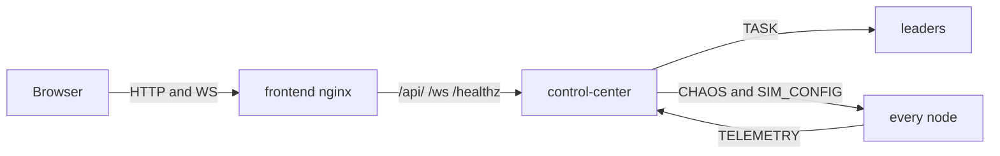
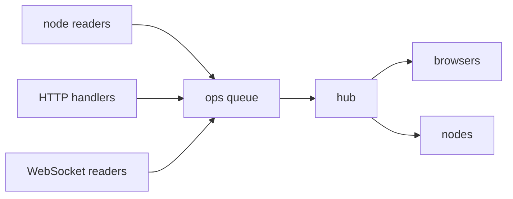
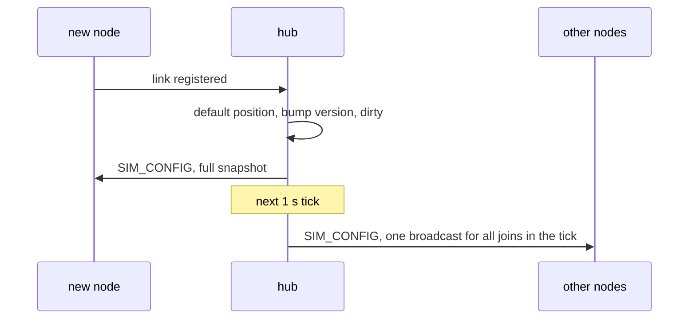
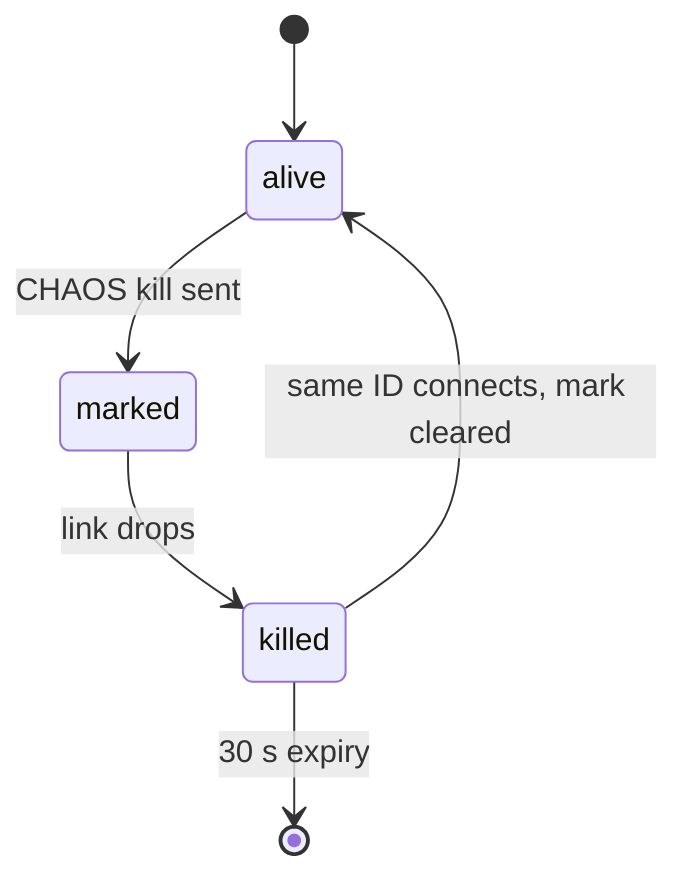
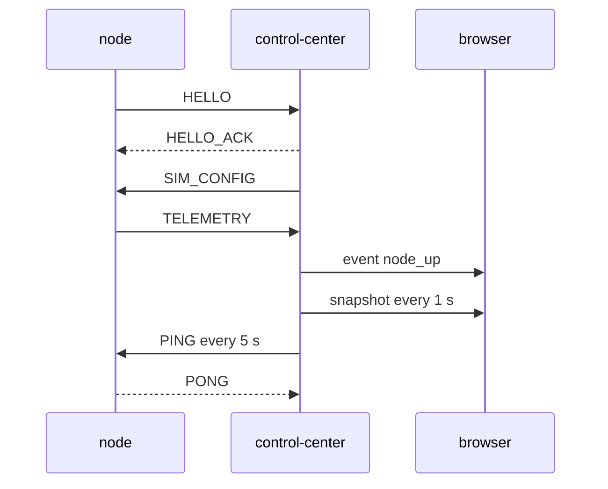
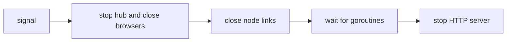

# The Control Center

The Control Center (CC) is one Go process with three jobs:

1. Accept a TCP link from every node and collect `TELEMETRY` and `TASK_RESULT`.
2. Serve a JSON API and a WebSocket feed.
3. Send `TASK` to leaders, `CHAOS` to any node, and `SIM_CONFIG` to every node.

It also owns the [drone simulation](./drone-simulation): every drone's position, the latency
model and the election overrides.

It does **not** serve the dashboard. The `frontend` nginx container does that and forwards API
and WebSocket traffic to the CC.

The mesh does not need the CC. Stop it and elections, heartbeats and failover carry on.

Code: `backend/pkg/controlcenter/` (the server), `backend/pkg/telemetry/` (the node side),
`backend/cmd/control-center/` (wiring).

## Where it sits



| Port | Used by | Setting |
|---|---|---|
| `8080` | HTTP API and WebSocket, reached through nginx | `SWARM_CC_HTTP` |
| `7000` | node links (framed TCP) | `SWARM_CC_LISTEN` |

## Inside: one owner for all state

One goroutine, the **hub** (`backend/pkg/controlcenter/hub.go`), owns the node list, the task list,
the set of browsers, the sim state (`backend/pkg/controlcenter/sim.go`) and the set of killed
IDs. Everything else sends it small functions to run. No locks are needed.



- Every second the hub sends a `snapshot` to each browser. The same tick expires old nodes and
  flushes pending sim changes (see below).
- A browser that falls 64 messages behind is dropped. It reconnects and gets a fresh snapshot.
  Waiting for it would stall every node.
- If a node connects twice, the newest link wins and the old one is closed quietly.

## State the hub keeps for the simulation

| State | What it is |
|---|---|
| `sim.version` | starts at the CC's start time in ms. Every change: `max(version + 1, now_ms)`. |
| `sim.enabled`, `sim.params` | the emulation switch and `base_ms`, `per_unit_ms`, `jitter_ms` |
| `sim.threshold`, `sim.hysteresis` | operator overrides. `0` and `-1` mean none. |
| `sim.positions` | every node ever seen, plus placements for IDs not yet connected. At most 4096. |
| `sim.dirty` | new nodes joined and the others have not been told yet |
| `killed` | IDs the CC sent CHAOS kill to |
| per node `flowsAt` | when the latest `flows` sample arrived |



- A request that changes nothing does not bump the version.
- `SIM_CONFIG` sends run in their own goroutines (`sendAsync`), like `CHAOS`. A failed send is
  not retried. The next change carries the full state anyway.
- The body is encoded once per broadcast, not once per node.

## Killed nodes



- A killed node is shown with `state: "killed"` and `connected: false`, never as merely
  disconnected.
- The mark is set when the kill is sent, even though the send is asynchronous. It only shows
  once the link drops.
- On reconnect the old telemetry is thrown away. The new process starts clean.

## The node link

A node dials `SWARM_CONTROL_CENTER` and does the normal `HELLO` handshake. The CC's node ID is
`control-center`.

- The CC is **not** a mesh member. Its `HELLO_ACK` carries no peer list, so it never feeds
  addresses into the mesh.
- Node to CC: `TELEMETRY` every `SWARM_TELEMETRY_INTERVAL` (default 1 s), and `TASK_RESULT`
  when a task finishes.
- CC to node: `TASK` (leaders only), `CHAOS`, `SIM_CONFIG` (on connect and on every change),
  and a `PING` every 5 s so an idle link is not timed out. The node answers `PONG`.
- `TELEMETRY` also carries `threshold`, `hysteresis`, `sim_version` and `flows`. The CC
  truncates `flows` to 256 entries before rebroadcasting it.
- A node uses incarnation 0 on this link. If `SWARM_CONTROL_CENTER` points at a mesh node by
  mistake, that link loses to the real mesh link and does no harm.
- A lost link is redialled with backoff. The node keeps up to 256 results while it is down.



## HTTP API

| Path | Purpose |
|---|---|
| `GET /ws` | WebSocket, JSON text messages |
| `GET /api/state` | the latest snapshot as JSON |
| `POST /api/tasks` | submit tasks. Returns `{"task_ids":[...]}` |
| `POST /api/chaos` | inject a fault. Returns `{"ok":true}` |
| `GET /api/sim` | the current sim config |
| `POST /api/sim` | partial sim update. Returns the new sim config. |
| `GET /healthz` | returns `ok` |

Request rules:

- POST bodies must be `Content-Type: application/json` (else 415), at most 64 KiB, with no
  unknown fields or trailing data (else 400). Task `kind` is at most 64 bytes.
- Cross-site browser requests (a foreign `Origin` or `Sec-Fetch-Site`) get 403. This blocks a
  malicious web page from making your browser call `/api/chaos` or `/api/sim`.
- If `SWARM_CC_API_TOKEN` is set, POSTs need `Authorization: Bearer <token>` (else 401), and a
  WebSocket may only send commands if its upgrade carried the token. Reads stay open.
- Task `output` is capped at 512 bytes and ends in `...[truncated]` when cut.
- Slow clients are cut off: header and request deadlines, and at most 128 node handshakes in
  progress at once.

Errors are always JSON:

```json
{"error": "bad request: task kind is required"}
```

| Status | When |
|---|---|
| 400 | bad JSON, unknown field, missing `kind` or `node`, invalid chaos action or delay, threshold outside `[0, 1]`, bad position key, more than 4096 positions, sim fields mixed with task or chaos fields |
| 401 | token required and missing or wrong |
| 403 | cross-site browser request |
| 404 | chaos target is not connected |
| 415 | body is not JSON |
| 503 | no connected leader, or the CC is shutting down |

The WebSocket only accepts same-origin requests.

## Messages

Browser to server (also the POST bodies, where `type` is optional):

```json
{"type": "task", "kind": "sleep", "body": {"ms": 100}, "count": 5}
{"type": "chaos", "node": "node-2", "action": "delay", "delay_ms": 300}
{"type": "sim", "per_unit_ms": 3, "positions": {"node-3": {"x": 10, "y": 80, "z": 35}}}
```

- `count` defaults to 1, at most 100.
- `action` is `kill`, `delay` (0 to 5000 ms) or `clear`.
- A `sim` message has no reply. The browser sees the result in the `sim` event and the next
  snapshot. The full field list is in [Drone Simulation](./drone-simulation#_7-http-and-websocket).

Server to browser, every second (shortened):

```json
{"type": "snapshot", "at_unix_ms": 1790000000000,
 "sim": {"version": 1790000000123, "enabled": true, "base_ms": 1, "per_unit_ms": 2,
         "jitter_ms": 0.5, "threshold": 0, "hysteresis": -1,
         "size": 100, "max_delay_ms": 1500},
 "nodes": [{"id": "node-1", "role": "leader", "state": "alive", "term": 3,
            "leader": "node-1", "connected": true, "ledger_size": 4,
            "peers": [], "scores": {},
            "pos": {"x": 43.1, "y": 19.3, "z": 75.5},
            "threshold": 0.3, "hysteresis": 0.5, "sim_version": 1790000000123,
            "flows": [{"to": "node-2", "type": "HEARTBEAT", "count": 2}]}],
 "tasks": [{"task_id": "t-1", "kind": "echo", "leader": "node-1",
            "worker": "node-2", "state": "done", "ok": true}]}
```

Server to browser, as things happen:

```json
{"type": "event", "at_unix_ms": 1790000000000, "kind": "leader_change",
 "node": "node-3", "detail": "worker -> leader"}
```

Event kinds: `node_up`, `node_down`, `leader_change`, `state_change`, `task_done`, `chaos`, `sim`.

Notes on the snapshot:

- A node whose link dropped stays listed with `connected: false` for 30 s.
- `state` can be `killed` (see above).
- `pos` is where the CC placed the node. `threshold`, `hysteresis` and `sim_version` are what
  the node reports, not the CC's overrides. They are 0 until the node's first telemetry.
- `flows` is the latest sample, emptied once older than 3 s. Never null.
- `tasks` holds the newest 200 tasks.
- A `score` of `-1` means **not measured yet**, not "excellent".

## Tasks through the CC

- The CC picks a leader round-robin from the latest telemetry.
- If a `TASK` cannot be queued, the task is marked `failed` at once.
- Delivery is at-least-once, so a result may arrive twice. The CC keeps the first.
- The CC keeps tasks in memory only. A CC restart forgets them.

## Shutdown order



WebSockets go first because the HTTP server's shutdown does not close them. See
[Graceful Shutdown and Teardown Ordering](/concepts/graceful-shutdown-and-teardown-ordering).

## Common problems

| Symptom | Likely cause |
|---|---|
| `POST /api/tasks` returns 503 `no connected leader` | the first election has not finished yet |
| log says `control center uplink misconfigured` | `SWARM_CONTROL_CENTER` points at a mesh node |
| dashboard keeps reconnecting with close code 1008 | the tab fell 64 messages behind (for example a throttled background tab) |
| WebSocket fails with HTTP 403 | the `Origin` does not match the host. Check the nginx proxy headers. |
| a task stays `pending` forever | its result was lost, or the CC restarted |
| `POST /api/sim` returns 400 `threshold` | a threshold below 0 or above 1. Use 0 to clear. |
| a `sim` change made no `sim` event | the request changed nothing |

## Related

- [WebSocket Framing and the HTTP Upgrade](/concepts/websocket-framing-and-upgrade)
- [CSP, Channels and the Memory Model](/concepts/csp-channels-and-memory-model)
- [Running the Swarm](./running-the-swarm)
- [Drone Simulation](./drone-simulation)
