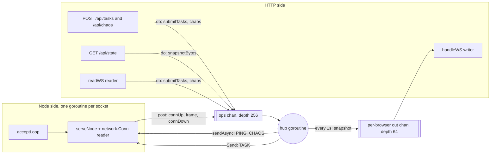
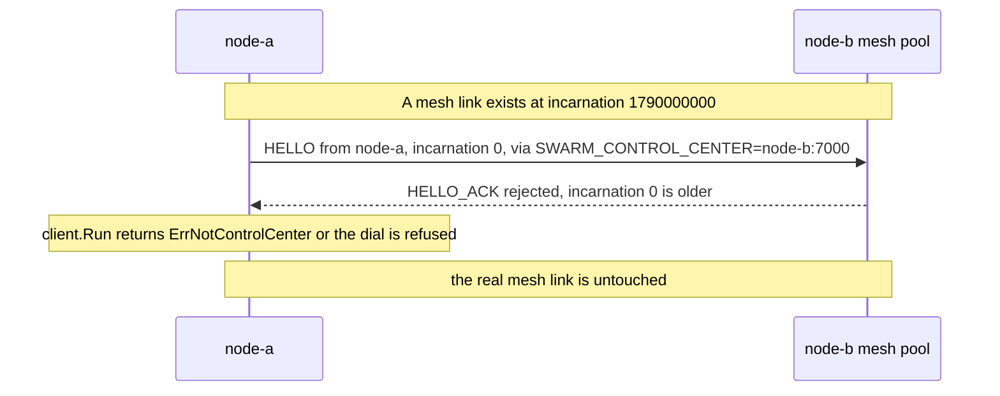
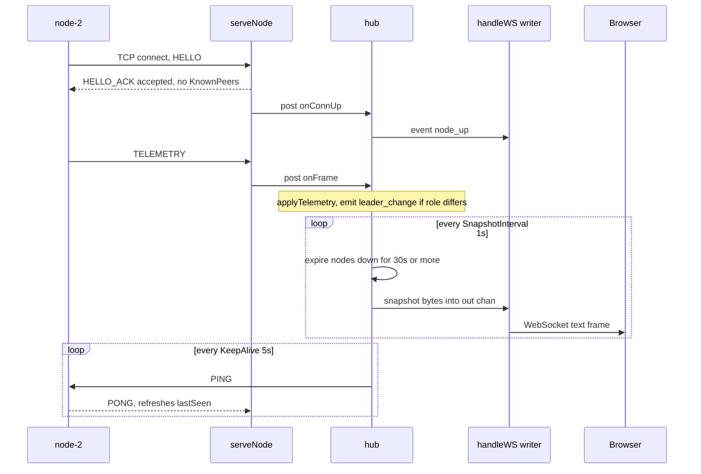
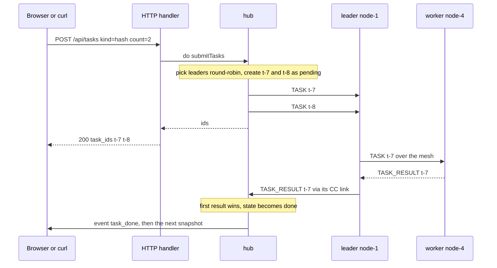
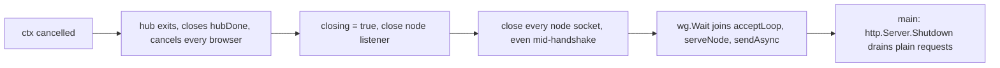

# The Control Center

The Control Center (CC) is one process with three jobs:

1. Accept a TCP link from every node and collect `TELEMETRY` and `TASK_RESULT`.
2. Serve the dashboard, a WebSocket feed, and a small JSON API.
3. Forward `TASK` to leaders and `CHAOS` to any node.

It coordinates nothing the mesh needs. Kill it and elections, heartbeats and
failover carry on. The wire and JSON shapes are fixed by the
[Control Plane Contract](./control-plane). This page covers how the CC is built.

Prerequisites: [Stream Framing](/concepts/stream-framing),
[CSP, Channels & The Memory Model](/concepts/csp-channels-and-memory-model),
[WebSocket Framing & The HTTP Upgrade](/concepts/websocket-framing-and-upgrade).

## Core Mental Model

One goroutine, the **hub**, owns all CC state. Everything else is a messenger
that posts closures to it.



| Piece | File | Owns |
|---|---|---|
| hub | `pkg/controlcenter/hub.go` | nodes, tasks, browser set |
| node server | `pkg/controlcenter/nodeserver.go` | accept, HELLO, one `network.Conn` per node |
| HTTP and WS | `pkg/controlcenter/http.go` | routes, JSON errors, browser read/write |
| lifecycle | `pkg/controlcenter/server.go` | `do`, `post`, shutdown order |
| wiring | `cmd/control-center/main.go` | flags, signals, `http.Server` |
| assets | `web/embed.go` | the dashboard, compiled into the binary |

## Under the Hood

### The hub: one owner, closures as messages

`hub.run` is a single `select` (`pkg/controlcenter/hub.go:73`). An op is just
`func(*hub)`, run at `hub.go:94-95`. No mutex guards node or task state because
only this goroutine ever touches it.

Two ways to reach the hub (`pkg/controlcenter/server.go`):

| Call | Waits for result? | Used by |
|---|---|---|
| `post(fn)` (`pkg/controlcenter/server.go:244`) | no, but blocks while `ops` is full | node readers: backpressure |
| `do(ctx, fn)` (`pkg/controlcenter/server.go:187`) | yes, bounded by `ctx` and `hubDone` | HTTP handlers, WS reader |

The subtle part of `do` is the timeout race. The caller may give up while `fn` is
still queued. Without care, `fn` would run later -- for example registering a
browser whose handler already returned. An atomic state settles who won:

```go
op := func(h *hub) {
	if !state.CompareAndSwap(queued, running) {
		return // the caller already gave up
	}
	fn(h)
	close(done)
}
// ... caller timed out:
if state.CompareAndSwap(queued, abandoned) {
	return false // fn will never run
}
<-done // fn already started, the hub always finishes it
```

See `pkg/controlcenter/server.go:203` and `pkg/controlcenter/server.go:222`. Exactly one CAS succeeds, so "timed out"
and "ran" are mutually exclusive.

`stopped()` (`pkg/controlcenter/server.go:233`) is checked before offering an op. `ops` is
buffered, so a bare `select` between "ops has room" and "hub is gone" would pick
at random and could queue work nobody will run.

### The node server: HELLO without a Pool

The CC does **not** use `network.Pool` for node links. A Pool answers `HELLO`
with `KnownPeers` = every address it has learned. The CC learns every node, so
it would hand each new node the whole swarm -- a second discovery path the
contract forbids. The reasoning is recorded at
`pkg/controlcenter/nodeserver.go:13-27`.

Instead the CC runs the acceptor half of the handshake itself
(`acceptHello`, `nodeserver.go:113`) and hands the socket to `network.NewConn`
(`nodeserver.go:103`), which brings framing, deadlines and queueing.

```go
// nodeserver.go:150 -- accepted, and deliberately empty
ack, err := protocol.NewReply(hello, protocol.TypeHelloAck, NodeID,
	protocol.HelloAckPayload{Accepted: true})
```

Details that matter:

- **One absolute deadline** for the whole exchange (`nodeserver.go:119`). A
  per-read timeout would let a peer trickle one byte at a time for ever.
- **Reserved ID.** A `HELLO` claiming `control-center` is rejected.
- **Handshake off the accept loop.** `go s.serveNode(raw)` so a silent client
  cannot stall `Accept`.
- **Accept backoff** from 5ms to 1s on errors such as `EMFILE`
  (`nodeserver.go:52-54`). A tight retry loop would burn a core.
- **The ready gate** (`nodeserver.go:90-105`). The node sends `TELEMETRY` the
  instant the handshake ends. The reader goroutine could deliver it before
  `connUp` is queued, and the hub drops frames from unknown links. The handler
  blocks on `<-ready`, which is closed only after `connUp` is posted.
- **Newest link wins** (`hub.go:119-124`). A second connection from the same ID
  is a restarted process or a redial after a half-open link. The old socket is
  closed, and its `connDown` finds it is no longer current (`hub.go:132`), so
  the dashboard sees no flap.

The node side mirrors this with a **private** `network.Pool`
(`pkg/telemetry/client.go:172`). Whatever that pool learns never reaches the
mesh pool.

### Keep-alive: the CC pings

The CC link is mostly one-way: node to CC. A node's `network.Conn` reaps any link
silent for `IdleTimeout` (default 15s, `pkg/network/conn.go:123`). A node with a
long `SWARM_TELEMETRY_INTERVAL` would see its CC link idle out while perfectly
healthy -- on the node side the CC sends nothing unless a task or chaos arrives.

So the hub sends `PING` to every connected node every `KeepAlive` = 5s
(`pkg/controlcenter/server.go:21`, `hub.go:223`). The node answers `PONG`
(`pkg/telemetry/client.go:327-339`), which refreshes the CC's read deadline too.

$$KeepAlive = 5s \ll IdleTimeout = 15s$$

With the defaults, two lost pings still leave a margin. The inequality is the
whole contract, and Compose breaks it: `SWARM_IDLE_TIMEOUT=5s`
(`docker-compose.yml:26`) also applies to the node's CC link
(`cmd/swarm-node/main.go:192`), so $KeepAlive = IdleTimeout$ and a PING that
arrives a few milliseconds late reaps a healthy link. See the failure table
below.

### Incarnation 0 on the CC link

The node announces **incarnation 0** on its CC link
(`pkg/telemetry/client.go:133-138`). This is a guard against one config mistake:



The pool tie-break keeps the higher incarnation (`pkg/network/registry.go:96-97`,
`pkg/network/admit.go:53`). With incarnation 0 the stray link always loses. Had
it won, it would have replaced a live mesh connection. If the handshake does
complete against a non-CC peer, the client sees a peer ID other than
`control-center` and stops with `ErrNotControlCenter`
(`pkg/telemetry/client.go:216-220`). The node keeps running without a CC.

The CC ignores the incarnation. Its rule is simply "newest link wins".

### From telemetry to the browser



- `applyTelemetry` overwrites `p.Node` with the link's ID (`hub.go:172`). The
  socket, not the payload, says who is speaking.
- A new browser gets a snapshot immediately in `addClient`, not after up to 1s.
- `peers` and `scores` are forced to `[]` and `{}` rather than `null`
  (`hub.go:421-426`). The browser calls `.length` and `Object.entries` on them.

### From a task submit to a result



- Leaders are the connected nodes whose latest telemetry says `role: leader`,
  sorted by ID for a stable round-robin (`hub.go:252`, `hub.go:283`).
- `TASK` is data plane: `Conn.Send` sheds instead of blocking. A shed task is
  marked `failed` at once rather than left pending for ever (`hub.go:302-307`).
- `applyResult` ignores a result for an unknown or settled task
  (`hub.go:191`). Delivery is at-least-once, so duplicates are expected.
- A node whose `SubmitTask` fails reports a failed result itself
  (`pkg/telemetry/client.go:303-308`), so the task does not hang as pending.

### HTTP, WebSocket and errors

Routes are in `Handler` (`pkg/controlcenter/http.go:30`). Bodies and WS messages
are capped at 64 KiB (`http.go:17`). Errors are always JSON:

| Sentinel | Status | Example body |
|---|---|---|
| `ErrBadRequest` | 400 | `{"error":"bad request: task kind is required"}` |
| `ErrUnknownNode` | 404 | `{"error":"node not connected: \"node-9\""}` |
| `ErrNoLeader` | 503 | `{"error":"no connected leader"}` |
| `ErrUnavailable` | 503 | `{"error":"control center not running"}` |

The mapping uses `errors.Is` (`http.go:134-145`). See
[Error Wrapping & Classification](/concepts/error-wrapping-and-classification).

Each browser gets two goroutines (`handleWS`, `http.go:160`):

- the handler itself is the **writer**, draining the client's `out` channel;
- one **reader** handles task and chaos messages and, just as important,
  processes control frames (ping, close). `coder/websocket` only does that
  while something is reading.

A `coder/websocket` pitfall shapes the code: **cancelling the context passed to
`Read` closes the whole connection.** If the reader shared the writer's context,
dropping a slow client would kill the socket before the writer could send a close
frame with a reason. So the reader runs on `context.WithoutCancel(ctx)`
(`http.go:194`) and ends when the connection is closed.

`websocket.Accept(w, r, nil)` (`http.go:163`) keeps the library default:
same-origin only. A page on another origin cannot drive chaos through a
visitor's browser.

### Slow browsers are dropped, not waited on

```go
// hub.go:368
func (h *hub) sendTo(c *wsClient, msg []byte) {
	select {
	case c.out <- msg:
	default: // 64 messages behind: drop this client
		delete(h.clients, c)
		c.cancel()
	}
}
```

If the hub waited on one stalled tab, it would stop reading `ops`, `post` would
block, and every node reader would stall behind it. Dropping is cheap: the
dashboard reconnects with backoff and gets a fresh snapshot. The writer then
closes with `1008 policy violation`, or `1001 going away` if the hub is shutting
down (`http.go:218-220`). See
[Backpressure & Bounded Queues](/concepts/backpressure-and-bounded-queues).

### Embedded assets

```go
//go:embed all:static
var static embed.FS
```

The directive is at `web/embed.go:20`. A `//go:embed` pattern that matches
nothing fails to compile. The `all:` prefix includes dot-files, so `web/static/.gitkeep` alone
satisfies it. Without `index.html` the CC serves a placeholder page
(`http.go:44-51`), so the binary works and tests pass without the frontend.

### The dashboard

`web/static/app.js` is plain JS with no build step. Points worth knowing:

- Reconnects with exponential backoff plus jitter, and drops a socket that has
  been silent for 8s even if the browser still reports it open.
- Falls back to `POST /api/tasks` and `/api/chaos` while the socket is down.
- `Kill` needs two clicks within 3s.
- **State is never shown by colour alone:**

| State | Visual cue besides colour |
|---|---|
| leader | larger circle with an "L" |
| suspect | dashed outline |
| dead | an X |
| disconnected from the CC | hollow circle |
| chaos delay active | a halo |

Every node also carries a text label in the node table.

### Shutdown

`Server.Run` stops things in a fixed order (`pkg/controlcenter/server.go:166-180`):



The hub goes first because WebSockets are **hijacked** connections, which
`http.Server.Shutdown` neither closes nor waits for
(`cmd/control-center/main.go:78-81`). Details in
[Graceful Shutdown & Teardown Ordering](/concepts/graceful-shutdown-and-teardown-ordering).

## Why It Matters in This Swarm

- **The CC is optional.** A node without `SWARM_CONTROL_CENTER` runs a full
  mesh (`cmd/swarm-node/main.go:182`). A CC restart shows up as a brief
  dashboard gap, never as a failover.
- **The CC cannot corrupt membership.** No `KnownPeers`, incarnation 0, and a
  private pool on the node side: three independent barriers between the
  observation plane and the mesh.
- **The hub design makes the dashboard honest.** One writer means one answer
  to "who changed this node's role", and events are emitted in the order the
  hub saw them.
- **Telemetry is a lossy sample stream.** A dropped `TELEMETRY` is replaced by
  the next tick. Results are not: the node buffers up to 256 while the link is
  down (`pkg/telemetry/client.go:247-253`).

## Common Failure Modes & Edge Cases

| Symptom | Cause |
|---|---|
| Nodes briefly show "disconnected", then reconnect. Node log: `control center disconnected ... disposition=timeout` | `KeepAlive` not well under the node's `IdleTimeout`. **Happens today under Compose** (5s vs 5s). Reproduced with `-idle-timeout 5s`: one timeout in 35s. |
| A node's mesh link flaps right after it starts | Would happen if the CC link used the real incarnation and `SWARM_CONTROL_CENTER` pointed at a peer. Incarnation 0 prevents it. |
| Log: `control center uplink misconfigured` | `SWARM_CONTROL_CENTER` reaches a mesh node, not the CC. The node runs on without a dashboard. |
| `POST /api/tasks` returns 503 `no connected leader` | No telemetry with `role: leader` yet, for example during the first seconds after start |
| A task stays `pending` for ever | The result was lost after the CC accepted the task (for example a CC restart forgets the task table). The CC has no task timeout. |
| Dashboard tab keeps reconnecting with close code 1008 | The tab cannot keep up (background tab throttling, slow machine). It fell 64 messages behind. |
| Browser console: WebSocket failed, HTTP 403 | Cross-origin page or a proxy rewriting `Host`. `Accept` rejects mismatched `Origin`. |
| First `TELEMETRY` of every node is lost | The ready gate was removed: frames reached the hub before `connUp`. |
| `docker compose stop` takes the full grace period for the CC | A goroutine not joined by `wg`, or a WebSocket left to `http.Server.Shutdown` |

## Related

- [Running the Swarm](./running-the-swarm) -- start it and use it.
- [Control Plane Contract](./control-plane) -- the shapes this page implements.
- [The Mesh and the Handshake](./mesh-and-handshake) -- the Pool the CC avoids.
- [Deadlines & I/O Timeouts](/concepts/deadlines-and-io-timeouts) -- why the
  keep-alive exists.
