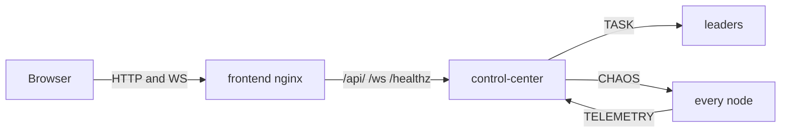
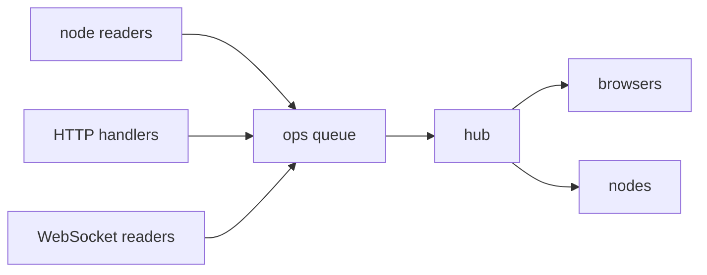
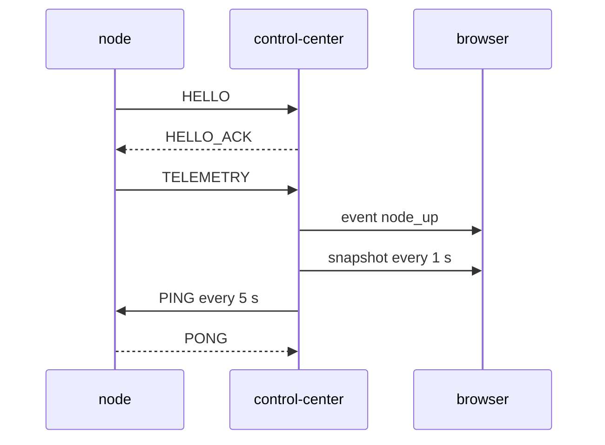
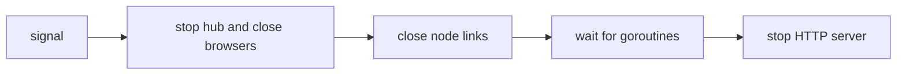

# The Control Center

The Control Center (CC) is one Go process with three jobs:

1. Accept a TCP link from every node and collect `TELEMETRY` and `TASK_RESULT`.
2. Serve a JSON API and a WebSocket feed.
3. Send `TASK` to leaders and `CHAOS` to any node.

It does **not** serve the dashboard. The `frontend` nginx container does that and forwards API
and WebSocket traffic to the CC.

The mesh does not need the CC. Stop it and elections, heartbeats and failover carry on.

Code: `backend/pkg/controlcenter/` (the server), `backend/pkg/telemetry/` (the node side),
`backend/cmd/control-center/` (wiring).

## Where it sits



| Port | Used by | Setting |
|---|---|---|
| `8080` | HTTP API and WebSocket, reached through nginx | `SWARM_CC_HTTP` |
| `7000` | node links (framed TCP) | `SWARM_CC_LISTEN` |

## Inside: one owner for all state

One goroutine, the **hub** (`backend/pkg/controlcenter/hub.go`), owns the node list, the task list
and the set of browsers. Everything else sends it small functions to run. No locks are needed.



- Every second the hub sends a `snapshot` to each browser.
- A browser that falls 64 messages behind is dropped. It reconnects and gets a fresh snapshot.
  Waiting for it would stall every node.
- If a node connects twice, the newest link wins and the old one is closed quietly.

## The node link

A node dials `SWARM_CONTROL_CENTER` and does the normal `HELLO` handshake. The CC's node ID is
`control-center`.

- The CC is **not** a mesh member. Its `HELLO_ACK` carries no peer list, so it never feeds
  addresses into the mesh.
- Node to CC: `TELEMETRY` every `SWARM_TELEMETRY_INTERVAL` (default 1 s), and `TASK_RESULT`
  when a task finishes.
- CC to node: `TASK` (leaders only), `CHAOS`, and a `PING` every 5 s so an idle link is not
  timed out. The node answers `PONG`.
- A node uses incarnation 0 on this link. If `SWARM_CONTROL_CENTER` points at a mesh node by
  mistake, that link loses to the real mesh link and does no harm.
- A lost link is redialled with backoff. The node keeps up to 256 results while it is down.



## HTTP API

| Path | Purpose |
|---|---|
| `GET /ws` | WebSocket, JSON text messages |
| `GET /api/state` | the latest snapshot as JSON |
| `POST /api/tasks` | submit tasks. Returns `{"task_ids":[...]}` |
| `POST /api/chaos` | inject a fault. Returns `{"ok":true}` |
| `GET /healthz` | returns `ok` |

Bodies are capped at 64 KiB. Errors are always JSON:

```json
{"error": "bad request: task kind is required"}
```

| Status | When |
|---|---|
| 400 | bad JSON, missing `kind` or `node`, invalid chaos action or delay |
| 404 | chaos target is not connected |
| 503 | no connected leader, or the CC is shutting down |

The WebSocket only accepts same-origin requests.

## Messages

Browser to server (also the POST bodies, where `type` is optional):

```json
{"type": "task", "kind": "sleep", "body": {"ms": 100}, "count": 5}
{"type": "chaos", "node": "node-2", "action": "delay", "delay_ms": 300}
```

- `count` defaults to 1, at most 100.
- `action` is `kill`, `delay` (0 to 5000 ms) or `clear`.

Server to browser, every second (shortened):

```json
{"type": "snapshot", "at_unix_ms": 1790000000000,
 "nodes": [{"id": "node-1", "role": "leader", "state": "alive", "term": 3,
            "leader": "node-1", "connected": true, "ledger_size": 4,
            "peers": [], "scores": {}}],
 "tasks": [{"task_id": "t-1", "kind": "echo", "leader": "node-1",
            "worker": "node-2", "state": "done", "ok": true}]}
```

Server to browser, as things happen:

```json
{"type": "event", "at_unix_ms": 1790000000000, "kind": "leader_change",
 "node": "node-3", "detail": "worker -> leader"}
```

Event kinds: `node_up`, `node_down`, `leader_change`, `state_change`, `task_done`, `chaos`.

Notes on the snapshot:

- A node whose link dropped stays listed with `connected: false` for 30 s.
- `tasks` holds the newest 200 tasks.
- A `score` of `-1` means **not measured yet**, not "excellent".

## Tasks through the CC

- The CC picks a leader round-robin from the latest telemetry.
- If a `TASK` cannot be queued, the task is marked `failed` at once.
- Delivery is at-least-once, so a result may arrive twice. The CC keeps the first.
- The CC keeps tasks in memory only. A CC restart forgets them.

## Shutdown order



WebSockets go first because the HTTP server's shutdown does not close them. See
[Graceful Shutdown and Teardown Ordering](/concepts/graceful-shutdown-and-teardown-ordering).

## Common problems

| Symptom | Likely cause |
|---|---|
| `POST /api/tasks` returns 503 `no connected leader` | the first election has not finished yet |
| log says `control center uplink misconfigured` | `SWARM_CONTROL_CENTER` points at a mesh node |
| dashboard keeps reconnecting with close code 1008 | the tab fell 64 messages behind (for example a throttled background tab) |
| WebSocket fails with HTTP 403 | the `Origin` does not match the host. Check the nginx proxy headers. |
| a task stays `pending` forever | its result was lost, or the CC restarted |

## Related

- [WebSocket Framing and the HTTP Upgrade](/concepts/websocket-framing-and-upgrade)
- [CSP, Channels and the Memory Model](/concepts/csp-channels-and-memory-model)
- [Running the Swarm](./running-the-swarm)
