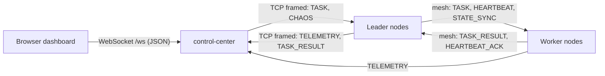

# Control Plane Contract

The fixed interface between the swarm nodes, the Control Center (CC), and the
browser dashboard. Phase 4 and Phase 5 are built in parallel against this page.



## 1. Node to Control Center (TCP)

- Every node dials `SWARM_CONTROL_CENTER` (host:port) and completes the normal
  `HELLO` handshake from `pkg/network`. The CC's `NodeID` is `control-center`.
- The CC is NOT a mesh member. Its connections never feed node membership, and the
  CC never advertises node addresses to nodes.
- Node -> CC: `TELEMETRY` every `SWARM_TELEMETRY_INTERVAL` (default 1s), and
  `TASK_RESULT` whenever a task led by that node completes
  (`NodeConfig.OnTaskResult`).
- CC -> node: `TASK` (only to leaders) and `CHAOS` (to any node).
- A lost CC link is redialled with backoff. Election and heartbeats never depend on it.

Node-side handling:

| Frame | Action |
|---|---|
| `TASK` | `Node.SubmitTask(ctx, payload)` |
| `CHAOS kill` | log, then `os.Exit(1)` (Compose restarts it as a new incarnation) |
| `CHAOS delay` | `MeshProber.SetDelay(d)` and `Node.SetChaosDelay(d)`; `0 <= delay_ms <= 5000` |
| `CHAOS clear` | both delays set to 0 |

## 2. Tasks

Built-in task kinds (`NodeConfig.Executor` default):

| kind | body | output |
|---|---|---|
| `echo` | any JSON | the body, verbatim |
| `sleep` | `{"ms": 200}` | `"slept 200ms"` (capped at 10000) |
| `hash` | `{"data": "abc"}` | hex SHA-256 of `data` |

Unknown kind: `ok=false`, output `"unknown task kind: X"`.

The CC picks a leader round-robin from the latest telemetry (`role == "leader"`).
Delivery is at-least-once: a task pending at failover is re-issued by the promoted
leader, so a result for the same `task_id` may arrive twice. The CC keeps the first.

## 3. HTTP and WebSocket (CC, default `:8080`)

| Path | Purpose |
|---|---|
| `GET /` | dashboard (embedded from `web/static/`) |
| `GET /ws` | WebSocket, JSON text messages |
| `GET /api/state` | the latest `snapshot` message as JSON (used by scripts) |
| `POST /api/tasks` | body = a `task` client message; returns `{"task_ids":[...]}` |
| `POST /api/chaos` | body = a `chaos` client message; returns `{"ok":true}` |
| `GET /healthz` | `ok` |

Server to browser, sent once on connect and then every 1s:

```json
{
  "type": "snapshot",
  "at_unix_ms": 1790000000000,
  "nodes": [
    {
      "id": "node-1", "role": "leader", "state": "alive", "term": 3,
      "leader": "node-1", "degraded": false, "connected": true,
      "last_seen_ms": 120, "dropped": 0, "ledger_size": 4,
      "peers": [{"id": "node-2", "advertise": "node-2:7946", "incarnation": 5,
                 "role": "worker", "state": "alive", "score": 0.4}],
      "scores": {"node-2:7946": 0.4}
    }
  ],
  "tasks": [
    {"task_id": "t-1", "kind": "echo", "leader": "node-1", "worker": "node-2",
     "state": "done", "ok": true, "output": "...", "duration_ms": 0.3,
     "submitted_unix_ms": 1790000000000}
  ]
}
```

- `nodes` is sorted by `id`. A node whose CC link dropped stays listed with
  `connected: false` for 30s, then disappears.
- `tasks` holds the newest 200 tasks, newest last. `state` is
  `pending` | `done` | `failed`.
- `peers` entries are `MemberRecord` exactly as on the wire.

Server to browser, sent as they happen:

```json
{"type": "event", "at_unix_ms": 1790000000000, "kind": "leader_change",
 "node": "node-3", "detail": "worker -> leader"}
```

`kind` is one of `node_up`, `node_down`, `leader_change`, `state_change`,
`task_done`, `chaos`.

Browser to server:

```json
{"type": "task", "kind": "sleep", "body": {"ms": 100}, "count": 5}
{"type": "chaos", "node": "node-2", "action": "delay", "delay_ms": 300}
```

`count` defaults to 1 and is capped at 100.
