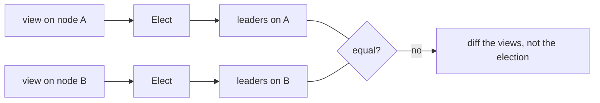
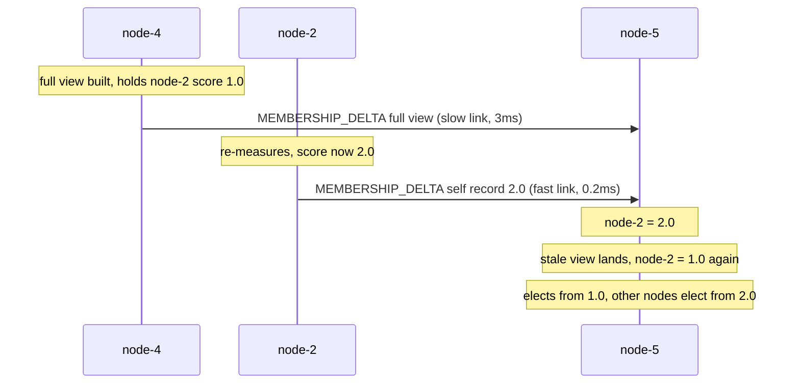
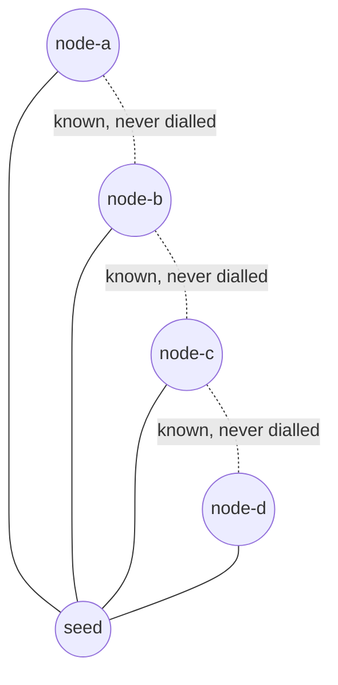

# Convergence Debugging: A Case Study

Phase 4 shipped after two bugs that made a Docker swarm elect the wrong leaders. Both passed
every unit test at the time. This page is how they were found, reproduced and fixed, and what
was wrong with the tests.

| | Bug 1: leader-set divergence | Bug 2: the star mesh |
|---|---|---|
| symptom | nodes settle on **different** leader sets | **every** node leads itself |
| root cause | self-reported claims had no merge order | `NodeConfig.Connect` never wired in `cmd` |
| fix commit | `efd8b03` | `c08ec5e`, `a6b270f` |
| regression test | `pkg/cluster/converge_test.go` | `TestNodesKnowingOnlyTheSeedFormAFullMesh` |

---

## Core Mental Model

### Same view, same leaders. Different view, different leaders.

`Elect` is a pure function (`pkg/cluster/election.go:126`). Two nodes with the same view and
the same scores always elect the same leaders. That is the swarm's only agreement mechanism.
See [Why Not Consensus](/architecture/why-not-consensus).

So the question for any divergence is never "is `Elect` wrong?". It is **"why do the inputs
differ, and why do they keep differing?"**



Gossip makes views **converge** only if merging is order-independent. A field that is merged
last-writer-wins by arrival order is not. See
[Monotonic Merge and Incarnation](/concepts/monotonic-merge-and-incarnation).

---

## Under the Hood

### Bug 1: leader-set divergence

**Evidence.** A 6-node Docker run where nodes settled on different leader sets, and stayed
there.

**The mechanism.** Each node gossips its own score (`selfScore`, `pkg/cluster/node.go:1646`).
Anti-entropy also relays everyone's score inside full views. Before the fix, at equal
incarnation, `Upsert` took any valid score it was handed. TCP keeps order **within** a link but
not **across** links:



Every gossip round sends more full views, so the stale value keeps arriving. The disagreement
never ends.

Roles had a different problem. They were believed only first-hand (`rec.ID == from`), which
protected them from stale relays but meant nobody but the owner could ever repair one.

**The reproduction.** A deterministic latency simulator, `simNet`
(`pkg/cluster/converge_test.go:37`):

| Property | How |
|---|---|
| per-link latency | seeded, 0.2 to 3 ms per directed link |
| FIFO within a link, reordered across links | a frame is due at `now + latency`, clamped to the link's last due time (`pkg/cluster/converge_test.go:113`) |
| scores that move | probe samples jitter every round |
| exact repeats | one seeded PRNG, a `FakeClock`, no real sockets |
| a strong oracle | `check()` (`pkg/cluster/converge_test.go:424`), below |

The oracle is the important part. At **every quiet moment** for 60 simulated seconds, on 16
seeds, it requires that:

- every node holds the same reported score for every member,
- every node holds the same leader set,
- every node's own role matches that set,
- every worker is attached to an elected leader, and that leader lists it.

Before the fix, `TestSwarmAgreesAtEveryQuietMomentUnderReordering`
(`pkg/cluster/converge_test.go:503`) failed on every seed.

**The fix.** A per-member sequence number, `Seq`, on `Member` and on the wire:

```go
// pkg/protocol/message.go:367
Seq uint64 `json:"seq,omitempty"`
```

- Only the member bumps it: `SetScore` and `SetRole` on its own record
  (`pkg/cluster/member.go:282`, `pkg/cluster/member.go:309`).
- At equal incarnation, role and score are taken **only from a newer `Seq`**, whoever relays
  it (`pkg/cluster/member.go:251`).
- State (alive, suspect, dead) is still merged separately: it can only get worse.
- A node starts at `Seq: 1` so anything it says outranks the `Seq: 0` placeholder a peer
  creates from its handshake (`pkg/cluster/node.go:499`).
- `Seq: 0` on both sides means an older build, and the old rules apply
  (`pkg/cluster/member.go:255`, `pkg/cluster/node.go:1270`).

Replay the diagram with `Seq`: the stale view carries `node-2 score 1.0 seq 4`, node-5 holds
`seq 5`, and the stale record is ignored. Isolated test:
`TestStaleRelayedScoreDoesNotOverwriteFresherOne` (`pkg/cluster/converge_test.go:565`).

### Four defects hiding behind bug 1

Once views agreed, the simulator exposed four more problems. Each got its own test.

| Defect | Evidence in the simulator | Fix | Test |
|---|---|---|---|
| zero hysteresis in production. `cmd` set only `Threshold`, and `Elect` reads `Hysteresis: 0` as "no damping" | about 35 re-elections per node per minute | `NodeConfig` maps 0 to the default margin (`pkg/cluster/node.go:218`) | `TestZeroElectionHysteresisTakesTheDefault` (`pkg/cluster/converge_test.go:763`) |
| JOIN ping-pong. Two nodes that disagree reject a worker with hints naming each other | about 100k `JOIN`/`JOIN_ACK` in one simulated instant | answer at most 3 rejections per probe round (`pkg/cluster/node.go:74`, `pkg/cluster/node.go:1774`) | `TestRejectionLoopIsBounded` (`pkg/cluster/converge_test.go:675`) |
| stale `JOIN_ACK`. An accept arriving after promotion, or after moving on, re-pointed `n.leader` | a leader "attached" to another leader | ignored unless it answers the JOIN still pending (`pkg/cluster/node.go:1428`) | `TestStaleJoinAckIsIgnored` (`pkg/cluster/converge_test.go:654`) |
| orphaned attachments. A leader dropped a worker whenever its own transient result seated that worker, and a leader that stepped down forgot workers that still thought they were attached | workers attached to leaders that did not list them | drop a worker only when the worker **claims** leadership (`pkg/cluster/node.go:1744`). A worker whose leader's Seq-ordered claim steps down voids the attachment and re-JOINs (`pkg/cluster/node.go:1309`) | `TestLeaderKeepsWorkerUntilItClaimsLeadership`, `TestWorkerRejoinsLeaderThatSteppedDown` (`pkg/cluster/converge_test.go:737`, `pkg/cluster/converge_test.go:710`) |

The hysteresis defect was invisible without bug 1's fix: while views disagreed, extra
re-elections looked like part of the same noise.
`TestSwarmDoesNotThrashOnSubMarginJitter` (`pkg/cluster/converge_test.go:527`) now requires
**zero** `ELECTION_RESULT` broadcasts over 60 s once converged, with jitter below the margin.

### Bug 2: the star mesh

**Evidence.** After bug 1 was fixed, the Compose swarm still misbehaved: six leaders where the
formula asked for two. The e2e script passed anyway.

**The mechanism.** A node dials its seeds. Everyone else it learns about (HELLO `KnownPeers`,
gossip) is handed to `NodeConfig.Connect` (`pkg/cluster/node.go:150`). `cmd/swarm-node` never set
it, so the hand-off was a no-op:

```go
// pkg/cluster/node.go:915
func (n *Node) connect(addr protocol.NodeAddress) {
	if addr == "" || n.cfg.Connect == nil {
		return // before the fix: always taken
	}
	...
}
```

The pool records learned addresses but does not dial them on its own
(`pkg/network/pool.go:416`). So the "mesh" was a star around the seed:



Every node learned every member through the seed's gossip, then failed to probe them
(no connection), suspected them, and declared them dead. With almost nobody alive in its own
view, each node elected itself.

**The fix.** One line in `cmd` (`cmd/swarm-node/main.go:235`):

```go
Connect: pool.Connect,
```

Regression test: three real nodes on loopback, the second and third knowing only the seed. It
asserts they dial **each other** and agree on leaders
(`TestNodesKnowingOnlyTheSeedFormAFullMesh`, `cmd/swarm-node/main_test.go:336`).

### Why the tests let both through

| Test | What it checked | Why it passed a broken swarm |
|---|---|---|
| in-package mesh tests | full agreement | frames delivered instantly and in send order, so no stale relay ever arrived late |
| in-package mesh tests | the mesh | the helpers connect every pair directly, so `Connect` was never needed |
| `TestTwoNodesConnectAndSeeEachOther` (`cmd/swarm-node/main_test.go:106`) | the real wiring | with two nodes, the seed **is** the whole mesh. A star and a full mesh look the same |
| `scripts/e2e.sh` | `leaders >= 1` and no unattached worker | a node that leads itself counts as attached. Six self-leaders passed |

The e2e oracle now derives the expected count from the spec formula
(`scripts/e2e.sh:165`) and requires it exactly (`scripts/e2e.sh:182`):

```bash
# want_leaders N -> max(1, ceil(N * THRESHOLD))
[ "$leaders" -eq "$wantl" ] && [ "$loose" -eq 0 ]
```

---

## Why It Matters in This Swarm

- **Weak oracles hide whole bugs.** "At least one leader" is true of a correct swarm and of a
  swarm with no mesh at all. An oracle must fail for the bug you fear. Derive the expected value
  from the spec, not from "something happened".
- **Agreement must be checked at every moment, not eventually.** An "eventually converges"
  test with a long timeout passes a swarm that flips back and forth. `check()` runs on every
  quiet step.
- **Delivery order is an input.** A test transport that delivers in send order cannot find
  reordering bugs. `simNet` exists to make order adversarial and still repeatable.
- **Test the wiring, with $N \ge 3$.** Two nodes cannot tell a star from a mesh. The composition
  in `cmd` is code too.
- **Fixing one bug can reveal the next.** The hysteresis and JOIN defects were only visible
  once views agreed.

---

## Common Failure Modes & Edge Cases

### Diagnosing a divergence in a live swarm

Symptom: the dashboard shows two nodes with different `leaders`. Steps:

1. Compare each node's `peers` in `/api/state`. Look for one member with different `score` or
   `role` on different nodes.
2. Compare that member's `seq`. Different `seq` means a newer claim has not reached everyone
   yet. Same `seq` and different values means an ordering bug.
3. Compare `incarnation`. A difference there is a restart or a death, not a score problem.

```bash
curl -s localhost:8080/api/state | jq -r '.nodes[] | .id as $n
  | .peers[] | select(.id=="node-2") | "\($n) seq=\(.seq) score=\(.score) role=\(.role)"'
```

### Every node leads itself

Symptom: leader count equals node count. First suspect the mesh, not the election. Check that
non-seed nodes log `learned peer address; connecting` (`pkg/cluster/node.go:927`) and that each
node's pool lists $N - 1$ peers.

### A thrashing swarm with agreeing views

Symptom: all nodes agree, but `leaders changed` appears every few seconds everywhere. Cause:
the hysteresis margin is zero or below the score jitter. See
[Idempotence and Hysteresis](/concepts/idempotence-and-hysteresis).

### A JOIN storm

Symptom: `join rejected` lines at thousands per second. Cause: two nodes each think the other
leads. The rejection cap limits it to 3 per probe round, and the next round usually has agreeing
views.

### A relay that bumps Seq

Symptom: divergence returns after a refactor. Cause: some code path calls `SetScore` or
`SetRole` on another member's record. `Seq` is only an order if the member is its sole author.

---

## See Also

- [Logical Clocks](/concepts/logical-clocks) -- `Seq` as a per-author counter.
- [Gossip and Anti-Entropy](/concepts/gossip-and-anti-entropy) -- where stale relays come from.
- [Idempotence and Hysteresis](/concepts/idempotence-and-hysteresis) -- the damping defect.
- [The Mesh and the Handshake](/architecture/mesh-and-handshake) -- the pool that was never asked
  to dial.
- [Running the Swarm](/architecture/running-the-swarm) -- the e2e script.
