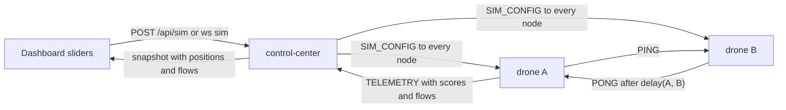
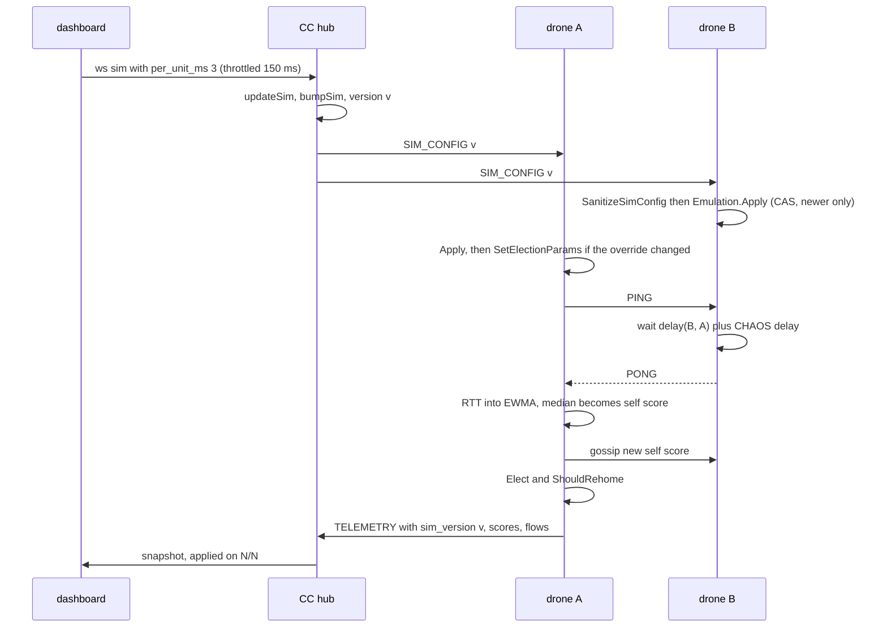
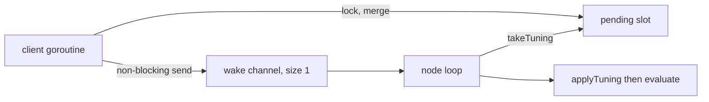

# Drone Simulation

Each node is a drone at a 3D position. The Control Center (CC) turns distance into
emulated network latency, so leader election and grouping follow the geometry. The
dashboard shows the airspace, the latencies, and the messages moving between drones.

No cluster code knows the map exists. The only change on the data path is that a PONG is
sent a little later. Everything else is the normal latency-driven election.



| Piece | Code |
|---|---|
| Latency model, default placement | `backend/pkg/geo/geo.go` |
| Per-PONG delay hook | `MeshProber.SetPeerDelay` in `backend/pkg/network/prober.go` |
| Node-side state, sanitising | `backend/pkg/telemetry/sim.go` |
| Frame counting | `backend/pkg/telemetry/flows.go`, `Pool.BroadcastRecipients` in `backend/pkg/network/pool.go` |
| Runtime election tuning | `backend/pkg/cluster/tuning.go` |
| Node wiring, override resolution | `backend/cmd/swarm-node/main.go` |
| CC state, `SIM_CONFIG` push | `backend/pkg/controlcenter/sim.go`, `backend/pkg/controlcenter/hub.go` |
| Dashboard | `frontend/app.js`, `frontend/index.html` |
| Blender export and write-back | `blender/make_swarm_scene.py`, `blender/swarm_blender.py` |

## 1. Latency model

$$delay(a, b) = base + \lVert a - b \rVert \times perUnit + jitter \times u, \quad u \sim U[0, 1)$$

- The airspace is a cube, `0..100` on each axis (`geo.Size`). `z` is the altitude.
  Positions are clamped into it, and NaN becomes 0.
- The delay is clamped to `[0, 1500ms]` (`geo.MaxDelay`), below the 2s probe timeout, so the
  far corner reads as "slow", never as "unreachable".
- Ranges (`Params.Clamp`): `base_ms` 0..500, `per_unit_ms` 0..10, `jitter_ms` 0..200.
- Defaults: `base_ms=1`, `per_unit_ms=2`, `jitter_ms=0.5`.
- `geo` is pure: the caller passes `u`, so tests are deterministic.

### Default placement

A drone with no operator placement sits at `geo.DefaultPosition(id)`:

1. FNV-1a 64 of the node ID.
2. The splitmix64 finalizer (`mix64`) over the result.
3. Three 21-bit fields (bits 0, 21, 42), one per axis, mapped to `[5, 95]`.

The finalizer is there because plain FNV-1a barely spreads IDs that differ in one trailing
digit: Compose replicas landed on one axis, and two landed on the same spot. See
[Hash Mixing](/concepts/hash-mixing-and-finalizers).

`frontend/app.js` (`defaultPos`) mirrors the function with `BigInt`, and
`TestDefaultPositionGolden` in `backend/pkg/geo/geo_test.go` pins the exact numbers, so the
two cannot drift apart silently.

## 2. Where the delay is applied

- A node answering a `PING` from peer `p` waits `delay(self, p)` before its `PONG`. The
  hook is evaluated per PONG, so every answer gets a fresh jitter draw. A CHAOS delay, if any,
  is added on top (`replyDelay`). A negative hook result counts as 0.
- **Only PONGs are delayed.** Heartbeats and acks are not, so the emulated latency changes
  scores and grouping but never causes a false failover.
- Only the responder delays, so a measured RTT is about **one** delay plus real network time,
  not two.
- No delay when emulation is disabled, when no `SIM_CONFIG` has arrived yet, or when either
  position is unknown.
- From there the existing code does the rest:
  - **Election:** a drone's self-reported score is the median of its RTTs to its peers
    (`selfScore` in `backend/pkg/cluster/node.go`), so central drones become leaders.
  - **Grouping:** a worker joins the leader with the lowest RTT, which is the nearest one.

Why this design works: [Network Emulation](/concepts/network-emulation).

## 3. Moving a slider, end to end



The regroup is not instant. The EWMA needs a few probe rounds to move, and hysteresis
holds a leader or a worker's choice until the difference passes the margin.

## 4. `SIM_CONFIG` (CC to node, control plane)

`protocol.SimConfigPayload`:

```json
{"version": 1790000000123, "enabled": true,
 "positions": {"seed": {"x": 50, "y": 50, "z": 20}},
 "base_ms": 1, "per_unit_ms": 2, "jitter_ms": 0.5,
 "threshold": 0, "hysteresis": -1}
```

- **A snapshot, not a delta.** CC sends are asynchronous and may arrive out of order. A node
  applies a config only if `version` is newer than the one it holds. `Emulation.Apply` uses a
  compare-and-swap loop, so an older version can never land last.
- **Version from the clock.** The CC seeds `version` with its start time in milliseconds and
  every bump is `max(version + 1, now_ms)`. Nodes that outlived a CC restart therefore accept
  the new CC's configs.
- **When it is sent:**
  - to a node right after its link is registered (also after a reconnect);
  - to all nodes after every change;
  - a new node gets a default position and a new version at once, but the other nodes hear
    about it on the next 1s snapshot tick. A whole swarm starting costs one broadcast per
    tick, not one per join.
- `enabled: false` turns the emulated delay off everywhere.
- **Sanitising** (`SanitizeSimConfig`): values are clamped, not rejected, so one bad field
  does not discard the positions that came with it. A threshold outside `(0, 1]` becomes 0.
  A NaN or infinite hysteresis becomes -1.

### Election overrides

| Field | Value | Meaning on the node |
|---|---|---|
| `threshold` | `0` | no override: use the node's own configured value |
| `threshold` | `(0, 1]` | use this leader fraction |
| `hysteresis` | negative | no override: use the node's own value |
| `hysteresis` | `>= 0` | use this margin, for both election and re-homing. `0` means no damping. |

- The CC sends `threshold: 0` and `hysteresis: -1` until an operator changes them.
- The node resolves the pair against its own settings (`electionPair.effective` in
  `backend/cmd/swarm-node/main.go`). A cleared override therefore **reverts** the node, rather
  than being read as "unchanged".
- The resolved pair is passed on only when it differs from the last one, so a resent snapshot
  does not re-run the election.

### Runtime tuning never blocks

`Node.SetElectionParams` is called on the telemetry client's reader goroutine. It must not wait
for the node loop.



- Several calls before the loop wakes collapse into one. The latest value of each field wins.
- A call made before `Run` is applied when `Run` starts.

## 5. Telemetry additions (node to CC)

`TelemetryPayload` gains:

| Field | Meaning |
|---|---|
| `threshold`, `hysteresis` | the election settings in force on this node |
| `sim_version` | version of the last `SIM_CONFIG` applied, `0` if none |
| `flows` | `[{"to": "node-2", "type": "PING", "count": 3}]`: frames since the previous sample |

### Flows

`FlowRecorder` wraps the mesh transport. The node and the prober both send through it, so
heartbeats, gossip, PINGs and PONGs are counted.

- Only **accepted** frames count: a `Send` that returned nil, or a broadcast recipient that
  accepted the frame.
- Broadcasts are exact per recipient, because `*network.Pool` implements
  `BroadcastRecipients`. Without it the recorder falls back to an approximation from `Peers()`.
- Frames on the CC link are not counted. The CC uplink has its own pool, outside the recorder.
- The recorder is built only when a CC is configured. Without one, nobody would drain it.
- `Drain` sorts busiest first and keeps at most 256 entries (`protocol.MaxFlowRecords`).
  The CC truncates again before it rebroadcasts.

## 6. Killed drones stay down

- CHAOS `kill` makes the node exit with code **0** (`exitKilled`).
- Node containers use `restart: on-failure`. A real crash (non-zero exit) is still restarted.
  A kill is not.
- The CC marks the ID when it sends the kill. A killed node whose link is down is shown with
  `state: "killed"` and `connected: false` until it expires (30s).
- If the same ID connects again, the mark is cleared and its old telemetry is dropped. The node
  is treated as new.
- To bring killed drones back: `docker compose up -d`.

## 7. HTTP and WebSocket

| Path | Purpose |
|---|---|
| `GET /api/sim` | the current sim config (the `sim` object below) |
| `POST /api/sim` | partial update. Returns the new sim config. |

`POST /api/sim` body, every field optional. The WebSocket client message is the same object
with `"type": "sim"`:

```json
{"enabled": true, "base_ms": 5, "per_unit_ms": 3, "jitter_ms": 1,
 "threshold": 0.4, "hysteresis": 0.5,
 "positions": {"node-3": {"x": 10, "y": 80, "z": 35}},
 "randomize": false, "reset_positions": false}
```

- **Order within one request:** `reset_positions`, then `randomize`, then explicit
  `positions`. So "randomize, but pin node-3 here" works.
- Model values and positions out of range are clamped.
- `threshold: 0` clears the override. Below 0, above 1, or NaN is a 400.
- `hysteresis` is capped at 1500. A negative value clears the override.
- A position for an unknown ID is kept and applied when that node connects.
- A position key that is empty, `control-center`, or longer than 128 bytes is a 400.
- **Cap:** at most 4096 positions. At the cap, entries for IDs the CC no longer lists are
  dropped first. If that is not enough, the request is a 400.
- Every check runs before any change, so a 400 changes nothing.
- A request that changes nothing does **not** bump the version or push anything.
- A real change bumps `version`, pushes `SIM_CONFIG` to every node, and emits an event of kind
  `sim` (for example `per_unit_ms 2 -> 3`).
- `POST /api/sim` uses the same mutation guard as `/api/tasks` (token and request rules). A
  `sim` message with task or chaos fields, or the reverse, is a 400.

### Start-up settings

| Env | Flag | Default |
|---|---|---|
| `SWARM_SIM_ENABLED` | `-sim-enabled` | `true` |
| `SWARM_SIM_BASE_MS` | `-sim-base-ms` | `1` |
| `SWARM_SIM_PER_UNIT_MS` | `-sim-per-unit-ms` | `2` |
| `SWARM_SIM_JITTER_MS` | `-sim-jitter-ms` | `0.5` |

At start-up, out-of-range, NaN or non-numeric values are a config error (exit 2), not
clamped.

## 8. Snapshot additions (CC to browser)

```json
{
  "type": "snapshot",
  "sim": {"version": 1790000000123, "enabled": true, "base_ms": 1, "per_unit_ms": 2,
          "jitter_ms": 0.5, "threshold": 0, "hysteresis": -1,
          "size": 100, "max_delay_ms": 1500},
  "nodes": [
    {"id": "node-1", "state": "alive",
     "pos": {"x": 12.5, "y": 40, "z": 33},
     "threshold": 0.3, "hysteresis": 0.5, "sim_version": 1790000000123,
     "flows": [{"to": "node-2", "type": "HEARTBEAT", "count": 2}],
     "...": "existing fields unchanged"}
  ]
}
```

- `sim.threshold` / `sim.hysteresis` hold the operator override, or `0` / `-1` when there is
  none. Each node entry holds the values actually in force on that node.
- `nodes[].state` can be `killed`.
- `nodes[].flows` is the latest sample, replaced on every telemetry and emptied once older
  than 3s. Never null.
- `nodes[].scores` (existing) is the node's measured RTT to each peer, keyed by address.

## 9. Worked example

Defaults: `base_ms=1`, `per_unit_ms=2`, jitter ignored. Three drones on a line
(`y=50`, `z=50`), `threshold=0.3`:

| Drone | x | Delays to the others | Median (self score) |
|---|---|---|---|
| A | 10 | B: $1 + 30 \times 2 = 61$, C: $1 + 80 \times 2 = 161$ | 111 |
| B | 40 | A: 61, C: $1 + 50 \times 2 = 101$ | **81** |
| C | 90 | A: 161, B: 101 | 131 |

- $\lceil 3 \times 0.3 \rceil = 1$ leader. B, the central drone, has the best score and leads.
- Set `threshold` to 0.5: $\lceil 3 \times 0.5 \rceil = 2$ leaders, B and A.
  C measures B at 101 and A at 161, so C joins B, the nearer leader.

Re-homing. A worker at $(20, 30, 40)$, leaders L1 at $(50, 50, 50)$ and L2 at $(25, 35, 40)$:

$$d_1 = \sqrt{30^2 + 20^2 + 10^2} \approx 37.4 \Rightarrow 1 + 74.8 = 75.8\,ms$$

$$d_2 = \sqrt{5^2 + 5^2 + 0^2} \approx 7.1 \Rightarrow 1 + 14.1 = 15.1\,ms$$

The gap, about 60.7 ms, is far above the 0.5 margin, so the worker moves to L2 once its
EWMA has caught up.

Seen live with the defaults: RTT grew about 2 ms per unit. Moving node-4 next to node-5 dropped
that RTT to 11.5 ms and node-4 re-homed. `threshold 0.5` gave 3 leaders, and clearing it went
back to 2.

## 10. Dashboard

The airspace panel has two views: **3D airspace** and the older **Grouped** view.

| Control | Action |
|---|---|
| drag | orbit the camera |
| shift-drag, right-drag, two fingers | pan |
| wheel, pinch, `+` / `-` buttons or keys | zoom |
| arrow keys | orbit |
| Fit button, `f` | frame every drone |
| Reset view button, `0` | reset the camera |
| click a drone | select and focus it |
| `Esc` | clear the selection, or leave the CSS fullscreen |
| Fullscreen button | Fullscreen API, with a CSS "maximized" fallback when the API is missing, refused or never answers |
| all peer links, link labels | toggles |
| message animation | toggle, plus a per-type legend whose entries toggle each type |

- **Drawing:** drones at `pos`, with a drop line and a shadow on the ground grid. Leaders are
  larger. Far drones are painted first. See
  [3D Projection](/concepts/3d-perspective-projection-and-depth-sorting).
- **Link labels:** distance (units), measured RTT (ms), and the predicted delay
  $base + d \times perUnit + jitter / 2$, the model's mean.
- **Message animation:** each `flows` entry becomes up to 4 dots per link and type, spread
  over the 1s interval (600 dots at most). The dots show **counts**, not individual frames.
- **Killed drones** are grey crosses until they expire.

### Advanced panel

| Control | Sends |
|---|---|
| latency emulation enabled | `enabled` |
| base, per unit, jitter sliders | `base_ms` (0..500), `per_unit_ms` (0..10), `jitter_ms` (0..200) |
| threshold slider | `threshold` (0.05..1) |
| hysteresis slider | `hysteresis` (0..10). The API allows up to 1500. |
| Randomize positions | `randomize: true` |
| Reset positions | `reset_positions: true` |
| Use drones' own threshold/hysteresis | `threshold: 0, hysteresis: -1` |
| Drone selector plus x / y / z sliders | `positions` for one drone |

- Slider moves are throttled to one message per 150 ms.
- "Reported by the drones" shows the threshold and hysteresis the live drones report.
- **applied on X/N** counts live, non-killed drones whose `sim_version` has reached the CC's
  version.

## 11. The same positions, in Blender

The dashboard is not the only consumer of `nodes[].pos`. `blender/make_swarm_scene.py`
reads the same `GET /api/state` and writes `swarm-scene.json`, which carries every drone
in **both** coordinate systems: `position_units` (the `pos` above, unchanged) and
`location_m` (Blender metres, $k = 20$ m per unit by default).

```bash
python3 blender/make_swarm_scene.py
blender --python blender/swarm_blender.py -- --scene blender/swarm-scene.json
```

- Links in the scene file carry the same pair the dashboard's labels show: the **measured**
  `rtt_ms` and the model's `predicted_one_way_ms` = $base + d \times perUnit + jitter/2$.
- The Blender add-on writes back through the same `POST /api/sim` `positions` body the
  Advanced panel uses, so moving a cone and moving a slider are the same operation.
- Units stay the source of truth. Metres are a rendering of them.

Reference: [Blender Scene Tooling](./blender-scene).

## Common problems

| Symptom | Cause |
|---|---|
| applied on 3/5 for a long time | two drones are not connected to the CC, or their `SIM_CONFIG` send failed. The next change resends the whole state. |
| a drone moved but its group did not change | the EWMA is still catching up, or the gain is below the hysteresis margin |
| every RTT is below 1 ms | emulation is off, or no `SIM_CONFIG` has arrived yet |
| all drones sit in one plane | a frontend copy that does not match `geo.DefaultPosition`. The golden test guards this. |
| a killed drone never comes back | expected. Run `docker compose up -d`. |

## Related

- [Network Emulation](/concepts/network-emulation)
- [3D Perspective Projection and Depth Sorting](/concepts/3d-perspective-projection-and-depth-sorting)
- [Hash Mixing](/concepts/hash-mixing-and-finalizers)
- [Latency as a Statistic](/concepts/latency-as-a-statistic)
- [Idempotence and Hysteresis](/concepts/idempotence-and-hysteresis)
- [The Control Center](./control-center)
- [Blender Scene Tooling](./blender-scene)
