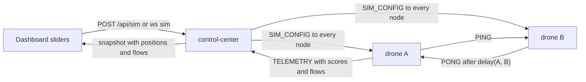

# Drone Simulation

Each node is a drone at a 3D position. The Control Center (CC) turns distance into
emulated network latency, so leader election and grouping follow the geometry. The
dashboard shows the airspace, the latencies, and the messages moving between drones.

This page is the contract the backend and the dashboard are built against.



## 1. Latency model

Code: `backend/pkg/geo`.

$$delay(a, b) = base + \lVert a - b \rVert \times perUnit + jitter \times u, \quad u \sim U[0, 1)$$

- The airspace is a cube, `0..100` on each axis. `z` is the altitude.
- The delay is clamped to `[0, 1500ms]`, below the 2s probe timeout.
- Parameter ranges: `base_ms` 0..500, `per_unit_ms` 0..10, `jitter_ms` 0..200.
- Defaults: `base_ms=1`, `per_unit_ms=2`, `jitter_ms=0.5`.
- The default position of a drone comes from a hash of its node ID
  (`geo.DefaultPosition`), so it is stable across restarts.

## 2. Where the delay is applied

- A node answering a `PING` from peer `p` delays its `PONG` by
  `delay(self, p)`, drawn fresh for every PONG. The CHAOS delay, if any, is added on top.
- Only PONGs are delayed. Heartbeats and acks are not, so the emulated latency
  changes scores and grouping but never causes a false failover.
- A peer with no known position gets no emulated delay.
- The prober measures the delay as round-trip time. From there the existing code
  does the rest:
  - **Election:** a drone's self-reported score is the median RTT to its peers, so
    central drones become leaders.
  - **Grouping:** a worker joins the leader with the lowest RTT, which is the
    nearest one.

## 3. `SIM_CONFIG` (CC to node, control plane)

`protocol.SimConfigPayload`:

```json
{"version": 7, "enabled": true,
 "positions": {"seed": {"x": 50, "y": 50, "z": 20}},
 "base_ms": 1, "per_unit_ms": 2, "jitter_ms": 0.5,
 "threshold": 0.3, "hysteresis": 0.5}
```

- A snapshot, not a delta. A node applies it only if `version` is newer than the
  one it holds.
- The CC sends it to a node right after the node connects, and to all nodes after
  every change.
- `enabled: false` turns the emulated delay off everywhere.
- `threshold`: `0` means keep the node's own value; otherwise `(0, 1]`.
- `hysteresis`: negative means keep the node's own value; `0` is legal. It sets both
  the election margin and the re-home margin.
- The CC sends `threshold: 0` and `hysteresis: -1` until an operator changes them.

## 4. Telemetry additions (node to CC)

`TelemetryPayload` gains:

| Field | Meaning |
|---|---|
| `threshold`, `hysteresis` | the election settings in force on this node |
| `sim_version` | version of the last `SIM_CONFIG` applied, `0` if none |
| `flows` | `[{"to": "node-2", "type": "PING", "count": 3}]`: frames sent since the previous sample, per destination and type, at most 256 entries (busiest kept) |

`flows` counts every frame the node sends to a mesh peer, including broadcasts
(once per recipient). Frames sent on the CC link are not counted.

## 5. Killed drones stay dead

- CHAOS `kill` makes the node exit with code **0**.
- Node containers use `restart: on-failure`. A real crash (non-zero exit) is still
  restarted; a kill is not.
- The CC remembers which node IDs it killed. A killed node that disconnects is shown
  with `state: "killed"` and `connected: false` until it expires (30s), and never as
  merely "disconnected".
- If the same ID connects again (for example after `docker compose up`), it is
  treated as new and the killed mark is cleared.

## 6. HTTP and WebSocket additions

| Path | Purpose |
|---|---|
| `GET /api/sim` | the current sim config (same shape as the `sim` object below) |
| `POST /api/sim` | partial update; returns the new sim config |

`POST /api/sim` body (every field optional). The WebSocket client message is the same
object with `"type": "sim"`:

```json
{"enabled": true, "base_ms": 5, "per_unit_ms": 3, "jitter_ms": 1,
 "threshold": 0.4, "hysteresis": 0.5,
 "positions": {"node-3": {"x": 10, "y": 80, "z": 35}},
 "randomize": false, "reset_positions": false}
```

- Values out of range are clamped, not rejected.
- `randomize: true` places every known drone at a new random position.
- `reset_positions: true` returns every drone to `geo.DefaultPosition`.
- A position for an unknown node ID is kept and applied when that node connects.
- A `threshold` outside `(0, 1]` is a 400.
- Every change bumps `version`, pushes `SIM_CONFIG` to all nodes, and emits an event
  of kind `sim`.
- `POST /api/sim` goes through the same mutation guard as `/api/tasks` (token and
  request rules).

## 7. Snapshot additions (CC to browser)

```json
{
  "type": "snapshot",
  "sim": {"version": 7, "enabled": true, "base_ms": 1, "per_unit_ms": 2,
          "jitter_ms": 0.5, "threshold": 0.3, "hysteresis": 0.5,
          "size": 100, "max_delay_ms": 1500},
  "nodes": [
    {"id": "node-1", "state": "alive",
     "pos": {"x": 12.5, "y": 40, "z": 33},
     "threshold": 0.3, "hysteresis": 0.5, "sim_version": 7,
     "flows": [{"to": "node-2", "type": "HEARTBEAT", "count": 2}],
     "...": "existing fields unchanged"}
  ]
}
```

- `sim.threshold` / `sim.hysteresis` hold the operator override, or `0` / `-1` when
  there is none. The dashboard shows each node's own values from the node entries.
- `nodes[].state` can now also be `killed`.
- `nodes[].flows` is the node's most recent `flows` sample, replaced on every
  telemetry sample and cleared once it is older than 3s.
- `nodes[].scores` (existing) is the node's measured RTT to each peer, keyed by
  address. The dashboard labels links with it.

## 8. Dashboard

- **3D airspace view:**
  - Drag to orbit the camera, and use the wheel to zoom.
  - Drones are drawn at `pos`, with a drop line to the ground grid to show altitude.
  - Leaders and workers are distinguished as before, and each worker has a link to
    its leader.
- **Links:** each leader-worker link is labelled with its distance (units) and the
  measured RTT (ms). A toggle shows every peer link.
- **Message animation:** each entry in `flows` becomes dots travelling from the
  sender to `to`, coloured by message type, with a legend.
- **Advanced panel** (collapsed by default):
  - Sliders for `base_ms`, `per_unit_ms`, `jitter_ms`, `threshold` and
    `hysteresis`, plus an enable switch.
  - Buttons to randomize and reset positions.
  - A drone selector with x / y / z sliders.
  - Moving a slider sends a `sim` message (throttled).
- **Killed drones** are drawn as grey crosses until they expire.
