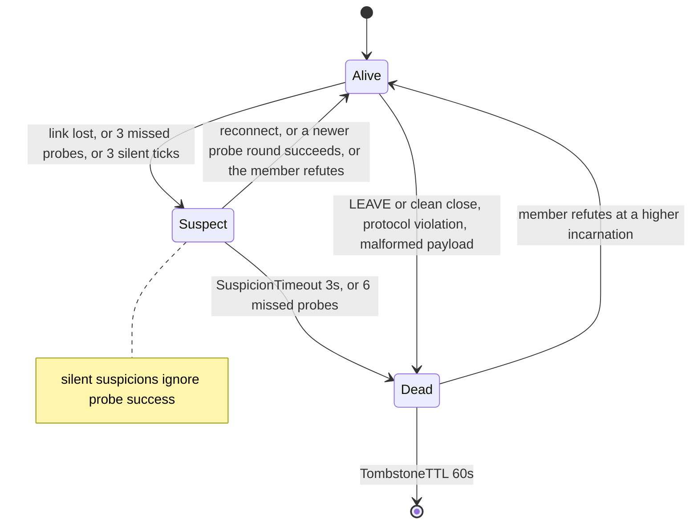
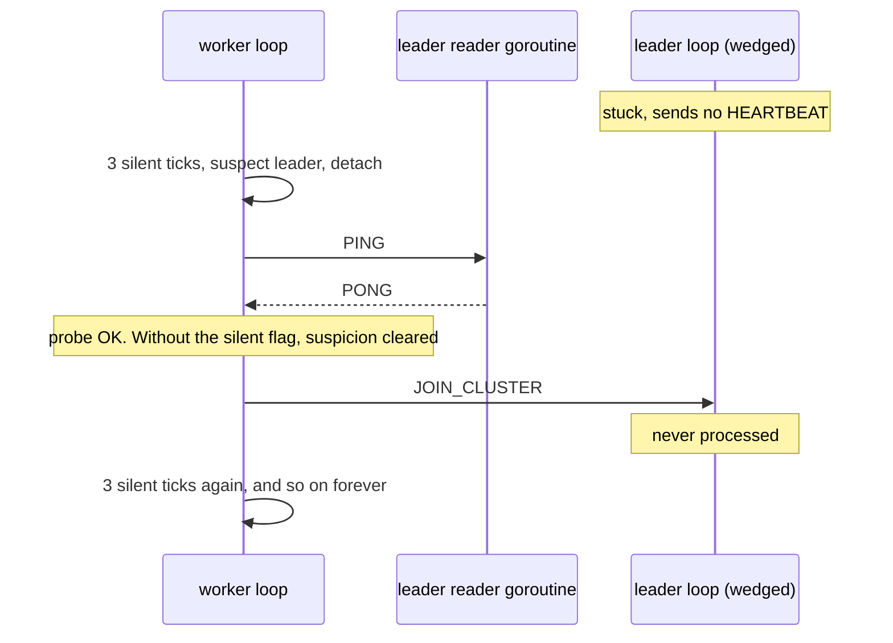
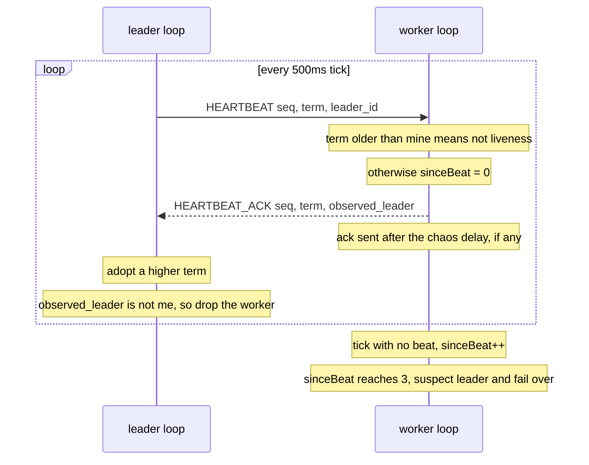
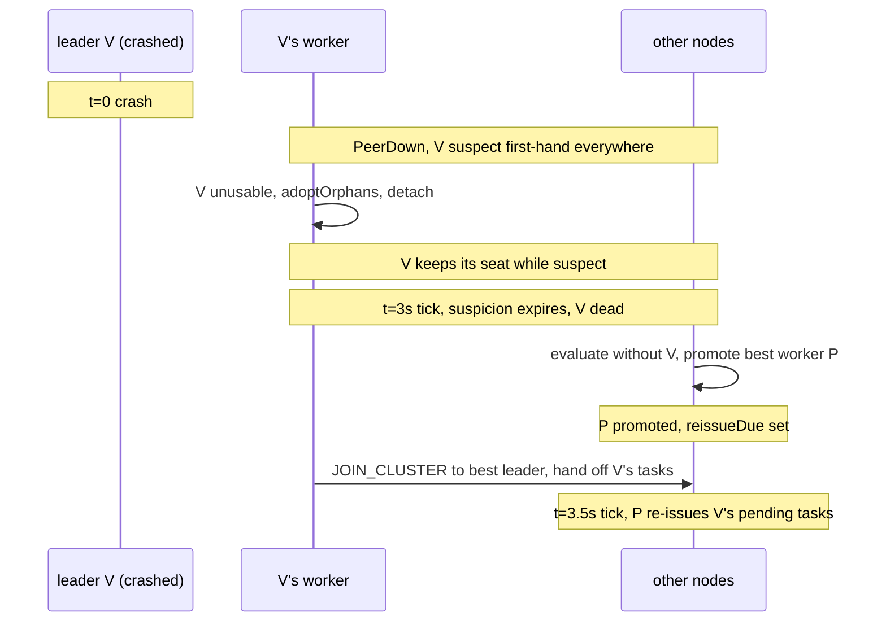

# Failure Detection and Failover

This page is the Phase 4 failure detector as it ships: `pkg/cluster/failure.go` and
`pkg/cluster/heartbeat.go`. The theory behind it is on
[Failure Detectors](/concepts/failure-detectors). The timer mechanics are on
[Heartbeat Intervals, Jitter and Timers](/concepts/heartbeat-intervals-and-timers).

Short version:

- A peer is **suspected** first and **declared dead** later. The gap is where a live peer can
  prove it is alive.
- Only the node that raised a suspicion may confirm it.
- Leaders beat their workers every 500 ms. A worker that hears nothing for 3 ticks leaves.
- A crashed leader is replaced within $T_{suspect} + 2 T_{hb} = 4$ s. The simulator measures 3 s.

---

## Core Mental Model

### Three states, two steps



Some evidence is a doubt and some is a fact:

| Evidence | Verdict | Code |
|---|---|---|
| TCP link lost (reset, timeout, mid-frame EOF) | suspect | `pkg/cluster/node.go:902` |
| `SuspectAfter` (3) failed probes in a row | suspect | `pkg/cluster/failure.go:109` |
| `HeartbeatMisses` (3) ticks without a beat from my leader | suspect (silent) | `pkg/cluster/heartbeat.go:74` |
| suspicion older than `SuspicionTimeout` (3 s) | dead | `pkg/cluster/failure.go:190` |
| `DeadAfter` (6) failed probes in a row | dead | `pkg/cluster/failure.go:107` |
| `LEAVE`, or EOF on a frame boundary | dead at once (`markLeft`) | `pkg/cluster/node.go:877` |
| protocol violation or undecodable payload | dead at once (`markDead`) | `pkg/cluster/node.go:883` |

The defaults live together at `pkg/cluster/node.go:38` to `pkg/cluster/node.go:55`.

### Suspect does not bump the incarnation

A death is recorded at the member's incarnation **+ 1** (`pkg/cluster/member.go:356`). A
suspicion keeps the member's own incarnation. That is what keeps it a doubt:

- a reconnect at the same incarnation clears it (`Revive`, `pkg/cluster/member.go:399`),
- the member can refute it by bumping once (`pkg/cluster/node.go:1376`).

Bump on suspicion and every lost packet becomes a verdict. See
[Monotonic Merge and Incarnation](/concepts/monotonic-merge-and-incarnation).

### What a suspect member can do

| Member | While suspect |
|---|---|
| a leader | keeps its seat and still counts toward $N$ |
| a worker | is not counted and cannot be promoted |

Both rules are one line in `electorate` (`pkg/cluster/election.go:201`). A leader keeps its
seat because a doubt that is later refuted would otherwise cost two re-elections (out, then
back in). A worker is not promotable because filling a seat with a node we already doubt is
the wrong call.

The seat is kept, but **workers stop using it**. A worker skips any leader it suspects
first-hand (`usableLeaders`, `pkg/cluster/failure.go:137`), so a suspect leader costs nobody a
live leader. It only delays the *promotion* until the suspicion is confirmed.

### First-hand versus relayed

A suspicion travels by gossip like any other record. But only the node that raised it runs the
timer.

| | First-hand (in `n.suspects`) | Relayed (only in the table) |
|---|---|---|
| merged into the table | yes | yes |
| seen by the election | yes | yes |
| timed, then turned into a death | yes | **no** |
| makes a worker leave its leader | yes | **no** |

Why: if every node timed every rumour, one node with one bad link could kill a healthy peer
across the whole swarm. Instead, the originator confirms its own doubt and pushes the death, or
the member hears the rumour and refutes it (`pkg/cluster/failure.go:32`).

---

## Under the Hood

### The failure-detector tick

One ticker, every `HeartbeatInterval` (500 ms), drives the whole detector
(`pkg/cluster/node.go:623`, handled at `pkg/cluster/node.go:667`).

```go
// pkg/cluster/failure.go:151
func (n *Node) controlTick(ctx context.Context) {
	now := n.cfg.Clock.Now()
	if n.expireSuspicions(ctx, now) {
		n.membershipChanged(ctx)
	}
	if n.sweepTombstones(now) {
		n.publish()
	}
	switch {
	case n.isLeader():
		n.beat(ctx)
		n.reissueIfDue(ctx)
	case n.leader != "":
		n.checkLeaderSilence(ctx)
	}
}
```

It runs on the node's single event loop, so nothing in the detector needs a lock.

### One suspicion record

```go
// pkg/cluster/failure.go:47 (comments trimmed)
type suspicion struct {
	since       time.Time // when the doubt was raised
	incarnation int64     // the member's incarnation at that moment
	round       uint64    // probe round current at that moment
	silent      bool      // raised by missed heartbeats
}
```

Each field closes one hole:

| Field | Hole it closes |
|---|---|
| `since` | expiry: `now - since >= SuspicionTimeout` (`pkg/cluster/failure.go:190`) |
| `incarnation` | a refutation or restart changes it, and the doubt is dropped (`pkg/cluster/failure.go:185`) |
| `round` | a probe round started **before** the link dropped cannot clear the doubt (`pkg/cluster/failure.go:123`) |
| `silent` | a successful probe cannot clear a heartbeat doubt (next section) |

### Why a probe cannot clear a silent suspicion

`PING` is answered by `MeshProber.HandleFrame`, which runs as `OnFrame` on the peer's **reader
goroutine** (`pkg/cluster/node.go:138`). A leader whose event loop is wedged still answers every
`PING`. Heartbeats come from the loop itself.

Without the rule, a wedged leader flaps:



With the flag, only three things clear a silent doubt: a resumed beat (`beatResumed`,
`pkg/cluster/heartbeat.go:119`), a refutation (new incarnation), or a reconnect
(`pkg/cluster/node.go:865`). Test: `TestSilenceSuspicionNeedsABeatToClear`
(`pkg/cluster/heartbeat_test.go:307`).

### Heartbeats

A leader beats **only its attached workers**. A worker counts ticks since the last valid beat.



| Step | Code |
|---|---|
| leader sends one beat per attached worker | `beat`, `pkg/cluster/heartbeat.go:37` |
| worker counts a silent tick | `pkg/cluster/heartbeat.go:66` |
| worker fails over at 3 | `pkg/cluster/heartbeat.go:67` to `pkg/cluster/heartbeat.go:79` |
| worker handles a beat | `handleHeartbeat`, `pkg/cluster/heartbeat.go:84` |
| ack delayed by chaos, without blocking the loop | `sendDelayed`, `pkg/cluster/heartbeat.go:171` |
| leader keeps its attached set honest | `handleHeartbeatAck`, `pkg/cluster/heartbeat.go:132` |

Two details:

- The worker counts **ticks without a beat**, not gaps in `HeartbeatPayload.Seq`. `Seq` is
  sent and echoed but nothing counts gaps in it today.
- The ack is also the leader's repair channel. A worker that names the leader but is not in its
  attached set is taken back (`pkg/cluster/heartbeat.go:146`). One that names someone else is
  dropped (`pkg/cluster/heartbeat.go:140`).

### Failing over

When the worker gives up on its leader:

```go
// pkg/cluster/heartbeat.go:65 (logging trimmed)
func (n *Node) checkLeaderSilence(ctx context.Context) {
	n.sinceBeat++
	if n.sinceBeat < n.cfg.HeartbeatMisses {
		return
	}
	leader := n.leader
	n.sinceBeat = 0
	n.adoptOrphans()          // carry its pending tasks
	n.markSilent(ctx, leader) // first-hand, silent suspicion
	n.leader = ""
	n.membershipChanged(ctx)  // evaluate: join the best usable leader
}
```

`adoptOrphans` is covered in [Replication and Tasks](/architecture/replication-and-tasks).

### Terms

`Term` is a **per-node** counter. A node adds one each time *its own* election result changes
(`pkg/cluster/node.go:1717`). Two nodes' terms are not comparable on their own.

They are made comparable, Lamport-style, **only over the leader-worker link**. Whoever sees a
higher term adopts it:

| Message | Adopts | Code |
|---|---|---|
| `HEARTBEAT` (worker side) | `max(mine, beat.Term)` | `pkg/cluster/heartbeat.go:92` |
| `HEARTBEAT_ACK` (leader side) | `max(mine, ack.Term)` | `pkg/cluster/heartbeat.go:134` |
| `STATE_SYNC` (worker side) | `max(mine, sync.Term)` | `pkg/cluster/replication.go:267` |
| `ELECTION_RESULT` | nothing, observability only | `pkg/cluster/node.go:1154` |

A beat with a **lower** term than the worker's means the leader has not caught up with a leader
change the worker saw. That is the split-brain symptom the field exists for:

```text
WARN heartbeat from an older term; ignoring as liveness (split-brain symptom) from=node-2 their_term=4 our_term=6
```

The beat is not counted as liveness, but it **is** acked, and the ack carries term 6. A healthy
leader that was only behind adopts 6 and its next beat counts. Tests:
`TestStaleTermBeatIsNotLiveness` (`pkg/cluster/heartbeat_test.go:273`),
`TestLeaderAdoptsHigherTermFromAck` (`pkg/cluster/heartbeat_test.go:104`). More on this kind of
clock: [Logical Clocks](/concepts/logical-clocks).

### The failover timeline

A leader crashes and every survivor sees its socket reset:



The suspicion is checked on the tick, so the verdict can land up to one tick late. Promotion,
the re-homing JOINs and the re-issue take up to one more tick. The bound asserted by the test is

$$
T_{failover} \le T_{suspect} + 2\,T_{hb} = 3\,\text{s} + 2 \times 0.5\,\text{s} = 4\,\text{s}
$$

(`failoverBound`, `pkg/cluster/failover_test.go:17`). The test also asserts the lower bound:
nobody re-elects before $T_{suspect}$, because the seat is kept while the leader is only
suspect.

Measured, `TestFailoverConvergesAfterLeaderCrash` (`pkg/cluster/failover_test.go:35`), 5 nodes,
the busiest leader killed with 6 tasks in flight:

```text
$ go test ./pkg/cluster -run TestFailoverConvergesAfterLeaderCrash -v | grep converged
failover_test.go:136: converged 3s after the crash; leaders [node-2 node-4] -> [node-1 node-4]; results 6 for 6 tasks
failover_test.go:136: converged 3s after the crash; leaders [node-4 node-5] -> [node-3 node-5]; results 6 for 6 tasks
...   (16 seeds, all 3s)
```

### When there is no link signal

The timeline above starts with a reset socket. Without one (a black hole or a wedged process),
detection is slower. These are estimates from the defaults, not measurements:

| Failure | First doubt | Death | Who detects |
|---|---|---|---|
| crash, socket reset | 0 s | about 3 s | everyone |
| leader loop wedged, sockets fine | 1.5 s (3 silent ticks) | about 4.5 s | its workers only. PONGs still flow |
| black hole, no packets | 1.5 s at its workers, otherwise 3 failed probe rounds | about 4.5 s via its workers | its workers, then everyone through the pushed death |

A probe round does not overlap the next one (`pkg/cluster/node.go:1458`). A black-holed peer
holds each round open for the strategy's 2 s probe timeout (`pkg/health/latency.go:39`), so
misses accrue about every 2 s, not every 1 s.

### The Docker case: about 1 s

The real Compose e2e (`scripts/e2e.sh`) reported failover in about 1 s, faster than the
simulator. The likely reason is how the victim dies.

`docker kill` sends SIGKILL. The kernel closes the dead process's sockets on exit. With nothing
unread in the receive queue, that close sends a FIN, not a RST. The peer's reader then sees
`io.EOF` on a frame boundary, which `Classify` reads as a clean close
(`pkg/network/conn.go:81`). A clean close takes the `markLeft` path: dead at once, no suspicion
window (`pkg/cluster/node.go:874`).

The simulator's `kill` sends `DispositionPeerDied` instead (`pkg/cluster/converge_test.go:397`),
which is the slower, suspicion-first path. To check which one you got, grep the survivor logs:

```text
INFO peer left peer=node-3                                  <- markLeft, immediate
WARN peer suspected peer=node-3 reason="link lost (...)"   <- suspicion, 3s
```

---

## Why It Matters in This Swarm

- **One loop owns the detector.** `n.suspects`, `n.tombstones`, `n.sinceBeat` and `n.term` are
  loop-owned fields (the block starting at `pkg/cluster/node.go:361`). No locks, no races
  between a timer and a handler.
- **The suspicion window is sized for the redial.** `SuspicionTimeout` is 3 s so that the pool's
  first jittered redial (200 ms base, `pkg/network/pool.go:35`) lands inside it
  (`pkg/cluster/node.go:48`). A link that
  blips and comes back costs no incarnation bump and no re-election. Test:
  `TestReconnectInsideSuspicionWindowClearsIt` (`pkg/cluster/failure_test.go:72`).
- **A worker crash costs no election.** The leader set is unchanged. The dead worker's tasks are
  re-assigned when its death is confirmed. Test: `TestWorkerCrashKeepsLeadersAndReassignsTasks`
  (`pkg/cluster/failover_test.go:144`).
- **Suspect peers still get gossip.** Our view is how a suspect learns it is suspected, so
  `gossipRound` includes them (`pkg/cluster/node.go:1064`).

---

## Common Failure Modes & Edge Cases

### A wedged leader that never dies

Symptom: workers log `leader silent; failing over` every few seconds, the same leader stays
elected, and probes to it succeed. Cause: a silent suspicion being cleared by probe success.
The `silent` flag exists for this. If you see it, check `probeClears`
(`pkg/cluster/failure.go:123`).

### A node killed by one bad link

Symptom: one node with a flaky NIC causes a healthy peer to be declared dead everywhere.
Cause: relayed suspicions being timed. Only `n.suspects` entries are timed. Test:
`TestRelayedSuspicionIsNotConfirmedHere` (`pkg/cluster/failure_test.go:195`).

### Re-election twice per blip

Symptom: a short network hiccup produces two `leaders changed` lines on every node, one out and
one back in. Cause: a suspect leader losing its seat. `electorate` keeps it. Test:
`TestSuspectLeaderKeepsItsSeat` (`pkg/cluster/election_test.go:248`).

### Workers leave a healthy leader

Symptom: after one node's link to a leader drops, many workers in that cluster detach. Cause:
`usableLeaders` honouring relayed suspicion. Only first-hand doubt makes a worker leave. Test:
`TestWorkerDetachesOnlyFromLeaderItSuspects` (`pkg/cluster/failure_test.go:217`).

### Stale-term warnings that never stop

Symptom: `heartbeat from an older term` repeats for the same leader. Cause: the ack is not
reaching the leader, so it never adopts the newer term. Check for `HEARTBEAT_ACK send failed`
or a chaos delay above the beat period. A single warning after a leader change is normal.

### A restarted leader's first beat is ignored

Symptom: one `heartbeat from an older term` warning right after a worker joins a freshly
restarted leader. Cause: the restarted leader's term starts from zero, while the worker's term
has been climbing. The first beat is not liveness, its ack teaches the leader the higher term,
and the next beat counts. One lost beat is well inside the 3-tick budget.

### Chaos delay does not fail a worker over

Symptom: `CHAOS delay 3000` on a worker, and nothing fails over. This is expected. The delay
applies to the worker's **replies** (acks, and PONGs through the prober). The leader's beats
still arrive on time, so the worker never goes silent. The ack's `observed_leader` is computed
when the beat is handled, not when the delayed ack is sent (`pkg/cluster/heartbeat.go:104`).
The delay is visible as higher RTTs in the other nodes' probes of the delayed node.

---

## See Also

- [Failure Detectors](/concepts/failure-detectors) -- completeness, accuracy, and why a timeout is
  a guess.
- [Heartbeat Intervals, Jitter and Timers](/concepts/heartbeat-intervals-and-timers) -- what a
  500 ms tick really guarantees.
- [Logical Clocks](/concepts/logical-clocks) -- terms, sequence numbers and incarnations.
- [Replication and Tasks](/architecture/replication-and-tasks) -- what survives the failover.
- [Convergence Debugging](/architecture/convergence-debugging) -- the bugs found on the way.
- [Split-Brain and Quorum](/concepts/split-brain-and-quorum) -- what terms can and cannot detect.
