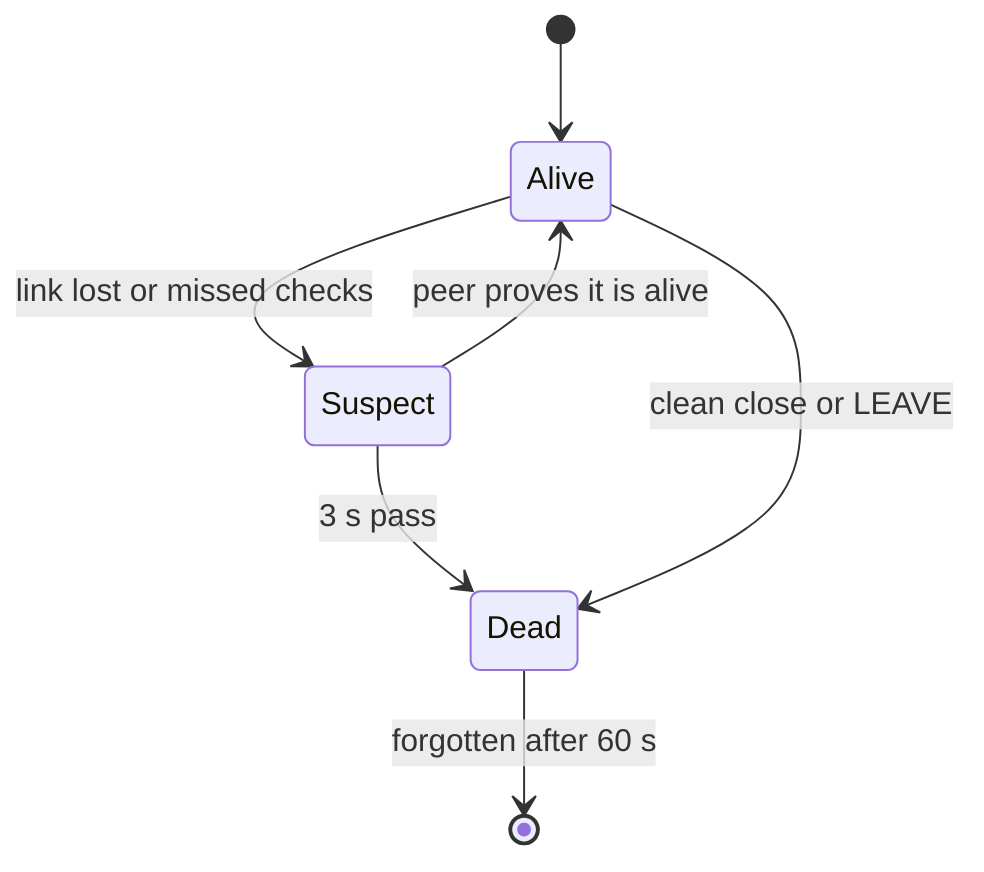
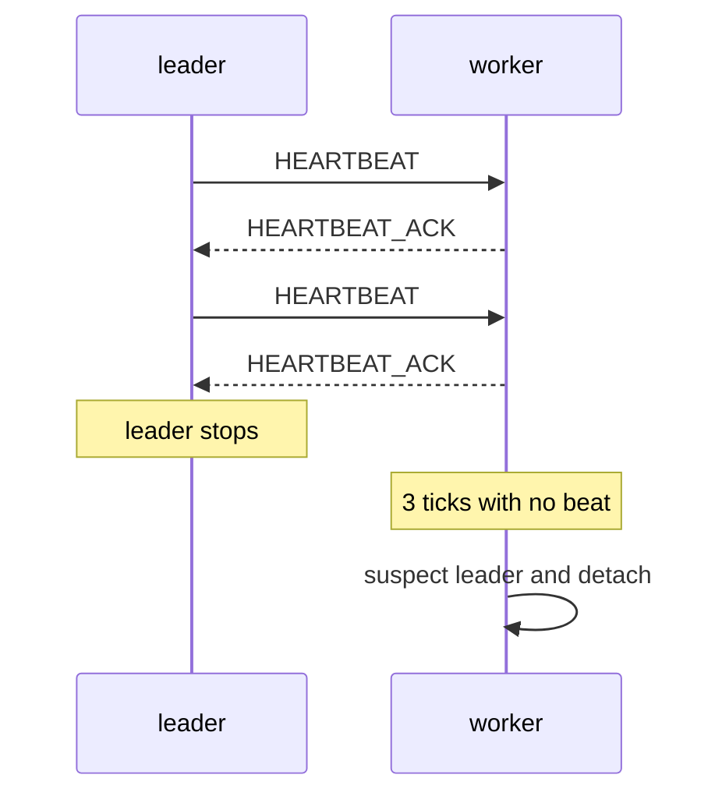
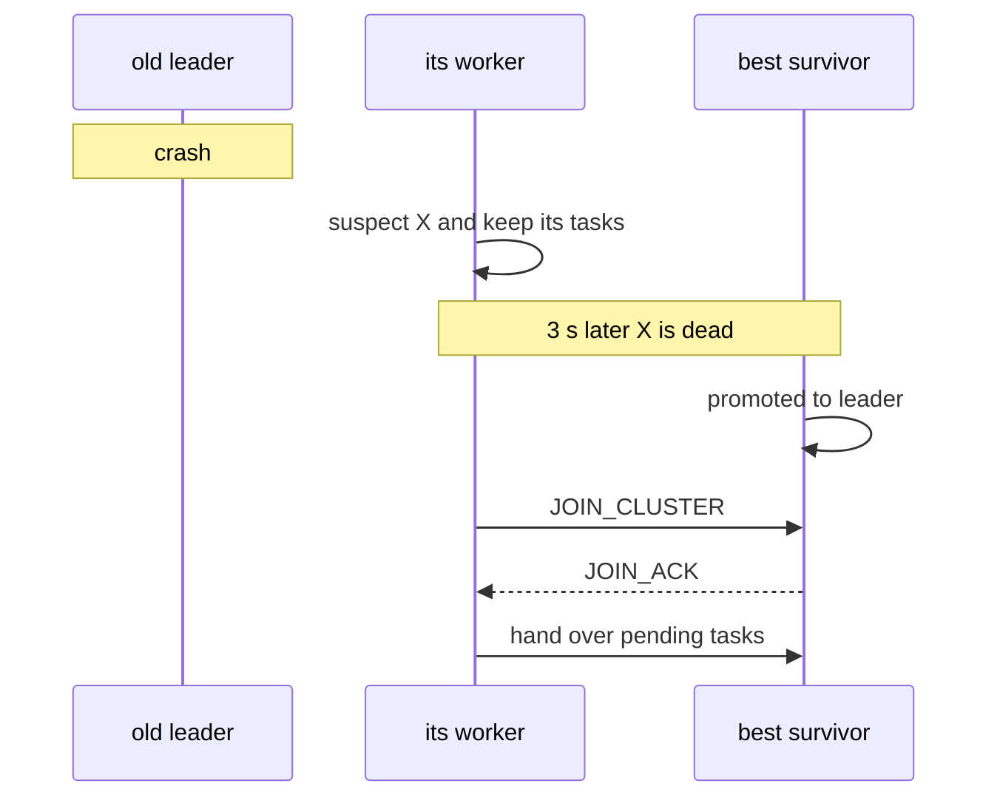

# Failure Detection and Failover

How the swarm notices a dead node and replaces a dead leader.

Code: `backend/pkg/cluster/failure.go` and `backend/pkg/cluster/heartbeat.go`.
Theory: [Failure Detectors](/concepts/failure-detectors) and
[Heartbeat Intervals, Jitter and Timers](/concepts/heartbeat-intervals-and-timers).

## In short

- A peer is **suspected** first and **declared dead** later. The gap gives a live peer time to
  prove it is alive.
- Leaders send a heartbeat to their workers every 500 ms. A worker that hears nothing for 3 ticks
  leaves its leader.
- A crashed leader is replaced within about 4 s with the default settings.

## Alive, suspect, dead

Some evidence is only a doubt. Some is a fact.

| Evidence | Result |
|---|---|
| TCP link reset or timed out | suspect |
| 3 failed health probes in a row | suspect |
| 3 heartbeat ticks with no beat from my leader | suspect |
| suspicion older than 3 s | dead |
| 6 failed health probes in a row | dead |
| `LEAVE` message, or a clean connection close | dead at once |
| broken or invalid messages | dead at once |

A suspect peer can clear the doubt by reconnecting, by answering a newer probe round, or by
restarting with a higher incarnation. A suspicion that came from missed heartbeats is only
cleared by a heartbeat, a reconnect or a new incarnation. A successful `PING` is not enough,
because a stuck leader can still answer `PING` from its reader goroutine.

## Only the node that raised a doubt may confirm it

Suspicions spread through gossip like any other record. Only the node that raised a suspicion
runs its 3 s timer and turns it into a death.

Why: if every node timed every rumour, one node with one bad cable could get a healthy peer
declared dead everywhere.

A worker also leaves a leader only if **it** suspects that leader. A rumour is not enough.

## Heartbeats

A leader beats only its own workers.

Each heartbeat carries a **term**. A node raises its term whenever its own view of the leaders
changes, and adopts any higher term it sees from its leader or worker. A beat with an older term
than the worker's is not counted as proof of life. That is a sign the leader missed a change.
The ack carries the newer term back, so the leader catches up on the next beat.

See [Logical Clocks](/concepts/logical-clocks).

## Leader failover

Things to notice:

- **A suspect leader keeps its seat.** If the doubt turns out to be wrong, nobody had to
  re-elect twice. Its workers still stop using it right away.
- **A suspect worker cannot be promoted.** Promoting a node we already doubt makes no sense.
- **A worker crash causes no election.** The leader set does not change. The dead worker's tasks
  are sent to another worker.

What happens to the tasks: [Replication and Tasks](./replication-and-tasks).

## How long it takes

The suspicion is checked once per 500 ms tick, and promotion plus re-joining takes up to one more
tick:

$$T_{failover} \le 3\,s + 2 \times 0.5\,s = 4\,s$$

| Failure | Detected by | Roughly |
|---|---|---|
| process crash, socket reset | everyone | 3 to 4 s |
| `docker kill` (clean close) | everyone | about 1 s |
| leader frozen, sockets still open | its workers, through missed beats | about 4.5 s |
| no packets at all | its workers first, then everyone | about 4.5 s |

`docker kill` is fast because the kernel closes the dead process's sockets cleanly. A clean close
means "dead at once", so there is no 3 s suspicion window.

## Lessons learned

Two bugs shipped past the unit tests during development and made a Docker swarm elect the wrong
leaders. What they taught:

- **Merges must not depend on arrival order.** Relayed scores used to overwrite fresher ones when
  they arrived late on a slow link. Nodes then elected different leaders forever. The fix was the
  per-member `seq` counter described in [The Mesh and the Handshake](./mesh-and-handshake).
- **Test with at least 3 nodes.** Nodes never dialled the peers they learned about, so the mesh
  was really a star around the seed. With 2 nodes a star and a mesh look the same.
- **Make the test check the exact answer.** The end-to-end test only checked "at least one
  leader", which a broken swarm also passes. It now checks the exact leader count from the
  formula.
- **Check agreement at every quiet moment**, not only "eventually". A test simulator with
  reordered, delayed delivery (`backend/pkg/cluster/converge_test.go`) does this.
- **Damping matters.** With zero hysteresis, small score jitter caused constant re-elections.
  See [Idempotence and Hysteresis](/concepts/idempotence-and-hysteresis).

## Common problems

| Symptom | Likely cause |
|---|---|
| workers log `leader silent; failing over` again and again, same leader stays | the leader's event loop is stuck but it still answers `PING` |
| a short network blip causes two leader changes | a suspect leader lost its seat (it should keep it) |
| repeated `heartbeat from an older term` for one leader | its acks are not getting back to it |
| `CHAOS delay` on a worker causes no failover | expected. The delay slows the worker's replies, not the leader's beats. |
| nodes show different leader sets | compare `seq` and `incarnation` of one member across nodes in `/api/state` |

## Related

- [Split-Brain and Quorum](/concepts/split-brain-and-quorum)
- [Why Not Consensus](./why-not-consensus)
