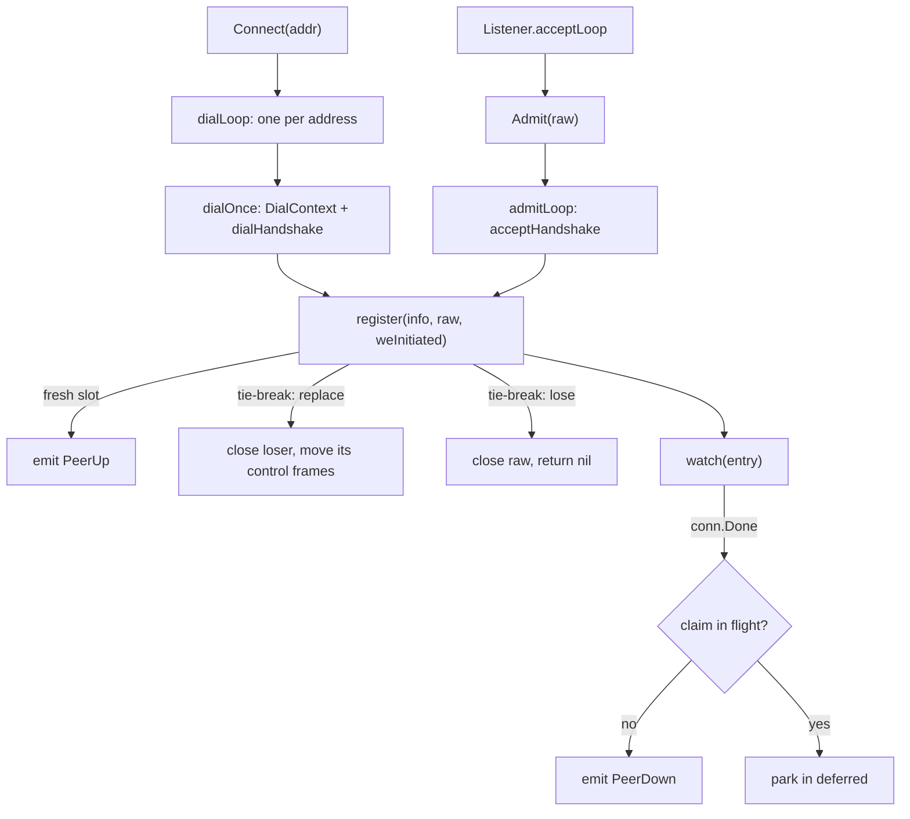
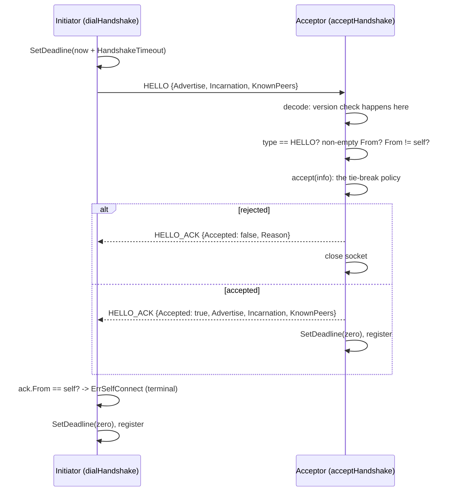
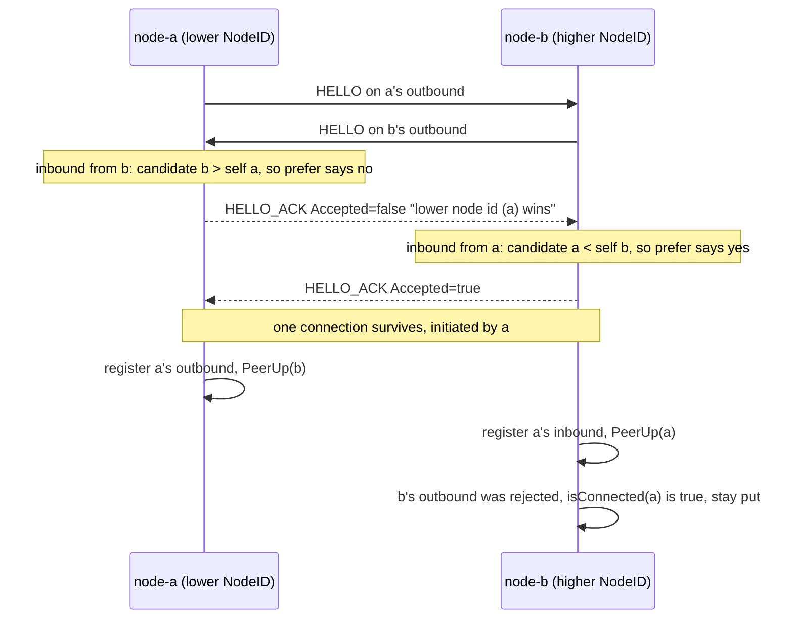
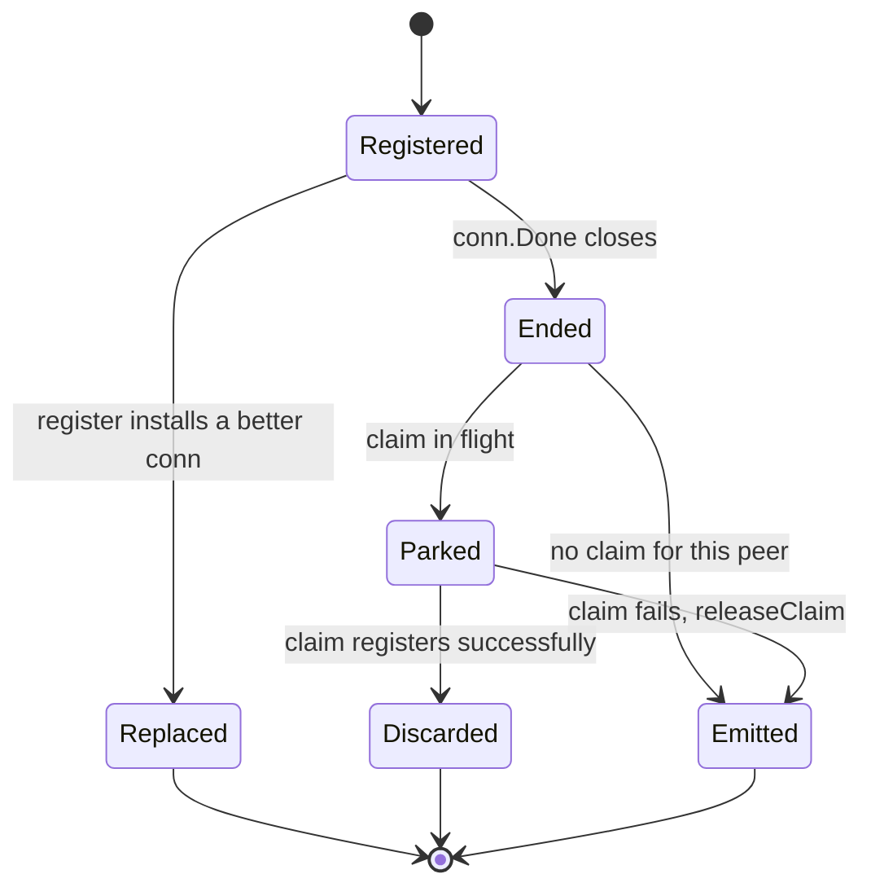

# The Mesh and the Handshake

`pkg/network` owns every socket in the swarm. It moves opaque frames and has no opinion about their
meaning (`pkg/network/doc.go:4`). What it does have opinions about is identity: no frame moves on a
connection until both ends know who the other is, and no peer is ever represented by more than one
connection. This page is how those two rules are kept.

Read [Stream Framing](/concepts/stream-framing) first for what a frame is, and
[TCP Teardown & Half-Open Sockets](/concepts/tcp-teardown-and-half-open-sockets) for why a
connection that looks alive may not be.

## Core Mental Model

A `Pool` is a table from `NodeID` to exactly one `*Conn`, plus the machinery that keeps the table
full. Two things feed it: a dial loop per seed address, and an admit goroutine per accepted socket.
Both run the same handshake, both call the same `register`, and `register` is the only place the
table is written.

The consumer (`pkg/cluster`) sees only the `Transport` interface (`pkg/network/transport.go:56`):
`Send`, `Broadcast`, `Peers`, and an `Events` channel that carries exactly one `PeerUp` when a peer
becomes reachable and exactly one `PeerDown` when it stops (`pkg/network/transport.go:33`).
Everything below -- tie-breaks, replacements, redials -- is invisible on `Events` by design.

## Under the Hood

### HELLO / HELLO_ACK

The handshake is run synchronously on the raw socket, before a `Conn` and its goroutines exist
(`pkg/network/handshake.go:45`). One absolute deadline covers the whole exchange
(`pkg/network/handshake.go:66`), and it is cleared before the `Conn` takes over
(`pkg/network/handshake.go:118`) so the per-frame idle deadline is not pre-empted by a handshake
deadline about to fire.

Three checks are structural and never reach the policy callback (`pkg/network/handshake.go:126`):

| Check | Where | What the peer is told |
|---|---|---|
| Wire version | the `Decoder` rejects before the envelope is inspected, `pkg/network/handshake.go:146` | "this build speaks wire version 1" |
| Empty `From` | `pkg/network/handshake.go:175` | "HELLO carries an empty node id" |
| Own `NodeID` | `pkg/network/handshake.go:179` | "node id is my own id (self-connect)" |

Every rejection is written back with a reason before the socket closes
(`pkg/network/handshake.go:130`). A peer that is merely disconnected learns nothing and redials in
a loop; a peer told "version 2 vs 1" can log something actionable.

Self-connect is terminal. A node whose seed list resolves to itself gets `ErrSelfConnect`
(`pkg/network/handshake.go:42`), and the dial loop exits rather than backing off
(`pkg/network/dial.go:69`): no amount of waiting turns a misconfigured address into a peer.

### The simultaneous-dial tie-break

Two nodes with each other in their seed lists dial at the same instant. Each ends up with an
outbound and an inbound connection to the same peer. `prefer` (`pkg/network/registry.go:95`)
decides which survives from information both sides already hold:

1. A newer `Incarnation` always wins. The process behind the old connection is gone and merely not
   timed out yet.
2. At equal incarnation, keep the connection **initiated by the lower `NodeID`**.

Both sides evaluate the same two IDs and reach the same answer, so neither closes both. The policy
runs twice: early in `admitPolicy` (`pkg/network/admit.go:48`) so the loser learns why in the
`HELLO_ACK`, and again under the lock in `register` (`pkg/network/registry.go:120`), because the
world can change between the two.

A rejection whose peer is already connected is the tie-break outcome, not a failure. The dial loop
checks exactly that (`pkg/network/dial.go:72`) and parks in `waitWhileConnected` rather than
counting a redial.

### Replacement moves control frames, and may reorder them

When `register` replaces an existing entry it closes the loser, then re-queues the loser's unsent
**control** frames onto the winner (`pkg/network/registry.go:148`). Data frames are not moved.
Re-queued frames land behind whatever the winner already holds, so:

> Control frames can be reordered across a connection swap. Data frames queued on the loser are
> dropped. Anything the loser had already handed to the socket may or may not have arrived.

The cluster layer tolerates this because it is idempotent on its inputs -- see
[Idempotence & Hysteresis](/concepts/idempotence-and-hysteresis).

### Claims: why a PeerDown can be deferred

The two sides register the winner independently. Whichever registers first closes the loser, and the
loser's `FIN` reliably reaches the other side *before* that side has finished decoding its own
`HELLO_ACK` for the winner (`pkg/network/pool.go:121`). Without care, every simultaneous dial would
emit a spurious `PeerDown` followed immediately by `PeerUp` -- a flap that membership would count.

So a handshake that has passed the policy takes a **claim** on the peer ID
(`pkg/network/admit.go:58`), and a dial in flight takes one on the address
(`pkg/network/dial.go:98`), both before they could possibly cause the loser to close. When a
connection ends while a claim exists for its peer, `watch` parks the `PeerDown` in `deferred`
instead of emitting it (`pkg/network/registry.go:201`).

The resolution is decided by the claim, never by a timer: a successful `register` discards the
parked event (`pkg/network/registry.go:127`); a failed handshake releases the claim and the parked
`PeerDown` is emitted after all (`pkg/network/registry.go:17`). The event is delayed by at most one
handshake, never lost, and never spurious.

### Events ordering

`Events` delivers a `PeerDown` for a peer **strictly before** any `PeerUp` that replaces it.
Emission happens outside the mutex, so a decided-but-undelivered `PeerDown` is recorded in
`downInFlight` (`pkg/network/pool.go:169`) and `register` blocks on it before emitting the
`PeerUp` (`pkg/network/registry.go:170`). The queue is bounded and emission blocks when it is full
(`pkg/network/pool.go:217`), except during `Close`, when a full buffer is skipped rather than
deadlocking the closer (`pkg/network/registry.go:216`).

### Redial with backoff and jitter

The dial loop never sleeps: every wait is a `select` against the loop's context
(`pkg/network/dial.go:50`). Consecutive failures drive an exponential schedule with +-25% jitter and
a 10 s cap (`pkg/network/dial.go:23`); a success resets the counter (`pkg/network/dial.go:60`).
Addresses are resolved by name on every attempt, never cached
(`pkg/network/dial.go:105`). The full argument is in
[Backoff & Connection Storms](/concepts/backoff-and-connection-storms).

### MeshProber: PING/PONG replaces the SYN probe

The Phase 2 `TCPConnectProber` timed the kernel three-way handshake. That completes from the listen
backlog with **zero application involvement**: a node in a GC pause or with a starved scheduler
still answers a `SYN` in microseconds and would be elected leader while comatose
(`pkg/network/prober.go:22`). `MeshProber` sends a `PING` over the established connection and times
the `PONG`, so the measurement includes the peer's reader goroutine, scheduler, and writer queue.

Two details matter. The pending entry is registered *before* the send, because on loopback the
`PONG` can land on the reader goroutine before `Send` returns (`pkg/network/prober.go:127`). And a
`PONG` with the right ID but the wrong nonce is ignored rather than credited
(`pkg/network/prober.go:228`), so a replayed answer cannot look like a fast one.

## Why It Matters in This Swarm

- **Leader election runs on top of `Events`.** A spurious flap on every simultaneous dial would be
  read as a failure by the detector in `pkg/cluster`. The claim mechanism exists so that the
  transport never lies to membership.
- **No keep-alive on accepted sockets** (`pkg/network/server.go:26`). The per-frame read deadline
  in `Conn` is the failure detector; a kernel timer measured in minutes would be a second, slower
  detector arguing with the first.
- **`Admit` never blocks the accept loop** (`pkg/network/server.go:145`). A client that connects and
  says nothing burns one goroutine parked on a deadline, not the listener.
- **`Close` is a proof of no leaks.** Every pool goroutine is counted in `wg`, and `Close` cancels
  dial loops, closes pending sockets, closes live connections, joins, then closes `Events`
  (`pkg/network/pool.go:351`).

## Common Failure Modes & Edge Cases

**A node dials itself.** *Symptom:* one log line
`network: node "n1": dial handshake with ...: network: connected to self`, then silence. *Cause:*
the seed list contains the node's own advertised address. *Behaviour:* terminal, no redial
(`pkg/network/dial.go:69`). Fix the config; the pool will not fight it.

**Version skew.** *Symptom:* the newer node logs
`handshake rejected by "n3": this build speaks wire version 1: ...` on every backoff. *Cause:* one
image was rebuilt. This is `DispositionProtocolViolation`, which is deliberately **not** a health
failure -- see [TCP Teardown & Half-Open Sockets](/concepts/tcp-teardown-and-half-open-sockets).

**Redialing a peer you are already connected to.** If the dial loop waited on its *own* connection
instead of on any connection to the peer, it would lose the tie-break on every backoff for ever.
`waitWhileConnected` (`pkg/network/dial.go:147`) waits on whichever entry is registered, including a
parked one.

**A restarted peer with the same NodeID.** Its `HELLO` carries a higher incarnation, so it replaces
the stale connection immediately (`pkg/network/registry.go:96`) instead of waiting out
`IdleTimeout`. Membership sees no `PeerDown`/`PeerUp` pair -- the peer "never left". If your
incarnation does not increase on restart, the new process loses the tie-break to a dead one.

**Two addresses for one node.** A node is dialled by whatever name the seed list used, which need
not be the string it advertises. `addrOf` (`pkg/network/pool.go:173`) records both so a dial claim
on either covers the peer.

**Consumer stops draining `Events`.** Emission blocks, and eventually every `watch` goroutine
stalls. That is deliberate (`pkg/network/pool.go:218`): silently dropping a `PeerDown` would leave a
dead peer looking alive forever, which is worse than backpressure. See
[Backpressure & Bounded Queues](/concepts/backpressure-and-bounded-queues).
