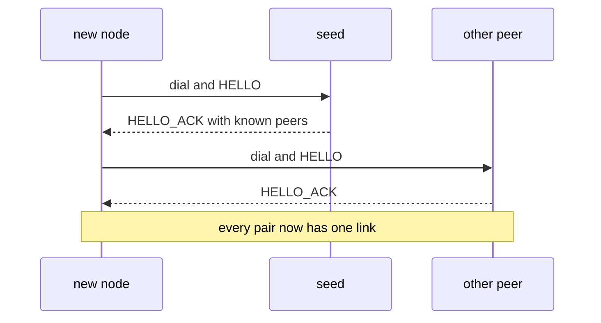
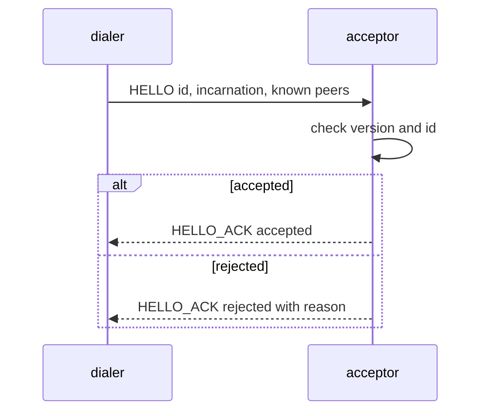
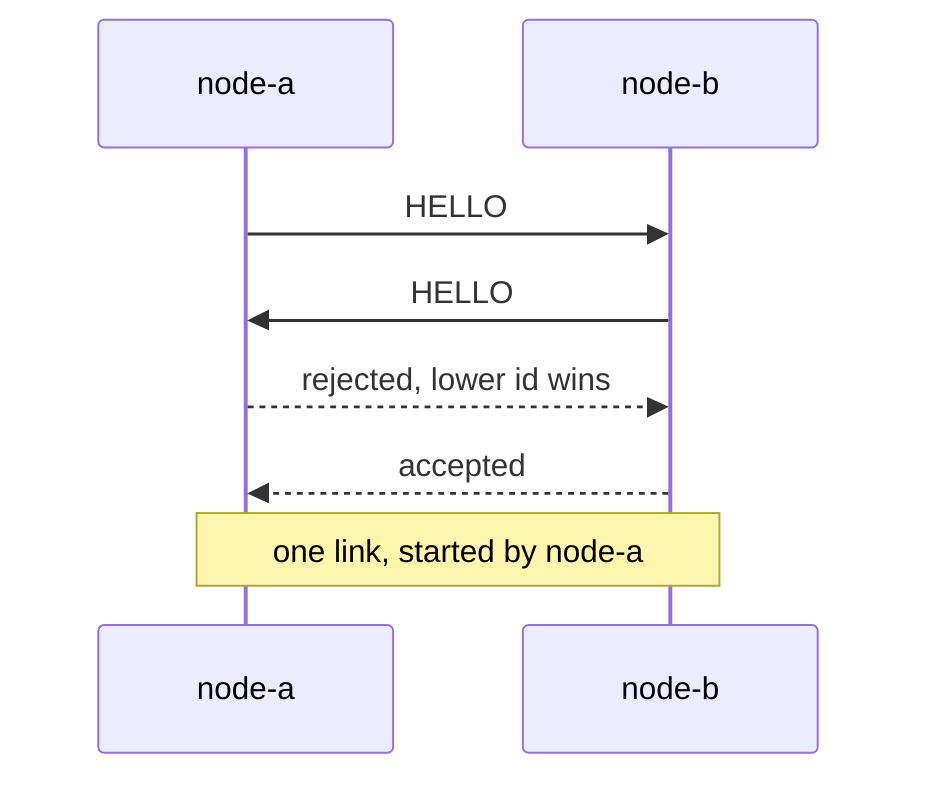
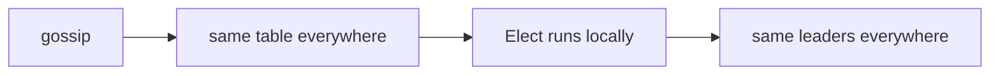

# The Mesh and the Handshake

This page covers how nodes connect: the first dial, the `HELLO` handshake, and how gossip turns
one seed address into a full mesh.

Code: `backend/pkg/network/` (sockets and handshake) and `backend/pkg/cluster/` (gossip).
Background: [Stream Framing](/concepts/stream-framing) and
[TCP Sockets and the Kernel](/concepts/tcp-sockets-and-the-kernel).

## Two rules

1. **No frame moves until both ends know who the other is.** Every connection starts with a
   handshake.
2. **One connection per peer.** If two connections to the same peer exist, one is closed.

The connection pool (`Pool`, `backend/pkg/network/pool.go`) keeps both rules. The cluster code
only sees a small `Transport` interface (`backend/pkg/network/transport.go`): send a frame, list
peers, and receive `PeerUp` / `PeerDown` events.

## From one seed to a full mesh

A new node knows only the seed address. It learns the rest from the seed and dials them itself.

Addresses learned later through gossip are dialled the same way.

## The handshake

What the `HELLO` carries:

| Field | Meaning |
|---|---|
| node ID | who is speaking |
| advertise address | where others can dial this node |
| incarnation | a number that goes up each time the process restarts |
| known peers | addresses this node has learned |

The acceptor rejects a `HELLO` that has the wrong wire version, an empty ID, or its own ID. The
reason is sent back before the socket closes, so the other side can log something useful.

The whole exchange has one deadline. A client that connects and says nothing is dropped when it
expires, and it never blocks the accept loop.

A node that dials itself (its seed list points at its own address) stops dialling that address
for good. Waiting will not fix a config mistake.

## When two nodes dial each other at once

Both end up with two connections to the same peer. Both sides apply the same rule, so they keep
the same one:

1. The newer incarnation wins. The older connection belongs to a dead process.
2. With equal incarnations, keep the connection started by the **lower node ID**.

The pool hides this from the cluster code. A swap does not produce a fake `PeerDown` followed by
`PeerUp`. A restarted peer with a higher incarnation replaces its old link at once.

## Redial with backoff

A failed dial is retried with exponential backoff, plus or minus 25% jitter, capped at 10 s.
A success resets the delay. Names are resolved again on every attempt, so a restarted container
with a new IP is found. See [Backoff and Connection Storms](/concepts/backoff-and-connection-storms).

## Measuring health: PING and PONG

`MeshProber` (`backend/pkg/network/prober.go`) sends a `PING` on the existing link and times the
`PONG`. This measures the peer's whole path: its reader, scheduler and writer.

An earlier version timed the TCP connect instead. That was wrong: the kernel completes a TCP
handshake even when the process is frozen, so a stuck node looked perfectly fast.

## Gossip in brief

Each node keeps a membership table: one record per member with its address, incarnation, role,
health score and state (alive, suspect or dead).

- Changes are pushed to peers as they happen (`MEMBERSHIP_DELTA`).
- Every gossip interval (`SWARM_GOSSIP_INTERVAL`, default 2 s), a node also sends its **full**
  table to one peer. This repairs anything a delta missed.
- Records merge in a fixed order, so every node ends up with the same table:

| Compare | Rule |
|---|---|
| incarnation | higher wins |
| same incarnation, state | state can only get worse (alive, then suspect, then dead) |
| same incarnation, role and score | the higher `seq` wins. Only the member itself bumps its `seq`. |

Same table on every node means the same election result on every node. There is no vote.

`Elect` lives in `backend/pkg/cluster/election.go`. More theory:
[Gossip and Anti-Entropy](/concepts/gossip-and-anti-entropy) and
[Monotonic Merge and Incarnation](/concepts/monotonic-merge-and-incarnation).

## Common problems

| Symptom | Likely cause |
|---|---|
| `connected to self` in the log, then silence | the seed list contains the node's own address |
| `handshake rejected ... wire version` on every retry | two images built from different versions |
| every node elects itself | nodes never dialled the peers they learned about. Check for `learned peer address` in the logs. |
| a restarted node loses to its old self | its incarnation did not go up on restart |

## Related

- [Failure Detection and Failover](./failure-detection-and-failover) -- what happens when a link
  drops.
- [TCP Teardown and Half-Open Sockets](/concepts/tcp-teardown-and-half-open-sockets)
- [Wire Protocol Design](/concepts/wire-protocol-design)
