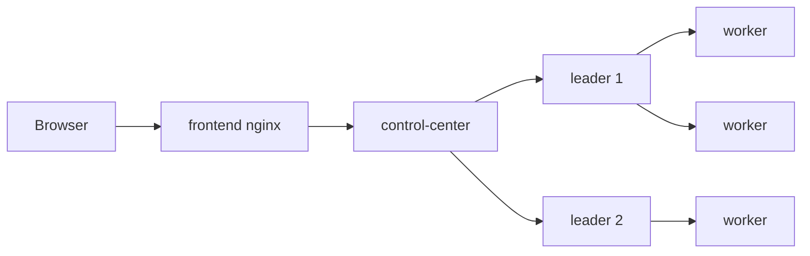
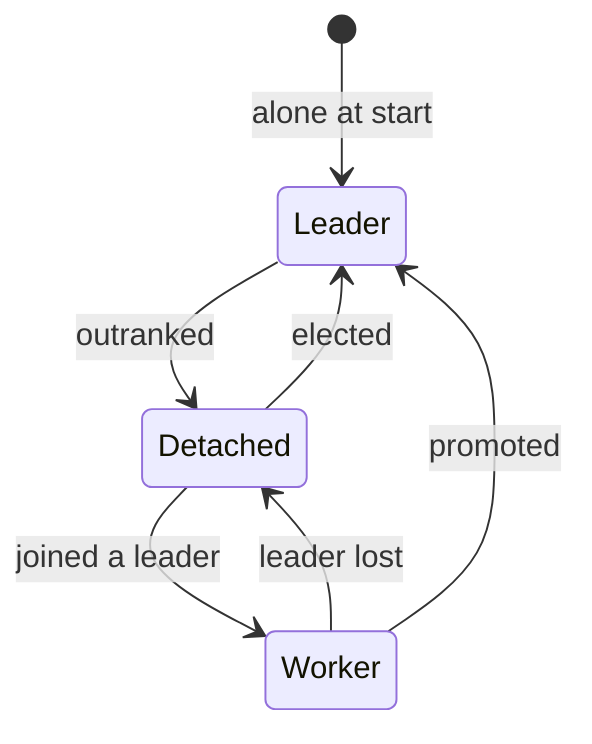
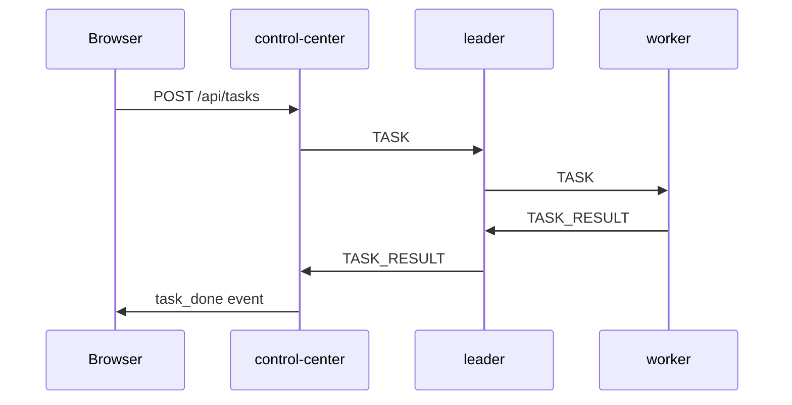
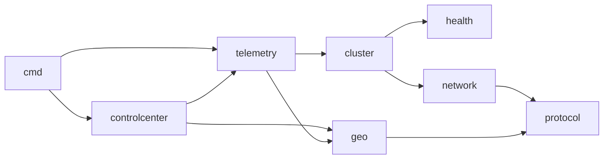

# System Overview

`swarm-net` is a group of identical Go processes ("nodes") that find each other over TCP, pick
their own leaders, and repair themselves when a node dies. A small Control Center watches the
swarm and sends it work. A browser dashboard shows everything live, as drones in a 3D
airspace.

The one rule behind the design: **there are no special nodes**. Every node runs the same binary.
A node becomes a leader because it measured healthy, not because it was configured that way.

## The components

| Component | What it does |
|---|---|
| Browser | Runs the dashboard. Talks HTTP and WebSocket to the frontend only. |
| `frontend` | nginx. Serves the dashboard files and forwards `/api/`, `/healthz` and `/ws` to the Control Center. |
| `control-center` | API and WebSocket server. Collects telemetry from every node, sends tasks to leaders, and runs the drone simulation. |
| leaders | Accept tasks, hand them to their workers, copy their task list to those workers. |
| workers | Run tasks. Each one joins the leader it can reach fastest. |

Every node also sends telemetry straight to the Control Center. That arrow is left out above to
keep the picture simple.

## How many leaders

The leader count grows with the swarm:

$$LeaderCount = \max(1, \lceil N \times threshold \rceil)$$

With the default `threshold = 0.3`: 3 nodes give 1 leader, 6 give 2, 10 give 3.

Nodes are ranked by their health score and the best ones lead. The score comes from a pluggable
interface, `HealthStrategy` (`backend/pkg/health/strategy.go`). The default,
`LatencyHealthStrategy`, scores round-trip time. In a running node the probe is a `PING`/`PONG`
over the existing link (`MeshProber`, `backend/pkg/network/prober.go`).
The cluster code only compares scores (lower is better), so another metric can be dropped in.

## Clusters form by latency

Nobody assigns workers to leaders. Each worker measures every leader and joins the fastest one.
Clusters can therefore be uneven, and that is intended.

A node changes role as the swarm changes:

"Detached" means a worker with no leader yet.

## A task, end to end

The browser request goes through nginx first. It is left out of the diagram.
Details: [Replication and Tasks](./replication-and-tasks) and
[The Control Center](./control-center).

## Drones and emulated distance

On one Docker bridge every node is about 0.1 ms from every other, so latency alone cannot tell
them apart. The Control Center gives each node a 3D position and tells every node the latency
model. A node then delays each `PONG` by:

$$delay = base + distance \times perUnit + jitter \times u$$

The election code is unchanged. It just measures bigger RTTs for far drones, so central drones
lead and workers join the nearest leader. Details:
[Drone Simulation](./drone-simulation) and [Network Emulation](/concepts/network-emulation).

## Two kinds of traffic

All node-to-node traffic shares one TCP connection per pair, but not one priority.

- **Control traffic:** handshakes, probes, heartbeats, gossip, `STATE_SYNC`. Small and never
  dropped.
- **Data traffic:** `TASK` and `TASK_RESULT`. Dropped first when a queue is full, so heartbeats
  never wait behind work.

See [Backpressure and Bounded Queues](/concepts/backpressure-and-bounded-queues).

## Repository layout

| Path | What it holds |
|---|---|
| `backend/` | Go module `swarm-net` |
| `backend/cmd/swarm-node/` | The node binary. Same for every node. |
| `backend/cmd/control-center/` | The Control Center binary (API and WebSocket only) |
| `backend/pkg/protocol/` | Message types and framing. Imports nothing local. |
| `backend/pkg/network/` | TCP listener, dialer, connection pool, prober (with the per-peer PONG delay hook) |
| `backend/pkg/geo/` | Drone latency model and default positions. Pure, imports only `protocol`. |
| `backend/pkg/health/` | `HealthStrategy` and `LatencyHealthStrategy` |
| `backend/pkg/cluster/` | Membership, election, heartbeats, failover, replication, tasks, runtime election tuning |
| `backend/pkg/telemetry/` | A node's link to the Control Center, `SIM_CONFIG` handling, frame counting (`FlowRecorder`) |
| `backend/pkg/controlcenter/` | The Control Center's hub, node server, HTTP API and sim state |
| `backend/Dockerfile` | Two targets: `node` and `control-center` |
| `backend/deploy/node-entrypoint.sh` | Gives each scaled replica a readable ID |
| `frontend/` | Dashboard (`index.html`, `app.js`, `style.css`): 3D airspace, grouped view, message animation, simulation panel. Plus `nginx.conf.template` and `Dockerfile`. |
| `docs/` | This site. `package.json` sits at the repo root. |
| `docker-compose.yml` | Services `frontend`, `control-center`, `seed`, `node` |
| `.env.example` | Every tunable. Copy it to `.env`. |
| `scripts/e2e.sh` | End-to-end test: self-healing, chaos kill, sim changes |

Imports only point one way:

Each package has one reason to change. `protocol` changes with the wire format, `network` with
connection handling, `health` with a new metric, `cluster` with the algorithm.

## What is deliberately missing

- **No consensus.** Two network partitions can each elect leaders. See
  [Why Not Consensus](./why-not-consensus).
- **No persistence.** State lives in memory. Stop every node and it is gone.
- **No mesh authentication.** The mesh runs on a private Docker network and its port is never
  published. Only the frontend port is published, bound to `127.0.0.1` by default.

## Read next

1. [The Mesh and the Handshake](./mesh-and-handshake)
2. [Failure Detection and Failover](./failure-detection-and-failover)
3. [Replication and Tasks](./replication-and-tasks)
4. [The Control Center](./control-center)
5. [Drone Simulation](./drone-simulation)
6. [Running the Swarm](./running-the-swarm)
7. [Why Not Consensus](./why-not-consensus)
