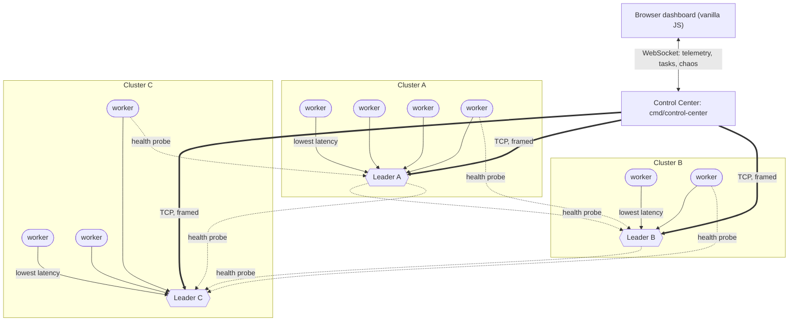
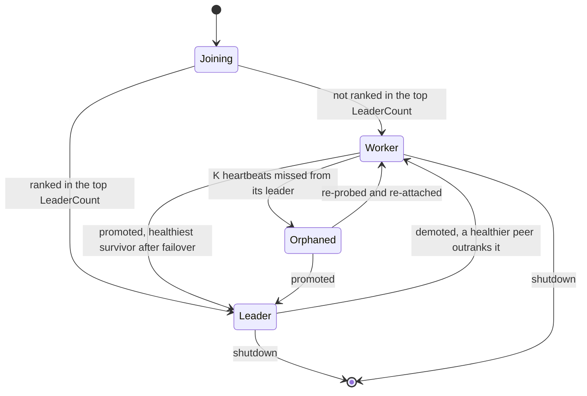
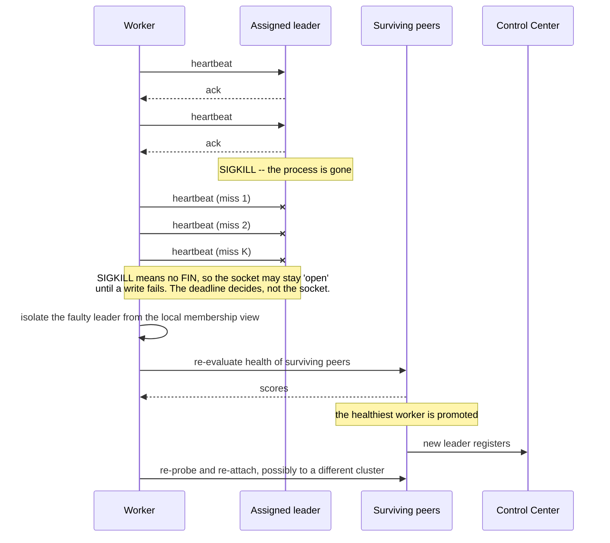

# System Overview

`swarm-net` is a peer-to-peer swarm of $N$ identical Go processes, each in its own container on a
user-defined Docker bridge network, plus one Control Center that coordinates nothing and observes
everything.

The design constraint that shapes every other decision: **there are no special nodes**. Every node
ships the same binary and the same configuration schema. Leadership is a role a node acquires from
measured health, not a flag it is started with. Kill any container and the swarm reshapes.

## The map



Solid double arrows are the Control Center's task and telemetry path. Solid single arrows are
cluster attachment: a worker attaches to whichever leader answers fastest. Dashed arrows are health
probing, which runs across the **full P2P mesh** -- every node can probe every other, not only its
own leader. Only a representative subset is drawn; at $N=10$ the real mesh is 45 edges.

The number of leaders is $\lceil N \times \text{threshold} \rceil$, minimum 1. Cluster sizes are
whatever affinity produces.

Two distinct traffic planes overlay the same TCP mesh:

- **The control plane.** Peer discovery, health probes, election messages, heartbeats, membership
  gossip. Node-to-node, constant, small, latency-sensitive.
- **The data plane.** Tasks injected at the Control Center, broadcast down through leaders to
  workers; telemetry aggregated back up. Bursty, larger, throughput-sensitive.

They share a transport but not a priority. Heartbeats must not queue behind a task payload -- a
fact that constrains the framing and connection-pool design in `pkg/network`.

## The four mechanisms

### 1. Dynamic leadership threshold

The number of leaders is a function of swarm size, not a constant:

$$\text{LeaderCount} = \max(1, \lceil N \times \text{threshold} \rceil)$$

With `threshold = 0.3`: $N=3 \Rightarrow 1$ leader, $N=10 \Rightarrow 3$, $N=25 \Rightarrow 8$. The
$\max(1, \ldots)$ clamp keeps a single-node swarm legal -- a degenerate case that must work,
because it is the first thing anyone runs.

Candidates are ranked by health score; the top `LeaderCount` become leaders. The interesting
question is not the formula but what happens when two nodes compute different values of $N$ at the
same instant. That is a split-brain scenario, handled in Phase 3/4, not wished away here.

Because leadership is acquired rather than configured, role is a state in a machine:



### 2. Affinity clustering, not quotas

A worker is not assigned to a leader. It probes every elected leader, measures the round-trip
health score, and joins the best one. There are no fixed percentage splits and no balancing
authority.

The consequence is worth stating up front: **clusters will be uneven**, and that is the intended
behaviour. If one leader sits on a fast path from seven workers, it gets seven workers. Load
balancing is a separate concern from affinity, and conflating them produces a system that is bad at
both. If capacity limits are later required, they enter as an explicit admission-control policy on
the leader, not as a quota baked into the clustering rule.

### 3. Health as an interface

```go
type HealthStrategy interface {
    Name() string
    EvaluateScore(target NodeAddress) (float64, error)
}
```

`LatencyHealthStrategy` ships as the default. The contract exists so that CPU load, free memory,
packet loss, or a composite weighted score can be substituted without `pkg/cluster` learning
anything new. The cluster logic must therefore never inspect *what* a score means -- only compare
scores. Any code that assumes "score is milliseconds" is a bug against this contract.

The open design questions this raises -- score direction (is higher better?), normalisation range,
error semantics when a probe fails, and staleness -- are contract decisions for Phase 2, listed in
the [Worklog](/WORKLOG) as open items.

### 4. Self-healing



$K$ consecutive misses, not one, because a single missed beat is indistinguishable from a scheduler
hiccup or a GC pause. The gap between "slow" and "dead" is unknowable from the outside -- this is
the core insight of failure-detector theory, and $K$ and the heartbeat interval are the two knobs
that trade detection latency against false positives.

## Package boundaries

| Package | Owns | Must not know about |
|---|---|---|
| `pkg/protocol` | Wire schemas, message types, framing codec | Cluster roles, health semantics |
| `pkg/network` | TCP listener, dialer, connection pool, read/write loops | Message *meaning* |
| `pkg/health` | `HealthStrategy` + `LatencyHealthStrategy` | Election rules, membership |
| `pkg/cluster` | Membership table, election math, heartbeats, failover, replication | Byte-level framing, socket details |
| `pkg/telemetry` | Node state snapshots for the dashboard | How they are transported |
| `cmd/swarm-node` | Wiring, config, lifecycle, signal handling | -- |
| `cmd/control-center` | Task broadcast, telemetry aggregation, HTTP/WS, chaos surface | Election internals |

The dependency direction is strictly downward: `cmd` -> `cluster` -> {`health`, `network`} ->
`protocol`. `pkg/protocol` imports nothing from this repo. If that ever inverts, the abstraction
has failed and the fix is a new interface, not an import cycle break.

## What is deliberately not here

- **No consensus algorithm.** This is not Raft. Leaders are elected from health scores, and the
  system accepts that two partitions may each elect leaders. The comparison to Raft/Paxos, and an
  honest account of what guarantees we are giving up, is in
  [Why Not Consensus](/architecture/why-not-consensus).
- **No persistence.** State lives in memory and is replicated leader-to-worker. A total swarm
  shutdown loses it. That is a legitimate choice for this system's purpose and an illegitimate one
  for a database; the docs will say which is which.
- **No authentication or encryption on the mesh.** The mesh is trusted because it is a private
  bridge network. Publishing any mesh port to the host would invalidate that assumption, which is
  why `deploy/` will publish only the Control Center's HTTP port.

## Where to go next

- [Repository Layout](./repo-layout) -- what lives where, and why the boundaries fall there.
- [TCP Sockets & The Kernel](/concepts/tcp-sockets-and-the-kernel) -- the substrate everything
  above is built on.
- [Stream Framing](/concepts/stream-framing) -- why "send a message" is not an operation TCP
  offers.
- [Engineering Worklog](/WORKLOG) -- the decisions and the open questions.
