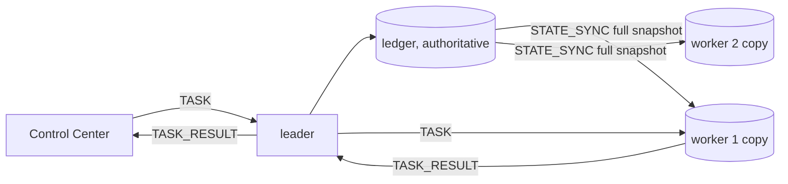
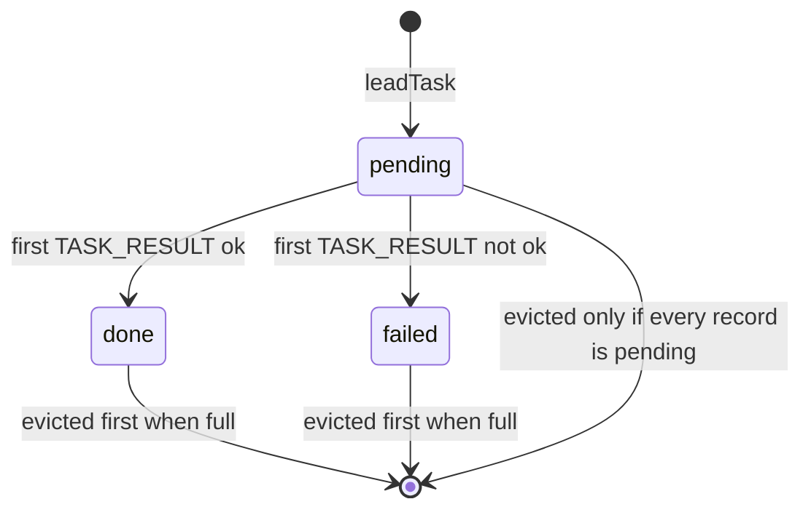
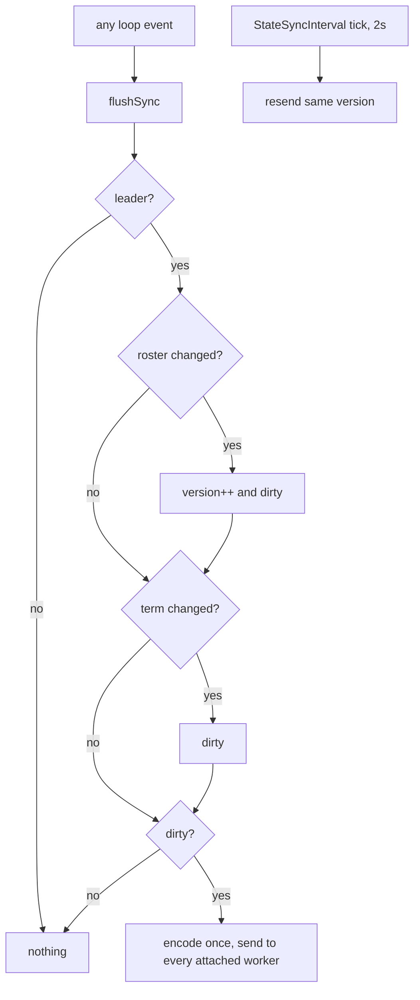
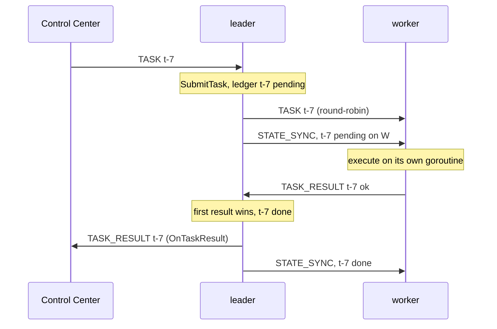
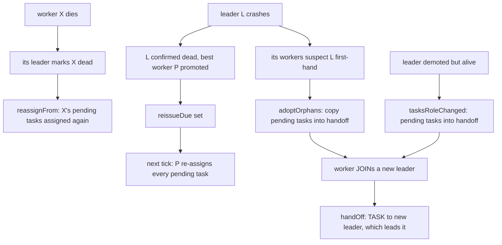
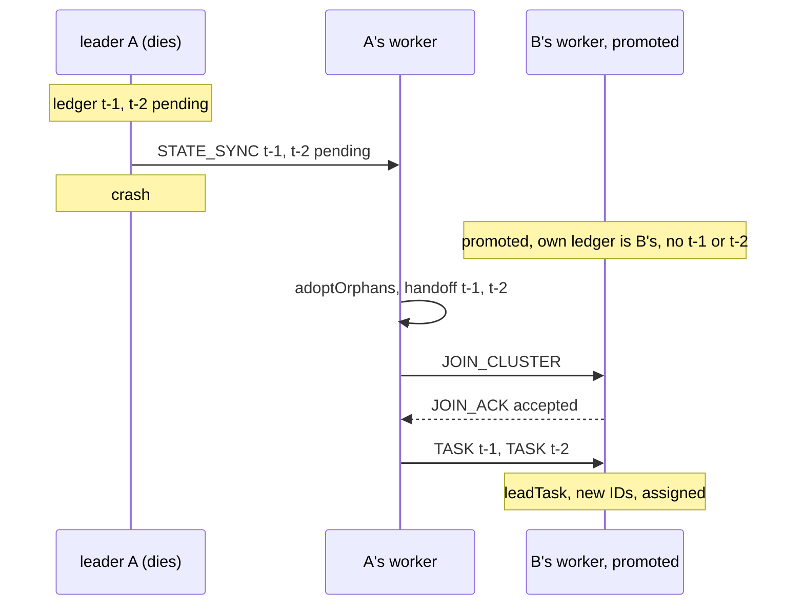

# Replication and Tasks

A leader owns a **task ledger**. It copies the whole ledger to its workers with `STATE_SYNC`.
When the leader dies, a worker's copy becomes the new leader's ledger, and pending tasks are
sent out again.

Code: `pkg/cluster/replication.go`, `pkg/cluster/tasks.go`, `pkg/cluster/control.go`. Theory:
[At-Least-Once Delivery](/concepts/at-least-once-delivery). Failure detection that triggers all
of this: [Failure Detection and Failover](/architecture/failure-detection-and-failover).

---

## Core Mental Model

### One author, full snapshots



Two rules:

| Rule | Why |
|---|---|
| a worker **replaces** its copy, never merges | the leader is the only author. Merging would resurrect records the leader already dropped |
| a worker accepts a snapshot only from **its own leader**, and only if **(Term, Version)** is newer | stale or foreign snapshots are ignored |

Compare membership, which is the opposite: many authors, so records are merged. See
`StateSyncPayload` (`pkg/protocol/message.go:488`) and
[Gossip and Anti-Entropy](/concepts/gossip-and-anti-entropy).

### A ledger record

```json
{"task_id": "t-7", "assigned_to": "node-4", "state": "pending",
 "kind": "sleep", "body": {"ms": 200}}
```



`kind` and `body` are there so a **promoted** worker can send the task out again. The body is
cleared once the task finishes (`pkg/cluster/tasks.go:251`).

---

## Under the Hood

### When a snapshot is sent



| Step | Code |
|---|---|
| flush once after every loop event | `pkg/cluster/node.go:681` |
| `flushSync` | `pkg/cluster/replication.go:160` |
| roster change is a new version | `pkg/cluster/replication.go:165` |
| periodic resend, same version | `pkg/cluster/replication.go:185`, ticker at `pkg/cluster/node.go:669` |
| encode once per snapshot | `sendSync`, `pkg/cluster/replication.go:192` |

Flushing once per event means a death that detaches a worker **and** re-assigns its tasks leaves
as one snapshot, not three. Test: `TestLedgerChangesAreCoalescedPerEvent`
(`pkg/cluster/replication_test.go:85`).

The periodic resend is the only retry. A worker that already holds that version ignores it. A
worker that missed one catches up. There is no log, no gap detection and no retransmit logic.

### The worker side

```go
// pkg/cluster/replication.go:262 (logging trimmed)
func (n *Node) handleStateSync(from protocol.NodeID, p protocol.StateSyncPayload) {
	if n.isLeader() || from != n.leader || (p.Leader != "" && p.Leader != from) {
		return // not from our leader
	}
	if p.Term > n.term {
		n.term = p.Term
	}
	if n.repl.held && !newerSnapshot(p.Term, p.Version, n.repl.term, n.repl.version) {
		n.publish()
		return // not newer
	}
	ledger := p.Ledger
	if extra := len(ledger) - n.cfg.LedgerSize; extra > 0 {
		ledger = ledger[extra:] // keep the newest
	}
	n.repl.ledger = ledger
	n.repl.version = p.Version
	n.repl.term = p.Term
	n.repl.held = true
	n.repl.pubStale = true
	n.publish()
}
```

`held` is reset whenever the worker attaches to a leader (`pkg/cluster/node.go:1435`) or changes
role (`pkg/cluster/replication.go:299`). A different leader numbers its versions from its own
counter, so the first snapshot of a new attachment is always taken.

On promotion there is nothing to copy. The worker's copy **is** its ledger, and the version
numbering continues from there (`roleChanged`, `pkg/cluster/replication.go:295`).

### Task routing

`TASK` means different things depending on who sent it. The frame is the same.

| `TASK` from | Meaning | Action | Code |
|---|---|---|---|
| my leader (I am a worker) | an assignment | run it, report to the sender | `pkg/cluster/tasks.go:283` |
| one of my attached workers | a forwarded submission or a handoff | lead it | `pkg/cluster/tasks.go:285` |
| another node I believe leads | an assignment from a leader that has not noticed I left | run it | `pkg/cluster/tasks.go:287` |
| anyone, and I lead | a forward from a worker not yet attached | lead it | `pkg/cluster/tasks.go:289` |
| anyone else | nobody to take work from | drop, warn | `pkg/cluster/tasks.go:291` |

A worker never forwards a forward, so there are no loops.



| Step | Code |
|---|---|
| entry point, safe from any goroutine | `SubmitTask`, `pkg/cluster/control.go:43` |
| a worker forwards to its leader | `submit`, `pkg/cluster/tasks.go:70` |
| duplicate ID ignored | `leadTask`, `pkg/cluster/tasks.go:88` |
| round-robin, skip unreachable, else run locally | `assign`, `pkg/cluster/tasks.go:98` |
| at most 256 running tasks, then fail fast with `busy` | `pkg/cluster/tasks.go:141` |
| panicking executor becomes a failed task | `execute`, `pkg/cluster/tasks.go:174` |
| first result wins | `completeTask`, `pkg/cluster/tasks.go:242` |
| result to current leader if the original is gone | `sendResult`, `pkg/cluster/tasks.go:203` |

### At-least-once: three failover paths

A pending task can be lost in three ways. Each has its own recovery.



| Path | Trigger | Code |
|---|---|---|
| re-issue on promotion | this node became a leader | `tasksRoleChanged`, `pkg/cluster/tasks.go:336`, then `reissueIfDue`, `pkg/cluster/tasks.go:367` |
| re-assign a dead worker's tasks | `markDead` or `markLeft` on an attached worker | `reassignFrom`, `pkg/cluster/tasks.go:304` |
| carry a failed leader's tasks | worker leaves a leader it suspects, or one that is dead or gone | `adoptOrphans`, `pkg/cluster/tasks.go:356`, called from `pkg/cluster/heartbeat.go:73` and `pkg/cluster/node.go:1765` |
| forward the carried tasks | `JOIN_ACK` accepted | `handOff`, `pkg/cluster/tasks.go:383`, called at `pkg/cluster/node.go:1437` |

Why the third path exists: election promotes the **healthiest node from any cluster**. The new
leader may never have been one of the dead leader's workers, so its own copy does not hold
those tasks:



Every orphaned worker carries the same tasks, so the new leader receives duplicates. `leadTask`
keeps the first copy of each ID and ignores the rest. Tests:
`TestOrphanedWorkerCarriesPendingTasks` (`pkg/cluster/tasks_test.go:515`),
`TestPromotedWorkerReissuesPendingTasksOnce` (`pkg/cluster/tasks_test.go:448`),
`TestDeadWorkersTasksAreReassigned` (`pkg/cluster/tasks_test.go:284`),
`TestDemotedLeaderHandsOffPendingTasks` (`pkg/cluster/tasks_test.go:483`).

An ordinary re-home (the old leader is alive) does **not** carry tasks. The old leader still
owns them.

### The limits

| Limit | Value | Where | What happens past it |
|---|---|---|---|
| ledger size | 500 records | `pkg/cluster/node.go:60` | oldest done or failed evicted first. If all are pending, the oldest pending goes, with a warning (`pkg/cluster/replication.go:141`) |
| body kept for re-issue | 1 KiB | `pkg/cluster/replication.go:110` | the task runs, but its record has no body and it cannot be re-issued (`pkg/cluster/replication.go:146`) |
| result kept in the ledger | 512 bytes, UTF-8 safe | `pkg/cluster/replication.go:113` | truncated. The full output still reaches `OnTaskResult` |
| snapshot size | frame limit minus 64 KiB, so 960 KiB | `pkg/cluster/replication.go:116` | the **sent copy** is trimmed: older half of the completed records per pass, or the older half of everything when none are completed (`pkg/cluster/replication.go:243-246`). The ledger itself is untouched |
| running tasks per node | 256 | `pkg/cluster/tasks.go:41` | extra tasks fail at once with `busy: too many running tasks` |
| resend period | 2 s | `pkg/cluster/node.go:58` | a lost snapshot is repaired within one period |

The frame limit is `MaxFrameSize`, 1 MiB (`pkg/protocol/framing.go:58`).

### Planes

`STATE_SYNC` is **control plane**: never shed (`pkg/protocol/message.go:98`). `TASK` and
`TASK_RESULT` are **data plane** (`pkg/protocol/message.go:156`): shed when a node's inbound data
queue is full. A shed task is not retried on a timer. Its record stays pending until one of the
failover paths above re-issues it (`pkg/cluster/tasks.go:33`).

---

## Why It Matters in This Swarm

- **Failover keeps the work, not just the roles.** The Phase 4 end-to-end test kills a leader
  with 6 tasks whose results were lost, and asserts all 6 are reported by survivors within the
  failover bound (`pkg/cluster/failover_test.go:35`).
- **The Control Center sees duplicates.** A task may be reported twice. The CC keeps the first
  result per `task_id`. See [Control Plane Contract](/architecture/control-plane).
- **The replica is also telemetry.** `Status.Ledger` is the ledger this node holds, leader or
  worker (`ControlStatus`, `pkg/cluster/control.go:93`), which the dashboard shows as
  `ledger_size`.
- **No log means no truncation bugs.** A bounded snapshot costs more bytes per change but has no
  gaps, no compaction and no catch-up protocol.

---

## Common Failure Modes & Edge Cases

### A task runs twice

Symptom: two `TASK_RESULT` lines for one `task_id`, from different workers. Cause: a failover
re-issued a task whose first run also finished. This is the design. Make executors idempotent;
see [At-Least-Once Delivery](/concepts/at-least-once-delivery).

### A large task is lost in a failover

Symptom: after a leader crash, one task never completes and the new leader logs nothing about
it. The old leader logged `task body too large to replicate`. Cause: its body was over 1 KiB, so
the replicated record had no body. Keep task bodies small, or pass a reference instead of the
data.

### A task stays pending forever

Symptom: a task shows `pending` on the dashboard long after submission, with no failover.
Cause: its `TASK` or `TASK_RESULT` was shed on a full data queue, and nothing retries it until a
failover. Check `dropped` in the node telemetry.

### A very late duplicate runs again

Symptom: a task finishes, then runs again much later. Cause: duplicate detection is a ledger
lookup. Once the record has been evicted (500 newer records), a late handoff of the same ID
looks new.

### A worker edits its replica

Symptom: a worker-side change to the ledger disappears. Cause: the next snapshot replaces the
copy. Only a leader records results (`pkg/cluster/tasks.go:232`).

### Records without a kind

Symptom: `pending task has no kind; cannot re-issue` after a rolling upgrade. Cause: the record
came from a build that did not replicate `kind`/`body` (`pkg/cluster/tasks.go:323`). Those tasks
are lost on failover.

---

## See Also

- [At-Least-Once Delivery and Idempotent Re-issue](/concepts/at-least-once-delivery)
- [Logical Clocks](/concepts/logical-clocks) -- why (Term, Version) orders snapshots.
- [Backpressure and Bounded Queues](/concepts/backpressure-and-bounded-queues) -- why tasks are
  shed and `STATE_SYNC` is not.
- [Failure Detection and Failover](/architecture/failure-detection-and-failover)
- [Why Not Consensus](/architecture/why-not-consensus) -- why this is a snapshot and not a
  replicated log.
