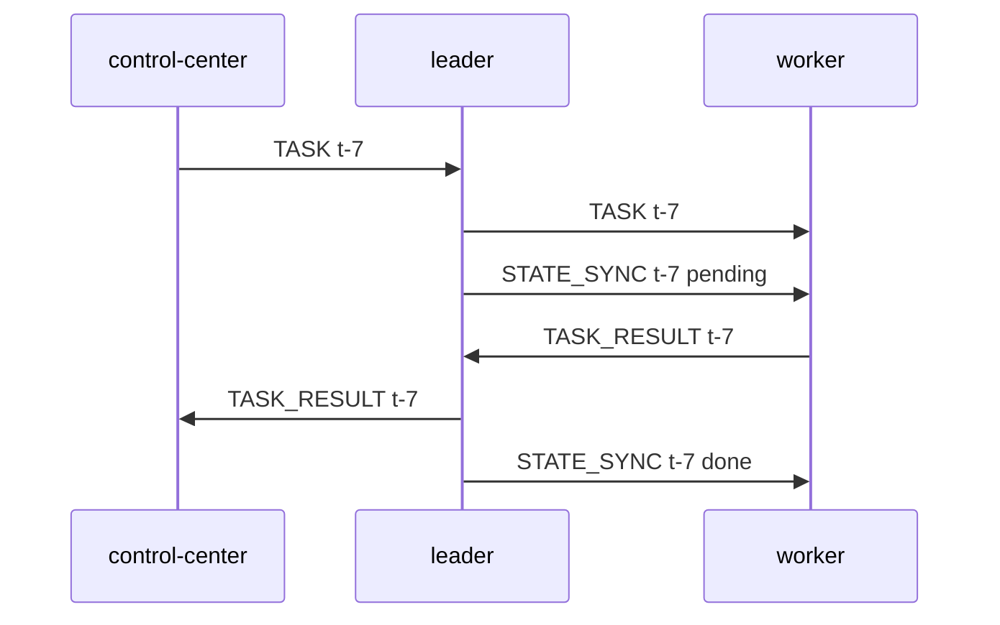
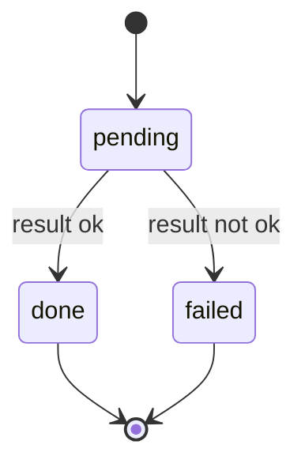
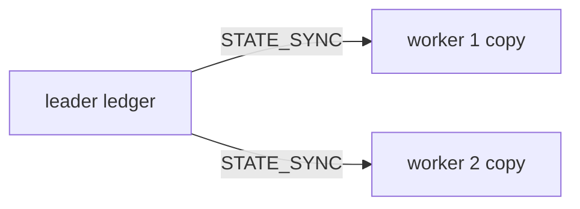
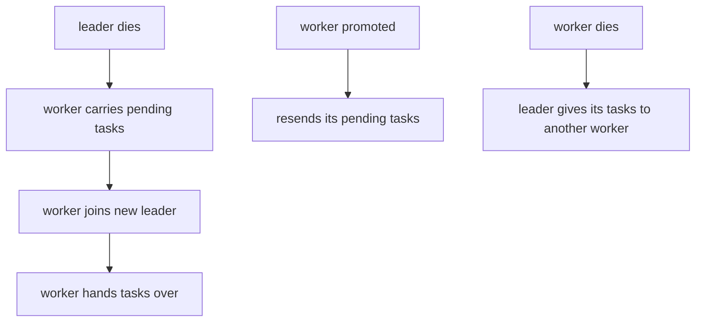
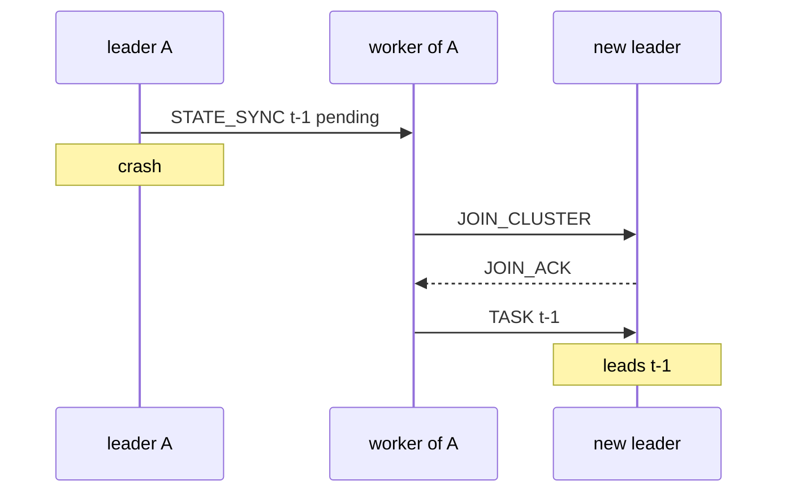

# Replication and Tasks

A leader keeps a **task ledger**: one record per task it leads. It copies the whole ledger to
its workers. When the leader dies, those copies let the swarm finish the work.

Code: `backend/pkg/cluster/tasks.go`, `backend/pkg/cluster/replication.go`,
`backend/pkg/cluster/control.go`. Theory:
[At-Least-Once Delivery](/concepts/at-least-once-delivery).

## A task's journey



- The leader picks workers round-robin and skips unreachable ones. With no worker, it runs the
  task itself.
- If a worker receives a task from the Control Center, it forwards it to its leader.
- A duplicate task ID is ignored. The first result for an ID wins.
- A node runs at most 256 tasks at once. Extra tasks fail at once with `busy`.

Built-in task kinds (`backend/pkg/cluster/executor.go`):

| kind | body | output |
|---|---|---|
| `echo` | any JSON | the body, unchanged |
| `sleep` | `{"ms": 200}` | `slept 200ms` (at most 10000 ms) |
| `hash` | `{"data": "abc"}` | hex SHA-256 of `data` |

## A ledger record

```json
{"task_id": "t-7", "assigned_to": "node-4", "state": "pending",
 "kind": "sleep", "body": {"ms": 200}}
```



`kind` and `body` are kept while the task is pending, so another node can send it out again.
The body is dropped once the task finishes.

## STATE_SYNC: full snapshots from one author



Rules:

- **Only the leader writes.** A worker replaces its copy with each snapshot. It never merges.
- **A worker only accepts its own leader's snapshot**, and only if its `(term, version)` is newer
  than what it holds.
- **Snapshots are sent after any change**, at most once per event, and resent every 2 s. The
  resend is the only retry. A worker that missed one catches up on the next.
- **On promotion there is nothing to copy.** The worker's copy becomes its ledger.

Membership works the other way: many authors, so records are merged. See
[Gossip and Anti-Entropy](/concepts/gossip-and-anti-entropy).

## Three ways a task survives a failure



| Path | When | Function |
|---|---|---|
| carry and hand over | a worker leaves a leader it suspects or knows is dead | `adoptOrphans`, then `handOff` |
| resend on promotion | a node becomes leader | `reissueIfDue` |
| reassign | a leader's worker dies | `reassignFrom` |

The first path exists because the new leader may come from a **different cluster**. Its own copy
does not hold the dead leader's tasks. So each orphaned worker brings them along:



Several workers may carry the same task. The new leader keeps the first copy of each ID.

If the old leader is still alive and the worker simply moves to a faster leader, nothing is
carried. The old leader still owns its tasks.

## At-least-once, not exactly-once

A task can run twice: once before the crash, and again after it is re-sent. The Control Center
keeps the first result per `task_id`. Task handlers should be safe to repeat.

## Limits

| Limit | Value | Past the limit |
|---|---|---|
| ledger size | 500 records | oldest finished records are dropped first |
| body kept for re-sending | 1 KiB | the task runs, but cannot be re-sent after a failover |
| result kept in the ledger | 512 bytes | truncated. The full result still reaches the Control Center. |
| snapshot size | under the 1 MiB frame limit | the sent copy is trimmed, the ledger is not |
| running tasks per node | 256 | fails at once with `busy` |

`STATE_SYNC` is control traffic and is never dropped. `TASK` and `TASK_RESULT` are data traffic
and can be dropped when a queue is full. A dropped task stays pending until a failover re-sends
it.

## Common problems

| Symptom | Likely cause |
|---|---|
| two results for one `task_id` | a failover re-sent a task that had already finished. Expected. |
| a task is lost after a leader crash, log says `task body too large to replicate` | the body was over 1 KiB |
| a task stays `pending` with no failover | its `TASK` or `TASK_RESULT` was dropped on a full queue. Check `dropped` in the telemetry. |
| a finished task runs again much later | its record was evicted, so a late handover looked new |

## Related

- [Failure Detection and Failover](./failure-detection-and-failover)
- [Backpressure and Bounded Queues](/concepts/backpressure-and-bounded-queues)
- [Why Not Consensus](./why-not-consensus) -- why this is a snapshot, not a replicated log.
