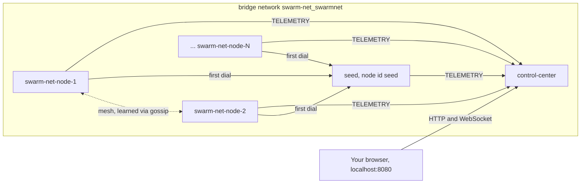
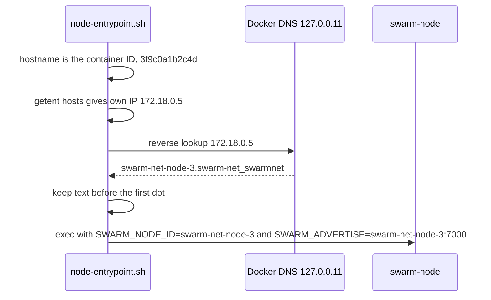
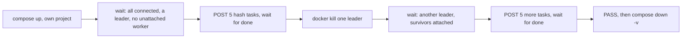

# Running the Swarm

How to start the swarm, scale it, watch it, break it, and test that it heals.
For how the Control Center works inside, see [The Control Center](./control-center).

## Core Mental Model



| Service | Image target | Count | Published port |
|---|---|---|---|
| `control-center` | `control-center` | 1 | `8080` (or `$SWARM_HTTP_PORT`) |
| `seed` | `node` | 1 | none |
| `node` | `node` | 5 by default, `--scale node=N` | none |

Only the dashboard port leaves the bridge. The mesh port 7000 is never published.

Total nodes $= 1 + \text{replicas}$. Leaders $= \max(1, \lceil N \times 0.3 \rceil)$, so
the default $N = 6$ gives 2 leaders.

## Under the Hood

### Start

```bash
docker compose up --build            # 1 seed + 5 nodes
docker compose up --build -d         # same, detached
docker compose logs -f node          # follow the replicas
docker compose down                  # stop and remove
```

Open `http://localhost:8080` in a browser.

### Scale

```bash
docker compose up -d --scale node=11     # 12 nodes, 4 leaders
docker compose up -d --scale node=2      # shrink: 3 nodes, 1 leader
```

No YAML or Go edits. Each replica picks its own readable ID at start-up:



The short container ID also resolves on the bridge, but it is unreadable on the
dashboard. If any lookup fails, the script exports nothing and the binary falls
back to the hostname (`deploy/node-entrypoint.sh:29-44`). `seed` sets both
variables explicitly, so the script leaves them alone.

### Configuration

Precedence: **flag > `SWARM_*` env > default**. The table is built from
`cmd/swarm-node/config.go:85-98` and `cmd/control-center/config.go:42-46`.

**swarm-node**

| Env | Flag | Code default | Compose value |
|---|---|---|---|
| `SWARM_NODE_ID` | `-node-id` | hostname | entrypoint, or `seed` |
| `SWARM_LISTEN` | `-listen` | `:7000` | `:7000` |
| `SWARM_ADVERTISE` | `-advertise` | `<hostname>:<listen port>` | entrypoint, or `seed:7000` |
| `SWARM_SEEDS` | `-seeds` | empty | `seed:7000` |
| `SWARM_CONTROL_CENTER` | `-control-center` | empty (no uplink) | `control-center:7000` |
| `SWARM_TELEMETRY_INTERVAL` | `-telemetry-interval` | `1s` | `1s` |
| `SWARM_THRESHOLD` | `-threshold` | `0.3`, must be in (0,1] | `0.3` |
| `SWARM_PROBE_INTERVAL` | `-probe-interval` | `1s` | `1s` |
| `SWARM_ELECTION_FLOOR` | `-election-floor` | `30s` | not set |
| `SWARM_GOSSIP_INTERVAL` | `-gossip-interval` | `2s` | `2s` |
| `SWARM_IDLE_TIMEOUT` | `-idle-timeout` | `15s`, must exceed 3 x probe interval | `5s` |
| `SWARM_LOG_LEVEL` | `-log-level` | `info` | `info` |

**control-center**

| Env | Flag | Default |
|---|---|---|
| `SWARM_CC_LISTEN` | `-listen` | `:7000` (node connections) |
| `SWARM_CC_HTTP` | `-http` | `:8080` (dashboard and API) |
| `SWARM_LOG_LEVEL` | `-log-level` | `info` |

**Compose only**

| Env | Default | Effect |
|---|---|---|
| `SWARM_HTTP_PORT` | `8080` | host port mapped to the CC's `8080` |

Values marked "Compose value" use `${VAR:-default}`, so you can override them
from the shell:

```bash
SWARM_THRESHOLD=0.5 SWARM_LOG_LEVEL=debug docker compose up -d --scale node=7
```

The CC service has no `environment:` block, so `SWARM_LOG_LEVEL` does not reach
it through Compose. Both binaries exit with code **2** on a config error and
**1** on a runtime error.

### The dashboard

| Area | Shows or does |
|---|---|
| Top bar | WebSocket state: live, stale, reconnecting with countdown |
| Summary | nodes, leaders, alive + connected, pending tasks, snapshot age |
| Topology | one circle per leader cluster, workers inside |
| Broadcast task | kind (`echo`, `sleep`, `hash`), JSON body, count 1-100 |
| Nodes table | per-node role, term, leader, peers, ledger, dropped, last seen, chaos buttons |
| Tasks, Events | newest first |

Node glyphs never rely on colour alone: large with "L" = leader, dashed =
suspect, X = dead, hollow = disconnected from the CC, halo = chaos delay active.

### Chaos controls

In the node table, per node:

| Button | Sends | Effect |
|---|---|---|
| Delay (0-5000 ms) | `CHAOS delay` | the node answers PINGs late, its health score worsens |
| Clear | `CHAOS clear` | delay back to 0 |
| Kill (click twice within 3s) | `CHAOS kill` | `os.Exit(1)`, Compose restarts it as a new incarnation |

"Clear all delays" sends `clear` to every node. The same actions over HTTP,
with real responses:

```bash
$ curl -s -d '{"node":"n2","action":"delay","delay_ms":300}' localhost:8080/api/chaos
{"ok":true}
$ curl -s -d '{"node":"n2","action":"delay","delay_ms":9000}' localhost:8080/api/chaos
{"error":"bad request: telemetry: invalid chaos instruction: delay_ms 9000 outside 0..5000"}
$ curl -s -d '{"node":"n9","action":"kill"}' localhost:8080/api/chaos
{"error":"node not connected: \"n9\""}
$ curl -s -d '{"kind":"echo","body":{"x":1}}' localhost:8080/api/tasks
{"task_ids":["t-1"]}
```

To keep a node down, kill it from the host instead. `restart: unless-stopped`
does not restart a container you stopped:

```bash
docker kill swarm-net-node-3       # stays dead, failover is visible
docker start swarm-net-node-3      # bring it back (compose up -d would also reset --scale)
docker pause swarm-net-node-3      # frozen, the half-open case
```

Why these behave differently: [Cooperative vs Uncooperative Failure Injection](/concepts/cooperative-vs-uncooperative-failure-injection).

### Watching from the shell

```bash
curl -s localhost:8080/api/state | jq '.nodes[] | {id, role, leader, connected}'
curl -s localhost:8080/healthz          # ok
docker compose ps                       # control-center shows (healthy)
```

### End-to-end test: `scripts/e2e.sh`



```bash
scripts/e2e.sh                       # seed + 5 nodes
E2E_NODES=8 scripts/e2e.sh           # seed + 8 nodes
E2E_KEEP=1 scripts/e2e.sh            # leave the stack up afterwards
```

| Env | Default | Meaning |
|---|---|---|
| `E2E_NODES` | `5` | replicas of `node` |
| `E2E_PROJECT` | `swarm-net-e2e` | Compose project, separate from your dev stack |
| `E2E_HTTP_PORT` | `18080` | host port for the CC |
| `E2E_READY_TIMEOUT` | `120` | seconds to converge |
| `E2E_HEAL_TIMEOUT` | `60` | seconds for failover |
| `E2E_TASK_TIMEOUT` | `60` | seconds per task batch |
| `E2E_TASKS` | `5` | tasks per batch |
| `E2E_NO_BUILD=1` | off | reuse existing images |
| `E2E_KEEP=1` | off | skip teardown |
| `E2E_JSON=python3` | `jq` if present | force the python3 JSON path |

Needs `docker`, `curl`, and `jq` or `python3`. On failure it prints `FAIL:`,
the last `/api/state` and recent logs, and exits non-zero. It always tears down
unless `E2E_KEEP=1` (`scripts/e2e.sh:76`).

### Without Docker

Three nodes and a CC on one machine. Every node needs its own port and an
explicit advertise address:

```bash
go run ./cmd/control-center -listen 127.0.0.1:7000 -http 127.0.0.1:8080

go run ./cmd/swarm-node -node-id n1 -listen 127.0.0.1:7001 -advertise 127.0.0.1:7001 \
  -control-center 127.0.0.1:7000
go run ./cmd/swarm-node -node-id n2 -listen 127.0.0.1:7002 -advertise 127.0.0.1:7002 \
  -seeds 127.0.0.1:7001 -control-center 127.0.0.1:7000
go run ./cmd/swarm-node -node-id n3 -listen 127.0.0.1:7003 -advertise 127.0.0.1:7003 \
  -seeds 127.0.0.1:7001 -control-center 127.0.0.1:7000
```

Each in its own terminal. Ctrl-C shuts a node down gracefully (log shows
`leaving ... notified=2`). A CHAOS kill ends the process for good: nothing
restarts it.

The dashboard is compiled into the binary (`web/embed.go:20`), so
`go run ./cmd/control-center` works from any directory.

## Why It Matters in This Swarm

- **`--scale` is the N in the formulas.** Every scaling experiment in the docs
  is one command, because identity is derived, not configured
  (`deploy/node-entrypoint.sh:36`).
- **Compose tightens the timeouts.** `SWARM_IDLE_TIMEOUT=5s`
  (`docker-compose.yml:26`) instead of 15s makes failover visible in seconds.
  The same value also bounds the node's CC link
  (`cmd/swarm-node/main.go:192`), and that is a problem: see the first row
  below.
- **One image, two targets.** The `Dockerfile` builds once and ships
  `swarm-node` and `control-center` as separate images
  ([Container Images & PID 1](/concepts/container-images-and-pid-1)).
- **The e2e script is the Phase 5 acceptance test.** It uses only the public
  API, so it tests what an operator sees.

## Common Failure Modes & Edge Cases

| Symptom | Cause and fix |
|---|---|
| **Known issue:** a node flaps `node_down` / `node_up` every half minute or so, node log `control center disconnected ... disposition=timeout` | The only traffic from CC to node is a PING every 5s (`pkg/controlcenter/server.go:21`), and Compose sets the node's idle timeout to 5s, which also applies to the CC link. A PING that arrives a hair late misses the read deadline. Reproduced locally with `-idle-timeout 5s`: one timeout in 35s. Workaround: `SWARM_IDLE_TIMEOUT=15s`. |
| `bind: address already in use` on 8080 | another process holds it. `SWARM_HTTP_PORT=9090 docker compose up`. |
| Node exits with code 2 and restarts in a loop | config error, the first log line says which. For example `idle-timeout 3s must exceed 3*probe-interval (3s)`. |
| Dashboard empty, CC log has no `node connected` | nodes cannot reach `control-center:7000`. Check `SWARM_CONTROL_CENTER` and that all services share the `swarmnet` network. |
| Node IDs look like `3f9c0a1b2c4d` | the entrypoint's reverse lookup failed, it fell back to the hostname. Still works. |
| Log: `control center uplink misconfigured` | `SWARM_CONTROL_CENTER` points at a node. The node keeps running without a dashboard. |
| `POST /api/tasks` gives 503 `no connected leader` | wait for the first election, or check that nodes are connected |
| Tasks end `failed` with `submit failed: ...` | the node rejected the task. At this commit `Node.SubmitTask` is a Phase 4 stub (`pkg/cluster/control.go:32`), so every task fails this way and `scripts/e2e.sh` stops at its first task batch. |
| Killed node back after a second | CHAOS kill is restarted by Compose. Use `docker kill` to keep it down. |
| e2e: `not healthy within 120s` | slow image build or slow host. Raise `E2E_READY_TIMEOUT`, or pre-build and use `E2E_NO_BUILD=1`. |
| e2e fails, port 18080 in use | a previous run with `E2E_KEEP=1`. `docker compose -p swarm-net-e2e down -v`. |
| Two stacks interfere | they do not: each Compose project gets its own `<project>_swarmnet` network |
| Local run: nodes never find each other | `-advertise` missing, so peers were told `<hostname>:7001`, which may not resolve. Set it to a dialable address. |
