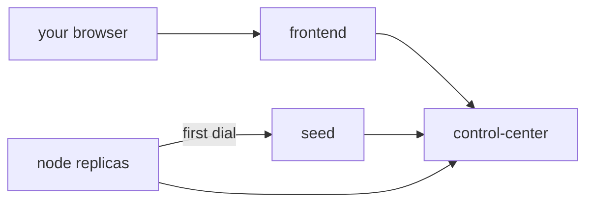
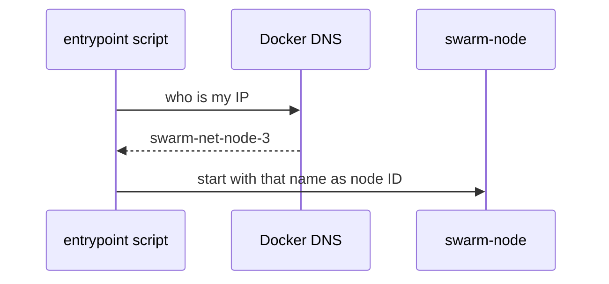
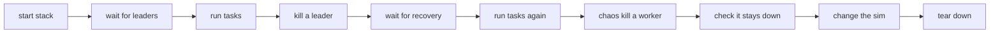

# Running the Swarm

Start the swarm, scale it, watch it, break it, and test that it heals.

## What Compose starts



| Service | What it is | Count | Published |
|---|---|---|---|
| `frontend` | nginx with the dashboard | 1 | `${BIND_ADDR:-127.0.0.1}:${FRONTEND_PORT:-8080}` |
| `control-center` | API and WebSocket server | 1 | no |
| `seed` | a normal node with a fixed name, dialled first | 1 | no |
| `node` | normal nodes | `NODE_REPLICAS`, scalable | no |

Everything runs on one private Docker bridge network. Only the frontend port leaves it. nginx
forwards `/api/`, `/healthz` and `/ws` to `control-center:8080`, and answers
`/frontend-healthz` itself. Every service drops all capabilities, sets `no-new-privileges` and
runs with a read-only root filesystem.

Total nodes = 1 seed + the `node` replicas.

## Start

```bash
cp .env.example .env          # once, then edit if you like
docker compose up --build -d
docker compose logs -f node
docker compose down
```

Open the dashboard at `http://127.0.0.1:8080` (your `BIND_ADDR` and `FRONTEND_PORT`).

## Configure with .env

Every tunable lives in `.env.example`, with a comment for each. `.env` is gitignored, so your
local values stay local. Common ones:

| Variable | What it controls |
|---|---|
| `FRONTEND_PORT` | host port for the dashboard |
| `BIND_ADDR` | host address the port binds to. `127.0.0.1` keeps it local. |
| `NODE_REPLICAS` | number of `node` containers |
| `SWARM_THRESHOLD` | leader fraction, in (0, 1] |
| `SWARM_PROBE_INTERVAL` | how often peers are measured |
| `SWARM_GOSSIP_INTERVAL` | how often a full membership table is sent |
| `SWARM_TELEMETRY_INTERVAL` | how often nodes report to the CC |
| `SWARM_IDLE_TIMEOUT` | silence before a link is declared dead. Must exceed 3 x the probe interval. |
| `SWARM_ELECTION_FLOOR` | periodic re-election, on top of event-driven ones |
| `SWARM_LOG_LEVEL` | `debug`, `info`, `warn` or `error` |
| `SWARM_CC_API_TOKEN` | optional API token. Empty = no auth. See below. |
| `SWARM_SIM_ENABLED` | start with emulated drone latency on (default `true`) |
| `SWARM_SIM_BASE_MS` | emulated latency, fixed part in ms, 0..500 (default `1`) |
| `SWARM_SIM_PER_UNIT_MS` | emulated latency per unit of distance in ms, 0..10 (default `2`) |
| `SWARM_SIM_JITTER_MS` | largest random extra delay in ms, 0..200 (default `0.5`) |
| `CC_HTTP_PORT` | host port for the CC, only if you uncomment its `ports:` block |
| `SWARM_IMAGE_TAG`, `SWARM_VERSION` | image tag and the version baked into the binaries |
| `GO_VERSION`, `ALPINE_VERSION`, `NGINX_VERSION` | base image versions |

See `.env.example` for the full list and defaults.

The `SWARM_SIM_*` values are read by the CC at start-up only (flags `-sim-enabled`,
`-sim-base-ms`, `-sim-per-unit-ms`, `-sim-jitter-ms`). A value out of range is a config error.
The dashboard changes them at run time. See [Drone Simulation](./drone-simulation).

### Protecting the API

`/api/tasks`, `/api/chaos` and `/api/sim` change the swarm, and chaos can kill nodes, so keep `BIND_ADDR=127.0.0.1` unless the
network is trusted. To also require a token:

```sh
echo "SWARM_CC_API_TOKEN=$(openssl rand -hex 32)" >> .env
docker compose up -d
```

- The token must be at least 16 characters from `A-Z a-z 0-9 - . _ ~ + / =`, or the CC refuses
  to start.
- nginx adds the token to `/api/` and `/ws` requests itself, so the dashboard keeps working and
  the browser never sees the token.
- The token stops callers that bypass nginx (other containers, a published CC port). It does
  not stop someone who can already open the dashboard.

The binaries read flags first, then `SWARM_*` variables, then built-in defaults. The full flag
list is in `backend/cmd/swarm-node/config.go` and `backend/cmd/control-center/config.go`. A
config error exits with code 2.

## Scale

```bash
docker compose up -d --scale node=11     # 12 nodes, 4 leaders
docker compose up -d --scale node=2      # 3 nodes, 1 leader
```

No code or YAML changes. Each replica picks a readable ID at start-up:



The script is `backend/deploy/node-entrypoint.sh`. If the lookup fails, the node uses its
hostname instead.

## The dashboard

| Area | Shows or does |
|---|---|
| top bar | connection state |
| summary | node, leader and pending task counts |
| airspace | **3D airspace** (default) or **Grouped** (one circle per cluster, workers inside) |
| message animation | dots per message type, with a legend that toggles each type |
| inspector | hover or click a drone: position, role, RTTs, predicted delays |
| broadcast task | pick a kind, a JSON body and a count |
| Advanced: drone simulation | latency sliders, election overrides, positions |
| drone table | role, term, leader, x / y / z, peers, chaos buttons |
| tasks and events | newest first |

State is never shown by colour alone: leaders are larger with an "L", suspect drones are dashed,
dead drones have an X, drones cut off from the CC are hollow, killed drones are grey crosses.

### Airspace controls

| Input | Action |
|---|---|
| drag | orbit |
| shift-drag, right-drag, two fingers | pan |
| wheel, pinch, `+` / `-` | zoom |
| arrow keys | orbit |
| `f` or Fit | frame every drone |
| `0` or Reset view | reset the camera |
| click a drone | select and focus it |
| `Esc` | clear the selection |
| Fullscreen | full screen, or a maximised panel where the browser refuses |

Link labels show the distance, the measured RTT and the predicted delay. "all peer links" and
"link labels" are toggles above the view. Click the airspace first so the keys reach it.

### Advanced panel

- Sliders: base, per unit, jitter, threshold, hysteresis, plus an enable switch.
- Randomize positions, Reset positions.
- **Use drones' own threshold/hysteresis** clears the overrides. Each drone goes back to its
  own `SWARM_THRESHOLD` and hysteresis.
- Pick a drone and move it with the x / y / z sliders.
- **applied on X/N** shows how many live drones run the newest config.

Try it: move a worker next to another leader, and within a few seconds it re-homes. Set the
threshold to 0.5 and watch the leader count grow.

The same through the API:

```bash
curl -s 127.0.0.1:8080/api/sim
curl -s -H 'Content-Type: application/json' \
  -d '{"positions":{"swarm-net-node-4":{"x":50,"y":50,"z":20}}}' 127.0.0.1:8080/api/sim
curl -s -H 'Content-Type: application/json' -d '{"threshold":0,"hysteresis":-1}' 127.0.0.1:8080/api/sim
```

## Break it

From the dashboard, per node:

| Button | Effect |
|---|---|
| Delay | the node answers late, its score gets worse |
| Clear | removes the delay |
| Kill (click twice) | the process exits with code 0 and **stays down** |

The same through the API, via the frontend port:

```bash
curl -s -H 'Content-Type: application/json' \
  -d '{"node":"node-2","action":"delay","delay_ms":300}' 127.0.0.1:8080/api/chaos
curl -s -H 'Content-Type: application/json' \
  -d '{"kind":"echo","body":{"x":1}}' 127.0.0.1:8080/api/tasks
curl -s 127.0.0.1:8080/api/state | jq '.nodes[] | {id, role, leader, connected}'
```

### Killed drones stay down

Node containers use `restart: on-failure`:

| How the node ended | Exit | Restarted? |
|---|---|---|
| CHAOS kill | 0 | no |
| crash or config error | non-zero | yes |
| `docker kill` / `docker stop` | any | no, under any policy |

- The dashboard shows a chaos-killed drone as `killed` for 30s, then drops it.
- If the same ID connects again, the mark is cleared.
- Bring killed drones back with:

```bash
docker compose up -d
```

Other ways to break things with Docker directly:

```bash
docker kill swarm-net-node-3      # stays down, failover is visible
docker start swarm-net-node-3     # bring it back
docker pause swarm-net-node-3     # frozen but sockets open
```

Why these behave differently:
[Cooperative vs Uncooperative Failure Injection](/concepts/cooperative-vs-uncooperative-failure-injection).

## End-to-end test

`scripts/e2e.sh` runs its own Compose project and talks only to the frontend port, like a user.



| Step | Checks |
|---|---|
| 1-3 | stack up, proxy and WebSocket origin rules, exact leader count, every worker attached |
| 4 | a task batch finishes |
| 5-6 | `docker kill` a leader, a new leader appears, survivors re-attach |
| 7 | a task batch finishes again |
| 8 | CHAOS kill a worker: exit code 0, not restarted after `E2E_KILL_WAIT` s, shown as `killed`, swarm healthy |
| 9 | `POST /api/sim` sets `per_unit_ms`: newer version, applied by the connected drones (`sim_version`), swarm healthy |

It checks the exact leader count from the formula, not just "at least one".

```bash
scripts/e2e.sh
E2E_NODES=8 scripts/e2e.sh
E2E_KEEP=1 scripts/e2e.sh      # leave the stack running
E2E_KILL_WAIT=20 scripts/e2e.sh
```

| Setting | Default | Meaning |
|---|---|---|
| `E2E_NODES` | 5 | `node` replicas. **At least 3**: steps 5 and 8 each remove one node for good. |
| `E2E_KILL_WAIT` | 10 | seconds a chaos-killed container must stay down |
| `E2E_SIM_PER_UNIT` | 3.5 | `per_unit_ms` sent in step 9 |

The full list is at the top of the script. It needs `docker`, `curl`, and `jq` or
`python3`.

## Without Docker

Run from `backend/`. Each node needs its own port and an address others can dial:

```bash
cd backend
go run ./cmd/control-center -listen 127.0.0.1:7000 -http 127.0.0.1:8080
go run ./cmd/swarm-node -node-id n1 -listen 127.0.0.1:7001 \
  -advertise 127.0.0.1:7001 -control-center 127.0.0.1:7000
go run ./cmd/swarm-node -node-id n2 -listen 127.0.0.1:7002 \
  -advertise 127.0.0.1:7002 -seeds 127.0.0.1:7001 -control-center 127.0.0.1:7000
```

Use one terminal each. The CC does not serve the dashboard, so use the API with `curl` on
port 8080. A chaos kill ends the process for good here, since nothing restarts it.

## Common problems

| Symptom | Fix |
|---|---|
| port 8080 already in use | set `FRONTEND_PORT` in `.env` |
| dashboard unreachable from another machine | `BIND_ADDR` is `127.0.0.1`. Change it only on a trusted network. |
| dashboard loads but shows no data | check that `control-center` is running: `docker compose ps` |
| a node exits with code 2 and restarts in a loop | config error. The first log line says which. |
| node IDs look like `3f9c0a1b2c4d` | the name lookup failed. Still works. |
| a chaos-killed drone never comes back | expected. Run `docker compose up -d`. |
| a chaos-killed drone comes back at once | the `node` service lost `restart: on-failure`, or the node exited non-zero |
| Advanced panel is disabled | the CC reports no `sim` config. The CC image is older than the frontend. |
| "applied on" stays below N | some drones are not connected to the CC. Check `docker compose logs node`. |
| all RTTs are below 1 ms | emulation is off (`SWARM_SIM_ENABLED=false` or the switch in the panel) |
| local run: nodes never find each other | `-advertise` is missing or not dialable |
