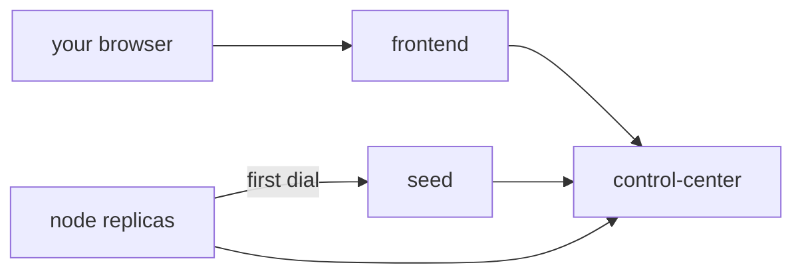
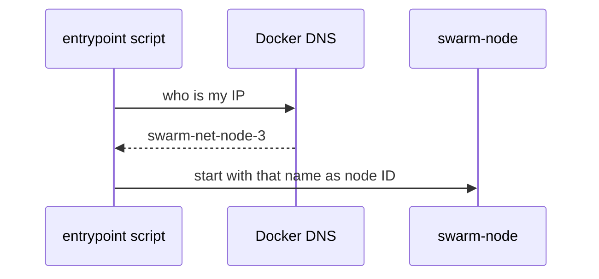
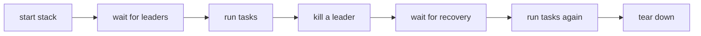

# Running the Swarm

Start the swarm, scale it, watch it, break it, and test that it heals.

## What Compose starts



| Service | What it is | Count | Published |
|---|---|---|---|
| `frontend` | nginx with the dashboard | 1 | `${BIND_ADDR:-127.0.0.1}:${FRONTEND_PORT:-8080}` |
| `control-center` | API and WebSocket server | 1 | no |
| `seed` | a normal node with a fixed name, dialled first | 1 | no |
| `node` | normal nodes | `NODE_REPLICAS`, scalable | no |

Everything runs on one private Docker bridge network. Only the frontend port leaves it. nginx
forwards `/api/`, `/healthz` and `/ws` to `control-center:8080`.

Total nodes = 1 seed + the `node` replicas.

## Start

```bash
cp .env.example .env          # once, then edit if you like
docker compose up --build -d
docker compose logs -f node
docker compose down
```

Open `http://localhost:8080` (or your `FRONTEND_PORT`).

## Configure with .env

Every tunable lives in `.env.example`, with a comment for each. `.env` is gitignored, so your
local values stay local. Common ones:

| Variable | What it controls |
|---|---|
| `FRONTEND_PORT` | host port for the dashboard |
| `BIND_ADDR` | host address the port binds to. `127.0.0.1` keeps it local. |
| `NODE_REPLICAS` | number of `node` containers |
| `SWARM_THRESHOLD` | leader fraction, in (0, 1] |
| `SWARM_PROBE_INTERVAL` | how often peers are measured |
| `SWARM_GOSSIP_INTERVAL` | how often a full membership table is sent |
| `SWARM_TELEMETRY_INTERVAL` | how often nodes report to the CC |
| `SWARM_IDLE_TIMEOUT` | silence before a link is declared dead. Must exceed 3 x the probe interval. |
| `SWARM_LOG_LEVEL` | `debug`, `info`, `warn` or `error` |

See `.env.example` for the full list and defaults.

The binaries read flags first, then `SWARM_*` variables, then built-in defaults. The full flag
list is in `backend/cmd/swarm-node/config.go` and `backend/cmd/control-center/config.go`. A
config error exits with code 2.

## Scale

```bash
docker compose up -d --scale node=11     # 12 nodes, 4 leaders
docker compose up -d --scale node=2      # 3 nodes, 1 leader
```

No code or YAML changes. Each replica picks a readable ID at start-up:



The script is `backend/deploy/node-entrypoint.sh`. If the lookup fails, the node uses its
hostname instead.

## The dashboard

| Area | Shows or does |
|---|---|
| top bar | connection state |
| summary | node, leader and pending task counts |
| topology | one circle per cluster, workers inside |
| broadcast task | pick a kind, a JSON body and a count |
| node table | role, term, leader, peers, chaos buttons |
| tasks and events | newest first |

State is never shown by colour alone: leaders are larger with an "L", suspect nodes are dashed,
dead nodes have an X, nodes cut off from the CC are hollow.

## Break it

From the dashboard, per node:

| Button | Effect |
|---|---|
| Delay | the node answers late, its score gets worse |
| Clear | removes the delay |
| Kill (click twice) | the process exits. Compose restarts it as a new incarnation. |

The same through the API:

```bash
curl -s -d '{"node":"node-2","action":"delay","delay_ms":300}' localhost:8080/api/chaos
curl -s -d '{"kind":"echo","body":{"x":1}}' localhost:8080/api/tasks
curl -s localhost:8080/api/state | jq '.nodes[] | {id, role, leader, connected}'
```

To keep a node down, use Docker directly. Compose does not restart a container you killed:

```bash
docker kill swarm-net-node-3      # stays down, failover is visible
docker start swarm-net-node-3     # bring it back
docker pause swarm-net-node-3     # frozen but sockets open
```

Why these behave differently:
[Cooperative vs Uncooperative Failure Injection](/concepts/cooperative-vs-uncooperative-failure-injection).

## End-to-end test

`scripts/e2e.sh` runs its own Compose project and talks only to the frontend port, like a user.



It checks the exact leader count from the formula, not just "at least one".

```bash
scripts/e2e.sh
E2E_NODES=8 scripts/e2e.sh
E2E_KEEP=1 scripts/e2e.sh      # leave the stack running
```

Its settings are listed at the top of the script. It needs `docker`, `curl`, and `jq` or
`python3`.

## Without Docker

Run from `backend/`. Each node needs its own port and an address others can dial:

```bash
cd backend
go run ./cmd/control-center -listen 127.0.0.1:7000 -http 127.0.0.1:8080
go run ./cmd/swarm-node -node-id n1 -listen 127.0.0.1:7001 \
  -advertise 127.0.0.1:7001 -control-center 127.0.0.1:7000
go run ./cmd/swarm-node -node-id n2 -listen 127.0.0.1:7002 \
  -advertise 127.0.0.1:7002 -seeds 127.0.0.1:7001 -control-center 127.0.0.1:7000
```

Use one terminal each. The CC does not serve the dashboard, so use the API with `curl` on
port 8080. A chaos kill ends the process for good here, since nothing restarts it.

## Common problems

| Symptom | Fix |
|---|---|
| port 8080 already in use | set `FRONTEND_PORT` in `.env` |
| dashboard unreachable from another machine | `BIND_ADDR` is `127.0.0.1`. Change it only on a trusted network. |
| dashboard loads but shows no data | check that `control-center` is running: `docker compose ps` |
| a node exits with code 2 and restarts in a loop | config error. The first log line says which. |
| node IDs look like `3f9c0a1b2c4d` | the name lookup failed. Still works. |
| a killed node is back after a second | chaos kill is restarted by Compose. Use `docker kill`. |
| local run: nodes never find each other | `-advertise` is missing or not dialable |
