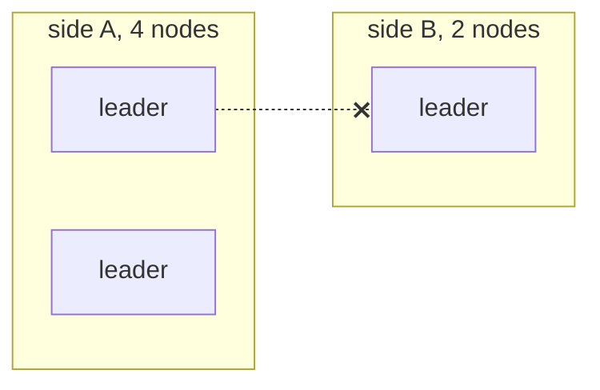

# Why Not Consensus

This swarm is **not** Raft or Paxos. It picks leaders from health scores and lets a cut-off group
of nodes keep working. This page says what that gives up and why it is acceptable here.

## Two different questions

- Consensus asks: "What single value do we all agree on?"
- This swarm asks: "Given what I can see, who should lead?"

| | Raft | This swarm |
|---|---|---|
| leaders at once | at most one per term | `LeaderCount` per partition |
| needs a majority | yes, for every election and write | no |
| minority partition | stops | keeps working, reports `degraded` |
| how nodes agree | votes | same table in, same answer out |
| what is copied | an ordered log | a membership table and a task ledger |

Raft never has two leaders because a minority refuses to act. A swarm that stops working when it
loses half its members is not useful here.

## A partition elects twice

Six nodes with threshold 0.3 should have 2 leaders. A link fails and splits them 4 and 2.

| Side | Nodes it sees | Leaders | Degraded |
|---|---|---|---|
| A | 4 | 2 | no, 4 is a majority of 6 |
| B | 2 | 1 | yes |

The swarm now has 3 leaders. Side B knows it is the minority and reports it, but keeps going.

`Degraded` and `Quorum` live in `backend/pkg/cluster/partition.go`. `Degraded` is only a report.
`Elect` (`backend/pkg/cluster/election.go`) never looks at it.

## When the partition heals

Both sides merge their membership tables with the normal gossip rules, run `Elect` again, and
agree on 2 leaders. Pending tasks from the extra leader are re-sent by the survivors, which is
why tasks must be safe to repeat. See
[Idempotence and Hysteresis](/concepts/idempotence-and-hysteresis).

## Why this is fine here, and not for a database

Ask: what is the worst thing a second leader can do?

| System | Worst case with two leaders | OK? |
|---|---|---|
| this swarm | a task runs twice | yes, if tasks are safe to repeat |
| a bank ledger | two withdrawals from one balance | no |
| a lock service | two clients hold the same lock | no |

Everything this swarm copies can be rebuilt: membership from gossip, tasks by re-sending them.
Nothing is "committed and must never be lost".

## What adding consensus would cost

- A persistent, ordered log.
- A majority acknowledgement for every ledger write.
- The minority side of a partition stops accepting work.
- Membership changes must go through the log too.

A reasonable split would be consensus for the task ledger only, with gossip still handling
membership.

## Common mistakes

- **"The demo looked like Raft."** On one Docker host, partitions are rare and gossip is fast, so
  double leaders are hard to see. They can still happen.
- **Adding `if Degraded { return }` before `Elect`.** The minority side would then never get a
  leader. That is a design change, not a bug fix.
- **Reading `term` as a Raft term.** It is a per-node counter. It carries no authority.

## Related

- [Split-Brain and Quorum](/concepts/split-brain-and-quorum)
- [Gossip and Anti-Entropy](/concepts/gossip-and-anti-entropy)
- [At-Least-Once Delivery](/concepts/at-least-once-delivery)
- [System Overview](./overview)
