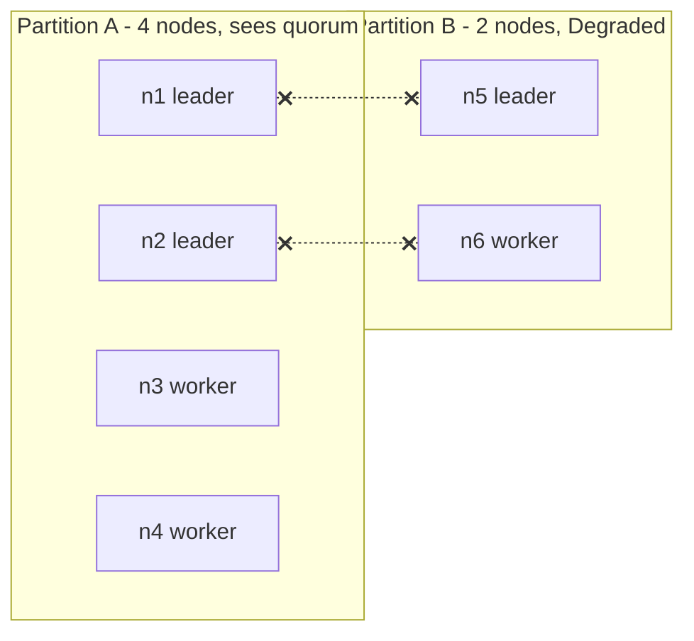

# Why Not Consensus

`docs/architecture/overview` says "this is not Raft" and promised an honest account of what that
costs. This is that account.

The short version: **Raft guarantees that at most one leader exists per term and that a committed
log entry is never lost. This swarm guarantees neither.** Two partitions can each elect a full
leader set. Nothing is linearizable. `Degraded` in `pkg/cluster/partition.go` makes split-brain
*visible*; it does not prevent it. That trade is correct for a drone swarm fanning out
re-issuable tasks and would be a data-loss bug in a database, and the rest of this page is about
why the same design can be both.

---

## Core Mental Model

### Two different questions

Consensus algorithms answer: *"What is the one value we all agree on?"* This swarm's election
answers a weaker question: *"Given what I can currently see, who should lead?"*

| Property | Raft / Multi-Paxos | This swarm |
|---|---|---|
| Leaders at one moment | at most one per term, swarm-wide | `max(1, ceil(N * threshold))` per *partition* |
| Requires a majority to act | yes, for every write and every election | no, any partition acts |
| Minority partition behaviour | halts (cannot commit, cannot elect) | keeps electing, flags `Degraded` |
| Agreement mechanism | votes, term numbers, log matching | every node runs the same pure function on its own view |
| What is replicated | an ordered log, linearizable | a membership roster and a task ledger, eventually consistent |
| Cost of a stale view | impossible by construction (quorum intersection) | a wrong leader until gossip converges |
| Availability under partition | one side or none | both sides |

The last row is the whole decision. Raft buys "never two leaders" by making a minority partition
refuse to work. A group of drones that refuses to coordinate because it lost contact with the other
half of the fleet is a group of drones that has stopped doing its job.

### The partition that elects twice

Six nodes, threshold 0.3, so `LeaderCount(6, 0.3) = 2`. A link fails and the swarm splits 4/2.



Each side recomputes with the nodes it can see:

| Side | Alive it can see | `LeaderCount` | `Quorum(6)` | `Degraded` |
|---|---|---|---|---|
| A | 4 | `ceil(4 * 0.3) = 2` | 4 | `4 < 4` is false |
| B | 2 | `max(1, ceil(0.6)) = 1` | 4 | `2 < 4` is true |

Three leaders now exist in a swarm sized for two. Side B knows it is a minority and says so in
telemetry. It does not stop. Raft would have left side B leaderless and unable to accept work.

---

## Under the Hood

### What Raft actually guarantees, and what it costs

Raft's safety argument rests on three things, and each one is a cost this swarm declined to pay:

1. **Election safety: at most one leader per term.** A candidate must collect votes from a strict
   majority, each node votes at most once per term, and any two majorities of $n$ share at least
   one node. That overlap is what makes two leaders in one term impossible. Cost: a partition
   with fewer than $\lfloor n/2 \rfloor + 1$ nodes can never elect.
2. **Log matching and leader completeness.** A follower only votes for a candidate whose log is
   at least as up to date as its own, so a committed entry is present on every future leader.
   Cost: every write is a round trip to a majority before it is acknowledged.
3. **Linearizable reads.** A leader must confirm it is still leader (a heartbeat round to a
   majority, or a lease bound to a clock assumption) before answering a read. Cost: reads are
   not local.

None of these are optional in Raft. Drop the majority requirement and election safety fails; drop
log matching and a new leader can overwrite committed entries.

### What this swarm does instead

`Elect` at `pkg/cluster/election.go:107` is a pure function of a membership snapshot and a score
map. There is no vote, no term comparison, no majority check:

```go
// pkg/cluster/election.go:107
func Elect(view View, scores map[protocol.NodeID]float64, cfg Config) Result {
```

The comment above it at `pkg/cluster/election.go:94` states the model: every node running it
against the same view reaches the same answer without exchanging a message. Agreement, where it
happens, is a *consequence of gossip having converged*, not a property the algorithm enforces.
When views differ, so do the answers, and `ELECTION_RESULT` messages
(`pkg/protocol/message.go:84`) exist to make that disagreement visible, not to resolve it.

Partition awareness is a separate, non-gating function:

```go
// pkg/cluster/partition.go:43
func Degraded(alive, lastKnownSize int) bool {
	if alive <= 0 || lastKnownSize <= 1 {
		return false
	}
	return alive < Quorum(lastKnownSize)
}
```

The package comment at `pkg/cluster/partition.go:5` says it plainly: "This is an AP design."
`Degraded` is never consulted by `Elect`. It is a telemetry field.

### Why `Quorum` exists at all if nothing enforces it

`Quorum` at `pkg/cluster/partition.go:22` computes $\lfloor n/2 \rfloor + 1$ exactly as Raft
would. The difference is what is done with the answer. Raft uses it as a *gate*: below quorum,
refuse. This swarm uses it as a *sensor*: below quorum, report. The formula and its intersection
property are covered in [Split-Brain and Quorum](/concepts/split-brain-and-quorum).

### Healing: who wins is decided per record, not per side

When the partition heals, there is no "true" view to restore. Membership merges through
`Table.Upsert` (`pkg/cluster/member.go:165`): higher incarnation wins, equal incarnation lets
state only worsen, lower incarnation is dropped. Roles reconcile because both sides re-run
`Elect` on the merged view and reach the same three-leaders-to-two demotion. Tasks that side B's
extra leader issued are either complete (fine) or pending (re-issued by the surviving leader,
which is why tasks must be idempotent -- see
[Idempotence and Hysteresis](/concepts/idempotence-and-hysteresis)).

---

## Why It Matters in This Swarm

### Legitimate here, illegitimate for a database

The question that decides whether AP is acceptable: **what is the worst thing a stale or duplicate
leader can do?**

| System | Worst case of two leaders | Acceptable? |
|---|---|---|
| This swarm | a task is fanned out twice, or to a leader whose roster is out of date | yes, if tasks are idempotent and re-issue is cheap |
| A bank ledger | two leaders each accept a withdrawal against the same balance | no, money is created |
| A lock service | two clients both believe they hold the lock | no, the lock is a lie |
| A config store | two leaders accept conflicting writes, one is silently lost | no, "committed" was false |

The swarm's replicated state is a roster (who is where, rebuildable from gossip) and a task ledger
(what is pending, rebuildable by re-issuing). Neither has a "committed and must never be lost"
entry. That is the precondition for AP being a design rather than a bug. The moment the ledger
holds something that must be exactly-once, this page's argument stops applying.

### What `Degraded` buys the operator

Because split-brain is not prevented, it must be observable, or the dashboard shows a healthy
swarm with one too many leaders and nobody knows why. `Degraded` is computed against a high-water
mark of swarm size (`pkg/cluster/partition.go:32`), not the current view, precisely so a
partitioned pair cannot compute `Quorum(2) = 2`, see two nodes, and declare itself healthy.

### The `Term` field is not a Raft term

`ElectionResultPayload` carries a `Term` (`pkg/protocol/message.go:366`). It is a per-sender
round counter for ordering that sender's own announcements. Two senders' terms are not comparable,
no node votes on them, and a higher term carries no authority. Reading it as a Raft term is the
most likely way a future contributor will accidentally assume safety the system does not have.

---

## Common Failure Modes & Edge Cases

### "It looked like Raft in the demo"

Symptom: every chaos run in Compose shows a clean single-leader failover, so someone concludes
the system has election safety. Cause: on one host with a bridge network, partitions are rare and
gossip converges in milliseconds, so the AP window is too short to observe. It is still there.
A real partition (two hosts, a pulled cable) will produce two leader sets. Test it with a
deliberate `CHAOS` partition rather than inferring safety from its absence.

### Two leaders with overlapping rosters after heal

Symptom: a worker receives `HEARTBEAT` from two leaders for a few hundred milliseconds after a
partition heals. Cause: both sides' leaders still believe the worker is theirs until the merged
view is re-elected. This is expected. The worker's affinity rule (`ShouldRehome` in
`pkg/cluster/affinity.go:65`) resolves it; the failure mode is a worker that *panics* on the
second heartbeat rather than tolerating it.

### Adding consensus later without knowing what it costs

If a future phase needs an exactly-once ledger, adding it means:

- **A log.** Ordered entries with index and term, persisted before acknowledgement.
- **Majority commit.** Every ledger write waits for $\lfloor n/2 \rfloor + 1$ acknowledgements.
  On a Docker bridge that is sub-millisecond; across real drone radios it is the latency floor
  for every task.
- **Minority halt.** The smaller side of a partition stops accepting ledger writes. The swarm's
  "keep coordinating" property is gone for that side.
- **Membership changes through the log.** Raft's joint consensus, because changing $n$ changes
  what a majority is. Gossip-driven membership cannot drive a consensus group's configuration.

The honest scope: put consensus under the *ledger* only, keep gossip and health-based election for
*membership and affinity*, and accept that the two layers have different consistency models. That
is roughly how production systems (Kafka's controller, Kubernetes' etcd behind a gossip-free API)
draw the line.

### Assuming `Degraded` gates anything

Symptom: a reader adds `if Degraded { return }` in front of `Elect` to "fix" split-brain. Result:
the minority partition now has no leader and never gets one, which is the CP failure mode this
system rejected at `pkg/cluster/partition.go:8`. If that behaviour is wanted, it is a design
change to be recorded in `docs/WORKLOG.md`, not a one-line patch.

---

## See Also

- [Split-Brain and Quorum](/concepts/split-brain-and-quorum) -- the quorum formula, why it is a
  sizing rule here and an agreement rule in Raft, and the two-node problem.
- [Gossip and Anti-Entropy](/concepts/gossip-and-anti-entropy) -- why views converge but never
  formally agree.
- [Failure Detectors](/concepts/failure-detectors) -- why "dead" is always a guess.
- [System Overview](/architecture/overview) -- where the AP decision sits in the whole design.
