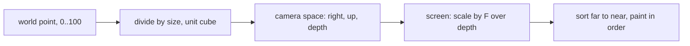
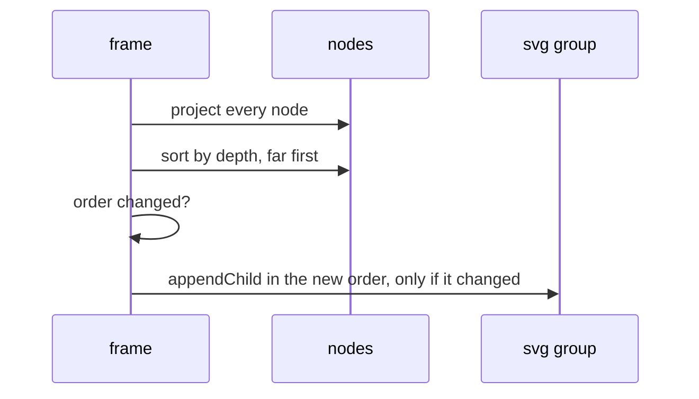

# 3D Perspective Projection and Depth Sorting

The dashboard draws the nodes in 3D with no WebGL and no library: plain SVG and about 30 lines
of vector maths.

## Core Mental Model

A pinhole camera. Far things shrink in proportion to their distance.

The camera orbits a target $t$ at distance $D = 2.6$ cube sides, at yaw $\psi$ (around the
vertical axis) and pitch $\varphi$ (above the ground).

## Under the Hood

**Camera basis.** Three unit vectors, recomputed each frame:

$$f = (-\cos\varphi \cos\psi,\ -\cos\varphi \sin\psi,\ -\sin\varphi)$$

$$r = \frac{(f_y,\ -f_x,\ 0)}{\sqrt{f_x^2 + f_y^2}}, \qquad u = r \times f, \qquad e = t - D \cdot f$$

$f$ points forward, $r$ right, $u$ up, and $e$ is the eye.

**Projection.** For a point $p$, with $v = p - e$:

$$z_c = v \cdot f, \qquad x_c = v \cdot r, \qquad y_c = v \cdot u$$

$$k = \frac{F \cdot zoom}{z_c}, \qquad x_s = \frac{W}{2} + pan_x + x_c k, \qquad y_s = \frac{H}{2} + pan_y - y_c k$$

- $F = 850$ is the focal length in pixels. $W \times H$ is the 800 x 560 view box.
- $y_s$ is negated because SVG's y axis points down.
- A point with $z_c < 0.05$ is behind or too close to the eye and is not drawn. Without this,
  $k$ changes sign and the point reappears mirrored.

**Size by depth.** A node's radius is scaled by $k / (F / D)$, clamped to $[0.45, 2.6]$, so
near nodes look bigger but never fill the screen.

**Depth sorting.** SVG has no z-buffer: later elements are painted over earlier ones. The
painter's algorithm sorts nodes by $z_c$, far first, and re-appends them to their group in
that order. Moving an existing node with `appendChild` does not copy it. The dashboard does this
only when the order actually changed, because every move forces the browser to restyle.

Sorting by the centre point is an approximation. It is exact for non-overlapping spheres of
similar size, which node glyphs are.

## Why It Matters in This Swarm

- `frontend/app.js`: `camBasis` builds $f$, $r$, $u$ and $e$. `project` is the formula above
  and returns `null` for points behind the eye. The render loop sorts by `depth` and
  re-appends only when the order string changed.
- `frontend/app.js`: pitch is clamped to `[0.03, 1.55]` radians. At $\varphi = \pi/2$ the
  forward vector is vertical, $f_x = f_y = 0$, and $r$ is undefined.
- The world is divided by `sim.size` (`geo.Size` in `backend/pkg/geo/geo.go`), so the camera
  constants work for any space size.
- Each node has a drop line to its ground point $(x, y, 0)$, projected with the same formula,
  which makes the height readable from any angle.
- "Fit" and "focus" move $t$, the zoom and the pan. They never move the nodes. Fit projects
  every node and its ground point, then picks the zoom and pan that frame them.

## Common Failure Modes & Edge Cases

| Symptom | Cause |
|---|---|
| nodes jump to the opposite side when the camera passes them | no near-plane check, so $z_c \le 0$ flips the sign of $k$ |
| view spins wildly when looking straight down | pitch reached $\pi/2$, the right vector is 0/0 |
| near nodes hidden behind far ones | no depth sort, or sorted near first |
| scrolling stutters with many nodes | the DOM is reordered every frame even when the order is the same |
| picture is upside down | $y_s$ not negated for SVG coordinates |
| 3D and grouped views disagree on the layout | the frontend default position does not match `geo.DefaultPosition` |

## Further Reading

- [Latency Simulation](/architecture/latency-simulation)
- [Hash Mixing](/concepts/hash-mixing-and-finalizers)
