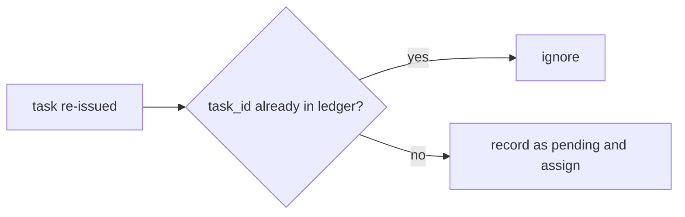

# At-Least-Once Delivery and Idempotent Re-issue

A leader sends a task to a worker and hears nothing back. Maybe the task was lost. Maybe the
worker crashed halfway through. Maybe the worker finished and only the reply was lost. From the
leader's side, all three look the same. It can either never resend (**at-most-once**: work may
be lost) or resend until it gets a result (**at-least-once**: work may run twice). There is no
third option at this layer.

Think of mailing a cheque and never hearing back. If you send another one, the payee might cash
both. The fix is to write a cheque number on it, so the bank refuses the second one. That number
is an **idempotency key**. An operation is **idempotent** when doing it twice gives the same
result as doing it once:

$$
f(f(x)) = f(x)
$$

"Exactly-once" in practice means at-least-once delivery plus a receiver that ignores repeats.

## How swarm-net uses it

- **Failover re-issues work.** A promoted worker re-sends the pending tasks in its copy of the
  ledger. A task that finished just before the leader died can run again. See
  [Replication and Tasks](/architecture/replication-and-tasks).
- **The task ID is the idempotency key.** `SubmitTask` rejects a task without one
  (`ErrNoTaskID` in `backend/pkg/cluster/control.go`).
- **Duplicate records are dropped.** A task ID already in the ledger is ignored, and only the
  first result for a task is kept (`backend/pkg/cluster/tasks.go`).
- **The built-in tasks are safe to repeat.** `echo`, `sleep` and `hash`
  (`backend/pkg/cluster/executor.go`) return the same answer every time, so a repeat only costs
  CPU.
- **Tests check "at least once", never "exactly once"**
  (`backend/pkg/cluster/failover_test.go`).

## Common pitfalls

- **Non-idempotent executors.** Dedup stops duplicate *records*, not duplicate *runs*. Two
  workers can both run a task. A task that writes to an outside system should pass the task ID
  along as its idempotency key.
- **The dedup window is finite.** The ledger holds 500 records by default. Once a finished task
  is evicted, a very late copy of it looks new.
- **Reusing task IDs.** A new task with an ID still in the ledger is silently ignored.
- **Order is not guaranteed.** After a failover, tasks may finish in a different order.

## Further reading

- [Idempotence and Hysteresis](/concepts/idempotence-and-hysteresis)
- [Why Not Consensus](/architecture/why-not-consensus)
