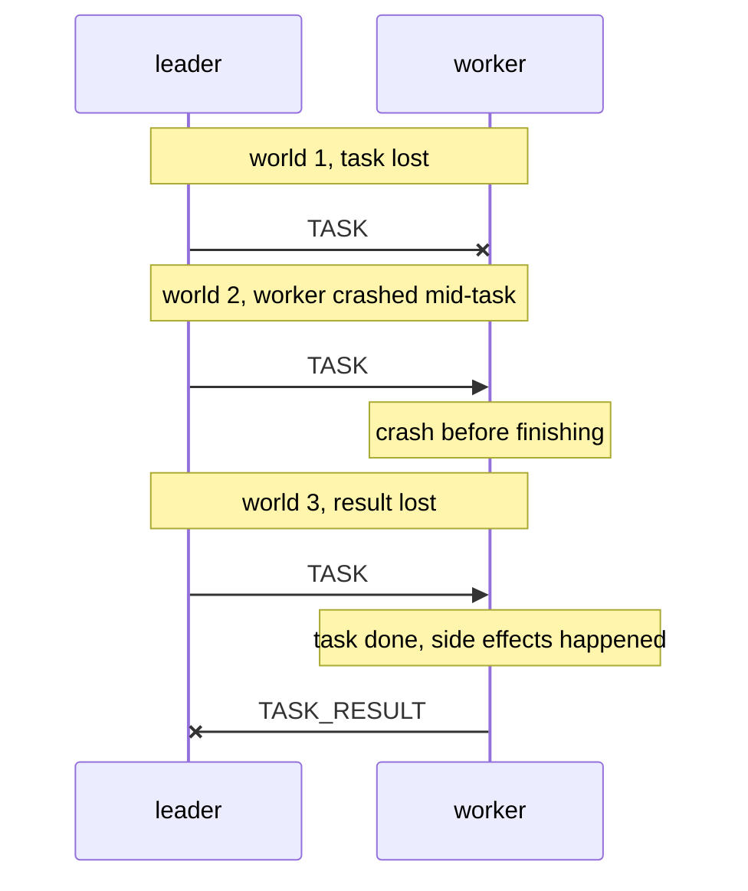
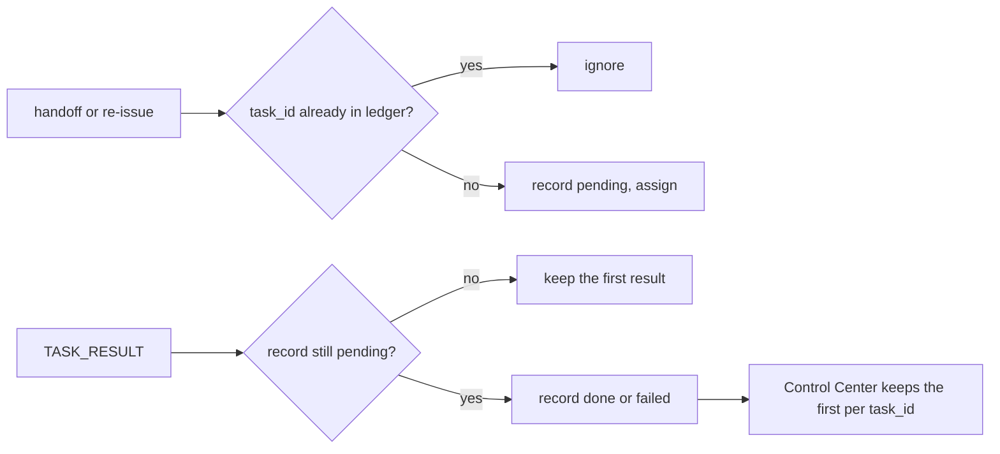

# At-Least-Once Delivery and Idempotent Re-issue

When a leader dies with work outstanding, the swarm sends that work out again. Sometimes the
work had already been done. This page is why that is unavoidable without much heavier
machinery, and how to make a repeat harmless.

Applied version: [Replication and Tasks](/architecture/replication-and-tasks).

---

## Core Mental Model

### The ambiguity

A sender sends a task and hears nothing back. Three different worlds produce that silence:

From the sender's side all three look the same. It has two choices:

| Choice | Guarantee | World 1 | World 3 |
|---|---|---|---|
| never resend | **at-most-once** | work lost | fine |
| resend until a result arrives | **at-least-once** | fine | work done twice |

There is no third choice at this layer. "Exactly-once" in practice means:

$$
\text{exactly-once effect} = \text{at-least-once delivery} + \text{idempotent or deduplicated processing}
$$

### Idempotence

An operation $f$ is idempotent when doing it twice is the same as doing it once:

$$
f(f(x)) = f(x)
$$

| Task | Idempotent? | Why |
|---|---|---|
| `hash` of some data | yes | pure function |
| `echo` | yes | pure function |
| "set key k to v" | yes | same final state |
| "add 1 to counter" | **no** | two runs, +2 |
| "send an email" | **no** | two emails |
| "charge card, key = order-17" | yes, **if** the payment service dedups on the key | the key makes it so |

A non-idempotent operation is made safe by an **idempotency key**: a unique ID the receiver
remembers, so the second request is recognised and skipped.

---

## Under the Hood

### Why TCP does not save you

TCP delivers bytes exactly once and in order **within one connection**. That guarantee ends when
the connection or a process ends.

- `write(2)` returning `n` means `n` bytes were copied into the socket's send buffer
  (`sk_write_queue`). It does not mean the peer received them, let alone processed them.
- On a crash, whatever is still in the send buffer, or in the peer's receive buffer unread, is
  gone with the socket.
- A new connection has new sequence numbers. TCP knows nothing about what the old one carried.

So every application that survives reconnects and restarts needs its own delivery rule. This
swarm's is at-least-once.

### Where a duplicate comes from here

| Source | What runs twice |
|---|---|
| promoted worker re-issues its snapshot's pending tasks | a task that finished after the last snapshot |
| orphaned workers each carry the dead leader's tasks | the same task handed to the new leader by several workers |
| a dead worker's tasks are re-assigned | a task the "dead" worker finished (a false positive) |
| a demoted leader hands its tasks on | a task its old worker is still running |

### Deduplication points

| Point | Code |
|---|---|
| duplicate submission ignored | `pkg/cluster/tasks.go:88` |
| duplicate result ignored | `pkg/cluster/tasks.go:242` |
| submissions are idempotent by contract | `pkg/cluster/control.go:40` |

These stop duplicate **records**. They do not stop duplicate **execution**: two workers may
both run the task before either result arrives. Only the executor can make that harmless.

### Why not exactly-once execution

Exactly-once execution needs the result to be recorded **atomically with the work**: a
transaction that both performs the side effect and marks the task done, or an outbox read by a
single consumer. This swarm's ledger is a best-effort snapshot, sent after each change with no
acknowledgement (`pkg/cluster/tasks.go:28`). A leader can record a result and crash before the
snapshot carrying it leaves, so a finished task can be pending in the copy a promoted worker
holds.

---

## Why It Matters in This Swarm

- **The replication choice buys this.** Replicating the ledger (rather than only the roster)
  was chosen so that in-flight work survives failover, at the cost of at-least-once delivery
  (`docs/WORKLOG.md`, section 4.2).
- **The built-in tasks are all idempotent.** `echo`, `sleep` and `hash`
  (`pkg/cluster/executor.go:20`) produce the same result on every run, so duplicates cost only
  CPU.
- **The failover test asserts "at least", never "exactly".** It requires every task to be
  reported at least once after a leader crash (`pkg/cluster/failover_test.go:35`).
- **The task ID is the idempotency key.** `SubmitTask` rejects a task without one
  (`ErrNoTaskID`, `pkg/cluster/control.go:24`), because the ledger, the dedup and the Control
  Center all key on it.

---

## Common Failure Modes & Edge Cases

### Double side effects

Symptom: a custom executor that writes to an external system creates two rows for one task.
Cause: the executor is not idempotent. Pass the `task_id` to the external system as its
idempotency key, or check before writing.

### Dedup memory is bounded

Symptom: a task runs again long after it finished. Cause: dedup is a ledger lookup, and the
ledger holds 500 records. Once the finished record is evicted, a very late handoff of the same
ID looks new. Any dedup window is finite. Size it to the longest delay a duplicate can have.

### Reused task IDs

Symptom: a new task is silently ignored. Cause: the client reused an ID still in the ledger.
The swarm reports success (submissions are idempotent). Generate unique IDs per task.

### Ordering is not guaranteed either

Symptom: two tasks that must run in order run reversed after a failover. Cause: re-issue
re-assigns pending tasks in ledger order, but a task the old worker is still running can finish
at any time. At-least-once says nothing about order.

### "Exactly-once" claims

Symptom: a design doc promises exactly-once over a network. Ask where the atomic commit of
"work done" and "result recorded" happens. If there is none, it is at-least-once with dedup, or
at-most-once.

---

## See Also

- [Replication and Tasks](/architecture/replication-and-tasks) -- the three re-issue paths.
- [Idempotence and Hysteresis](/concepts/idempotence-and-hysteresis) -- idempotence at the
  election layer.
- [TCP Teardown and Half-Open Sockets](/concepts/tcp-teardown-and-half-open-sockets) -- what a
  crash does to bytes in flight.
- [Why Not Consensus](/architecture/why-not-consensus) -- what a replicated log would add.
