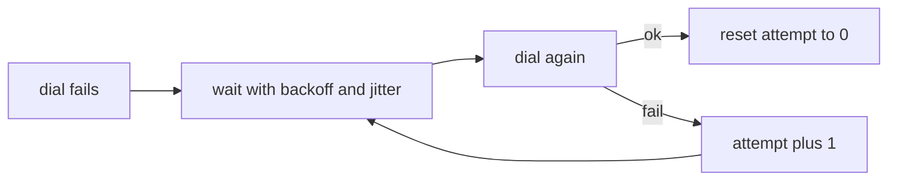

# Backoff & Connection Storms

When a leader dies, every worker notices at about the same moment and redials at the same
moment. If they all retry on the same fixed interval, they stay in lockstep. When the leader
comes back, it gets hit by every worker at once, right when it is weakest. That is a
**connection storm**. It is like a power cut ending: if every fridge restarts in the same
second, the breaker trips again.

A safe retry schedule has four properties:

| Property | What it prevents |
|---|---|
| Exponential growth | hammering a peer that is down for a long time |
| Jitter (randomness) | everyone retrying at the same instant |
| A cap | waiting minutes for a peer that came back seconds ago |
| Reset on success | punishing a peer for old failures |

The default schedule in swarm-net starts at 200 ms, doubles, caps at 10 s, and adds +-25%
jitter:

$$
d_n = \min(10\,\text{s},\ 200\,\text{ms} \cdot 2^n) \cdot (1 \pm 0.25)
$$

## How swarm-net uses it

- **The redial loop** uses `defaultBackoff` in `backend/pkg/network/dial.go`. The exponent is
  clamped so a large attempt count cannot overflow into a negative wait.
- **The wait can be interrupted.** `wait` in `backend/pkg/network/dial.go` selects on a timer
  and the context, so closing the pool does not sit out a 10 s sleep.
- **A peer we already have is not redialed.** The dial loop parks on the live connection
  instead of retrying and losing a tie-break again.
- **The accept loop has its own backoff.** On "too many open files" it waits 5 ms, doubling to
  1 s, instead of spinning a CPU core (`backend/pkg/network/server.go`).
- **Startup is a storm by design.** `docker compose up` starts every node at once, so the first
  dials usually fail. Backoff turns that into a gentle ramp.

## Common pitfalls

- **Fixed-interval retries.** The recovered peer sees a spike of handshakes on every tick.
- **No jitter.** Exponential backoff alone keeps everyone in lockstep, just with longer gaps.
- **No cap, or no reset.** A peer that is back in 3 s is not rejoined for minutes.
- **`time.Sleep` in the loop.** Shutdown then waits out the full backoff.

## Further reading

- [TCP Teardown & Half-Open Sockets](./tcp-teardown-and-half-open-sockets)
- [Context & Cancellation](./context-cancellation)
- [AWS: Exponential Backoff and Jitter](https://aws.amazon.com/blogs/architecture/exponential-backoff-and-jitter/)
