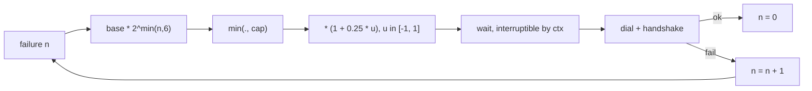

# Backoff & Connection Storms

When a leader is `SIGKILL`ed, every worker notices within the same idle timeout, and every worker
redials at the same moment. If they all fail (the container is still restarting), they all wait
the same fixed interval and all redial again -- in lockstep, forever. When the container finally
comes back it is hit by $N-1$ simultaneous `SYN`s, $N-1$ handshakes, and $N-1$ `HELLO` payloads
in the same millisecond. The thing that just recovered is the thing most likely to fall over.

This is a **connection storm**, and it is the survivors' fault, not the victim's.

Prerequisites: [TCP Teardown & Half-Open Sockets](./tcp-teardown-and-half-open-sockets) for why
the survivors all notice at the same time; [Context & Cancellation](./context-cancellation) for
why the wait must be interruptible.

## Core Mental Model

A retry schedule has four independent knobs. Each one fixes a different failure, and leaving any
one out re-creates that failure.

| Property | Failure it prevents | In this repo |
|---|---|---|
| Exponential growth | hammering a peer that is down for a long time | `base << attempt`, `pkg/network/dial.go:37` |
| Jitter | lockstep retries from correlated failures | `+-25%`, `pkg/network/dial.go:41` |
| A cap | waiting minutes for a peer that came back seconds ago | 10 s, `pkg/network/dial.go:26` |
| Reset on success | a peer with one bad minute being punished for an hour | `attempt = 0`, `pkg/network/dial.go:60` |



## Under the Hood

### The formula

The default schedule (`pkg/network/dial.go:23`) is:

$$
d_n = \min\!\big(c,\; b \cdot 2^{\min(n,\,6)}\big) \cdot \big(1 + 0.25\,u\big),
\qquad u \sim \mathcal{U}(-1, 1)
$$

with $b = 200\,\text{ms}$ and $c = 10\,\text{s}$. In code:

```go
func defaultBackoff(random func() float64) func(int) time.Duration {
	const (
		base = 200 * time.Millisecond
		cap_ = 10 * time.Second
	)
	return func(attempt int) time.Duration {
		if attempt < 0 {
			attempt = 0
		}
		if attempt > 6 {
			attempt = 6
		}
		d := base << attempt
		if d > cap_ {
			d = cap_
		}
		factor := 1 + (random()*2-1)*0.25
		return time.Duration(float64(d) * factor)
	}
}
```

The exponent is clamped at 6 before the shift (`pkg/network/dial.go:34`). `200ms << 6` is
12.8 s, already past the cap; without the clamp, `attempt = 40` would shift a `time.Duration`
into overflow and produce a negative wait, which `time.NewTimer` treats as zero -- a tight loop
disguised as a schedule.

### Why exponential

Each failed attempt is evidence the peer is down for longer than the last estimate. Doubling
means the total number of attempts over any outage of length $T$ is $O(\log T)$, so a peer that
is down for an hour receives a handful of `SYN`s, not thousands. The listen backlog on the
recovering peer, and the survivors' own descriptor budget, both stay bounded.

### Why jitter, and why +-25%

Exponential backoff alone does **not** fix the storm. If every worker failed at $t_0$ and uses
the same schedule, they all retry at $t_0 + 200\text{ms}$, $t_0 + 400\text{ms}$, $t_0 + 800\text{ms}$
-- still in lockstep, just with longer gaps. The peer still receives $N-1$ handshakes per wave.

Jitter decorrelates the waves. With $\pm 25\%$ on a 1.6 s step, arrivals spread across an
800 ms window; on the 10 s cap, across 5 s. That is wide enough that a peer sees one handshake
at a time rather than a burst, and narrow enough that the schedule still means something.
Full jitter ($u \sim \mathcal{U}(0, 1)$ applied as $d \cdot u$) spreads even better but makes
"how long until we notice a recovered peer" much harder to reason about; the bounded form is the
teaching compromise.

The randomness source is injectable (`pkg/network/pool.go:41`) so tests can pin it.

### Why a cap

Without one, a peer that is down for ten minutes is next dialled at `200ms << 11`, roughly
7 minutes after the last attempt. It could be back for six of those. The cap turns "time to
notice recovery" into a hard bound: at most 12.5 s (10 s plus jitter) after the peer is
actually reachable (`pkg/network/dial.go:20`).

### Reset on success, count consecutive failures

`attempt` is a count of *consecutive* failures, not lifetime failures
(`pkg/network/pool.go:33`). A connection that succeeds, lives for an hour, and then drops redials
with `attempt = 0` -- immediately, plus jitter. The alternative punishes a peer for its history
rather than its present.

The tie-break case is a success for this purpose. A `HELLO` rejected with "already connected"
while a live connection to that peer exists resets the counter (`pkg/network/dial.go:75`),
because the peer is reachable -- the pool simply already has it.

`MaxRedials` (`pkg/network/pool.go:39`) is the give-up bound: after that many consecutive
failures the dial loop exits, and a later `Connect` starts it over. Zero means never give up.

### The wait is a timer, not a sleep

`wait` (`pkg/network/dial.go:169`) selects between the backoff timer and the loop's context. A
`time.Sleep` would pin the goroutine for the full backoff, so `Pool.Close` on a swarm in the
middle of a 10 s wait would take 10 s. `Close` cancels first, precisely so parked loops wake
before any socket is touched (`pkg/network/pool.go:351`).

### The accept loop has its own backoff

The listener has a different storm: `Accept` returning an error in a tight loop. Two errors are
worth retrying (`pkg/network/server.go:157`):

- `ECONNABORTED`: the client hung up while still in the backlog. Already over; retry immediately.
- `EMFILE` / `ENFILE`: descriptor exhaustion. Retrying in a tight loop burns a core until some
  other goroutine closes something.

So the schedule starts at 5 ms and doubles to a 1 s cap (`pkg/network/server.go:107`), reset on
the next successful accept (`pkg/network/server.go:144`). Any other error means the listener
itself is broken and the loop records it and exits rather than spinning
(`pkg/network/server.go:123`).

## Why It Matters in This Swarm

- **A restarted leader is the most fragile node in the swarm** for its first second. It is
  handshaking with every survivor, rebuilding membership from their `KnownPeers`, and being probed
  for election. Jitter is what keeps that second from being a burst.
- **Startup is a storm by construction.** `docker compose up` starts every container at once, and
  every one dials every seed before any listener is bound. Every first dial fails with
  `ECONNREFUSED`. The schedule is what turns that into a ramp instead of a retry loop -- see the
  startup-ordering failure in [Docker Bridge Networking](./docker-bridge-networking).
- **The dial loop does not redial a peer it already has.** After a tie-break the loop parks on the
  surviving connection (`pkg/network/dial.go:68`) rather than backing off and losing again. A
  schedule cannot fix a loop that should not be running.

## Common Failure Modes & Edge Cases

**Fixed-interval retry.** *Symptom:* a recovered leader's CPU spikes on a fixed period visible in
the dashboard, and the first `N` handshakes after restart time out. *Cause:* a schedule with no
jitter. Every survivor retries on the same tick.

**Backoff without a cap.** *Symptom:* a peer is `docker restart`ed, comes back in 3 s, and is not
rejoined for four minutes. *Cause:* the schedule kept doubling through the outage. The cap is
what makes `attempt` stop mattering once the peer is back.

**Lifetime failure count.** *Symptom:* after a day of chaos testing, a single dropped connection to
a peer takes 10 s to redial even though the peer is up. *Cause:* `attempt` was never reset. It
must be zeroed on success (`pkg/network/dial.go:60`).

**Sleeping in the loop.** *Symptom:* `Pool.Close` takes up to 10 s; tests time out on teardown.
*Cause:* `time.Sleep(backoff)` instead of a `select` against `ctx.Done()`.

**Retrying a terminal error.** *Symptom:* a node logs `connected to self` every 10 s, forever.
*Cause:* self-connect treated as a transient failure. The dial loop exits on it
(`pkg/network/dial.go:69`) because no schedule fixes a misconfigured address.

**`EMFILE` in a tight accept loop.** *Symptom:* one core pinned at 100%, `accept: too many open
files` thousands of times per second in the log. *Cause:* no backoff on temporary accept errors.
The 1 s cap (`pkg/network/server.go:108`) bounds the damage while whatever is leaking
descriptors is found.
