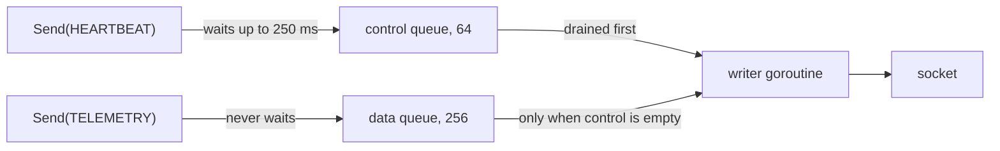

# Backpressure & Bounded Queues

When a peer stops reading, the bytes we send have to pile up somewhere. With an unbounded queue
they pile up in our memory until the process is killed. With a blocking write, the goroutine that
called `Send` gets stuck, and in a swarm node that might be the election loop. **Backpressure**
is the question "who absorbs the stall?". A bounded queue answers it: when the queue is full, the
sender must wait a little, or drop something, but never grow forever. Think of a restaurant with
a fixed number of tables: when it is full, new guests wait at the door or go elsewhere.

swarm-net gives each connection one writer goroutine and two bounded queues:



The writer drains control first with a nested `select`, because a flat `select` picks randomly
among ready channels:

```go
select {
case env = <-c.ctrl:
default:
	select {
	case env = <-c.ctrl:
	case env = <-c.data:
	case <-c.done:
		return
	}
}
```

## How swarm-net uses it

- **Data frames are shed.** `TASK`, `TASK_RESULT` and `TELEMETRY` are dropped when the data
  queue is full, and `Send` returns `ErrDataDropped` (`backend/pkg/network/conn.go`).
- **Control frames wait briefly.** Heartbeats and election messages wait up to
  `CtrlSendTimeout` (250 ms), then return `ErrSendQueueFull`. The connection is still fine.
- **Drops are counted.** `Conn.Dropped()` exposes the count so shedding is visible.
- **Unknown message types go to the control queue.** When in doubt, do not drop.
- **The node loop has bounded inboxes too.** `ctrlIn` and `dataIn` in
  `backend/pkg/cluster/node.go` are sized by `QueueDepth`.

## Common pitfalls

- **An unbounded channel on a new fan-out path.** Memory grows until the OOM killer strikes,
  with no log line.
- **One queue for everything.** A burst of tasks delays heartbeats and triggers false failovers.
- **Treating `ErrSendQueueFull` as a dead peer.** The peer is slow, not gone. Skip this send.
- **A blocking read handler.** Frame handlers run on the reader goroutine and must hand work off
  quickly.

## Further reading

- [CSP, Channels & The Memory Model](./csp-channels-and-memory-model)
- [TCP Sockets & The Kernel](./tcp-sockets-and-the-kernel)
