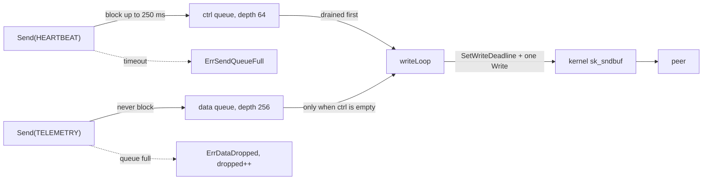

# Backpressure & Bounded Queues

A peer stops reading. Its kernel receive buffer fills, its advertised window drops to zero, and
our kernel send buffer fills behind it. From then on, every byte we try to send has to go
*somewhere*. If that somewhere is an unbounded channel, it is our heap, and the process dies
of memory a few minutes after a single peer went quiet. If it is the calling goroutine's stack --
a blocking `Write` -- then whichever goroutine called `Send` is stuck, and in a swarm node that
goroutine is the election loop.

Backpressure is the design question of *who absorbs the stall*. `pkg/network` answers it
differently for the two traffic planes, and the asymmetry is the whole point.

Prerequisites: [CSP, Channels & The Memory Model](./csp-channels-and-memory-model) for channel
semantics; [TCP Sockets & The Kernel](./tcp-sockets-and-the-kernel) for the kernel buffers that
sit underneath.

## Core Mental Model

Every `Conn` has one writer goroutine and two bounded queues in front of it
(`pkg/network/conn.go:168`). Callers never touch the socket; they offer a frame to a queue and get
an answer immediately or within a short bound.



The kernel already provides backpressure between two hosts: a full receive window stalls the
sender. What it cannot do is tell a heartbeat from a task payload. Both queues exist so the
application can.

## Under the Hood

### Why not one unbounded channel

A channel with no capacity bound is a linked list of `sudog`s and buffered elements the runtime
grows on demand. Nothing in Go stops it growing. If the writer goroutine is parked in `Write`
because `sk_sndbuf` is full and the peer's window is zero, every `Send` succeeds instantly,
every frame is retained, and memory grows at the caller's send rate until the cgroup OOM killer
intervenes. The process cannot log why it died -- the kernel killed it. The peer that caused it
was never even marked unhealthy, because from the sender's point of view every `Send` returned
`nil`.

### Why not synchronous writes

`net.Conn.Write` with the send buffer full parks the caller in the netpoller until the peer
ACKs something. The caller is whichever goroutine called `Send`. Under Phase 4 that is the
heartbeat ticker or the election loop, and a single dead peer would freeze both -- for
`WriteTimeout` per frame, per dead peer. The worklog records this as the invariant the design
preserves: **a dead peer cannot stall the election loop.**

### Two queues and the control-first drain

The writer chooses its next frame with a nested `select` (`pkg/network/conn.go:400`):

```go
var env *protocol.Envelope
select {
case env = <-c.ctrl:
default:
	select {
	case env = <-c.ctrl:
	case env = <-c.data:
	case <-c.done:
		return
	}
}
```

Go's `select` picks uniformly among ready cases, so a flat `select` over both queues would send
data frames half the time even when a heartbeat is waiting. The outer non-blocking attempt on
`ctrl` runs first; only when it is empty does the inner `select` let a data frame through. This
is how strict priority is expressed with channels -- there is no other idiom.

The consequence: a saturated data queue cannot delay a heartbeat by more than one in-flight
frame's write time.

### Control blocks briefly, data sheds immediately

`Send` (`pkg/network/conn.go:249`) routes on `env.Type.IsDataPlane()`:

| Plane | On a full queue | Error | What the caller learns |
|---|---|---|---|
| Data (`TASK`, `TASK_RESULT`, `TELEMETRY`) | drop, increment counter (`pkg/network/conn.go:277`) | `ErrDataDropped` (`pkg/network/conn.go:99`) | one sample is gone |
| Control (everything else, including unknown types) | wait up to `CtrlSendTimeout`, default 250 ms (`pkg/network/conn.go:135`) | `ErrSendQueueFull` (`pkg/network/conn.go:97`) | the peer is slow, the stream is intact |

`ErrSendQueueFull` is deliberately not a write error (`pkg/network/conn.go:94`). The frame never
reached the socket, so the stream is still synchronised and the connection is still usable. The
caller decides what a slow peer means for *this* message.

Unknown types go to the control queue (`pkg/network/conn.go:282`): when in doubt, do not drop.

### What a dropped frame means

The asymmetry encodes a judgement about consequences:

- A dropped **telemetry** sample is a gap in a graph. The next sample supersedes it.
- A dropped **task** is re-issued by the leader on the next replication pass, because delivery is
  at-least-once by design.
- A dropped **heartbeat** is a missed beat that the receiver counts toward $K$. Dropping it
  locally would make our own backpressure look like the peer's failure.
- A dropped **election result** is a split brain.

So control frames wait for space, and if there is none within 250 ms, the caller is told and can
decide -- the policy for that lives in `pkg/cluster`, not here. `Dropped()`
(`pkg/network/conn.go:230`) exposes the data-plane counter to telemetry so shedding is visible on
the dashboard rather than silent.

### The read side: a Handler that must not block

Inbound frames are delivered to the `Handler` on the reader goroutine
(`pkg/network/conn.go:194`). A blocking handler stalls the read loop, which stops refreshing the
idle deadline, which eventually kills the connection it is running on. `MeshProber` obeys this by
answering each `PING` on its own goroutine (`pkg/network/prober.go:35`), because a control-plane
`Send` can wait 250 ms and the reader cannot.

### The `Events` channel: block, except during Close

`Events` is bounded too (`pkg/network/pool.go:45`, default 64), but its full-queue policy is the
opposite of the data plane: emission **blocks** (`pkg/network/pool.go:217`). Dropping a `PeerDown`
would leave a dead peer looking alive to membership forever, which is worse than stalling a
connection watcher. The one exception is `Close`, where a full buffer is skipped rather than
deadlocking the closer (`pkg/network/registry.go:222`); a closed channel already means "everything
is down".

```go
func (p *Pool) emit(ev PeerEvent) {
	select {
	case p.events <- ev:
		return
	default:
	}
	select {
	case p.events <- ev:
	case <-p.ctx.Done():
	}
}
```

### Broadcast snapshots the table and sends outside the lock

`Broadcast` copies the connection list under `mu` and calls `Send` on each afterwards
(`pkg/network/pool.go:313`). `Send` can block 250 ms per slow peer; holding the mutex across
that would freeze `Admit` and every other `Send`. The return value is a count, not per-peer
errors (`pkg/network/transport.go:62`): a broadcast is best-effort, and the caller already has
`PeerDown` for the rest.

## Why It Matters in This Swarm

- **A stalled peer costs bounded memory.** 64 control plus 256 data envelopes per connection,
  then shedding. Never the heap.
- **A stalled peer costs bounded time.** 250 ms per control send, `WriteTimeout` per frame in the
  writer. The election loop keeps running.
- **Replacement preserves control frames.** When the tie-break swaps connections, unsent control
  frames are moved to the winner (`pkg/network/registry.go:161`); data frames are not, because
  they are shed under pressure anyway. See
  [The Mesh and the Handshake](/architecture/mesh-and-handshake).
- **`drainUnsent` waits for the writer to exit** (`pkg/network/conn.go:321`) before reading the
  queues, because `done` closing does not prove the writer has stopped dequeuing.

## Common Failure Modes & Edge Cases

**Memory climbs after one peer goes quiet.** *Symptom:* RSS grows linearly, then OOM-kill with
no log line. *Cause:* an unbounded send channel. Not possible through `Conn`, but the first
thing anyone reaches for when adding a new fan-out path.

**Heartbeats time out under load, peers are fine.** *Symptom:* mass failover during a task burst.
*Cause:* one queue for both planes, or a flat `select` that gives data frames equal odds. The
nested `select` is the fix, and the reason it is nested must survive refactoring.

**`ErrSendQueueFull` treated as a dead peer.** *Symptom:* a peer with a briefly saturated queue
is evicted. *Cause:* conflating a local queue timeout with a transport failure. The stream is
intact (`pkg/network/conn.go:96`); the right response is to skip this send, not to close.

**Dropped counter never read.** *Symptom:* telemetry graphs have gaps nobody can explain.
*Cause:* `Dropped()` not surfaced. Shedding is only acceptable when it is visible.

**Handler does a network call.** *Symptom:* connections die with `disposition=timeout` on
healthy peers. *Cause:* the handler blocked the reader past `IdleTimeout`
(`pkg/network/conn.go:196`). Hand off to another goroutine or a bounded queue.

**`Events` consumer stops.** *Symptom:* every connection watcher eventually parks; `Peers()`
still updates but no events arrive. *Cause:* the consumer stopped draining. This is the designed
behaviour, and the cure is on the consumer side.
