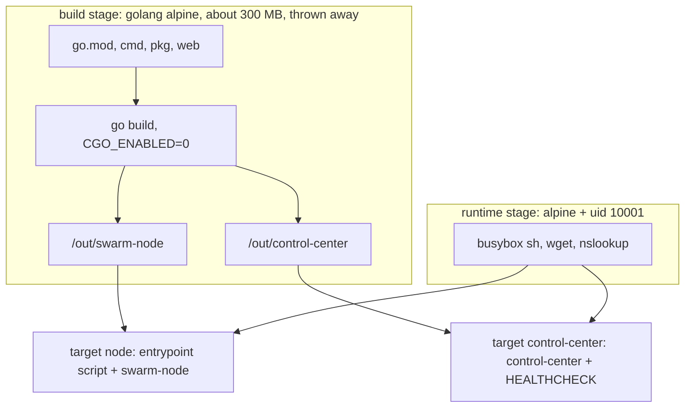
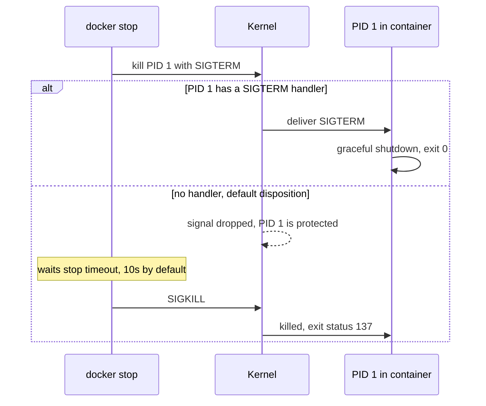

# Container Images & PID 1

`docker stop` is supposed to trigger a graceful shutdown. Whether it does depends
on two things most Dockerfiles get wrong: **which process is PID 1**, and
**whether that process has a signal handler**. This page explains both, using
this repo's `Dockerfile` and `deploy/node-entrypoint.sh`.

Prerequisites: [Docker Bridge Networking](./docker-bridge-networking).

## Core Mental Model

An image is a stack of read-only filesystem layers plus metadata
(`ENTRYPOINT`, `USER`, `EXPOSE`, `HEALTHCHECK`). A container is one process tree
started from it, inside its own namespaces. The first process in the new PID
namespace gets **PID 1**, and PID 1 is special.





## Under the Hood

### PID 1 signal rules

The kernel protects a namespace's init process:

- A signal whose disposition is **default** (`SIG_DFL`) is **not delivered** to
  PID 1 of a PID namespace. On a normal process, default `SIGTERM` terminates it.
  On PID 1 it is dropped.
- `SIGKILL` and `SIGSTOP` sent from the parent namespace (the Docker daemon) are
  always delivered.
- A signal with a **handler installed** is delivered normally.

So a PID 1 without a `SIGTERM` handler ignores `docker stop` and dies 10s later
to `SIGKILL`. Exit status $128 + 9 = 137$ is the tell. A clean handler exit is 0;
a process killed by an unhandled `SIGTERM` (not PID 1) reports $128 + 15 = 143$.

Go programs are fine here **if they register**:

```go
// cmd/swarm-node/main.go:57
ctx, stop := signal.NotifyContext(context.Background(), syscall.SIGINT, syscall.SIGTERM)
```

### Shell form vs exec form

```dockerfile
ENTRYPOINT /usr/local/bin/swarm-node            # shell form
ENTRYPOINT ["/usr/local/bin/swarm-node"]        # exec form
```

| Form | What runs as PID 1 | Signals |
|---|---|---|
| shell | `/bin/sh -c "/usr/local/bin/swarm-node"` | `sh` is PID 1. It installs no `SIGTERM` handler, so the signal is dropped. Whether `sh` execs the command or forks it is shell-specific. Do not rely on it. |
| exec | the binary itself, via `execve(2)` | the binary receives `SIGTERM` directly |

A wrapper **script** in exec form is still a shell. It must end in `exec`:

```sh
# deploy/node-entrypoint.sh:47
exec /usr/local/bin/swarm-node "$@"
```

`exec` replaces the shell's process image with the binary. Same PID (1), new
program, no shell left to swallow signals.

Check it in a running container:

```
$ docker compose exec node ps -o pid,comm
PID   COMMAND
    1 swarm-node
   23 ps
```

If `PID 1` shows `sh`, signals are not reaching the binary.

### Zombie reaping

When any process in the container exits, its parent must `wait(2)` for it, or
it stays a zombie (`Z` in `ps`). Orphans are re-parented to PID 1. So PID 1 is
expected to reap children it never started.

- Neither Go binary forks, so there is nothing to reap.
- The entrypoint runs `getent`, `awk` and `nslookup` **before** `exec`. The shell
  waits for each, so none are orphaned.
- A process that does spawn children should run under an init such as
  `tini` (`docker run --init`), which reaps and forwards signals.

### Static binaries and multi-stage builds

```dockerfile
# Dockerfile:39
CGO_ENABLED=0 go build -trimpath -ldflags "-s -w -X main.version=${VERSION}" ...
```

| Flag | Effect |
|---|---|
| `CGO_ENABLED=0` | pure-Go net and user lookups, no libc dependency, runs on any base |
| `-trimpath` | no host paths in the binary, reproducible output |
| `-s -w` | drop symbol and DWARF tables, smaller binary |
| `-X main.version=...` | stamp the version at link time |

The `build` stage holds the Go toolchain. The runtime stages copy only the
binaries (`COPY --from=build`), so the toolchain never ships. Both targets
(`node`, `control-center`) share one `build` stage, so Compose compiles once.
`RUN --mount=type=cache` keeps the module and build caches between builds
without putting them in a layer.

### Alpine vs distroless

| | `alpine` (chosen) | `distroless/static` |
|---|---|---|
| Size | about 8 MB base | about 2 MB base |
| Shell | busybox `sh` | none |
| Tools | `wget`, `nslookup`, `ping` | none |
| Needed here for | the entrypoint's DNS lookup, the CC healthcheck, `docker exec` debugging | -- |

The reasoning is in the `Dockerfile` comment block above `FROM alpine`
(`Dockerfile:44-59`).

### Non-root

```dockerfile
# Dockerfile:63-64
RUN addgroup -S -g 10001 swarm && adduser -S -D -H -u 10001 -G swarm swarm
USER 10001:10001
```

A fixed numeric UID keeps file ownership predictable. Ports 7000 and 8080 are
above 1024, so no `CAP_NET_BIND_SERVICE` is needed.

### Healthcheck and restart policy

```dockerfile
# Dockerfile:81-82
HEALTHCHECK --interval=5s --timeout=2s --start-period=5s --retries=3 \
    CMD wget -q -O /dev/null http://127.0.0.1:8080/healthz || exit 1
```

`docker ps` shows `(healthy)` once `/healthz` answers. The `CMD` runs as a new
process inside the container each time, which is one reason a shell and `wget`
must exist.

`restart: unless-stopped` (`docker-compose.yml:42`) restarts a container that
**exits on its own**, but not one the operator stopped with `docker stop` or
`docker kill`.

## Why It Matters in This Swarm

- **Graceful LEAVE depends on PID 1.** A node's `SIGTERM` path broadcasts LEAVE
  before closing sockets (`cmd/swarm-node/main.go:276`). That only happens
  because the binary is PID 1 (`Dockerfile:73`, `deploy/node-entrypoint.sh:47`)
  and has a handler (`cmd/swarm-node/main.go:57`).
- **CHAOS kill vs `docker kill`.** CHAOS kill calls `os.Exit(1)`
  (`cmd/swarm-node/main.go:245`). The container exited on its own, so
  `unless-stopped` restarts it as a new incarnation. `docker kill` from the host
  counts as a manual stop, so the container stays dead and failover stays
  visible. `scripts/e2e.sh:238` relies on that.
- **Readable node IDs need a shell.** Under `--scale`, the entrypoint
  reverse-resolves its own IP via Docker DNS (`deploy/node-entrypoint.sh:36`),
  turning `3f9c0a1b2c4d` into `swarm-net-node-3`. Distroless could not run it.
- **Stop timing.** Compose sets `stop_grace_period: 3s`
  (`docker-compose.yml:44`), so a node has 3s to finish LEAVE before `SIGKILL`.

## Common Failure Modes & Edge Cases

| Symptom | Cause |
|---|---|
| `docker stop` always takes 10s, exit code 137 | PID 1 is a shell, or the binary installs no `SIGTERM` handler |
| Peers see a crash (idle timeout) instead of a LEAVE on `docker compose down` | same as above: the graceful path never ran |
| `exec format error` on start | binary built for another `GOARCH`, or a script with CRLF line endings or no shebang |
| `no such file or directory` for a binary that exists | dynamically linked binary (CGO on) in an image without that libc |
| Entrypoint script: `permission denied` | missing execute bit. The `Dockerfile` uses `COPY --chmod=0555`. |
| `ps` shows many `Z` processes | PID 1 does not reap. Use `--init` or `exec` properly. |
| Node restarts in a loop, exit 2 | config error (`errConfig` maps to exit 2), restarted by `unless-stopped`. Read the first log line. |
| Killed node never comes back | expected after `docker kill`. `docker start <container>` brings it back. |
| Healthcheck `unhealthy` with no logs | `wget` missing (distroless), or the app bound to a different port |

## Related

- [Graceful Shutdown & Teardown Ordering](./graceful-shutdown-and-teardown-ordering)
- [Cooperative vs Uncooperative Failure Injection](./cooperative-vs-uncooperative-failure-injection)
- [Running the Swarm](/architecture/running-the-swarm)
