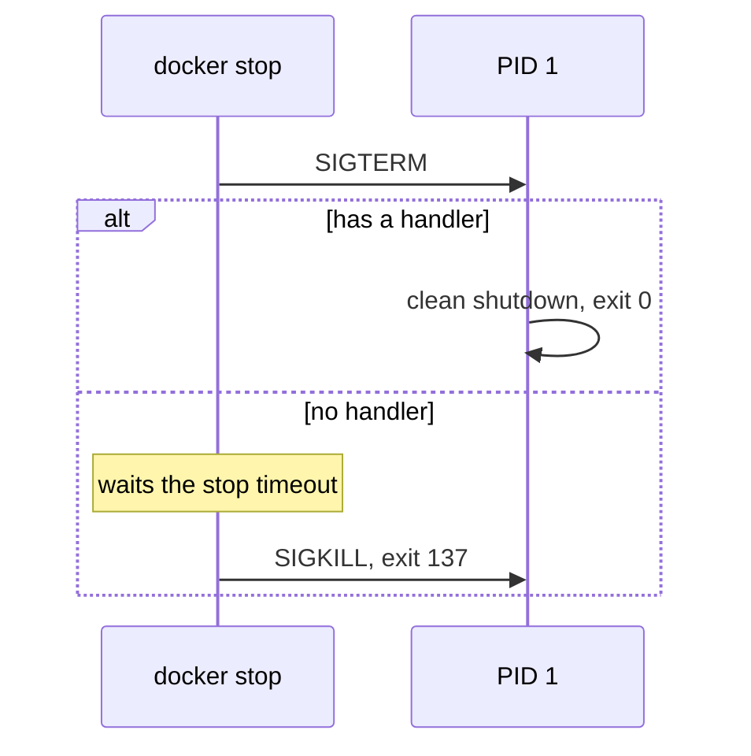

# Container Images & PID 1

An image is a stack of read-only filesystem layers plus some settings (entrypoint, user,
healthcheck). A container is one process tree started from it. The first process inside gets
**PID 1**, and the kernel treats PID 1 specially: a signal it has no handler for is simply
ignored. So if PID 1 does not handle `SIGTERM`, `docker stop` does nothing, Docker waits out the
timeout, and then sends `SIGKILL`. Exit code 137 ($128 + 9$) is the sign that this happened.

A common trap is the shell. With a shell-form entrypoint (`ENTRYPOINT /bin/app`), PID 1 is
`/bin/sh`, which does not pass the signal on to your program. Use exec form
(`ENTRYPOINT ["/bin/app"]`), and if you need a wrapper script, end it with `exec`:

```sh
exec /usr/local/bin/swarm-node "$@"
```

`exec` replaces the shell with the binary. Same PID, no shell left in between.



## How swarm-net uses it

- **Multi-stage build.** A large Go build stage compiles static binaries (`CGO_ENABLED=0`), and
  only the binaries are copied into a small Alpine runtime stage that runs as a non-root user.
- **Exec form everywhere.** The node image runs an entrypoint script that ends in `exec`, so
  `swarm-node` is PID 1.
- **The binary handles the signal.** `signal.NotifyContext` in `backend/cmd/swarm-node/main.go`
  turns `SIGTERM` into a cancelled context, which starts the graceful LEAVE.
- **The script needs a shell on purpose.** It looks up a readable node name through Docker DNS,
  which a distroless image could not do.
- **Stop timing.** Compose gives each node a 3 s `stop_grace_period` before `SIGKILL`.

## Common pitfalls

- **Shell-form entrypoint.** Every `docker stop` takes the full timeout and exits 137.
- **Wrapper script without `exec`.** Same symptom. Check with `docker compose exec node ps`:
  PID 1 should be the binary, not `sh`.
- **Zombies.** PID 1 must reap child processes. A Go binary that spawns none is fine. Use
  `docker run --init` if it does.

## Further reading

- [Docker Bridge Networking](./docker-bridge-networking)
- [Graceful Shutdown & Teardown Ordering](./graceful-shutdown-and-teardown-ordering)
