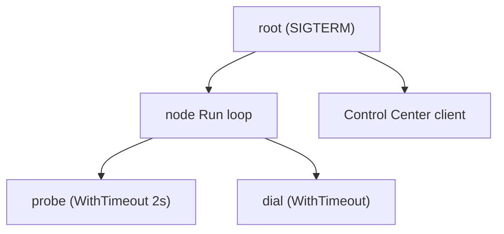

# Context & Cancellation Propagation

A `context.Context` is a "stop" signal plus an optional deadline that you pass down a call
chain. Contexts form a tree: when a parent is cancelled, every child derived from it is cancelled
too, but cancelling a child never affects the parent. Think of a project manager calling off a
project: every team working on it stops, but one team quitting does not cancel the project.



Three rules cover most use:

- Pass `ctx` as the first argument. Do not store it in a struct.
- Always call the `cancel` function you get back, usually with `defer`, or a timer leaks.
- A child's deadline can only be earlier than its parent's, never later.

```go
probeCtx, cancel := context.WithTimeout(ctx, s.probeTimeout)
defer cancel()
rtt, err := s.probe(probeCtx, target)
if err != nil {
	return s.classify(ctx, target, err) // looks at the PARENT ctx
}
```

## How swarm-net uses it

- **The root comes from signals.** `signal.NotifyContext` in
  `backend/cmd/swarm-node/main.go` cancels the root on `SIGINT` or `SIGTERM`.
- **Probes are bounded.** `EvaluateScore` in `backend/pkg/health/latency.go` wraps each probe in
  `context.WithTimeout`, and returns early if the caller is already cancelled.
- **Cancelled is not failed.** If the parent context is done, a failed probe is reported as
  `ErrProbeCanceled` and is not counted against the peer. Otherwise it is a real failure.
- **Dials share the handshake budget** via `context.WithTimeout` in
  `backend/pkg/network/dial.go`, and backoff waits select on `ctx.Done()`.
- **The node loop checks `ctx.Err()` before its `select`** in `backend/pkg/cluster/node.go`,
  so a busy loop still stops promptly.
- **Reads use deadlines, not contexts.** A context cannot interrupt a blocked `Read`. See
  [Deadlines & I/O Timeouts](./deadlines-and-io-timeouts).

## Common pitfalls

- **Counting cancellation as a peer failure.** During shutdown every probe fails, and the swarm
  would demote healthy leaders.
- **Forgetting `cancel()`.** Each `WithTimeout` holds a timer until its deadline fires.
- **Draining with an already-cancelled context.** A child of a cancelled context is born
  cancelled. Use `context.WithoutCancel` or a fresh context for the shutdown budget.
- **`context.Background()` deep in the code.** That work can no longer be stopped.

## Further reading

- [Error Wrapping & Classification](./error-wrapping-and-classification)
- [Go blog: Contexts and structs](https://go.dev/blog/context-and-structs)
