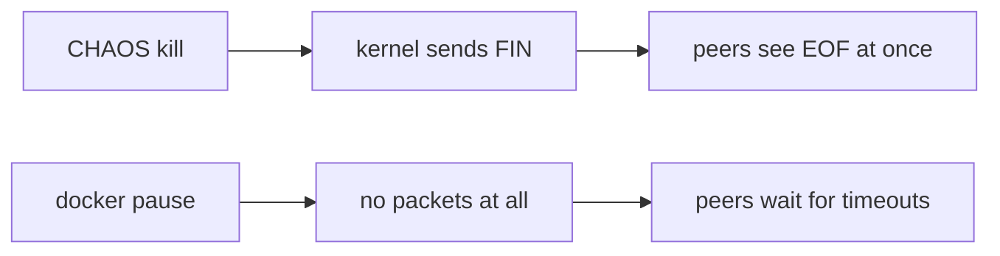

# Cooperative vs Uncooperative Failure Injection

A **cooperative** failure is one the node performs on itself: it is told "die" or "be slow" and
does so. An **uncooperative** failure is done *to* the node from outside: the process is frozen,
or its network is cut. The difference matters because a process that exits still has a working
kernel, which closes its sockets and sends `FIN` or `RST`. Peers find out instantly. A frozen or
cut-off node sends nothing at all, so peers only find out by noticing silence. It is the
difference between a colleague saying "I'm leaving" and one who just stops replying.



## How swarm-net uses it

- **CHAOS kill exits the process.** `applyChaos` in `backend/cmd/swarm-node/main.go` calls the
  exit function with no LEAVE. Compose restarts the container as a new incarnation.
- **CHAOS delay is selective.** `SetChaosDelay` in `backend/pkg/cluster/control.go` delays
  replies such as `PONG`, so health scores react while telemetry stays live.
- **Kill tests the fast path.** Peers get EOF at once, so failover time mostly measures
  election, not detection.
- **Only a frozen or partitioned node tests the detector.** The idle timeout and the
  suspect-then-dead steps in `backend/pkg/cluster/failure.go` run only when nothing arrives.
- **In-process chaos was a deliberate choice.** It works under `go run` and needs no Docker
  socket mounted into the Control Center.

To test the slow path, act from the host:

```sh
docker pause  swarm-net-node-3     # freeze: the half-open case
docker unpause swarm-net-node-3
docker network disconnect swarm-net_swarmnet swarm-net-node-3   # partition
docker network connect    swarm-net_swarmnet swarm-net-node-3   # heal
```

## Common pitfalls

- **Only testing kill.** The failure detector looks correct but is never exercised.
- **Expecting `docker kill` to be silent.** The kernel still sends `FIN`, so it is almost as
  cooperative as CHAOS kill. The difference is that the container stays down.
- **`tc netem` delays everything,** including the dashboard feed, and needs `NET_ADMIN`.

## Further reading

- [Failure Detectors](./failure-detectors)
- [TCP Teardown & Half-Open Sockets](./tcp-teardown-and-half-open-sockets)
