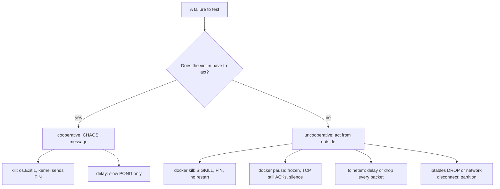
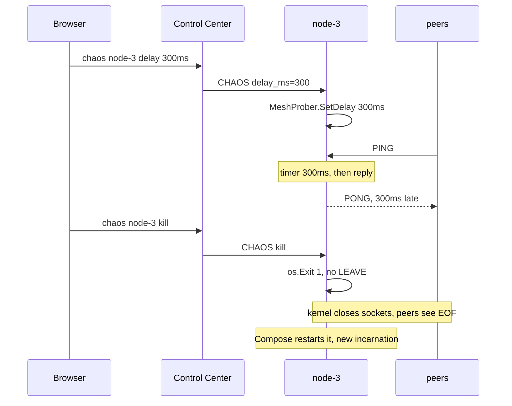

# Cooperative vs Uncooperative Failure Injection

The dashboard can kill a node or slow it down. Both work by **asking the node
to misbehave**. A node that is wedged cannot be asked anything, so the most
dangerous failures are exactly the ones this kind of chaos cannot produce.

Prerequisites: [TCP Teardown & Half-Open Sockets](./tcp-teardown-and-half-open-sockets),
[Failure Detectors](./failure-detectors).

## Core Mental Model

| | Cooperative | Uncooperative |
|---|---|---|
| Who injects | the victim, on request | the environment: kernel, network, runtime |
| Needs the victim to be healthy? | yes | no |
| Precision | exact, per message type | blunt, whole process or interface |
| Portable (`go run`, Compose) | yes | needs root, `NET_ADMIN`, or Docker |
| Examples here | CHAOS `kill`, `delay`, `clear` | `docker kill`, `docker pause`, `tc netem`, `iptables` |

Analogy: a fire drill (cooperative) tests the exits. It does not test what
happens when the person holding the keys has fainted.



## Under the Hood

### What CHAOS actually does



- `kill` -- `app.applyChaos` calls `os.Exit(1)` (`cmd/swarm-node/main.go:245`).
  The Go process is gone, but the kernel is alive, so every socket gets a
  `FIN` or `RST`. Peers see `io.EOF` or `ECONNRESET` within one RTT.
- `delay` -- a timer before each PONG (`pkg/network/prober.go:205`) and, by
  contract, before each HEARTBEAT_ACK via `Node.SetChaosDelay`. Everything else
  (TELEMETRY, gossip, tasks, the CC's own PING/PONG) is on time.
- Validation: `0 <= delay_ms <= 5000` (`pkg/telemetry/chaos.go:27`, `:44`).
  Beyond 5s "slow" turns into "dead", which is what `kill` is for.

### What a real failure looks like to the kernel

| Failure | Process | Kernel TCP | Peer observes |
|---|---|---|---|
| CHAOS kill | exits | alive, sends `FIN`/`RST` | immediate EOF |
| `docker kill` (SIGKILL) | killed | alive until the namespace goes | immediate EOF, then no restart |
| `docker pause` (cgroup freezer) | frozen, not scheduled | alive, **keeps ACKing** | nothing. Sends succeed, replies never come. |
| `kill -STOP` | stopped | alive, keeps ACKing | same as pause |
| deadlock or GC stall | running, not answering | alive | same as pause |
| `tc netem loss 100%` | fine | packets dropped at egress | silence, retransmits |
| `iptables -j DROP` | fine | packets dropped | silence both ways |
| host power loss | gone | gone, no packet | silence |

The frozen rows are the **half-open** case: the peer's socket stays
`ESTABLISHED`, writes succeed until the receive window of the frozen side fills,
and only a read deadline or heartbeat timeout ends it. CHAOS cannot produce this,
because a node that obeys a CHAOS message is by definition not frozen.

### Uncooperative recipes

Run these from the host against a Compose container.

```bash
# freeze and thaw (the half-open case)
docker pause  swarm-net-node-3
docker unpause swarm-net-node-3

# SIGSTOP a single process instead of the cgroup
docker kill --signal=STOP swarm-net-node-3
docker kill --signal=CONT swarm-net-node-3

# partition one node from the bridge, then heal
docker network disconnect swarm-net_swarmnet swarm-net-node-3
docker network connect    swarm-net_swarmnet swarm-net-node-3

# packet-level delay and loss (needs NET_ADMIN, run in the node's netns)
pid=$(docker inspect -f '{{.State.Pid}}' swarm-net-node-3)
sudo nsenter -t "$pid" -n tc qdisc add dev eth0 root netem delay 300ms 50ms loss 5%
sudo nsenter -t "$pid" -n tc qdisc del dev eth0 root
```

`nsenter -n` runs the host's `tc` inside the container's network namespace, so
the image needs neither `iproute2` nor extra capabilities.

What `ss` shows on a peer while `node-3` is paused and the peer keeps writing:

```
$ ss -tn dst 172.18.0.5
State  Recv-Q Send-Q Local Address:Port  Peer Address:Port
ESTAB  0      2896   172.18.0.4:43122    172.18.0.5:7000
```

`Send-Q` grows because the paused side stopped reading. The state never changes.

## Why It Matters in This Swarm

- **The choice was deliberate.** In-process CHAOS works under `go run` and in
  Compose, and needs no Docker socket mounted into the CC (a privileged mount).
  The cost is that it only tests clean deaths and selective slowness.
- **Kill tests the fast path.** A killed node's peers get EOF at once, so
  failover time mostly measures election, not detection.
- **`docker kill` in e2e is also cooperative-ish.** `scripts/e2e.sh:238` uses it,
  and the kernel still sends `FIN`. It differs from CHAOS kill only in that the
  container stays down (`restart: unless-stopped`, `docker-compose.yml:42`).
- **The detection path needs `docker pause`.** Only a frozen or partitioned
  node exercises the idle timeout (`SWARM_IDLE_TIMEOUT`, 5s in Compose,
  `docker-compose.yml:26`) and the suspect/dead state machine.
- **Delay is selective.** It slows PONG and HEARTBEAT_ACK, so health scores
  and leader choice react, while telemetry stays live. A `tc netem` delay
  would slow everything, including the dashboard feed.
- **Status at this commit.** `Node.SetChaosDelay` is still a stub
  (`pkg/cluster/control.go:40`), so a CHAOS delay slows PONGs but not yet
  HEARTBEAT_ACKs, and telemetry `degraded` (`pkg/telemetry/status.go:35`)
  stays false until Phase 4 fills it in.

## Common Failure Modes & Edge Cases

| Symptom | Cause |
|---|---|
| CHAOS kill on a wedged node does nothing | the node cannot process messages. Use `docker kill`. |
| Failover after `docker pause` takes seconds, after kill it is instant | expected: pause needs the idle timeout, kill produces EOF |
| Killed node back within a second, dashboard barely flickers | CHAOS kill plus `restart: unless-stopped`. Use `docker kill` to keep it down. |
| `docker unpause` and the node is immediately declared dead | its peers already timed it out. It must rejoin with a higher incarnation. |
| `tc: command not found` inside the container | use `nsenter` from the host, as above |
| `RTNETLINK answers: Operation not permitted` | `tc` without `NET_ADMIN`. Run it from the host namespace side. |
| Delay of 5001 ms rejected with 400 | `MaxChaosDelay` is 5s |
| `netem` rule survives a test run | qdiscs live on the interface until deleted or the container is recreated |
| Leader delay has no visible effect | only PONG and HEARTBEAT_ACK are delayed. Election reacts after the EWMA moves and the next election round. |

## Related

- [Graceful Shutdown & Teardown Ordering](./graceful-shutdown-and-teardown-ordering)
- [Container Images & PID 1](./container-images-and-pid-1)
- [Running the Swarm](/architecture/running-the-swarm)
- [Split-Brain & Quorum](./split-brain-and-quorum) -- what a partition does to leadership.
