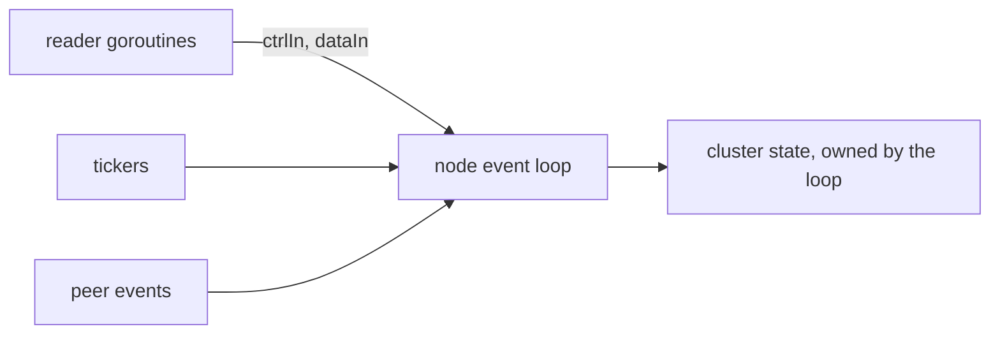

# CSP, Channels & The Go Memory Model

Go's motto is "do not communicate by sharing memory, share memory by communicating". Instead of
many goroutines touching the same variable under a lock, one goroutine owns the data and others
send it messages over **channels**. This style is called CSP (Communicating Sequential
Processes). It is like a kitchen with one head chef: waiters pass orders through a window rather
than all cooking at the same stove.

The **memory model** is the rule underneath: if two goroutines access the same variable and at
least one writes, they must be synchronised (a channel, a mutex, or `sync/atomic`). Otherwise it
is a data race, and the result is undefined, not merely "a bit stale". A mutex is still the right
tool for a simple shared table.

Key channel facts:

- An unbuffered channel is a handoff: sender and receiver meet.
- A buffered channel is a bounded queue.
- `select` picks **randomly** among ready cases.
- `close(ch)` wakes every receiver, which makes it a broadcast "stop" signal.

## How swarm-net uses it

- **One event loop owns cluster state.** `Run` in `backend/pkg/cluster/node.go` is a single
  `select` over inbound frames, peer events, tickers and task results. No locks are needed on
  that state.
- **Outsiders call in through a channel.** The `calls` channel runs a function on the loop, so
  reads of state stay on the owning goroutine.
- **Small shared values use atomics.** The chaos delay and dropped count are `atomic` values in
  `backend/pkg/cluster/node.go`.
- **The membership table uses a lock.** `backend/pkg/cluster/member.go` guards it with a
  `sync.RWMutex`.
- **One writer per socket.** Each connection's writer goroutine is the only one that writes, so
  frames never interleave (`backend/pkg/network/conn.go`).

## Common pitfalls

- **Assuming `select` has priority.** It does not. Use a nested `select` for priority, and check
  `ctx.Err()` first when shutdown must win.
- **Receiving from a closed channel in a loop.** It is always ready and returns zero values. Set
  the channel variable to `nil` to disable that case.
- **Goroutine leaks on a blocked send.** Buffer result channels to the number of senders.
- **Skipping the race detector.** Run `cd backend && go test -race ./...`.

## Further reading

- [Backpressure & Bounded Queues](./backpressure-and-bounded-queues)
- [The Go Memory Model](https://go.dev/ref/mem)
