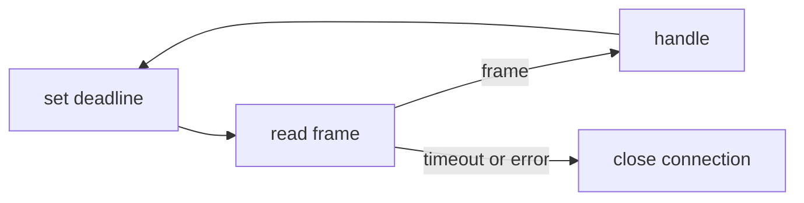

# Deadlines & I/O Timeouts

A blocking `Read` on a socket waits until data arrives. If the peer was killed without closing
its socket, or the network was cut, data never arrives and no error ever comes. The goroutine
waits forever. A **deadline** fixes this: `conn.SetReadDeadline(t)` says "if nothing has
happened by time `t`, fail with a timeout error". It is an absolute time, like an alarm clock set
for 7:00, not a timer set for "8 hours". So you must set a fresh one before each read.

```go
for {
	c.raw.SetReadDeadline(time.Now().Add(c.cfg.IdleTimeout))
	env, err := c.dec.ReadFrame()
	if err != nil {
		c.closeWith(Classify(err), err) // timeout, EOF, reset...
		return
	}
	h(c.peer, env)
}
```



## How swarm-net uses it

- **Every read has a deadline.** `readLoop` in `backend/pkg/network/conn.go` sets an idle
  deadline (default 15 s) before each frame.
- **Every write has a deadline.** `writeLoop` sets a write deadline (default 5 s) so a peer that
  stopped reading cannot block the writer forever.
- **Close wakes a blocked read at once.** Shutdown never waits out the idle timeout.
- **The idle timeout must be longer than a few heartbeats.** Otherwise a quiet but healthy peer
  is dropped. Compose sets `SWARM_IDLE_TIMEOUT` to 5 s, against a 500 ms heartbeat.
- **Dials are bounded by a context** (`context.WithTimeout` in `backend/pkg/network/dial.go`),
  not by the kernel's default of about two minutes.

## Common pitfalls

- **Setting a deadline once.** It is a fixed instant, so every read after it fails.
- **A timeout in the middle of a frame is fatal.** Part of the frame was consumed, so the stream
  is out of sync. Close the connection.
- **`select` with `time.After` around a blocking read.** The timer wins but the reader stays
  stuck, leaking a goroutine.
- **Forgetting to clear a handshake deadline.** `backend/pkg/network/handshake.go` calls
  `SetDeadline(time.Time{})` once the handshake is done.

## Further reading

- [TCP Teardown & Half-Open Sockets](./tcp-teardown-and-half-open-sockets)
- [The Netpoller](./go-netpoller)
