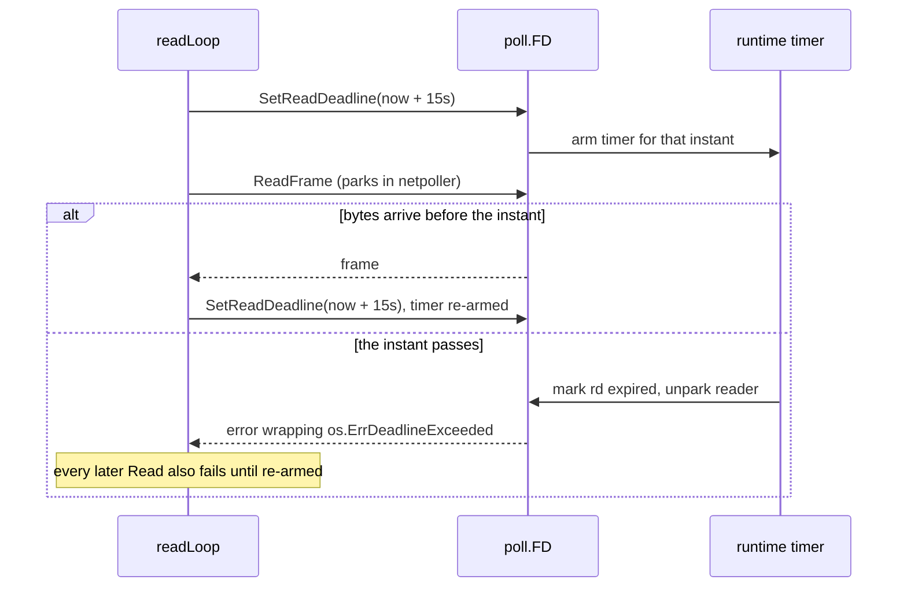

# Deadlines & I/O Timeouts

Go's `net.Conn` has no timeout parameter on `Read` or `Write`. It has *deadlines*: absolute
instants after which any blocked or future I/O call returns an error. This is a different model
from `SO_RCVTIMEO`, from `select` with a timer, and from `context.WithTimeout`, and the
differences are where the bugs live.

Prerequisites: [The Netpoller](./go-netpoller) for how a blocked `Read` parks and wakes;
[Stream Framing](./stream-framing) for why "mid-frame" is a meaningful position.

## Core Mental Model

A deadline is a wall-clock instant stored on the file descriptor. Every I/O call on that
descriptor checks it; the runtime's timer wheel fires it. Three rules follow:

1. **It is absolute.** `SetReadDeadline(t)` means "fail reads after `t`", not "allow `t - now`
   per read". A successful read does not push it forward.
2. **It is sticky.** Once set, it applies to every subsequent call until replaced. Once expired,
   *every* call fails immediately until it is re-armed or cleared with the zero `time.Time`.
3. **It is per-direction.** Read and write deadlines are independent; `SetDeadline` sets both.



## Under the Hood

### What `SetReadDeadline` does

It does not call `setsockopt`. `net.(*conn).SetReadDeadline` reaches
`internal/poll.(*FD).SetReadDeadline`, which calls `runtime_pollSetDeadline`. The runtime stores
the instant in the `pollDesc` (`rd` field, as a monotonic nanotime) and arms a runtime timer.
When the timer fires it sets `pd.rd = -1` and calls `netpollunblock`, which makes the parked
goroutine's `netpollblock` return `false`. `poll.FD.Read` then returns
`os.ErrDeadlineExceeded`.

Two consequences:

- Re-arming every iteration is cheap: it is a timer modification, not a syscall. The read loop
  does exactly that (`pkg/network/conn.go:368`).
- The deadline is evaluated against the monotonic clock, so a wall-clock step does not fire it
  early or late. The `Now` hook (`pkg/network/conn.go:118`) is only for computing the instant.

The error satisfies both `errors.Is(err, os.ErrDeadlineExceeded)` and
`net.Error.Timeout() == true`. `Classify` uses the sentinel (`pkg/network/conn.go:77`) because
`Timeout()` is also true for some errors that are not deadlines.

### Fresh deadline per frame

```go
for {
	if err := c.raw.SetReadDeadline(c.cfg.Now().Add(c.cfg.IdleTimeout)); err != nil {
		c.closeWith(DispositionOther, err)
		return
	}
	env, err := c.dec.ReadFrame()
	if err != nil {
		c.closeWith(Classify(err), err)
		return
	}
	h(c.peer, env)
}
```

Setting it once at connection open would make the deadline a *lifetime* bound: the connection
dies after `IdleTimeout` regardless of traffic. Setting it before each `ReadFrame` makes it an
*idle* bound: the connection dies only after `IdleTimeout` of silence. The comment at
`pkg/network/conn.go:356` calls this mandatory rather than defensive, and
[TCP Teardown & Half-Open Sockets](./tcp-teardown-and-half-open-sockets) explains why nothing else
detects a silent peer.

### A deadline mid-frame is terminal

`ReadFrame` issues two `io.ReadFull` calls: four bytes of header, then the body. If the deadline
fires after the header and halfway through the body, the bytes already consumed are gone and the
next read would start in the middle of a payload. There is no resynchronisation API by design (see
[Stream Framing](./stream-framing)). So a timeout is not retried: the reader classifies it as
`DispositionTimeout` and closes (`pkg/network/conn.go:375`). The same logic applies to the writer:
a write deadline firing mid-frame leaves the peer holding a length prefix for bytes that will
never come, so the writer closes too (`pkg/network/conn.go:415`).

This is why `Classify` checks the deadline before the EOF cases (`pkg/network/conn.go:70`): a
deadline mid-frame can otherwise present as `io.ErrUnexpectedEOF` further up the stack and be
misfiled as a peer death.

### Idle timeout vs whole-operation timeout

| Kind | Question it answers | Where |
|---|---|---|
| Idle | "has the peer said anything in the last `T`?" | `IdleTimeout`, per frame, `pkg/network/conn.go:105` |
| Per-write | "did this one frame reach the kernel within `T`?" | `WriteTimeout`, per frame, `pkg/network/conn.go:411` |
| Whole-operation | "did this multi-step exchange finish by instant `t`?" | `HandshakeTimeout`, `pkg/network/handshake.go:63` |

The handshake is the interesting case. It sets **one absolute deadline for the whole exchange**
before the first byte moves (`pkg/network/handshake.go:66`) and reuses it for the `HELLO` write
and the `HELLO_ACK` read. A per-operation timeout would let a peer that trickles one byte per
timeout hold the goroutine indefinitely (`pkg/network/handshake.go:64`). The dial itself shares
the same budget through `context.WithTimeout` (`pkg/network/dial.go:107`), so dial plus handshake
together cannot exceed `HandshakeTimeout` (default 3 s, `pkg/network/pool.go:56`).

### Set, then clear

Once the handshake succeeds the deadline is cleared with `SetDeadline(time.Time{})`
(`pkg/network/handshake.go:118` on the dial side, `pkg/network/handshake.go:202` on the accept
side). Without this, the `Conn` would inherit an absolute instant that is about to fire, and the
first frame after the handshake would fail with a timeout that looks exactly like a dead peer.
Rule 2 above is the reason: deadlines are sticky.

The handshake also maps its timeout to a distinct sentinel, `ErrHandshakeTimeout`
(`pkg/network/handshake.go:237`), because a half-open handshake says nothing about the health of
a peer we never identified (`pkg/network/handshake.go:36`).

### `IdleTimeout` must exceed $K \times$ heartbeat interval

The transport's deadline and the cluster's failure detector are two detectors on the same
silence. If `IdleTimeout` is shorter than the interval at which peers actually send, the
transport reaps healthy peers for being quiet; if it is shorter than $K \times$ interval, it
pre-empts the detector's verdict and every failure arrives as a connection error rather than a
missed-beat decision. The constraint is stated at `pkg/network/conn.go:105`:

$$
\text{IdleTimeout} > K \cdot \text{HeartbeatInterval} + \text{margin}
$$

Defaults are 15 s idle (`pkg/network/conn.go:123`) and 5 s per write
(`pkg/network/conn.go:126`); the cluster layer chooses $K$ and the interval to fit under them.
See [Failure Detectors](./failure-detectors) for what $K$ trades off.

## Why It Matters in This Swarm

- **Every read carries a deadline** (`pkg/network/doc.go:10`). It is the package's first
  invariant, because a `SIGKILL`ed peer leaves a socket that never errors on its own.
- **A deadline is a goroutine-leak guarantee.** The reader returns on any read error and the
  idle deadline guarantees one arrives (`pkg/network/conn.go:158`). No `select` on
  `time.After` around a blocking read, which would leave the reader parked after the timer wins.
- **Close does not wait for the deadline.** Closing the socket unparks a reader or writer
  immediately (`pkg/network/conn.go:303`); shutdown never waits out `IdleTimeout`.
- **`Send` has its own, non-I/O timeout.** `CtrlSendTimeout` bounds waiting for queue space
  (`pkg/network/conn.go:283`); that is a channel timer, not a socket deadline, and it means the
  peer is slow rather than that the stream is broken.

## Common Failure Modes & Edge Cases

**Deadline set once, connection dies on schedule.** *Symptom:* every connection lasts exactly
`IdleTimeout` from open, regardless of traffic, with `disposition=timeout`. *Cause:* the deadline
was armed at construction and never refreshed. Rule 1: absolute, not sliding.

**Handshake deadline leaks into the connection.** *Symptom:* a connection dies within seconds of
a successful `HELLO_ACK`, before any heartbeat. *Cause:* the handshake deadline was not cleared.
Rule 2: sticky. The two `SetDeadline(time.Time{})` calls are load-bearing.

**Per-read timeout on a multi-step exchange.** *Symptom:* a hostile or broken peer holds a
handshake goroutine for minutes by sending one byte at a time. *Cause:* re-arming the deadline
per `Read`. A whole-operation bound must be one instant.

**Retrying after a read timeout.** *Symptom:* `ErrMalformedFrame` or absurd frame lengths right
after a timeout. *Cause:* the reader continued on the same stream from mid-body. A timeout on a
length-prefixed stream is terminal.

**Idle timeout below the send interval.** *Symptom:* periodic swarm-wide reconnects with no
outage. *Cause:* `IdleTimeout` tuned below the heartbeat interval. The check in
`pkg/network/conn.go:105` is a comment, not a runtime assertion; the cluster layer's configuration
is where it has to be enforced.

**`Timeout()` used as the classifier.** *Symptom:* `ECONNREFUSED` during a dial counted as a
peer timeout. *Cause:* some `net.OpError`s report `Timeout() == true` for non-deadline reasons.
Use `errors.Is(err, os.ErrDeadlineExceeded)` for the deadline case, as `Classify` does.
