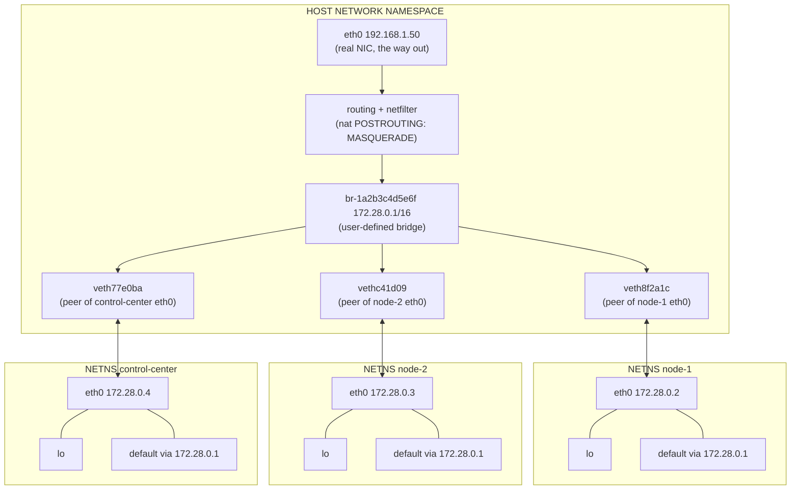

# Docker Bridge Networking

The swarm is specified to run as `N` containers on a custom bridge network, discovering each other
by name, with chaos controls that kill containers and inject latency. Every one of those sentences
is a claim about Linux network namespaces, veth pairs, a userspace DNS server at `127.0.0.11`, and
netfilter rules that Docker writes on your behalf. If you treat the bridge as a black box, the
swarm will appear to work and then fail in a specific, reproducible, deeply confusing way the
first time you kill a node and restart it.

This page is the networking substrate underneath [TCP Sockets & The Kernel](./tcp-sockets-and-the-kernel).
Nothing here changes what a socket is; it changes where the packets go.

---

## Core Mental Model

### There is no such thing as "Docker networking"

There is only Linux. A container is a process with a set of namespaces, and the networking part of
that set is a **network namespace**: a completely independent copy of the kernel's network stack --
its own interfaces, its own routing table, its own ARP cache, its own netfilter rules, its own
socket table, its own `/proc/net`. Two processes in different network namespaces can both bind
`0.0.0.0:7946` and never collide, because they are binding in different stacks.

A namespace with only a loopback interface cannot reach anything. To connect it to the outside you
need a **veth pair**: a virtual Ethernet cable, created as two linked interfaces. Whatever is
transmitted on one end is received on the other. Put one end inside the container's namespace
(renamed `eth0`) and enslave the other end to a **bridge** in the host namespace, and you have a
container on a network. A Linux bridge is a software layer-2 switch: it learns MAC addresses on
ports and forwards frames between them.



Two containers on this bridge talk to each other as though they were two machines on the same
switch. Nothing is translated, nothing is proxied, and -- this matters more than it sounds -- no
netfilter NAT rule is involved at all.

### The packet path, end to end

A heartbeat from `node-1` to `node-2` on the same bridge:

```
 node-1 process: write(fd, frame)
   |
   +- netns(node-1): route lookup -> 172.28.0.0/16 is on-link via eth0
   +- netns(node-1): ARP for 172.28.0.3 -> MAC of node-2's eth0
   +- netns(node-1): frame transmitted on eth0
   |      (veth: TX on one end = RX on the other)
   +- HOST netns: frame arrives on veth8f2a1c, which is a bridge port
   +- br-1a2b...: FDB lookup on destination MAC -> port vethc41d09
   |      (bridge forwarding; NO IP routing, NO nat table traversal
   |       unless br_netfilter is enabled -- see Under the Hood)
   +- veth: frame emerges inside netns(node-2) on eth0
   \- netns(node-2): normal IP + TCP receive, delivered to the listener
```

And the same node reaching the public internet:

```
 node-1: write to 93.184.216.34:443
   +- netns(node-1): no on-link route -> default via 172.28.0.1
   +- HOST netns: arrives on the bridge, addressed to the bridge's own MAC
   +- HOST netns: IP forwarding (net.ipv4.ip_forward=1) routes it to eth0
   +- nat POSTROUTING: MASQUERADE rewrites source 172.28.0.2 -> 192.168.1.50
   \- out of the real NIC. Return traffic is un-rewritten by conntrack.
```

Egress is NAT. Container-to-container on the same bridge is not. Hold onto that distinction; it
explains several things later.

---

## Under the Hood

### Seeing it directly

Docker does not register its namespaces in `/var/run/netns`, so `ip netns list` shows nothing by
default. You can link them in:

```
$ pid=$(docker inspect -f '{{ .State.Pid }}' swarm-node-1)
$ sudo mkdir -p /var/run/netns
$ sudo ln -sf /proc/$pid/ns/net /var/run/netns/node1
$ sudo ip netns exec node1 ip addr
1: lo: <LOOPBACK,UP,LOWER_UP> mtu 65536 qdisc noqueue state UNKNOWN
    inet 127.0.0.1/8 scope host lo
24: eth0@if25: <BROADCAST,MULTICAST,UP,LOWER_UP> mtu 1500 qdisc noqueue state UP
    link/ether 02:42:ac:1c:00:02 brd ff:ff:ff:ff:ff:ff link-netnsid 0
    inet 172.28.0.2/16 brd 172.28.255.255 scope global eth0
```

`eth0@if25` is the giveaway: this interface's veth peer is interface index 25 **in another
namespace**. Find it on the host:

```
$ ip addr | grep -A2 '^25:'
25: veth8f2a1c@if24: <BROADCAST,MULTICAST,UP,LOWER_UP> mtu 1500 master br-1a2b3c4d5e6f state UP
    link/ether 3a:11:c0:9d:2f:4e brd ff:ff:ff:ff:ff:ff link-netns 1
```

`master br-1a2b3c4d5e6f` is the enslavement to the bridge. The routing table inside is minimal:

```
$ sudo ip netns exec node1 ip route
default via 172.28.0.1 dev eth0
172.28.0.0/16 dev eth0 proto kernel scope link src 172.28.0.2
```

And the bridge from Docker's point of view:

```
$ docker network inspect swarm-net
[
    {
        "Name": "swarm-net",
        "Id": "1a2b3c4d5e6f...",
        "Driver": "bridge",
        "EnableIPv6": false,
        "IPAM": { "Config": [ { "Subnet": "172.28.0.0/16", "Gateway": "172.28.0.1" } ] },
        "Internal": false,
        "Options": { "com.docker.network.driver.mtu": "1500" },
        "Containers": {
            "9f3c...": { "Name": "swarm-node-1", "IPv4Address": "172.28.0.2/16",
                         "MacAddress": "02:42:ac:1c:00:02" },
            "b71e...": { "Name": "swarm-node-2", "IPv4Address": "172.28.0.3/16",
                         "MacAddress": "02:42:ac:1c:00:03" }
        }
    }
]
```

### Default bridge vs user-defined bridge

This is the single most consequential choice on this page, and the difference is not cosmetic.

| | `docker0` (default) | user-defined bridge |
|---|---|---|
| Name resolution | **none** -- IP addresses only | **automatic DNS by container name and by network alias** |
| Isolation | every container shares one flat network | one bridge per network; separate broadcast domains |
| Attach/detach at runtime | requires restart | `docker network connect/disconnect` live |
| Legacy `--link` | supported, deprecated | not supported, and not needed |
| ICC control | global `--icc` daemon flag | per-network |

The line that matters for a peer-to-peer swarm is the first one. On a user-defined bridge, a
container can `dial("tcp", "swarm-node-3:7946")` and it resolves. That is the entire peer-discovery
mechanism for this project: **no registry, no gossip seed list, no service mesh -- just the names in
`deploy/docker-compose.yml`.** Compose creates a user-defined bridge by default and registers every
service name plus every declared `alias` in it.

Aliases are worth knowing about because they give you a second, role-based namespace on top of the
per-container one:

```yaml
services:
  swarm-node-1:
    networks:
      swarm-net:
        aliases: [ node-1, seed ]
```

Multiple containers may share an alias. Docker's DNS then returns **all** of their A records, in
rotated order -- a crude round-robin. That is useful for a seed set and actively dangerous for
anything expecting a single stable peer, since each lookup may hand you a different node.

### The embedded DNS server at 127.0.0.11

Inside any container on a user-defined network:

```
$ docker exec swarm-node-1 cat /etc/resolv.conf
nameserver 127.0.0.11
options ndots:0
```

`127.0.0.11` is a loopback address *inside the container's network namespace*. There is no server
listening on it in the host namespace and no such address on any real interface. What actually
happens:

1. The Docker daemon runs an embedded DNS resolver as a goroutine in `dockerd`, in the **host**
   namespace, bound to an ephemeral port.
2. When the container's namespace is created, Docker installs netfilter rules *inside that
   namespace* that DNAT traffic to `127.0.0.11:53` to that ephemeral port, and SNAT the replies
   back. Those rules are invisible from the host -- you must look inside the namespace:

```
$ sudo ip netns exec node1 iptables -t nat -L -n
Chain DOCKER_OUTPUT (2 references)
target     prot opt source       destination
DNAT       tcp  --  0.0.0.0/0    127.0.0.11    tcp dpt:53 to:127.0.0.11:35401
DNAT       udp  --  0.0.0.0/0    127.0.0.11    udp dpt:53 to:127.0.0.11:44329

Chain DOCKER_POSTROUTING (2 references)
target     prot opt source       destination
SNAT       tcp  --  127.0.0.11   0.0.0.0/0     tcp spt:35401 to::53
SNAT       udp  --  127.0.0.11   0.0.0.0/0     udp spt:44329 to::53
```

3. The resolver answers names it knows -- container names and aliases on the networks this container
   is attached to -- from Docker's own in-memory tables. Anything else is forwarded to the host's
   upstream resolvers.

Two practical consequences. First, `options ndots:0` means bare names are tried as absolute names
first, so `swarm-node-3` is one query with no search-domain suffixing -- fast and unambiguous.
Second, **the answers are generated live from the daemon's current state**, not from a file. When a
container restarts with a new IP, the very next query returns the new address. Which brings us to
the failure mode that will bite this project.

### The NAT rules, and what does not traverse them

On the host:

```
$ sudo iptables -t nat -L -n
Chain PREROUTING (policy ACCEPT)
target     prot opt source     destination
DOCKER     all  --  0.0.0.0/0  0.0.0.0/0    ADDRTYPE match dst-type LOCAL

Chain POSTROUTING (policy ACCEPT)
target       prot opt source         destination
MASQUERADE   all  --  172.28.0.0/16  0.0.0.0/0
MASQUERADE   all  --  172.17.0.0/16  0.0.0.0/0
MASQUERADE   tcp  --  172.28.0.4     172.28.0.4   tcp dpt:8080

Chain DOCKER (2 references)
target     prot opt source     destination
RETURN     all  --  0.0.0.0/0  0.0.0.0/0
DNAT       tcp  --  0.0.0.0/0  0.0.0.0/0    tcp dpt:8080 to:172.28.0.4:8080
```

Read those three rule sets carefully:

- **`MASQUERADE` on `POSTROUTING`** rewrites the source address of anything leaving `172.28.0.0/16`
  for a non-bridge destination. This is what gives containers outbound internet access. Note the
  `-s 172.28.0.0/16 ! -o br-1a2b...` form in the full listing (`iptables -t nat -S` shows it) --
  the `! -o <bridge>` exclusion is precisely what stops intra-bridge traffic being masqueraded.
- **`DNAT` in the `DOCKER` chain** implements `-p 8080:8080`. It is reached only from `PREROUTING`
  with `dst-type LOCAL`, i.e. traffic addressed to one of the **host's own** addresses.
- **The third `MASQUERADE`** is the hairpin rule, for a container reaching its own published port.

The load-bearing conclusion: **container-to-container traffic on the same user-defined bridge does
not traverse the DNAT rules at all.** It is destined for `172.28.0.3`, which is not a local host
address, so `PREROUTING`'s `ADDRTYPE LOCAL` match fails and the `DOCKER` chain is never entered.
Moreover, bridged frames forwarded at layer 2 do not enter the `nat` table on the `FORWARD` path
unless `br_netfilter` is loaded and `net.bridge.bridge-nf-call-iptables=1` -- and even then, only
the `filter` and `mangle` hooks see them in the usual configuration.

So: the swarm mesh is plain, unmodified, un-NATted TCP between real IP addresses on a real layer-2
segment. Latency is a veth traversal and a bridge FDB lookup, typically tens of microseconds. That
is a good property, and it is worth knowing that you have it.

### Published ports vs the container port

`ports: ["8080:8080"]` does two distinct things, and neither of them is "open a port on the
container":

1. Installs the DNAT rule above, so `host:8080` is redirected to `172.28.0.4:8080`.
2. In some configurations also starts a `docker-proxy` userspace process -- a small TCP relay used
   for hairpin cases and where `iptables` DNAT cannot apply (notably loopback). You can see it:
   `ps aux | grep docker-proxy` shows `docker-proxy -proto tcp -host-ip 0.0.0.0 -host-port 8080
   -container-ip 172.28.0.4 -container-port 8080`. It is a genuine extra hop and a genuine extra
   copy; `userland-proxy: false` in `/etc/docker/daemon.json` disables it.

`expose:` by contrast does nothing at runtime. It is metadata. A container port is reachable from
any other container on the same network whether or not it is exposed or published; the only thing
governing that is the network the container is on.

The rule this gives us: **publish only what a human or a browser needs to reach from the host.**
For this project that is the Control Center's HTTP/WebSocket port and nothing else. Publishing the
swarm's internal mesh port would (a) put `N` DNAT rules in the host's netfilter tables for no
benefit, (b) expose an unauthenticated internal protocol on the host's interfaces, and (c) risk
peers connecting to each other *via the host's published address* rather than directly across the
bridge -- which quietly doubles the hop count and, through `docker-proxy`, the copies, polluting
exactly the latency measurements the health strategy depends on.

### MTU

The bridge's MTU is inherited from the daemon configuration, not auto-negotiated per path. If the
host's egress path has a smaller MTU than the bridge -- a VPN at 1420, an overlay at 1450, a
cloud instance at 1450, a PPPoE link at 1492 -- then a container emitting a 1500-byte frame
produces a packet that must be fragmented or dropped. Since Linux sets the `DF` bit and relies on
Path MTU Discovery, the router is supposed to return `ICMP Fragmentation Needed`. Where a firewall
blocks ICMP type 3 code 4 -- and many do -- you get a **PMTU black hole**: the TCP handshake works
(small packets), small messages work, and the connection hangs the instant a large message is
sent.

That failure signature -- "heartbeats fine, state replication hangs" -- is one to memorise, because
it looks exactly like an application bug and is not one. Set it explicitly when in doubt:

```yaml
networks:
  swarm-net:
    driver: bridge
    driver_opts:
      com.docker.network.driver.mtu: "1450"
```

### Container lifecycle signals, as the peers experience them

The chaos controls will terminate containers. What the *surviving peers observe* depends entirely
on how the container dies, and the three cases are behaviourally different in ways your failure
detector must handle.

```
 docker stop <c>                     (SIGTERM, wait 10s, then SIGKILL)
 -----------------------------------------------------------------------
   PID 1 gets SIGTERM.
   If it handles it: closes listeners and conns -> clean FIN to each peer.
   Peer sees: Read returns io.EOF. Immediate, unambiguous, ~0 ms.
   If it ignores it: 10 s of silence, then SIGKILL -> kernel closes the
   sockets on process teardown -> RST or FIN depending on pending data.
   Peer sees: nothing for 10 s, then an abrupt error.

 docker kill <c>                     (SIGKILL immediately)
 -----------------------------------------------------------------------
   No userspace cleanup. The kernel tears down the socket table.
   Peer sees: FIN (if buffers are clean) or RST -> ECONNRESET.
   Still fast: the namespace still exists long enough to emit it.

 docker kill -s SIGSTOP <c>          (freeze, do not kill)
 -----------------------------------------------------------------------
   Process stops scheduling. Sockets stay OPEN. Kernel keeps ACKing
   until the receive buffer fills, then advertises a zero window.
   Peer sees: NOTHING. No FIN, no RST, no error. Writes succeed into
   the local send buffer. This is the SILENT BLACKHOLE, and it is the
   only one of the three that a timeout-based failure detector is
   actually required for. The other two are detected by the socket.

 docker network disconnect <net> <c> (yank the cable)
 -----------------------------------------------------------------------
   veth removed. Packets have nowhere to go. Same silent blackhole,
   from the other direction.
```

Restart policies (`restart: unless-stopped`, `on-failure`) then bring the container back -- with a
**new network namespace, a new veth pair, and in general a new IP address from the IPAM pool**.

### Injecting latency with tc netem

Latency chaos is done with the kernel's own traffic control, inside the container's namespace:

```
$ docker exec --privileged swarm-node-3 \
    tc qdisc add dev eth0 root netem delay 200ms 40ms distribution normal
$ docker exec swarm-node-3 tc qdisc show dev eth0
qdisc netem 8001: root refcnt 2 limit 1000 delay 200ms  40ms
$ docker exec swarm-node-3 tc qdisc del dev eth0 root
```

`netem` can also do `loss 15%`, `duplicate 1%`, `reorder 25% 50%`, and `rate 1mbit`. Note that
`root` applies to **egress only**; to delay ingress you must redirect to an IFB device
(`tc qdisc add dev eth0 handle ffff: ingress` plus a mirred redirect), which is a meaningfully
more involved setup.

Manipulating qdiscs requires `CAP_NET_ADMIN`, which containers do not have by default. Grant it
narrowly rather than using `privileged: true`:

```yaml
services:
  swarm-node-3:
    cap_add: [ NET_ADMIN ]
```

`iproute2` must also be present in the image; a `FROM scratch` or `distroless` final stage will not
contain `tc`. That is a real tension with a minimal image, and the honest resolution is either a
slightly larger base (`alpine` plus `iproute2`) or a sidecar container sharing the target's network
namespace via `network_mode: "container:swarm-node-3"`, which can carry the tooling and the
capability without the node image doing so.

---

## Why It Matters in This Swarm

No Go code exists yet; what follows are commitments that `pkg/network/`, `pkg/cluster/` and
`deploy/` will have to honour.

**`deploy/docker-compose.yml` will declare one explicit user-defined bridge, never the default.**
The entire peer-discovery design rests on DNS-by-container-name. Falling back to `docker0` removes
name resolution, and the swarm would need a registry it is explicitly designed not to have. The
network will be declared with an explicit name and subnet so that addresses in logs and in the
dashboard are predictable across `docker compose down && up`.

**`deploy/docker-compose.yml` will publish exactly one port: the Control Center's HTTP/WebSocket
port.** `cmd/control-center/` serves the dashboard to a browser on the host, so it must be
reachable through DNAT. Every `cmd/swarm-node/` instance will use `expose`-style internal reachability
only. The reasoning is in "Published ports vs the container port" above: publishing the mesh port
would add a `docker-proxy` hop into exactly the path `pkg/health/` is trying to measure.

**`pkg/network/` will store peers as `name:port` strings and resolve at dial time -- never cache a
resolved `net.IP`.** This is the most important commitment on the page and it follows directly from
the chaos requirement. The sequence that breaks a caching implementation:

```
  t0   swarm-node-3 is at 172.28.0.5. Peer table caches net.IPv4(172,28,0,5).
  t1   Chaos control: docker kill swarm-node-3.
  t2   Restart policy recreates it. IPAM assigns 172.28.0.11.
  t3   Docker's embedded DNS now answers swarm-node-3 -> 172.28.0.11.
  t4   Our node dials the CACHED 172.28.0.5.
       Nothing is there. The bridge has no FDB entry and no ARP reply.
       The SYN is not refused -- it is unanswered.
  t5   The dial hangs for the full TCP SYN retry schedule (~2 minutes on
       Linux defaults, tcp_syn_retries=6) before returning ETIMEDOUT.
  t6   Health scoring records catastrophic latency for a node that is
       actually healthy and sitting right there on the bridge.
       The node is never readmitted. The swarm has permanently lost a peer
       and no error was logged anywhere.
```

Note the asymmetry with the failure it is *not*: a dial to a live host with nothing listening gets
`ECONNREFUSED` in microseconds. A dial to a dead IP on a bridge gets silence and a two-minute
timeout. So the concrete commitments are: `pkg/network/` dials by name on every attempt, and every
dial uses `net.Dialer{Timeout: ...}` or a `DialContext` with a deadline far shorter than the kernel
default.

```go
// pkg/network -- the shape the dialer will take.
// Name, not address: DNS is re-consulted on every attempt, so a peer that
// has been killed and restarted with a fresh IP is found immediately.
func dialPeer(ctx context.Context, name string, port int) (net.Conn, error) {
    d := net.Dialer{Timeout: 2 * time.Second}
    addr := net.JoinHostPort(name, strconv.Itoa(port))
    return d.DialContext(ctx, "tcp", addr)
}
```

**`pkg/cluster/`'s peer identity will be a stable node ID, not an IP address.** Since IPs are
recycled by IPAM, a restarted node may receive the address a *different* node previously held.
Keying cluster membership, leader identity, or health history on an IP would let a restart
masquerade as a different peer. The wire protocol in `pkg/protocol/` must therefore carry an
explicit node identifier in every frame, and `pkg/cluster/` must key on it.

**`cmd/swarm-node/` will handle `SIGTERM` and close its listener and peer connections before
exiting.** This is what converts a `docker stop` into an immediate `io.EOF` at every peer rather
than a ten-second silence followed by a timeout. It makes graceful shutdown visibly different from
a crash on the dashboard, which is a demonstration the project exists to give. It also requires
that the container's PID 1 actually be our binary -- `exec` form `ENTRYPOINT`, not shell form,
because a shell PID 1 does not forward signals.

**`pkg/cluster/`'s K-missed-heartbeat detector exists for the SIGSTOP case and nothing else.** As
the lifecycle table shows, `docker stop` and `docker kill` are both reported by the socket layer as
errors, and a detector that only waited for socket errors would look correct against both. It would
then fail completely against a frozen or network-partitioned node, which produces no socket event
at all. The chaos controls in `cmd/control-center/` should therefore include `SIGSTOP` and
`network disconnect`, not only `kill`, or the failure detector is never genuinely exercised.

**The node image will carry `iproute2` and the compose file will grant `NET_ADMIN` to the nodes
subject to latency chaos.** Without both, the `tc netem` chaos control fails with
`RTNETLINK answers: Operation not permitted`, which is an easy hour to lose.

---

## Common Failure Modes & Edge Cases

**Cached IP after a container restart.**
*Symptom:* a node is killed, restarts successfully, logs that it is healthy and listening -- and is
never re-admitted to the cluster. No error appears on either side. *Cause:* peers hold a stale
resolved address; the SYN goes to an address nobody owns and is silently dropped by the bridge.
*Detection:* `ss -tan state syn-sent` inside a peer shows a connection to an address that
`docker network inspect` does not list. *Fix:* re-resolve on every dial; see above.

**A dial that hangs for two minutes instead of failing.**
*Symptom:* one health probe blocks and the whole health sweep stalls behind it, so the node stops
reporting telemetry entirely. *Cause:* `net.Dial` with no timeout against an unreachable address
inherits the kernel's SYN retry schedule (`/proc/sys/net/ipv4/tcp_syn_retries`, default 6, roughly
127 s). *Fix:* every dial takes a context or a `Dialer.Timeout`; health probes run concurrently so
one slow peer cannot serialise the sweep.

**PMTU black hole.**
*Symptom:* heartbeats work perfectly; state replication or any large frame hangs, forever, with no
error. Both `ss` endpoints show ESTABLISHED and a non-empty `Send-Q` that never drains. *Cause:*
bridge MTU exceeds the true path MTU and ICMP `Fragmentation Needed` is filtered. *Detection:*
`ping -M do -s 1472 <peer>` from inside the container; if 1472 fails and 1400 succeeds, the path
MTU is below 1500. *Fix:* set `com.docker.network.driver.mtu` explicitly.

**Binding to 127.0.0.1 inside the container.**
*Symptom:* peers get `ECONNREFUSED` instantly, while a local `curl` inside the same container
works fine. *Cause:* the container's loopback is its own namespace's loopback; nothing outside can
reach it. *Fix:* bind `0.0.0.0` (or leave the host part of the `net.Listen` address empty).
This is not merely a Docker quirk -- it is exactly what namespace isolation means.

**Name resolves but connection refused.**
*Symptom:* `ECONNREFUSED` immediately, not a timeout. *Cause:* the container exists and its IP is
right, but the process inside has not yet bound its listener. This is *startup ordering*, and
`depends_on` does not fix it -- `depends_on` waits for the container to start, not for the service
inside it to be ready. *Fix:* dial with retry and backoff in `pkg/network/`, and treat
`ECONNREFUSED` during startup as normal rather than as a health signal. Distinguish it in code:

```go
var sysErr *os.SyscallError
if errors.As(err, &sysErr) && errors.Is(sysErr.Err, syscall.ECONNREFUSED) {
    // Peer container is up, process not yet listening. Retry, do not penalise health.
}
```

**Compose project-name prefixing.**
*Symptom:* `dial tcp: lookup swarm-node-2: no such host` when the container is plainly running.
*Cause:* Compose prefixes container names with the project name (`drones-swarm-node-2-1`), but
registers the **service name** as a DNS alias on the network. Dialling the container name works
only if it matches; dialling the service name always works. *Fix:* peer configuration uses service
names, and the node's own identity is passed explicitly via environment rather than inferred from
the hostname.

**IPv6 and dual-stack surprises.**
*Symptom:* intermittent "network is unreachable" or unexpectedly slow dials. *Cause:* if the image
has an `AAAA`-capable resolver path but the bridge has no IPv6, Go's Happy Eyeballs dialler may
attempt an IPv6 connection first and fail over. *Fix:* leave `EnableIPv6` false (the default) and
be aware that `net.Dial` with `"tcp"` will try both families; `"tcp4"` forces one.

**Stale `tc netem` qdisc left attached.**
*Symptom:* a node's health score never recovers after a chaos experiment is "stopped"; latency
stays elevated across runs. *Cause:* a qdisc added with `tc qdisc add` persists for the lifetime of
the network namespace and is not cleared by anything the application does. *Fix:* the chaos control
in `cmd/control-center/` must issue the matching `tc qdisc del dev eth0 root`, and should be
idempotent -- deleting a non-existent root qdisc returns `RTNETLINK answers: No such file or
directory`, which is safe to ignore.

**Bridge name collisions and subnet overlap.**
*Symptom:* `docker compose up` fails with `Pool overlaps with other one on this address space`, or
worse, containers cannot reach a corporate network. *Cause:* the chosen subnet collides with a VPN
route or another Docker network. *Fix:* pick an explicit, unusual subnet in
`deploy/docker-compose.yml` and document it.

**Every container getting the same MAC or IP after a daemon restart.**
*Symptom:* rare, but ARP confusion and packets landing on the wrong container. *Cause:* IPAM state
and running containers disagreeing after an unclean daemon restart. *Fix:* `docker compose down`
fully (which removes the network) rather than restarting the daemon underneath a live network.

---

## Further Reading

- [TCP Sockets & The Kernel](./tcp-sockets-and-the-kernel) -- what the connections crossing this
  bridge actually are, and what `ss` is telling you about them.
- [Non-Blocking I/O: select, poll & epoll](./nonblocking-io-and-epoll) -- the readiness machinery
  the arriving packets drive.
- [Stream Framing](./stream-framing) -- why a bridge that delivers your bytes perfectly still does
  not deliver your messages.
- [The Netpoller](./go-netpoller) -- how a frame landing on `eth0` in a namespace ends up waking a
  specific goroutine.
