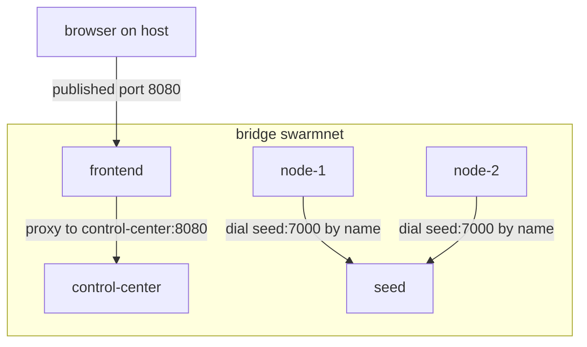

# Docker Bridge Networking

A Docker bridge network is a virtual Ethernet switch inside the host kernel. Each container gets
its own network namespace (its own interfaces, routes and ports) and a virtual cable (a `veth`
pair) plugged into that switch. Containers on the same bridge talk to each other directly. Only
ports you **publish** are reachable from the host, through NAT. Think of an office LAN: desks
talk to each other freely, and only the reception desk has a phone line to the outside.

A **user-defined** bridge (one you declare in Compose) adds a built-in DNS server at
`127.0.0.11`, so containers can reach each other by service or container name. The default
`docker0` bridge does not do this.

## How swarm-net uses it

- **One user-defined bridge.** Every container joins `swarmnet` (driver `bridge`) in the
  Compose file, so names like `seed` and `swarm-net-node-3` resolve through Docker DNS.
- **Only the frontend is published** (host port 8080, bound to `127.0.0.1` by default). nginx
  forwards API and WebSocket calls to `control-center:8080` over the bridge. Node-to-node
  traffic stays on the bridge, so latency probes measure the real path, not a proxy hop.
- **Peers are dialed by name on every attempt.** `dialOnce` in `backend/pkg/network/dial.go`
  passes the `host:port` string to `DialContext` each time. A restarted container gets a new
  IP, and a cached IP could point at nothing, or at another node.
- **Identity is a node ID, not an IP.** IPs get reused, so membership is keyed on the ID sent in
  the handshake (`backend/pkg/network/handshake.go`).
- **Readable names under `--scale`.** The node entrypoint script reverse-resolves its own IP to
  its container name and uses that as its node ID.

## Common pitfalls

- **Using the default bridge.** Name resolution disappears and every dial fails with "no such
  host".
- **Caching resolved IPs.** After a restart, a dial to the old IP gets no answer at all, and
  without a timeout it hangs for about two minutes.
- **Dial before listen at startup.** Containers start together, so the first dials fail with
  "connection refused". Retry with [backoff](./backoff-and-connection-storms).
- **Confusing published and container ports.** `8080:8080` means host port, then container
  port. Containers on the bridge always use the container port.

## Further reading

- [Container Images & PID 1](./container-images-and-pid-1)
- [Docker docs: Bridge network driver](https://docs.docker.com/engine/network/drivers/bridge/)
