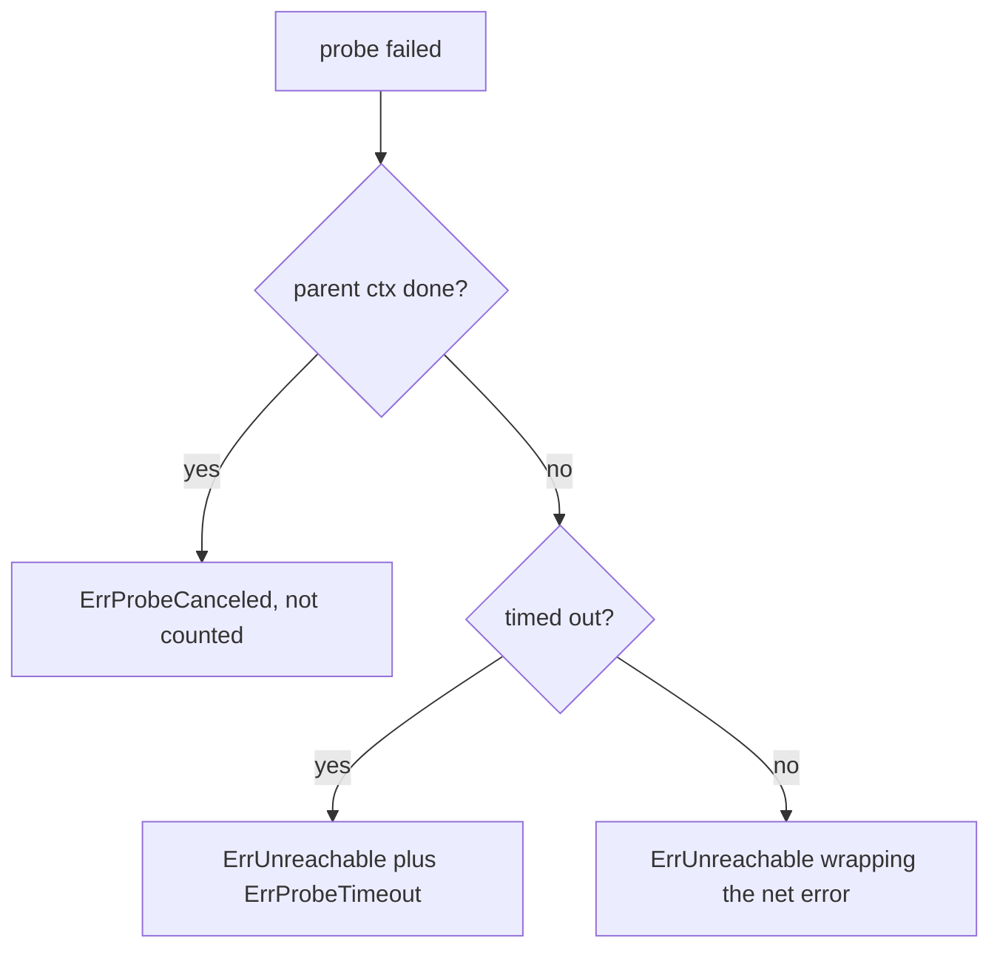

# Error Wrapping & Classification: The Chain Is An API

In Go, `fmt.Errorf("probing %s: %w", addr, err)` **wraps** `err`: the message includes it, and
`errors.Is` / `errors.As` can still find it inside. Using `%v` instead gives the same message
but hides the original error from those functions. So the choice is not about formatting. It
decides what callers are allowed to detect. Think of `%w` as putting the original letter inside
a new envelope, and `%v` as copying out its text by hand.

- `errors.Is(err, target)` asks "is this specific value anywhere in the chain?"
- `errors.As(err, &target)` asks "is there an error of this *type* in the chain?"
- A **sentinel** is a package-level value like `var ErrUnreachable = errors.New(...)`.

```go
if errorIsDeadline(cause) {
	// %v on cause, not %w: wrapping context.DeadlineExceeded would make
	// IsCancellation true, and a dead peer would never be evicted.
	return ScoreUnavailable(), fmt.Errorf("%w: %w: %s did not answer within %v (%v)",
		ErrUnreachable, ErrProbeTimeout, target, s.probeTimeout, cause)
}
```



## How swarm-net uses it

- **Health sentinels** live in `backend/pkg/health/strategy.go`: `ErrUnreachable`,
  `ErrProbeTimeout`, `ErrProbeCanceled` and `ErrInvalidTarget`.
- **Classify from the parent context, not the error.** The caller's deadline and the probe's own
  timeout both produce `context.DeadlineExceeded`. `classify` in
  `backend/pkg/health/latency.go` checks `ctx.Err()` on the parent to tell them apart.
- **A deliberately missing `%w`.** The snippet above keeps the timeout out of the chain, so
  `IsCancellation` stays false for a peer that never answers.
- **Two spellings of "deadline".** `errorIsDeadline` checks both `net.Error.Timeout()` and
  `context.DeadlineExceeded`, because dialers report the first.
- **Connection deaths are classified too.** `Classify` in `backend/pkg/network/conn.go` maps
  read errors to clean close, peer died, timeout or protocol violation.

## Common pitfalls

- **Adding `%w` "to be helpful".** It can change what a classifier sees and flip a decision.
- **Removing `%w`.** Callers that branch on the wrapped sentinel silently stop matching.
- **Comparing with `==`.** Wrapped errors never match. Use `errors.Is`.
- **Creating a sentinel inside a function.** Each call makes a new value that never matches.

## Further reading

- [Context & Cancellation](./context-cancellation)
- [Go blog: Working with Errors in Go 1.13](https://go.dev/blog/go1.13-errors)
