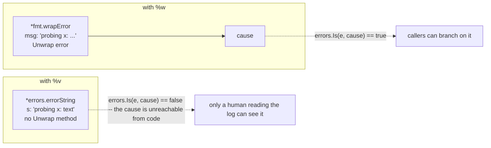
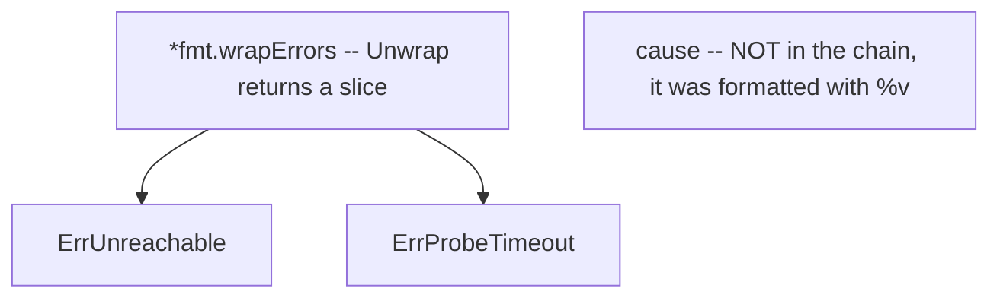
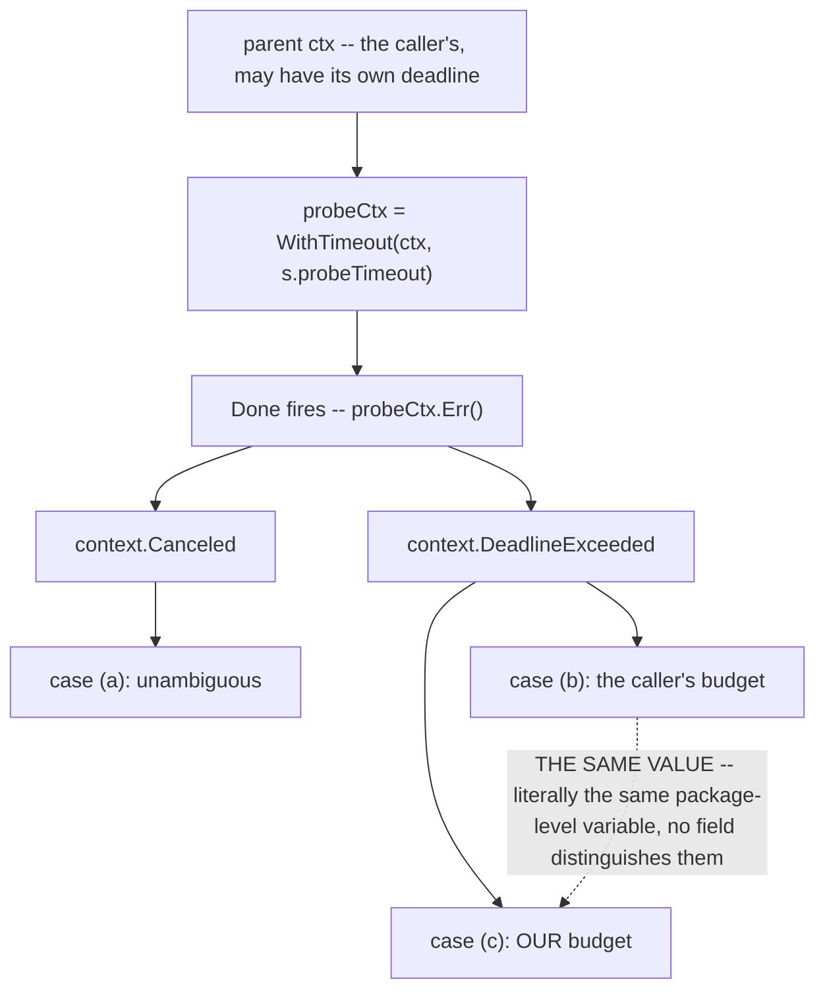
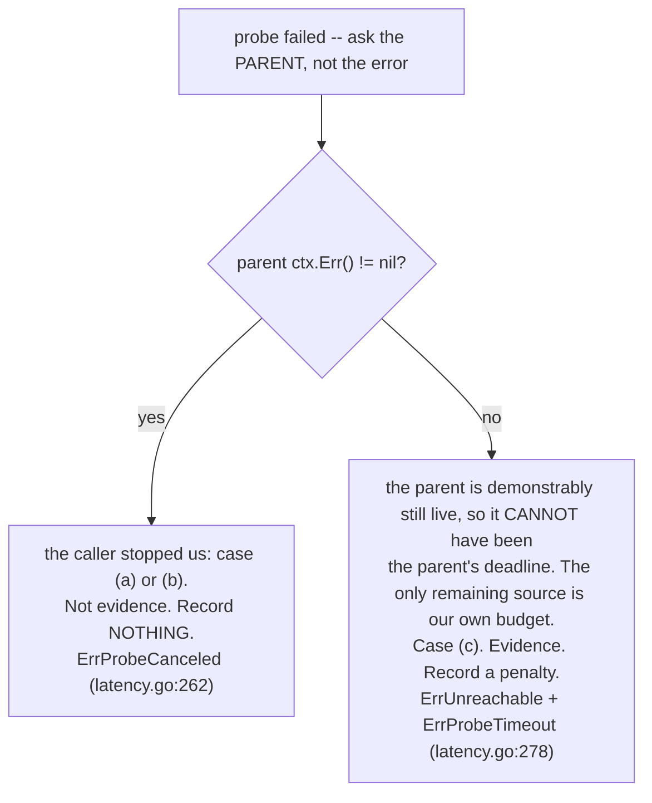
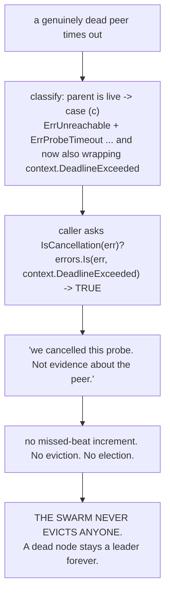

# Error Wrapping & Classification: The Chain Is An API

Most Go codebases treat error wrapping as string formatting with extra steps. It is not. Every
`%w` you write adds an edge to a graph that callers can traverse at runtime, and once a caller
traverses it, that edge is part of your package's public contract as surely as a method signature.

This page is built around one example from `pkg/health` where getting this wrong produces no
compile error, no test failure, and no log line. It produces a swarm that **never evicts a dead
node** -- which presents as "the cluster seems a bit slow" for as long as you care to look at it.

---

## 1. Core Mental Model

### 1.1 `%w` and `%v` do the same thing to the string and opposite things to the program

```go
fmt.Errorf("probing %s: %v", target, cause)  // cause is RENDERED. It is text now.
fmt.Errorf("probing %s: %w", target, cause)  // cause is LINKED. It is still an error.
```

Both produce the identical `Error()` string. The difference is entirely in what the returned value
*is*:



`fmt.Errorf` inspects its format string for `%w` verbs at runtime. With exactly one it returns a
`*fmt.wrapError` with `Unwrap() error`. With two or more (Go 1.20+) it returns a `*fmt.wrapErrors`
with `Unwrap() []error`. With none it returns a plain `*errors.errorString` with no `Unwrap` at
all.

### 1.2 The consequence: wrapping is a promise you cannot take back

The moment you write `%w`, any caller may write `errors.Is(err, thatSentinel)` and branch on it.
Removing the `%w` later -- or swapping the wrapped sentinel for a different one -- silently changes
that branch's outcome. The compiler will not help you. There is no deprecation warning. The call
site keeps compiling and starts taking the other path.

> **Rule of thumb.** Ask, before every `%w`: *do I want callers to be able to branch on this?* If
> yes, wrap and document it. If the cause is diagnostic detail for a human, `%v` it -- and if the
> answer is "wrapping it would make a caller's classification wrong", `%v` is not merely
> acceptable, it is mandatory. Section 3 is an entire section about one such case.

### 1.3 `errors.Is` vs `errors.As`

Both walk the same chain; they ask different questions.

| | question | test at each level | use for |
|---|---|---|---|
| `errors.Is(err, target)` | "is this specific VALUE anywhere in the chain?" | `err == target`, then `err.Is(target)` if defined | sentinels -- values with no data, where membership is the whole question |
| `errors.As(err, &target)` | "is there a value of this TYPE anywhere in the chain? if so, assign it so I can call its methods" | assignability to the target's pointee type | when you need to *read something off* the error |

Both then call `Unwrap()` and repeat; for a multi-`%w` error they explore every branch of
`Unwrap() []error` depth-first. `net.Error`'s `Timeout()` method forces `As`: "did this time out?"
is a question only the concrete value can answer.

### 1.4 Three error idioms, and when each is right

```go
// SENTINEL -- a fixed value callers compare against.
var ErrUnreachable = errors.New("health: target unreachable")
//   For:  a small, closed set of conditions callers branch on.
//   Cost: it is now API. You can never delete it, and you can never stop
//         wrapping it, without breaking callers.

// TYPED -- a struct carrying data about the failure.
type ProbeError struct {
    Target  protocol.NodeAddress
    Elapsed time.Duration
}
func (e *ProbeError) Error() string { return "probe of " + string(e.Target) + " failed" }
//   For:  when the caller needs to DO something with the details -- retry-after,
//         which field was invalid, how long it took.
//   Cost: bigger surface; every exported field is API.

// OPAQUE -- no sentinel, no type, just a message.
return fmt.Errorf("health: probing %s: %v", target, cause)
//   For:  everything else. The default. Callers log it and give up.
//   Benefit: nothing is API, so you can change it freely.
```

`pkg/health` uses the sentinel idiom deliberately, and the comment above the block at
`pkg/health/strategy.go:94` says why: *"These are the conditions callers are expected to branch on;
every other failure is wrapped and reported but not distinguished."* The set is closed at four
(`strategy.go:102`, `:112`, `:118`, `:123`), and closing it is the point -- a caller has four cases
to handle, not an open-ended taxonomy.

### 1.5 Multiple `%w` and the tree it builds

```go
return fmt.Errorf("%w: %w: %s did not answer within %v (%v)",
    ErrUnreachable, ErrProbeTimeout, target, s.probeTimeout, cause)
```

That is `pkg/health/latency.go:278`, and it produces:



| query | result | |
|---|---|---|
| `errors.Is(err, ErrUnreachable)` | `true` | this IS evidence about the peer |
| `errors.Is(err, ErrProbeTimeout)` | `true` | and specifically, a timeout |
| `errors.Is(err, context.DeadlineExceeded)` | `false` | section 3. The whole page. |

Two sentinels at two levels of specificity in one error: a caller that only cares whether the peer
is usable checks `ErrUnreachable`; a caller building a diagnostic checks `ErrProbeTimeout`. Before
Go 1.20 this needed a custom type with an `Is` method.

Writing your own is straightforward:

```go
// Single-parent chain.
type wrapped struct{ msg string; err error }
func (w *wrapped) Error() string { return w.msg + ": " + w.err.Error() }
func (w *wrapped) Unwrap() error { return w.err }

// Multi-parent tree. Note: a type may define ONE of these, never both.
type multi struct{ msg string; errs []error }
func (m *multi) Error() string     { return m.msg }
func (m *multi) Unwrap() []error   { return m.errs }
```

---

## 2. Under the Hood

### 2.1 What `errors.Is` costs

`errors.Is` is a loop with an interface comparison and a type assertion per level: no reflection,
no allocation, no map lookup. On a chain of depth three it is on the order of nanoseconds. That
licenses the style used throughout `pkg/health` and `pkg/protocol`: classify freely at the point of
decision rather than caching a boolean, because a cached boolean can go stale and an `errors.Is`
call cannot.

`errors.As` *does* use reflection -- `reflectlite.TypeOf(target).Elem()` and an assignability check
-- which is measurably more expensive but still trivial against a network probe.

### 2.2 Comparison identity of sentinels

`errors.New` returns `*errorString`, a **pointer**. Two calls with identical text produce two
values that are never `==`. That is the property that makes sentinels work: `ErrUnreachable` is
identified by its address, not its message, so rewording the message breaks nothing.

The corollary: a sentinel must be a package-level `var` created exactly once. A function returning
`errors.New("health: unreachable")` on each call creates a fresh pointer every time and can never
be matched by `errors.Is`.

### 2.3 Why the standard library has two spellings of "deadline exceeded"

`context.DeadlineExceeded` and `os.ErrDeadlineExceeded` are different values in different packages,
and both can arise from what looks like one operation. `net.Dialer.DialContext` does not simply
return `ctx.Err()` when the context expires; it sets a deadline on the underlying socket operation,
and an expiry there surfaces through the `net` package's own machinery as a `*net.OpError` whose
chain reaches `os.ErrDeadlineExceeded` -- a value that satisfies `net.Error` with
`Timeout() == true`.

So a probe that times out during a dial produces an error for which:

| check | result |
|---|---|
| `errors.Is(err, context.DeadlineExceeded)` | may be **false** |
| `errors.As(err, &netErr) && netErr.Timeout()` | **true** |

Recognising only one spelling is the classic bug, and it is why `errorIsDeadline`
(`pkg/health/latency.go:291`) checks both:

```go
func errorIsDeadline(cause error) bool {
	if cause == nil {
		return false
	}
	var ne net.Error
	if errors.As(cause, &ne) && ne.Timeout() {
		return true
	}
	return errors.Is(cause, context.DeadlineExceeded)
}
```

`net.Error` is tested first because it is the more likely spelling for a dial, and because
`Timeout()` also covers socket read/write deadlines -- a shape that never produces a `context`
error at all.

---

## 3. Why It Matters in This Swarm

### 3.1 The ambiguity: three events, two error values

`LatencyHealthStrategy.EvaluateScore` (`pkg/health/latency.go:198`) bounds each probe with its own
budget derived from the caller's context:

```go
probeCtx, cancel := context.WithTimeout(ctx, s.probeTimeout)
defer cancel()
```

`context.WithTimeout` takes the *earlier* of the parent's deadline and the new one, so the caller
can always tighten the budget and never loosen it past `ProbeTimeout`. Correct -- and it creates an
ambiguity that no amount of error inspection can resolve. Three different events end that derived
context, and **two of them produce the identical `context.DeadlineExceeded` value**:

| event | derived `ctx.Err()` | what it means | evidence about the peer? |
|---|---|---|---|
| (a) caller cancels `ctx` | `context.Canceled` | shutdown, superseded election round | **no** |
| (b) caller's own deadline expires | `context.DeadlineExceeded` | the caller stopped us | **no** |
| (c) our `ProbeTimeout` expires | `context.DeadlineExceeded` | the peer was too slow | **yes** |



(b) and (c) are not merely similar errors. They are *the same object*.
`context.DeadlineExceeded` is one package-level value; `deadlineExceededError{}` carries no fields,
no timestamp, no identity of which context expired. Any classifier that inspects the error value to
distinguish them is inspecting a value containing zero bits of the information it needs.

And the distinction is the entire point of the package. (c) is the health signal `pkg/health`
exists to produce.

### 3.2 The resolution: classify from the parent context, not the error

`classify` (`pkg/health/latency.go:253`) does not look at the error value at all for this decision.
It looks at the **parent**:

```go
func (s *LatencyHealthStrategy) classify(ctx context.Context, target protocol.NodeAddress, cause error) (float64, error) {
	if cerr := ctx.Err(); cerr != nil {
		return ScoreUnavailable(), fmt.Errorf("%w: probing %s: %w", ErrProbeCanceled, target, cerr)
	}
	s.recordFailure(target)
	if errorIsDeadline(cause) {
		return ScoreUnavailable(), fmt.Errorf("%w: %w: %s did not answer within %v (%v)",
			ErrUnreachable, ErrProbeTimeout, target, s.probeTimeout, cause)
	}
	return ScoreUnavailable(), fmt.Errorf("%w: probing %s: %w", ErrUnreachable, target, cause)
}
```

The reasoning is a clean disjunction, and it is airtight:



The parent context carries exactly the bit the error value lacks: *did the thing above me stop?* An
error-value-based approach cannot work, not because it would be harder, but because the information
is not present in the value. No refactor recovers it.

Two supporting details:

- `latency.go:207` fails fast at the top of `EvaluateScore`: if the caller's context is *already*
  done before the probe starts, return `ErrProbeCanceled` immediately rather than dialing. Without
  it, a probe launched during shutdown still costs a file descriptor, and on a fast-failing target
  it can even return a valid sample that would then be recorded for a node the process is
  abandoning.
- `classify` performs no `recordFailure` in the cancelled branch. Polluting the EWMA on shutdown
  would degrade every peer's score on every clean stop.

### 3.3 The climax: a missing `%w` that holds the swarm together

Look again at `latency.go:278`, and specifically at the last verb:

```go
return ScoreUnavailable(), fmt.Errorf("%w: %w: %s did not answer within %v (%v)",
    ErrUnreachable, ErrProbeTimeout, target, s.probeTimeout, cause)
//                                                            ^^^^^ %v, NOT %w
```

`cause` here is, in the common case, `context.DeadlineExceeded`. It is formatted with `%v`:
rendered into the message text and **deliberately excluded from the chain**.

To see why that is load-bearing, read `IsCancellation` (`pkg/health/strategy.go:222`):

```go
func IsCancellation(err error) bool {
	if err == nil {
		return false
	}
	return errors.Is(err, ErrProbeCanceled) ||
		errors.Is(err, context.Canceled) ||
		errors.Is(err, context.DeadlineExceeded)
}
```

Now trace the counterfactual. Suppose a well-meaning cleanup changes that `%v` to `%w` -- it
*looks* like an oversight, every other cause in the file is wrapped, a linter might even suggest
it:



Observe how it fails. No error is returned anywhere. No test panics. No log line says anything
alarming. The dashboard shows a leader with a degrading latency score and workers that never
re-home. It presents as "the cluster feels slow."

A comment cannot prevent this, because a comment cannot fail. So the decision is pinned by a test,
`TestProbeTimeoutDoesNotWrapContextDeadline` at `pkg/health/strategy_test.go:178`:

```go
func TestProbeTimeoutDoesNotWrapContextDeadline(t *testing.T) {
	s := NewLatencyHealthStrategy(Config{Probe: deadlineProber()})
	_, err := s.EvaluateScore(context.Background(), "slow:9000")
	if err == nil {
		t.Fatal("expected an error from a timing-out probe")
	}
	if !errors.Is(err, ErrUnreachable) {
		t.Fatalf("a probe timeout must be ErrUnreachable, got %v", err)
	}
	if errors.Is(err, context.DeadlineExceeded) {
		t.Fatalf("probe-timeout error must not wrap context.DeadlineExceeded: %v", err)
	}
	if IsCancellation(err) {
		t.Fatalf("probe timeout classified as a cancellation: %v", err)
	}
}
```

Its own comment (`strategy_test.go:175`) is explicit that it exists to catch a "tidy-up". Note the
test asserts a **negative** -- that something is *absent* from the chain. Negative assertions are
unusual and usually a smell; here it is exactly right, because the property being protected is the
absence of an edge.

> **Any decision that a future maintainer will reasonably mistake for an oversight must be pinned
> by a test, not a comment.** Comments are advisory. Tests are enforcement.

The information is not lost, either. `cause` still appears in the message text, in parentheses, so
an engineer reading a log sees exactly which deadline fired. It is kept where it helps a human and
kept out of where it would break a machine.

### 3.4 Why the stakes are asymmetric -- and how the race is resolved

The doc comment on `IsCancellation` (`strategy.go:222`) spells out why misclassification in the
cancellation direction is catastrophic rather than merely wrong: **every probe in the process is
cancelled at the same instant during shutdown.** Conflating cancellation with failure therefore
does not produce one bad sample; it produces a synchronised, swarm-wide burst of "missed
heartbeat", which is precisely the signature of a network partition, which triggers a re-election
of a perfectly healthy cluster while it is trying to stop.

That is the mandated caller shape, from the same doc comment:

```go
score, err := strategy.EvaluateScore(ctx, peer)
switch {
case health.IsCancellation(err):
    return              // shutdown or superseded round: record nothing, elect nothing
case err != nil:
    missedBeats[peer]++ // a real statement about the peer
default:
    record(peer, score)
}
```

`IsCancellation` is checked **first**, before `err != nil`. The order is the policy.

One case is genuinely unresolvable: the caller cancels in the same microsecond our own budget
expires. `classify` checks the parent first, so that race resolves in favour of **cancelled**. The
cost/benefit is explicit:

| resolution | wrong when | cost |
|---|---|---|
| toward CANCELLED (what the code does) | peer really was dead AND caller cancelled simultaneously | one lost sample; the next probe interval catches it |
| toward TIMEOUT (the alternative) | caller cancelled AND our budget happened to expire too | a false missed beat during shutdown -> a spurious election |

Losing a sample costs a probe interval. A false missed beat costs an election. Bias toward the
cheap mistake.

Note also that the first clause of `IsCancellation`, `errors.Is(err, ErrProbeCanceled)`, is usually
redundant: `ErrProbeCanceled` is returned with a double `%w` at `latency.go:262` that already wraps
the underlying context error, so `errors.Is(err, context.Canceled)` would catch it. It is kept
anyway, for a strategy that returns a bare context error or a future one that forgets the sentinel.
Under-reporting cancellation is the expensive direction, so the check is deliberately
over-inclusive.

### 3.5 The rest of the sentinel set

`ErrInvalidTarget` (`strategy.go:123`, returned at `latency.go:200`) is a programming error in the
caller -- an empty address -- not a fact about any peer, and must never increment a missed-beat
counter. It is separated from `ErrUnreachable` for exactly that reason: an unreachable peer and a
bug in your own code demand different responses, and a single "probe failed" error would force
every caller to guess.

`ErrUnreachable` (`strategy.go:102`) is documented as the *only* error class that may increment a
missed-beat counter or trigger eviction. That one sentence is the package's entire contract with
the election logic, and every other sentinel is defined by how it differs from it.

A related discipline on the same signature: on any error the returned score is `ScoreUnavailable()`
(`strategy.go:139`), a NaN, never zero. Errors and scores are separate channels and neither may
impersonate the other -- a zero would have won every lower-is-better ranking, making a dead node
the most attractive leader in the swarm. See [Latency as a Statistic](./latency-as-a-statistic) and
[Interface Polymorphism](./interface-polymorphism) for the ranking side of that.

### 3.6 The protocol side: classifying a connection's death

`pkg/protocol/framing.go` faces a structurally identical problem with a different vocabulary. When
a read fails, three outcomes must be told apart, and the doc comment at `framing.go:90` enumerates
them:

| category | observation | what it means | response |
|---|---|---|---|
| 1 | `io.EOF` at a frame boundary | the peer sent a FIN with nothing outstanding -- a graceful close, often preceded by a LEAVE | NOT a protocol violation. Expected. |
| 2 | `io.ErrUnexpectedEOF` mid-frame | the peer declared N bytes and vanished after writing some of them. It DIED holding the pen | not a violation -- a crash. Fail over. |
| 3 | `ErrFrameTooLarge` / `ErrZeroLengthFrame` / `ErrMalformedFrame` | the bytes arrived and are not this protocol: a desynchronised stream, or the wrong software | drop the connection; no resync exists |

`IsProtocolViolation` (`framing.go:112`) is a single predicate over exactly the third category:

```go
func IsProtocolViolation(err error) bool {
	return errors.Is(err, ErrFrameTooLarge) ||
		errors.Is(err, ErrZeroLengthFrame) ||
		errors.Is(err, ErrShortWrite) ||
		errors.Is(err, ErrMalformedFrame)
}
```

**The normalisation at `framing.go:356`.** After a length header has been read, a failure to read
the payload gets rewritten:

```go
if errors.Is(err, io.EOF) {
	err = io.ErrUnexpectedEOF
}
```

`io.ReadFull` returns `io.EOF` if it read *zero* bytes and `io.ErrUnexpectedEOF` if it read some
but not all. At a frame boundary that distinction is meaningful; *after a header has been read* it
is not -- the peer committed to sending N bytes and then vanished either way. Without this
normalisation, a peer killed in the instant after writing a length prefix returns `io.EOF`, which
is indistinguishable from a graceful leave, and the failover logic would treat a crash as a clean
departure. One line, and it preserves the category-1-vs-category-2 boundary that everything above
depends on.

**Why it is one predicate and not a check at each call site.** The classification is subtle enough
that re-deriving it invites drift: one call site forgets `ErrZeroLengthFrame`, another mistakenly
includes `io.ErrUnexpectedEOF` and starts treating crashes as protocol violations. Adding a fourth
violation sentinel then means finding every site. Centralising it means the policy is stated once,
tested once, and changed in one place -- the same instinct as `Better` in `pkg/health`
(`strategy.go:160`), which exists so that "lower is better" is written down once rather than
re-derived at every `<`.

The same instinct explains `PayloadOf` (`pkg/protocol/message.go:375`) wrapping its unmarshal
failure with `ErrMalformedFrame`: a peer claiming `HEARTBEAT` and sending something that is not a
`HeartbeatPayload` is in the same category as framing-level garbage -- *this peer is not speaking
our protocol* -- so it is deliberately made to satisfy the same predicate. See
[Wire Protocol Design](./wire-protocol-design) for why that category is fatal to a connection while
an unknown message *type* is not.

---

## 4. Common Failure Modes & Edge Cases

### 4.1 `%w` added to a cause that a classifier checks for

**Symptom.** The one this page is built around. A dead node is never evicted; workers never
re-home; the cluster "feels slow" indefinitely. No errors, no panics, no alarming logs.

**Cause.** `latency.go:278`'s `%v` changed to `%w`. **Detection:** `go test ./pkg/health/` -- the
guard at `strategy_test.go:178` fails with a message explaining why it is not a tidy-up.

### 4.2 `%w` removed from a cause that a caller branches on

The exact inverse, and equally silent. If `latency.go:284`'s trailing `%w` on `cause` became `%v`,
the underlying `*net.OpError` leaves the chain and any caller doing `errors.As(err, &opErr)` to
distinguish connection-refused from host-unknown starts taking the default branch. **Symptom:**
diagnostics get vaguer and a retry policy keyed on error type stops firing. **Cause:** unwrapping
treated as a formatting change rather than an API removal.

### 4.3 Only one spelling of "deadline exceeded" recognised

**Symptom.** Probes that time out during the *dial* are classified as generic unreachability rather
than as timeouts. The peer is still evicted, so the swarm works -- but `ErrProbeTimeout` never
appears in logs, and an engineer debugging a slow link concludes the peer is refusing connections
when it is actually just slow. A misleading diagnostic rather than an outage, which makes it
long-lived.

**Cause.** Checking `errors.Is(err, context.DeadlineExceeded)` without the `net.Error.Timeout()`
branch. `errorIsDeadline` (`latency.go:291`) checks both.

### 4.4 Classifying from the error value instead of the parent context

**Symptom.** During shutdown, a burst of missed-beat increments across every peer at once, a
re-election of a cluster that is trying to stop, and possibly a leader elected onto a node that is
one second from exiting. On restart the swarm converges and the evidence evaporates, which is why
this bug survives for months.

**Cause.** A `classify` that inspects `probeCtx.Err()` or the returned error instead of the parent
`ctx.Err()`. The information required is not in the error. See section 3.1.

### 4.5 A sentinel created per call

```go
func errUnreachable() error { return errors.New("health: target unreachable") } // WRONG
```

**Symptom.** `errors.Is` returns false for an error whose text matches exactly. Debugging this is
maddening because the log line looks completely correct. **Cause.** `errors.New` returns a fresh
pointer per call; sentinel identity is the pointer. Sentinels are package-level `var`s, created
once.

### 4.6 `errors.Is` used where `errors.As` was needed

**Symptom.** A timeout check that never fires. `errors.Is(err, net.ErrClosed)` works because that
is a value; `Timeout()` is a *method*, so no value comparison can answer it. **Cause.** Confusing
"is this value present" with "is there a value of this kind whose method I want to call."

### 4.7 A missed normalisation making a crash look like a clean close

**Symptom.** A container killed with `SIGKILL` at an unlucky instant -- right after a length prefix
went out -- is recorded as having left gracefully. Its cluster does not fail over as fast as it
should, or does not fail over at all if the leave path short-circuits the failure detector.

**Cause.** The `io.EOF` -> `io.ErrUnexpectedEOF` rewrite at `framing.go:356` removed as
"redundant". It is not redundant; it is the only thing distinguishing the two cases once a header
has been consumed.

### 4.8 A violation predicate re-derived at a call site

**Symptom.** Two connection handlers behave differently on the same error -- one drops the
connection, one retries forever against a peer speaking a different protocol. **Cause.** A local
`if errors.Is(err, ErrMalformedFrame)` written instead of `IsProtocolViolation(err)`
(`framing.go:112`). When a fifth sentinel is added, the local check silently misses it.

---

## See Also

- [Context & Cancellation](./context-cancellation) -- what `ctx.Err()` returns, when, and why
  `context.WithTimeout` takes the earlier of two deadlines.
- [Wire Protocol Design](./wire-protocol-design) -- the unknown-type vs malformed-envelope
  asymmetry that `ErrMalformedFrame` encodes.
- [Stream Framing](./stream-framing) -- why a desynchronised length-prefixed stream has no
  resynchronisation primitive, and therefore why category 3 is always fatal.
- [I/O Reader & Writer Contracts](./io-reader-writer-contracts) -- `io.ReadFull`'s `io.EOF` vs
  `io.ErrUnexpectedEOF` contract, at the source.
- [Latency as a Statistic](./latency-as-a-statistic) -- what happens to the EWMA when a failure is
  or is not recorded.
- [Interface Polymorphism](./interface-polymorphism) -- the `HealthStrategy` contract these
  sentinels are half of.
- [Monotonic vs Wall Clocks](./monotonic-vs-wall-clocks) -- why a negative measured duration is a
  failed probe rather than a fast one (`latency.go`, the `rtt < 0` guard).
- [Architecture Overview](../architecture/overview) -- where eviction and re-election consume these
  classifications.
