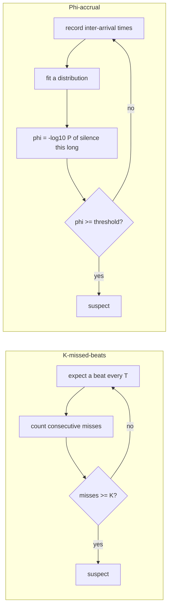
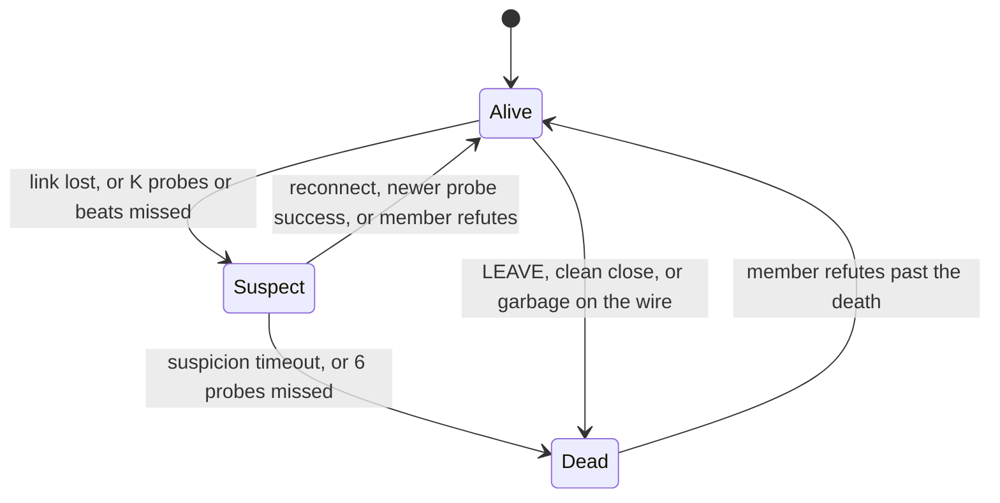

# Failure Detectors

Every "node X is dead" this swarm ever emits is a guess. Not a hedge, a theorem: on an
asynchronous network there is no observation that distinguishes a crashed peer from one that is
merely slow, because the only evidence of either is silence, and silence has no timestamp on it
telling you which one it is.

A failure detector is the component that turns that silence into a decision anyway. This page
covers what it can promise, what it cannot, how the swarm's detector is parameterised, and the
one input it must refuse to count.

---

## Core Mental Model

### The impossibility in one paragraph

Fischer, Lynch and Paterson (1985) proved that in an asynchronous system -- no bound on message
delay, no bound on processing time -- no deterministic protocol can guarantee agreement if even
one process may crash. The reason is exactly the slow-versus-dead ambiguity: any protocol that
waits for a message from a possibly-crashed process might wait forever, and any protocol that
stops waiting might have given up on a live one. Every real system escapes FLP by adding a
timing assumption. A failure detector is where that assumption is written down.

### Unreliable failure detectors

Chandra and Toueg (1996) made the escape precise. A failure detector is a local oracle that
outputs a set of suspected processes. It is allowed to be wrong, and its quality is described on
two axes:

| Property | Meaning | Violated when |
|---|---|---|
| **Completeness** | every crashed process is eventually suspected | a dead node stays "alive" forever |
| **Accuracy** | no live process is suspected | a slow node is evicted |

Perfect completeness is easy: suspect everyone. Perfect accuracy is easy: suspect no one. A
useful detector holds *strong completeness* (every crash is eventually caught by every correct
node) and only *eventual weak accuracy* (eventually, some correct node stops being wrongly
suspected). That weak-sounding pair is enough to solve consensus, and it is the class every
timeout-based detector actually belongs to.

The practical translation: **completeness is a matter of waiting long enough; accuracy is a
matter of not giving up too soon.** Every knob below moves along that line.

### Two ways to decide



**K-missed-beats** is a boolean with a fixed budget. Detection time is $K \cdot T$ plus one
probe timeout, regardless of how regular the peer has been. Simple, and its constants are visible
in a config file.

**Phi-accrual** (Hayashibara et al., 2004) outputs a suspicion *level*. If a peer has always
answered within 1 ms, a 50 ms silence is $\phi$ of many sigmas and suspicion rises fast; if it
routinely takes 40 ms, the same silence is unremarkable. The threshold is on $\phi$, not on a
count, so the detector adapts per peer. Cassandra and Akka use it.

This swarm chose K-missed-beats, in three places, and all of them ship (Phase 4):

| Detector | $T$ | $K$ | Watches |
|---|---|---|---|
| probes | 1 s | 3 to suspect, 6 to kill | every peer, from every node |
| leader heartbeats | 500 ms | 3 ticks | a worker's own leader |
| socket idle deadline | 15 s | 1 | every connection |

Every verdict goes through a **suspect** step first, unless the evidence is a fact (a `LEAVE`,
a clean close, garbage on the wire):

| Transport or detector event | Verdict | Where |
|---|---|---|
| clean close or `LEAVE` | dead at once (departed) | `pkg/cluster/node.go:877`, `pkg/cluster/node.go:1172` |
| protocol violation | dead at once | `pkg/cluster/node.go:883` |
| undecodable payload | dead at once | `pkg/cluster/node.go:1219` |
| peer died, timeout, other | suspect | `pkg/cluster/node.go:902` |
| 3 missed probes | suspect | `pkg/cluster/failure.go:109` |
| 3 ticks without a beat | suspect | `pkg/cluster/heartbeat.go:74` |
| suspicion older than 3 s, or 6 missed probes | dead | `pkg/cluster/failure.go:190`, `pkg/cluster/failure.go:107` |

The worker counts **ticks without a valid beat**, not gaps in `HeartbeatPayload.Seq`
(`pkg/protocol/message.go:302`). `Seq` is sent and echoed, but nothing counts gaps in it. The
full mechanism is on
[Failure Detection and Failover](/architecture/failure-detection-and-failover).

---

## Under the Hood

### The three knobs and the one inequality

| Knob | Lives in | Moves |
|---|---|---|
| heartbeat / probe interval $T$ | `pkg/cluster/node.go:38`, `pkg/cluster/node.go:24` | how often evidence arrives |
| probe timeout $t_p$ | `pkg/health/latency.go:39`, default 2 s | how long one probe waits |
| read idle timeout $t_{idle}$ | `pkg/network/conn.go:107`, default 15 s (`pkg/network/conn.go:123`) | how long a socket may be silent before it is torn down |
| miss budget $K$ | `pkg/cluster/node.go:42`, `pkg/cluster/node.go:46` | how many consecutive absences are tolerated |
| suspicion timeout | `pkg/cluster/node.go:52`, default 3 s | how long an accused peer has to answer |

Worst-case detection latency for a clean crash is roughly

$$D_{max} \approx K \cdot T + t_p$$

and the false-positive rate is the probability that $K$ consecutive probes all exceed $t_p$
while the peer is alive. If probe latency tail events are independent with probability $p$ of
exceeding $t_p$, that is $p^K$ -- which is why $K$ is worth more than $T$ for accuracy, and
why $K = 1$ is a detector that evicts on a single GC pause.

The idle timeout must satisfy

$$t_{idle} > K \cdot T + t_p$$

or the socket layer will close the connection *before* the detector has reached its verdict,
and the eviction will arrive as a connection error rather than a missed-beat decision. Two
detectors with different budgets on the same link produce whichever answer is faster, and the
faster one is always the less accurate one.

### What the strategy counts, and what it refuses to

`pkg/health` produces a score, not a verdict, but it feeds the detector, so its classification
of probe errors is where completeness and accuracy are first decided.

```go
// pkg/health/strategy.go:102
ErrUnreachable = errors.New("health: target unreachable")
// pkg/health/strategy.go:112
ErrProbeTimeout = errors.New("health: probe deadline exceeded")
// pkg/health/strategy.go:118
ErrProbeCanceled = errors.New("health: probe canceled by caller")
```

Only `ErrUnreachable` (which wraps `ErrProbeTimeout`) is a statement about the peer. It records
a penalty sample of `ProbeTimeout * FailurePenalty` (`recordFailure`,
`pkg/health/latency.go:334`, penalty
default at `pkg/health/latency.go:44`) so that a peer which times out is ranked worse than one
which answers slowly. That is the coordinated-omission fix described in
[Latency as a Statistic](/concepts/latency-as-a-statistic), and it is a *completeness* measure:
without it a dying peer produces no samples and looks healthier the sicker it gets.

### The probe that must never count

Rule 4 of the `HealthStrategy` contract at `pkg/health/strategy.go:65`:

> A cancelled probe is not an unhealthy peer.

The reason is in the shape of a shutdown. Every in-flight probe in the process is cancelled in
the same instant. If those are counted, the detector sees $N$ simultaneous misses, which is the
exact signature of a network partition, and it starts an election of a cluster that was healthy
until the moment it was asked to stop.

```go
// pkg/health/strategy.go:222 (comment elided)
func IsCancellation(err error) bool {
	if err == nil {
		return false
	}
	return errors.Is(err, ErrProbeCanceled) ||
		errors.Is(err, context.Canceled) ||
		errors.Is(err, context.DeadlineExceeded)
}
```

The hard part is that "our probe timed out" and "the caller's deadline expired" both surface as
the same `context.DeadlineExceeded` value (`pkg/health/strategy.go:200`). The strategy resolves
it at `pkg/health/strategy.go:206` not by inspecting the error but by inspecting the *parent*
context: if the parent is done, the caller stopped us; if it is still live, only our own budget
can have expired. `classify` at `pkg/health/latency.go:253` implements that, and deliberately
does not call `recordFailure` on the cancelled path. The race where both expire in the same
microsecond is resolved toward "cancelled" (`pkg/health/strategy.go:218`), because losing one
sample costs a probe interval and a false miss costs an election.

The caller-side contract is the switch in the comment above `IsCancellation`:

```go
score, err := strategy.EvaluateScore(ctx, peer)
switch {
case health.IsCancellation(err):
	return // record nothing, count nothing, elect nothing
case err != nil:
	missedBeats[peer]++
default:
	record(peer, score)
}
```

Order matters. `IsCancellation` first, `err != nil` second. Reversed, every shutdown is a
partition.

### Suspicion as a state, not a bit

`StateSuspect` (`pkg/cluster/member.go:47`) sits between alive and dead. It is assigned in one
place, `suspect` (`pkg/cluster/failure.go:93`), and timed only by the node that raised it.



A detector that goes straight from alive to dead has no window in which the accused can
object. Suspect is that window: the swarm gossips "I think X is gone", and X, if alive,
answers with a higher incarnation. That buys accuracy without paying for it in $K$: a false
suspicion is corrected by the victim instead of by waiting longer. This is the SWIM design
(Das, Gupta and Motivala, 2002).

The merge code keeps it a doubt:

- `SetState` bumps the incarnation on death only (`pkg/cluster/member.go:356`). A suspicion
  stays at the member's own incarnation, so the member can still refute it by bumping once.
- `Revive` clears a suspect record held at the member's own incarnation, for example on a
  reconnect (`pkg/cluster/member.go:399`).

Two rules keep one bad link from doing swarm-wide damage:

- A **relayed** suspicion is merged, so elections see it, but it is never timed into a death
  here (`pkg/cluster/failure.go:32`).
- A suspect **leader** keeps its seat until the suspicion is confirmed, and a suspect
  **worker** cannot be promoted (`electorate`, `pkg/cluster/election.go:198`).

The merge rules behind refutation are on
[Monotonic Merge and Incarnation](/concepts/monotonic-merge-and-incarnation).

---

## Why It Matters in This Swarm

- **Election consumes the detector's output as a view.** `Elect` (`pkg/cluster/election.go:126`)
  sizes the leader count from its electorate (`pkg/cluster/election.go:129`). Every confirmed
  false positive shrinks $N$, changes `LeaderCount`, and can trigger a re-election of a swarm
  that lost nobody. A mere suspicion of a leader does not, by design.
- **The detector's false positives are correlated.** A GC pause, a cgroup throttle, or a host
  under load delays *every* probe from that node at once. $p^K$ assumes independence; under
  correlated tails the true false-positive rate is closer to $p$. This is the argument for
  $K \geq 3$ rather than a tighter $T$.
- **Two detectors run on every link.** The transport's read deadline and the cluster's miss
  budget are both watching the same silence. They must be tuned as a pair, with the transport's
  deadline the looser of the two, or the transport pre-empts the decision the cluster was
  designed to make.
- **A `LEAVE` is an optimisation, not a signal the detector may depend on.**
  `pkg/protocol/message.go:93` says a SIGKILLed container never sends one. Completeness must
  come from silence alone.
- **A false positive is expensive to undo.** A death bumps the member's incarnation
  (`pkg/cluster/member.go:356`), so a peer wrongly declared dead cannot come back by simply
  reconnecting. It must see the death and refute it. That is why the suspect step exists, and
  why its 3 s window is sized to let a dropped link redial first.
- **Heartbeats see what probes cannot.** `PING` is answered on a reader goroutine, so a leader
  whose event loop is wedged still passes every probe. Only its heartbeats stop. A suspicion
  raised by silence is therefore not cleared by a probe (`pkg/cluster/failure.go:123`).

---

## Common Failure Modes & Edge Cases

### Shutdown triggers an election

Symptom: every clean restart of one node produces an `ELECTION_RESULT` burst from the others, and
the logs show $N-1$ simultaneous "missed beat" entries at the instant of shutdown. Cause: a
caller counted a cancelled probe. Check that `IsCancellation` is consulted before `err != nil`,
and that `ErrProbeTimeout` is not wrapping `context.DeadlineExceeded` (which would invert the
bug: dead peers classified as cancellations, and no eviction ever).

### The transport evicts first

Symptom: peers are dropped on an idle-timeout `PeerDown` before any probe misses are logged.
Cause: $t_{idle} < K \cdot T + t_p$. The socket's idle deadline fires before the detector's
budget is spent. Raise the idle timeout or lower $K \cdot T$; they must be ordered. The
defaults are 15 s against about 5 s.

### A crash that looks like a goodbye

Symptom: a `docker kill` shows up as `peer left`, not `peer suspected`, and failover is faster
than the suspicion timeout. Cause: the kernel closes a killed process's sockets, usually with a
FIN, so the peer reads EOF on a frame boundary: a clean close. The swarm treats that as a
departure. See
[TCP Teardown and Half-Open Sockets](/concepts/tcp-teardown-and-half-open-sockets).

### $K = 1$ in a test that leaks into production

Symptom: a single GC pause on a busy leader evicts it. Cause: a test set $K = 1$ for speed and
the value shipped. Every real detector budget must survive at least one full stop-the-world
pause and one delayed-ACK stall (up to 40 ms) without a miss.

### Timeout shorter than the tail

Symptom: a peer with p99 latency of 3 ms is repeatedly penalised. Cause: $t_p$ was set near the
median rather than well past the tail. A probe timeout is a *completeness* bound, and it should
be an order of magnitude above p99, not near it. The `FailurePenalty` multiplier then ensures a
genuine timeout still ranks worse than any honest slow answer.

### Slow versus stopped

Symptom: a leader under load, still beating but late, is failed over like a leader that
stopped. Cause: its beats are more than about two intervals apart. The worker counts ticks
without a beat, so any beat that lands resets it, however late, but a gap of two missed beats
is a failover (see
[Heartbeat Intervals, Jitter and Timers](/concepts/heartbeat-intervals-and-timers)). Counting
gaps in `Seq` would let a worker tell loss from delay. It is not implemented.

---

## See Also

- [Latency as a Statistic](/concepts/latency-as-a-statistic) -- the EWMA the score comes from,
  and coordinated omission.
- [Context and Cancellation](/concepts/context-cancellation) -- why the parent context is the
  only place the discrimination can be made.
- [Error Wrapping and Classification](/concepts/error-wrapping-and-classification) -- the
  `errors.Is` chain that `IsCancellation` depends on.
- [Gossip and Anti-Entropy](/concepts/gossip-and-anti-entropy) -- how a death reaches every
  peer.
- [Monotonic Merge and Incarnation](/concepts/monotonic-merge-and-incarnation) -- refutation
  and why death bumps the incarnation.
- [Split-Brain and Quorum](/concepts/split-brain-and-quorum) -- what a false positive does to $N$.
- [Failure Detection and Failover](/architecture/failure-detection-and-failover) -- this
  detector as built.
- [Heartbeat Intervals, Jitter and Timers](/concepts/heartbeat-intervals-and-timers) -- what $T$
  really means at runtime.
