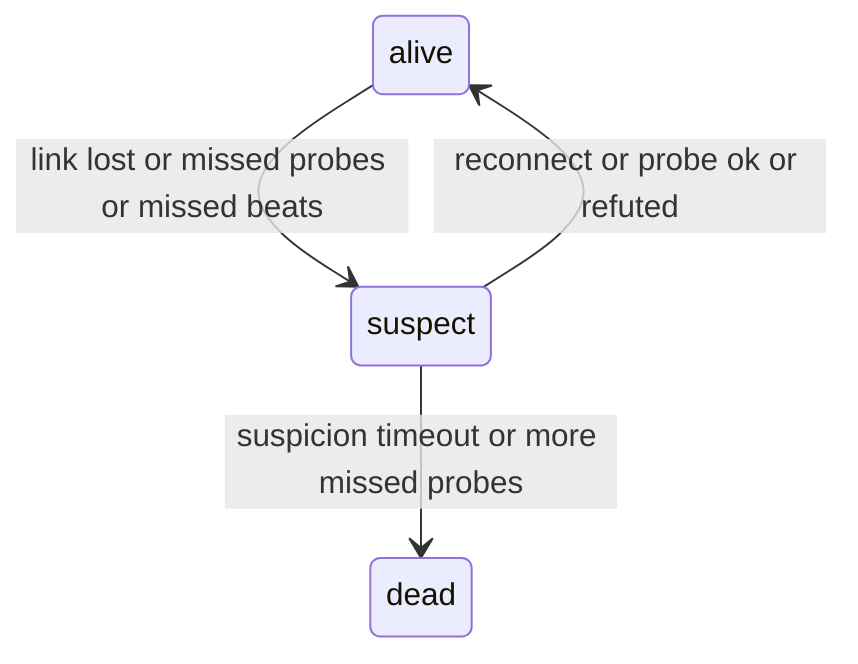

# Failure Detectors

Over a network you cannot tell a dead node from a slow one. Both just go quiet. A **failure
detector** makes a guess: "no reply within this time, so probably dead". Guessing faster means
more false alarms. Guessing more carefully means slower failover. It is like deciding a friend
is not coming: leave after 5 minutes and you sometimes leave too early, wait an hour and you
waste the evening.

A common rule is **K missed beats**: declare a peer dead after K checks in a row fail. If one
check fails by accident with probability $p$, K in a row fail with roughly $p^K$, so a small K
already cuts false alarms a lot. Detection then takes about $K \times T$ for check interval $T$.

swarm-net adds a middle step, **suspect**, so one bad moment is not an instant death:

## How swarm-net uses it

- **Probes every second.** A peer is suspect after 3 failed probes and dead after 6, or when a
  suspicion has stood for 3 s (defaults in `backend/pkg/cluster/node.go`).
- **Leaders beat every 500 ms.** A worker that misses 3 beats suspects its leader
  (`backend/pkg/cluster/heartbeat.go`).
- **The state machine** lives in `backend/pkg/cluster/failure.go` (`markSuspect`,
  `expireSuspicions`).
- **Only first-hand doubts are timed.** A suspicion heard through gossip is recorded but never
  turned into a death here, so one node with a bad link cannot kill a healthy peer everywhere.
- **Silence from heartbeats is not cleared by a probe.** PONGs are answered on the reader
  goroutine, so a leader with a stuck event loop still answers probes.
- **Cancelled probes never count.** Shutdown must not look like a failure. See
  [Error Wrapping & Classification](./error-wrapping-and-classification).

## Common pitfalls

- **K = 1.** One dropped packet or GC pause triggers a failover.
- **Timeout shorter than normal slow replies.** Healthy peers get evicted under load.
- **Transport timeout tighter than the detector.** The socket closes first and makes the
  decision the detector was meant to make.
- **Relying on LEAVE.** A killed process never sends one. Silence alone must be enough.

## Further reading

- [Gossip and Anti-Entropy](./gossip-and-anti-entropy)
- [Heartbeat Intervals, Jitter & Timers](./heartbeat-intervals-and-timers)
- [SWIM paper (Das et al., 2002)](https://www.cs.cornell.edu/projects/Quicksilver/public_pdfs/SWIM.pdf)
