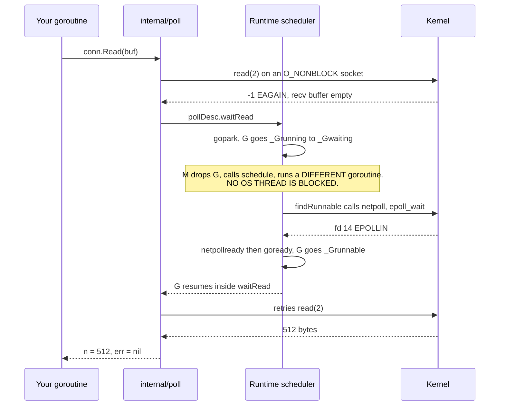
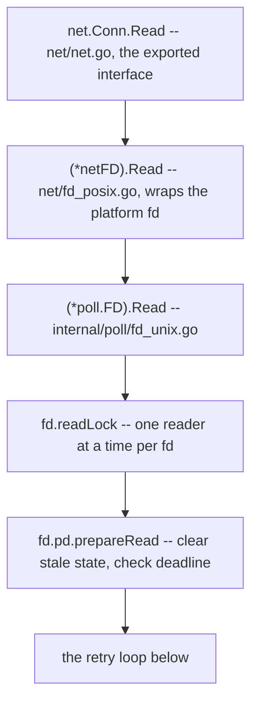

# The Netpoller: How Blocking Go Code Isn't

```go
n, err := conn.Read(buf)
```

One apparent semantic: *stop here until bytes arrive*. In C, `read(2)` on a blocking socket does
exactly that -- it puts the calling **thread** to sleep in the kernel. Ten thousand concurrent
connections in C means ten thousand threads, or abandoning this programming model for an event loop
with callbacks.

Go gives you the synchronous model *and* the event loop, by hiding the event loop inside the
runtime. `conn.Read` blocks the **goroutine**, never the thread. This page is about the machinery
that makes that true, because the abstraction leaks in exactly the places that matter to a
distributed system: deadlines, file-descriptor limits, and latency under CPU load.

Read alongside [The GMP Scheduler](./go-scheduler-gmp), which explains the `_Gwaiting` state this
page repeatedly puts goroutines into, and
[Non-blocking I/O and epoll](./nonblocking-io-and-epoll) for the readiness model in isolation.

---

## Core Mental Model

The netpoller is a runtime-internal component owning one `epoll` instance per process (`kqueue` on
BSD/macOS, IOCP on Windows). It translates *file-descriptor readiness* into *goroutine runnability*.

Three facts, and everything follows:

1. **Every socket the `net` package creates is non-blocking** (`O_NONBLOCK`) and registered with
   epoll at creation time -- regardless of the fact that your code reads it synchronously.
2. **A read that would block returns `EAGAIN` immediately.** The runtime catches that, parks the
   goroutine in `_Gwaiting`, and returns its M+P to the scheduler to run other work.
3. **The scheduler polls epoll as part of finding work.** When epoll reports the fd readable, the
   parked goroutine becomes `_Grunnable`, eventually runs, and retries the read -- which now
   succeeds. Your code never saw any of this.



The illusion is total from the caller's side, and total *only* from the caller's side. From the
outside -- `strace`, `ss`, `/proc/<pid>/status` -- a Go server handling 5,000 connections looks
nothing like a thread-per-connection server. It looks like a handful of threads, one of which is
sitting in `epoll_wait`.

---

## Under the Hood

### The call chain, named



```go
for {
    n, err := ignoringEINTRIO(syscall.Read, fd.Sysfd, p)
    if err != syscall.EAGAIN { return n, err } // done, or a real error
    if !fd.pd.pollable()     { return n, err }
    if err = fd.pd.waitRead(fd.isFile); err != nil {
        return 0, err // deadline fired, or fd closed
    }
    // else: loop and retry the syscall
}
```

`internal/poll.pollDesc` is a thin shim over the runtime's `runtime.pollDesc`, reached through
`//go:linkname` bindings -- `runtime_pollWait`, `runtime_pollOpen`, `runtime_pollSetDeadline`,
`runtime_pollClose`. The runtime's `pollDesc` (`runtime/netpoll.go`) is the real object:

- `rg`, `wg` -- the *reader* and *writer* goroutine slots, each an atomic word holding `pdNil`
  (nothing waiting), `pdReady` (readiness arrived before anyone waited), or a `*g` pointer (that
  goroutine is parked here).
- `rd`, `wd` -- read and write deadline timestamps.
- `rt`, `wt` -- the runtime timers enforcing those deadlines.
- `fd`, `closing`, `everr`.

The `pdReady` sentinel matters: readiness can arrive *before* the goroutine parks. If epoll reports
the fd readable while the goroutine is still between the `EAGAIN` and the `gopark`, the netpoller
stores `pdReady` in `rg`, and `waitRead` consumes it and returns immediately without parking.
Without that, there would be a lost-wakeup race on every single read.

### epoll, edge-triggered, one registration for life

On Linux the backend is `runtime/netpoll_epoll.go`. At the first fd registration the runtime creates
the epoll instance and an eventfd for waking a blocked poller:

```
epoll_create1(EPOLL_CLOEXEC)          = 4
eventfd2(0, EFD_CLOEXEC|EFD_NONBLOCK) = 5
epoll_ctl(4, EPOLL_CTL_ADD, 5, {events=EPOLLIN, data={...}}) = 0
```

Each socket is added **once**, at open:

```
epoll_ctl(4, EPOLL_CTL_ADD, 14,
          {events=EPOLLIN|EPOLLOUT|EPOLLRDHUP|EPOLLET, data={ptr=0xc000108000}}) = 0
```

Four things to notice:

- **`EPOLLET` -- edge-triggered.** Readiness is reported on *transitions*, not on *state*. The
  runtime must therefore drain until `EAGAIN`, which is exactly what the retry loop above does. The
  payoff: the fd never needs re-arming, so there is **one** `epoll_ctl` per connection for its
  entire lifetime rather than one per read. At thousands of connections that is the whole ballgame.
- **`EPOLLIN|EPOLLOUT` registered together.** No re-registration when you switch from reading to
  writing; one registration serves both directions, and the `rg`/`wg` slots disambiguate.
- **`data.ptr` is the `*pollDesc`.** No hash lookup from fd to state: the kernel hands the pointer
  straight back in the event, so `netpoll` goes from event to waiting goroutine in constant time.
  The pointer carries a generation counter so a reused fd cannot resurrect a stale `pollDesc`.
- **`EPOLLRDHUP`** lets the runtime see a peer's half-close as a readable event, so a goroutine
  parked in `Read` wakes with `io.EOF` rather than hanging until a deadline.

### Where `netpoll` is actually called from

This is the part most people never learn, and it is the part that governs latency:

| Call site | Mode | When |
|---|---|---|
| `findRunnable()` -- step 5 | `netpoll(0)` non-blocking | Every time a P looks for work and its queues are empty |
| `findRunnable()` -- final | `netpoll(-1)` blocking | A P has nothing to do at all; the M blocks in `epoll_wait` |
| `sysmon` | `netpoll(0)` non-blocking | If nobody has polled for more than 10ms |
| `startTheWorld`, GC transitions | `netpoll(0)` | Opportunistic |

The consequence: **network readiness is discovered by whichever thread happens to go looking for
work.** On an idle process, an M is already parked in a blocking `epoll_wait` and wake-up latency is
essentially the kernel's -- microseconds. On a *busy* process, where every P has a full run queue and
nobody reaches step 5, ready network I/O may not be noticed until sysmon's 10ms backstop, and even
then the woken goroutine joins the back of a queue.

So the netpoller does not protect you from CPU saturation. It converts an I/O-concurrency problem
into a scheduling problem -- a much better problem to have, but still a problem. This is the
mechanical reason heartbeat round-trip times in a loaded swarm degrade in steps of milliseconds
rather than smoothly.

### Why `O_NONBLOCK` even though your code is synchronous

`net.Dial` and `net.Listen` both end in `internal/poll.FD.Init`, which calls `syscall.SetNonblock`
and then `runtime_pollOpen`. Under `strace`, opening a connection looks like this:

```
socket(AF_INET, SOCK_STREAM|SOCK_CLOEXEC|SOCK_NONBLOCK, IPPROTO_TCP) = 14
connect(14, {sa_family=AF_INET, sin_port=htons(7946), ...}) = -1 EINPROGRESS
epoll_ctl(4, EPOLL_CTL_ADD, 14, {EPOLLIN|EPOLLOUT|EPOLLRDHUP|EPOLLET, {ptr=0xc00011c000}}) = 0
epoll_pwait(4, [{EPOLLOUT, {ptr=0xc00011c000}}], 128, -1, NULL, 0) = 1
getsockopt(14, SOL_SOCKET, SO_ERROR, [0], [4]) = 0         # connect completed
```

Even `Dial` is asynchronous underneath: `connect` returns `EINPROGRESS`, the goroutine parks on
*writability*, and `SO_ERROR` is checked on wake-up to distinguish success from `ECONNREFUSED`.
Your code just sees `net.Dial` return.

The corollary is sharp: **if you obtain an fd from outside the `net` package, this all stops
applying.** `os.File.Fd()` puts the descriptor into blocking mode and removes it from the poller,
precisely so it can be handed to cgo or `exec` safely. `net.FileConn` and `net.FileListener` *dup*
the fd and re-register the copy. Use `(*net.TCPConn).SyscallConn()` when you need to touch a socket
option without leaving the netpoller's world:

```go
// Planned pkg/network helper: set SO_RCVBUF without dropping out of the netpoller.
func setRecvBuf(c *net.TCPConn, bytes int) error {
	rc, err := c.SyscallConn()
	if err != nil {
		return err
	}
	var serr error
	if err := rc.Control(func(fd uintptr) {
		serr = syscall.SetsockoptInt(int(fd), syscall.SOL_SOCKET, syscall.SO_RCVBUF, bytes)
	}); err != nil {
		return err
	}
	return serr
}
```

`rc.Control` keeps the fd registered and guarantees it is not closed underneath you for the duration
of the callback. Compare `c.File()`, which silently switches the connection to blocking mode and
costs you a thread per subsequent read.

### Deadlines are runtime timers, and they are the only safe bound

`SetReadDeadline` does not set `SO_RCVTIMEO`. It calls `runtime_pollSetDeadline`, which arms a
runtime timer (the same per-P timer heap `time.After` uses). When the timer fires,
`netpolldeadlineimpl` sets `pd.rd = -1`, marks the descriptor's read side expired, and calls
`netpollunblock` -> `goready` on whatever goroutine is parked in `rg`. That goroutine resumes inside
`waitRead`, sees the expired state, and returns `os.ErrDeadlineExceeded`, which `FD.Read` surfaces
as an error satisfying `net.Error.Timeout()`.

Properties that follow directly from that implementation:

- **The deadline is absolute, not a per-call timeout.** Re-arm it before every operation, or the
  second read inherits the first read's already-passed deadline and fails instantly.
- **It is idempotent and cheap.** Re-arming an existing timer is a heap adjustment, not an
  allocation. Calling `SetReadDeadline` every loop iteration is normal and correct practice.
- **It affects only goroutines parked on this fd's read side.** No cross-talk with writes, no
  process-wide effect.
- **`SetDeadline(time.Time{})` clears it** -- which is also the *default*. A `net.Conn` with no
  deadline will park forever. Not "for a long time": forever. TCP will not save you; with keepalives
  off, a peer whose container was `SIGKILL`ed leaves you with a connection that is perfectly healthy
  as far as both kernels are concerned, and permanently silent.

```go
// The read loop shape pkg/network will use. Every read is bounded.
func (c *peerConn) readLoop(ctx context.Context, idle time.Duration) error {
	hdr := make([]byte, 4)
	for {
		if err := c.conn.SetReadDeadline(time.Now().Add(idle)); err != nil {
			return err
		}
		if _, err := io.ReadFull(c.conn, hdr); err != nil {
			var ne net.Error
			if errors.As(err, &ne) && ne.Timeout() {
				// Idle beyond the heartbeat budget: treat as peer loss,
				// not as a transient condition to retry.
				return fmt.Errorf("peer %s idle for %s: %w", c.id, idle, err)
			}
			return err // io.EOF, ECONNRESET, or a framing-layer error
		}
		n := binary.BigEndian.Uint32(hdr)
		if n > maxFrameBytes {
			return fmt.Errorf("frame of %d bytes exceeds limit %d", n, maxFrameBytes)
		}
		body := make([]byte, n)
		if _, err := io.ReadFull(c.conn, body); err != nil {
			return err
		}
		if err := c.dispatch(ctx, body); err != nil {
			return err
		}
	}
}
```

A timeout mid-frame is unrecoverable: `io.ReadFull` may have consumed part of the header before the
deadline fired, and the stream is now desynchronised. The only correct response to a deadline in the
middle of a frame is to close the connection. Framing is discussed in
[TCP Sockets and the Kernel](./tcp-sockets-and-the-kernel).

### Deadlines versus `context`

`context.Context` cancellation does **not** interrupt a blocked `Read`. There is no mechanism by
which it could: the goroutine is parked in the netpoller, and `ctx.Done()` is a channel nobody is
selecting on. The two standard bridges:

```go
// Bridge 1: a watcher goroutine that closes the conn. Read returns
// net.ErrClosed promptly. Simple, and the connection is unusable after.
stop := context.AfterFunc(ctx, func() { _ = conn.Close() })
defer stop()

// Bridge 2: push the context deadline into the socket deadline.
// The connection stays usable if the deadline is later cleared.
if dl, ok := ctx.Deadline(); ok {
	_ = conn.SetReadDeadline(dl)
}
```

Bridge 2 is preferable for per-request bounds; bridge 1 is what a shutdown path wants. See
[Context Cancellation](./context-cancellation).

### select vs poll vs epoll

Why epoll specifically is what makes goroutine-per-connection viable:

| | `select(2)` | `poll(2)` | `epoll(7)` |
|---|---|---|---|
| Interest set lives | in userspace bitmaps | in a userspace array | **in the kernel**, a red-black tree keyed by fd |
| Passed per call | the FULL set | the FULL array | nothing; registration is a separate one-off `epoll_ctl` |
| Kernel scan per call | ALL watched fds | ALL watched fds | none; socket callbacks push onto a READY LIST |
| Set survives the call | no, bitmaps modified in place and rebuilt each iteration | yes, `events` and `revents` are separate | yes, for the fd's whole lifetime |
| Hard limit | `FD_SETSIZE` = 1024 | none | none |
| Cost | `O(n)` watched | `O(n)` watched, plus copying `n*8` bytes user to kernel each call | **`O(ready)`**, independent of watched count |

With 10,000 connections, 10 of them active, one poll cycle:

| Mechanism | What happens |
|---|---|
| `select` | cannot be used at all -- `FD_SETSIZE` |
| `poll` | copy 80 KB in, kernel scans 10,000 entries, returns 10 |
| `epoll` | copy 0 bytes in, kernel returns 10 events from its ready list |

That `O(ready)` rather than `O(watched)` is precisely the property letting the Go runtime keep one
epoll instance for the whole process and poll it on *every scheduling decision* without the cost
scaling with connection count. Without it, the netpoller's "check for ready I/O whenever a P looks
for work" strategy would be quadratic and goroutine-per-connection would be untenable.

---

## Why It Matters in This Swarm

No Go code exists yet; the following are commitments the implementation will have to honour.

**`pkg/network/` -- every read and write will carry a deadline, without exception.** The single most
consequential rule in the package. In a Docker bridge network the most common failure is not a
graceful `FIN` -- it is `docker kill`, a `SIGKILL`ed process, or a chaos control dropping a
container. In those cases the peer's kernel may never send `RST`, and the local socket stays
`ESTABLISHED` indefinitely. A `Read` with no deadline parks a goroutine forever, and -- critically --
that goroutine looks perfectly healthy to the scheduler while doing so. The read deadline is the
only mechanism in the stack converting "silence" into an error. The idle deadline will be derived
from the heartbeat parameters: strictly greater than `K * heartbeatInterval`, so that the
application-level failure detector in `pkg/cluster/` makes the liveness decision and the socket
deadline is only a backstop against a wedged connection.

**`pkg/cluster/` -- heartbeat timeouts are read deadlines, not `select` on `time.After`.** Wrapping
a blocking read in a `select` with a timer requires a second goroutine and leaves the first parked
after the timeout expires -- a leak per timeout. `SetReadDeadline` unparks the actual reader. Cheaper
and correct.

**`pkg/network/` -- the connection pool sets the file-descriptor budget.** Each node holds one
listening socket, one accepted conn per inbound peer, one dialled conn per outbound peer, plus the
Control Center link: `O(N)` fds per node, which is small. Reconnection logic is where fds leak -- a
dial that fails after the socket is created, a conn replaced in the pool map without closing the old
one, a `Close` skipped on an error path. Every `net.Conn` the pool creates must have exactly one
`Close`, and the pool must be the only owner.

**`cmd/control-center/` -- the WebSocket dashboard multiplies fd usage by viewers.** Each browser tab
is a long-lived connection with its own reader and writer goroutines. Parked in the netpoller they
cost nothing, but they consume descriptors and must be reaped when the client disappears -- which,
again, only a read deadline or a ping/pong timeout reliably detects.

**`pkg/health/` -- `LatencyHealthStrategy.EvaluateScore` must bound its own probe.** A probe to a
dead leader that never returns would block the health evaluation and, through it, the election. The
probe will set a deadline shorter than the election's own budget and treat `Timeout()` as a maximal
(worst) score rather than an error to propagate, so an unreachable node is ranked last instead of
aborting the evaluation of all the others.

**`deploy/` -- the container fd limit must be set deliberately.** Docker's default `nofile` soft
limit varies by daemon configuration; the failure mode is documented below.

**`pkg/telemetry/` -- poll wait time is a first-class signal.** `runtime/metrics` does not expose a
netpoller histogram directly, but pairing `/sched/latencies:seconds` (see
[The GMP Scheduler](./go-scheduler-gmp)) with measured round-trip times separates "the network was
slow" from "we were too busy to notice the network".

---

## Common Failure Modes & Edge Cases

**`accept: too many open files`**
*Symptom:* the accept loop returns `accept tcp [::]:7946: accept4: too many open files`; existing
connections keep working; new peers cannot join. *Cause:* `RLIMIT_NOFILE` reached -- a leak, or a
legitimately larger fan-in than the limit allows. *Critical detail:* a naive accept loop treats the
error as fatal and exits; `net/http` instead sleeps and retries with backoff, because the condition
is often transient. A swarm node's accept loop should do the same rather than take the node down.
*Diagnosis:*

```
$ ls /proc/$(pgrep swarm-node)/fd | wc -l
1021
$ cat /proc/$(pgrep swarm-node)/limits | grep 'open files'
Max open files            1024                 1024                 files
$ ss -tanp | grep swarm-node | awk '{print $1}' | sort | uniq -c
    847 ESTAB
    162 CLOSE-WAIT        # the smoking gun: peer closed, we never called Close()
```

A large `CLOSE-WAIT` count means the remote sent `FIN`, the local read returned `io.EOF`, and the
code never closed the fd. That is a connection-lifecycle bug, not a capacity problem.

**A read that hangs forever after a peer is `SIGKILL`ed.**
*Symptom:* one node keeps a leader in its membership indefinitely; the dashboard shows a cluster
that should have failed over but did not. *Cause:* no read deadline, and the connection was severed
in a way producing no `FIN` and no `RST` -- container killed, network partitioned, or `iptables
DROP`. Without deadlines, TCP retransmits and gives up only after `tcp_retries2` (roughly 15 minutes
of exponential backoff by default). *Fix:* deadlines, and optionally `SetKeepAlivePeriod` as a
second line of defence.

**Deadline fired mid-frame, stream desynchronised.**
*Symptom:* subsequent frames decode as garbage; length prefixes of absurd size; "frame exceeds
limit" errors. *Cause:* treating `os.ErrDeadlineExceeded` from a partial `io.ReadFull` as retryable.
*Fix:* a deadline error during a partially-read frame terminates the connection. There is no
recovery, because the stream position is unknown.

**Stale deadline: "i/o timeout" on the very first read after a pause.**
*Symptom:* a read fails instantly with `i/o timeout` despite data being available. *Cause:* the
deadline is absolute and was set before a long pause. *Fix:* re-arm before every operation.

**`os.File.Fd()` on a socket, silently costing a thread per read.**
*Symptom:* `schedtrace` shows `threads=` climbing; latency degrades; no obvious code change caused
it. *Cause:* something called `(*net.TCPConn).File()` to set a socket option. That dups the fd, sets
it **blocking**, and removes it from the poller, so every subsequent read on that handle occupies an
entire OS thread. *Fix:* `SyscallConn().Control(...)` instead.

**Assuming `Read` fills the buffer.**
`conn.Read` returns as soon as *any* bytes are available. A 1 KiB logical message may arrive as reads
of 536, 300 and 188 bytes, and two messages may arrive in a single read. This is not a netpoller
property; it is TCP being a byte stream. Use `io.ReadFull` against a known length. See
[TCP Sockets and the Kernel](./tcp-sockets-and-the-kernel).

**Concurrent readers on one `net.Conn`.**
`internal/poll.FD` holds a read lock and a write lock, so concurrent `Read` calls will not corrupt
runtime state -- but they will interleave *frames*, which corrupts your protocol. The rule for
`pkg/network/`: exactly one reader goroutine and one writer goroutine per connection, with all other
producers going through a channel to the writer.

**Blocked writes silently backing up.**
*Symptom:* a node's memory grows, and its outbound send channel is always full. *Cause:* a slow or
wedged peer whose receive window has closed; the local send buffer fills, `write(2)` returns
`EAGAIN`, and the writer goroutine parks on writability indefinitely. *Fix:* write deadlines on the
writer side too, plus a bounded send channel with an explicit policy -- drop the peer, or drop
non-critical telemetry frames -- when it is full. Unbounded queueing in front of a stalled socket
turns a peer failure into a local out-of-memory.

**Expecting the netpoller to be a latency guarantee under CPU load.**
*Symptom:* heartbeat RTT p99 rises sharply when a node is doing CPU work, though the network is idle.
*Cause:* `netpoll` is called from `findRunnable` and sysmon; when every P is busy, readiness is
noticed late and the woken goroutine queues behind others. *Fix:* this is a scheduling problem, not
an I/O one -- see [The GMP Scheduler](./go-scheduler-gmp). Do not tighten the heartbeat interval in
response; that makes it worse.

---

## Further Reading Within This Curriculum

- [The GMP Scheduler](./go-scheduler-gmp) -- what happens to the M and P while a G is parked.
- [Non-blocking I/O and epoll](./nonblocking-io-and-epoll) -- the readiness model on its own terms.
- [TCP Sockets and the Kernel](./tcp-sockets-and-the-kernel) -- buffers, framing and connection teardown.
- [CSP, Channels and the Memory Model](./csp-channels-and-memory-model) -- handing frames to the state machine.
- [Context Cancellation](./context-cancellation) -- bridging cancellation into a parked read.
