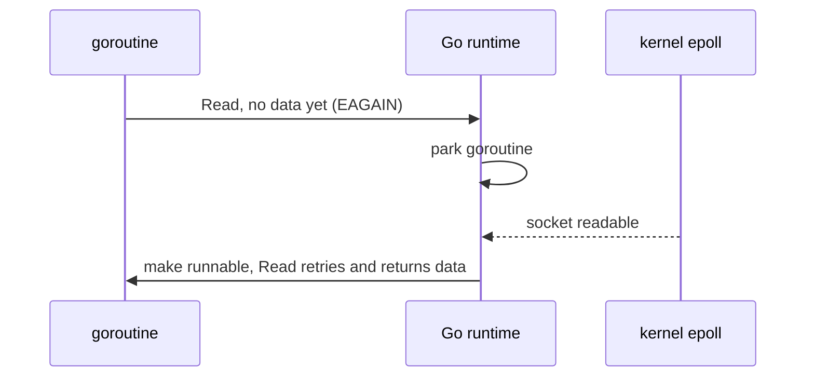

# The Netpoller: How Blocking Go Code Isn't

In Go you write `conn.Read(buf)` and it looks like it blocks. Under the hood it does not block
an OS thread. Every socket is set to non-blocking mode. When a read has no data yet, the runtime
parks the goroutine and registers the socket with **epoll** (on Linux). When data arrives,
epoll reports it, and the runtime puts the goroutine back in the run queue. It is like a
restaurant buzzer: you do not stand at the counter, you sit down until it buzzes.

This is why thousands of goroutines each "blocked" on a socket cost only memory, not threads.

Deadlines plug into the same system. `SetReadDeadline` sets a runtime timer. When it fires, the
runtime wakes the parked goroutine with a timeout error. Closing the connection wakes it too.

## How swarm-net uses it

- **One reader and one writer goroutine per connection** (`readLoop` and `writeLoop` in
  `backend/pkg/network/conn.go`). Cheap, thanks to the netpoller.
- **Every read and write has a deadline.** A killed peer can leave a socket that never errors.
  The deadline turns silence into an error. See
  [Deadlines & I/O Timeouts](./deadlines-and-io-timeouts).
- **Close unblocks everything.** `Pool.Close` in `backend/pkg/network/pool.go` closes every
  socket, which wakes any parked reader or writer.
- **Every socket has one owner**, so file descriptors do not leak on reconnect.
- **Dashboard WebSockets** in `backend/pkg/controlcenter/http.go` use the same machinery, one
  pair of goroutines per browser tab.

## Common pitfalls

- **Reads without a deadline.** A goroutine parks forever and looks perfectly healthy.
- **Wrapping a read in `select` with a timer.** The reader stays parked after the timer wins.
- **Assuming a `context` can interrupt `Read`.** It cannot. Use a deadline or close the conn.
- **Running out of file descriptors.** Each connection is one fd. Leaks show up as
  "too many open files".

## Further reading

- [epoll, select & Non-Blocking I/O](./nonblocking-io-and-epoll)
- [The GMP Scheduler](./go-scheduler-gmp)
