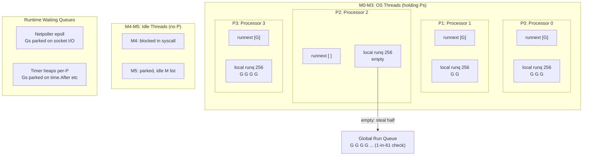
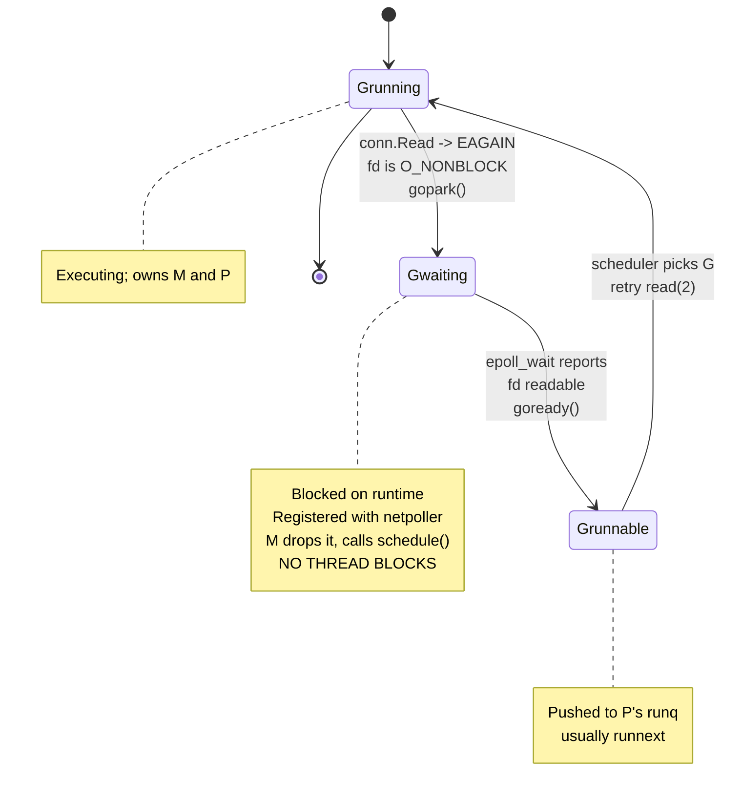

# The GMP Scheduler

Every design decision in `swarm-net` -- one goroutine per accepted TCP connection, one heartbeat
ticker per peer, one state-machine goroutine per node -- is a bet on the Go scheduler. The bet is
that goroutines are cheap enough to spend freely and that the runtime will multiplex thousands of
them onto a handful of OS threads without the engineer having to think about it. That bet is sound,
but only if you know precisely what is being bought and what is being paid for.

This guide explains the scheduler as it actually exists in the runtime: three concrete structs, a
set of run queues, a work-stealing loop, and a supervisory thread that preempts anything that
overstays its welcome.

Companion reading: [The Netpoller](./go-netpoller), which explains what happens to a goroutine the
moment it touches a socket; [CSP, Channels and the Memory Model](./csp-channels-and-memory-model)
for what happens when goroutines communicate; and [Context Cancellation](./context-cancellation)
for how a goroutine tree is torn down.

---

## Core Mental Model

Three entities, three roles:

- **G -- a goroutine.** A `runtime.g` struct: a stack, a program counter, a status field, and
  scheduling bookkeeping. It is *work to be done*. There may be millions.
- **M -- a machine.** A `runtime.m` struct, backed one-to-one by an OS thread (`clone(2)` on Linux).
  It is *the thing that can execute instructions*. There may be dozens to hundreds; the runtime
  caps them at `runtime/debug.SetMaxThreads`, default 10,000.
- **P -- a processor.** A `runtime.p` struct: a scheduling context holding a local run queue, a
  memory-allocation cache (`mcache`), and deferred-object pools. It is *permission to run Go code*.
  There are exactly `GOMAXPROCS` of them, fixed at startup unless changed.

The invariant that makes the whole design work: **an M must hold a P to execute Go code.** No P, no
Go code. That single rule is what bounds parallelism, localises the allocator cache, and gives
work-stealing a well-defined unit to steal between.



Goroutines flow between these places. A G in a run queue is runnable; a G in the netpoller or a
timer heap is waiting and costs nothing but memory until it is made runnable again.

### Why P exists at all

Go 1.0 had only Gs and Ms, with a single global run queue behind one mutex. It worked and it did not
scale: every scheduling decision serialised on that lock, and every goroutine could land on any
thread, so the allocator could not keep per-thread free lists without a hand-off protocol.

P solves three problems at once:

1. **It bounds parallelism.** `GOMAXPROCS` Ps means at most `GOMAXPROCS` goroutines executing Go
   code simultaneously, regardless of how many threads exist. Threads blocked in syscalls do not
   consume parallelism because they have released their P.
2. **It gives each runner a private run queue.** Most scheduling operations -- push, pop, `runnext` --
   touch only the local P and need no global lock.
3. **It is the unit of ownership for caches.** The `mcache` (size-class free lists for the
   allocator), the deferred-record pool, and the local timer heap all hang off the P, so they are
   accessed without synchronisation by whichever M currently holds it.

Since Go 1.25 the runtime also adjusts the default `GOMAXPROCS` to respect a cgroup CPU limit, which
matters directly here: `swarm-net` nodes run in Docker containers. A container with
`cpus: "0.5"` on a 16-core host gets a `GOMAXPROCS` derived from the quota rather than from
`nproc`, so you do not get 16 Ps fighting over half a core's worth of quota.

---

## Under the Hood

### The scheduling loop

The core is `runtime.schedule()`, which never returns -- it finds a G and jumps into it. The search
is `findRunnable()`, and its order matters:

```
findRunnable():
  1. if this P's schedtick % 61 == 0 -> take one G from the GLOBAL queue
       (starvation guard: without it, a P with a self-replenishing local
        queue would never look at the global queue)
  2. take P.runnext if set                    <- the hot path
  3. pop from the head of P's local runq
  4. pop a batch from the global runq
  5. netpoll(0)  -- non-blocking: any socket become ready?
  6. work-steal:  4 randomised passes over other Ps,
                  stealing HALF of a victim's local runq
                  (last pass may also steal the victim's runnext)
  7. check GC mark work
  8. still nothing -> drop the P, add M to the idle list,
                     block in netpoll(-1) or futex sleep
```

`runnext` is a single-slot lookahead that is not a queue. When goroutine A readies goroutine B --
typically by sending on an unbuffered channel or unlocking a mutex B is waiting on -- B goes into
`runnext`, not the tail of the queue. This is a latency optimisation for the extremely common
ping-pong pattern: the just-woken goroutine usually has hot cache lines and a short critical
section, so running it immediately is both faster and fairer than making it wait behind 200 queued
goroutines. A G in `runnext` also gets a small inheritance of the current time slice rather than a
fresh one, so the pattern cannot be used to monopolise a P indefinitely.

The local run queue is a fixed 256-entry ring. When it overflows, the pushing P moves *half* of it
plus the new G to the global queue in one batch -- so a producer goroutine spawning work in a tight
loop naturally spills into shared territory where idle Ps can find it.

Work-stealing steals half the victim's queue, not one G. Stealing one G would mean a thief returns
to the stealing path almost immediately; stealing half amortises the cost and tends to balance the
system in O(log n) steal operations.

### Goroutine states

The states you will actually reason about (`runtime/runtime2.go`):

| State | Meaning |
|---|---|
| `_Gidle` | Allocated, not yet initialised |
| `_Grunnable` | On a run queue, waiting for a P+M |
| `_Grunning` | Executing; owns an M and a P |
| `_Gsyscall` | Executing a syscall; owns an M but **not** a P |
| `_Gwaiting` | Blocked on the runtime (channel, mutex, netpoller, timer). Not on any queue |
| `_Gdead` | Finished or freshly allocated; on a free list for reuse |

The transitions for a goroutine that reads from a TCP socket -- the single most common path in this
project -- are worth memorising:



Note what is *not* here: `_Gsyscall`. A network read on a socket owned by the `net` package does not
go through the blocking-syscall path at all. That is the whole point of the netpoller, and it is
why ten thousand idle connections cost ten thousand parked Gs but close to zero threads.

### Blocking syscalls and handoff

Syscalls that the netpoller cannot cover -- regular-file reads, `getaddrinfo` via cgo, `fork/exec` --
do block the thread. The runtime wraps them:

```
entersyscall():   G: _Grunning -> _Gsyscall
                  P: _Prunning -> _Psyscall, and is *detached* from the M
                  (the P is now claimable by anyone)
      ... the thread sits in the kernel ...
exitsyscall():    fast path  -> reacquire the same P, back to _Grunning
                  slow path  -> that P was taken; put G on the global queue
                               and park this M
```

Nobody hands the P off at `entersyscall` time, because most syscalls return in microseconds and a
handoff costs a thread wake-up. Instead **sysmon** does it lazily. If sysmon sees a P in `_Psyscall`
for more than ~20us, it calls `handoffp()`: the P is given to an idle M, or a new M is spawned to
take it. This is why a program doing heavy blocking file I/O can have a hundred OS threads while
`GOMAXPROCS` is 8 -- the threads are all parked in the kernel, and only 8 of them can be running Go
code at any instant.

### sysmon

`sysmon` is a dedicated M that runs **without a P**, in a loop, sleeping between 20us and 10ms
depending on how busy the process is. It is the runtime's watchdog and it has four jobs:

1. **`retake()`** -- hand off Ps stuck in syscalls (above), and preempt any G that has been
   `_Grunning` on the same P for more than **10ms**.
2. **Netpoll backstop** -- if nobody has called `netpoll` for more than 10ms, sysmon calls it and
   injects any ready goroutines into the global queue. Without this, ready network I/O could sit
   unnoticed while every P is busy in a compute loop.
3. **Forced GC** -- trigger a collection if none has run for 2 minutes.
4. **Scavenging** -- return unused memory pages to the OS.

sysmon is why a single goroutine spinning on arithmetic cannot stall the whole program -- but note
the granularity: preemption is checked at ~10ms, not at ~10us. A latency-sensitive heartbeat
deadline of 50ms has a meaningful fraction of its budget exposed to scheduler jitter if any Ps are
saturated.

### Preemption: cooperative, then asynchronous

Before Go 1.14, preemption was purely cooperative. The compiler inserted checks only at function
prologues (comparing the stack pointer against `g.stackguard0`, which the preemptor poisoned with
`stackPreempt`). A loop with no function calls and no allocation had no check, so this used to hang
forever on `GOMAXPROCS=1`:

```go
func main() {
	go func() {
		for { // no calls, no allocations: no preemption point pre-1.14
		}
	}()
	runtime.Gosched() // never gets control back on Go < 1.14 with GOMAXPROCS=1
	println("unreachable on old runtimes")
}
```

Since Go 1.14 the runtime uses **asynchronous preemption**: `preemptM` sends `SIGURG` to the target
thread; the signal handler checks whether the interrupted PC is at an *asynchronously preemptible*
safe point (the compiler emits register maps so the GC can still scan the frame), and if so rewrites
the return address to land in `asyncPreempt`, which spills registers and calls into the scheduler.
`SIGURG` was chosen because it is otherwise unused and debuggers tolerate it.

Two consequences you will actually meet:

- Under `strace`, a busy Go process shows a steady drizzle of `tgkill(..., SIGURG)` and
  `rt_sigreturn`. That is normal, not a bug.
- Tight loops are *now* preemptible, but preemption is still not free and still only checked on
  sysmon's cadence or at GC safe-point requests.

### Stacks: why a goroutine per connection is affordable

A goroutine starts with a **2 KiB** stack (`_StackMin`), allocated from a per-P stack cache, not
from the OS. Compare with a `pthread`, whose default stack is 8 MiB of reserved address space with
guard pages, and which costs a `clone(2)` and kernel task_struct.

Growth is by copying, not by guard-page faults:

1. Every non-leaf function prologue compares `SP` against `g.stackguard0`.
2. If the frame does not fit, it calls `morestack`.
3. `newstack` allocates a stack of **double** the size, copies the old stack into it, and -- the part
   that makes Go's approach unusual -- **adjusts every pointer that points into the old stack**,
   using the compiler-emitted stack maps. This is why Go can move stacks while C cannot.
4. The old stack is freed. Shrinking happens at GC time, when a stack using less than a quarter of
   its space is halved.

The upper bound is 1 GiB on 64-bit (`runtime/debug.SetMaxStack`); exceeding it is the familiar
`goroutine stack exceeds 1000000000-byte limit / fatal error: stack overflow`, almost always
unbounded recursion.

So the memory arithmetic for this project: 10,000 connections x one reader goroutine each, each with
a modest stack that has grown once to 4 KiB, is roughly 40 MiB of stack plus ~200 bytes of `g`
struct each. That is affordable. Two caveats:

- Stacks **do not shrink until a GC runs**. A goroutine that once called a deep JSON-decode path
  holds an 8 or 16 KiB stack until the next collection.
- Goroutines are *cheap*, not *free*. The cost that bites is not memory.

### The real cost model: scheduling latency

With `R` runnable goroutines and `P` processors, a goroutine that becomes runnable waits behind
roughly `R/P` others before it runs. If each of those runs for the full 10ms preemption slice, the
tail latency is tens of milliseconds -- and no amount of RAM fixes it.

This is the thing to internalise: **the scheduler is a bandwidth device, not a latency device.**
Handing 5,000 goroutines a 100ms deadline is fine. Handing 5,000 goroutines a 5ms deadline while one
of them runs a 40ms CPU-bound loop is not, because the loop occupies a P for four preemption
quanta and everything queued behind it eats that delay.

### Reading `schedtrace`

```
GODEBUG=schedtrace=1000 ./swarm-node
```

emits one line per second:

```
SCHED 1004ms: gomaxprocs=4 idleprocs=0 threads=11 spinningthreads=1 needspinning=0 idlethreads=3 runqueue=17 [4 9 2 6]
SCHED 2007ms: gomaxprocs=4 idleprocs=2 threads=11 spinningthreads=0 needspinning=0 idlethreads=5 runqueue=0 [0 1 0 0]
```

How to read it:

| Field | Meaning | What a bad value looks like |
|---|---|---|
| `gomaxprocs` | number of Ps | Not matching the container CPU quota |
| `idleprocs` | Ps with no M | Persistently 0 under load = saturated |
| `threads` | total Ms | Climbing without bound = blocking-syscall leak |
| `spinningthreads` | Ms hunting for work | Persistently high = churn, too little work per G |
| `idlethreads` | parked Ms | Harmless; these are cached, not leaked |
| `runqueue` | **global** queue depth | Sustained non-zero = more runnable work than CPU |
| `[4 9 2 6]` | per-P **local** queue depths | Wildly uneven = stealing cannot keep up, or Ps pinned |

The line above with `runqueue=17 [4 9 2 6]` means 36 goroutines are runnable *right now* on 4 Ps.
Every one of them is by definition already late.

Add `scheddetail=1` for a per-P, per-M, per-G dump (very verbose -- use it on a reproduction, not in
production):

```
GODEBUG=schedtrace=1000,scheddetail=1 ./swarm-node

SCHED 1002ms: gomaxprocs=4 idleprocs=1 threads=9 ...
  P0: status=1 schedtick=2201 syscalltick=88 m=4 runqsize=3 gfreecnt=12 timerslen=6
  P1: status=0 schedtick=1980 syscalltick=91 m=-1 runqsize=0 gfreecnt=9  timerslen=4
  M4: p=0 curg=118 mallocing=0 throwing=0 preemptoff= locks=0 dying=0 spinning=false blocked=false
  G118: status=2(running) m=4 lockedm=-1
  G23:  status=4(sleep) m=-1 lockedm=-1     <- _Gwaiting, waiting on the netpoller
```

Complementary knobs: `GODEBUG=gctrace=1` (is the GC the reason your Ps are busy?), and
`runtime.NumGoroutine()` exported as a telemetry gauge, which is the cheapest goroutine-leak
detector in existence.

---

## Why It Matters in This Swarm

No Go code exists yet, so what follows are commitments the implementation must honour rather than
citations. Each is a direct consequence of the mechanics above.

**`pkg/network/` -- one goroutine per connection is the design, and it is defensible.** The accept
loop will spawn a reader goroutine per accepted `net.Conn`, and typically a writer goroutine too so
that a slow peer cannot block the reader. At swarm scale (tens of nodes, each holding connections to
a handful of peers plus the Control Center) that is hundreds of goroutines per process -- three
orders of magnitude below where the scheduler starts to be the constraint. The design is chosen
because it is *simple*, and it is affordable because of copying stacks and the netpoller, not in
spite of them.

**`pkg/network/` -- every spawned goroutine must have an owner and a termination proof.** A
connection goroutine that outlives its connection is a leak the scheduler will never complain about;
it just shows up as `runtime.NumGoroutine()` drifting upward over hours. The connection pool will
therefore own the lifecycle: the reader exits when `Read` returns an error, the writer exits when
its send channel is closed or its context is cancelled, and closing the pool closes every `net.Conn`
so that both goroutines are forced out. See [Context Cancellation](./context-cancellation).

**`pkg/cluster/` -- heartbeat tickers must budget for scheduler jitter.** If a worker declares its
leader dead after `K` missed beats at interval `T`, the detection window is `K*T` *plus* scheduling
delay. `time.Ticker` guarantees only that a tick is delivered no *earlier* than the interval; if all
Ps are busy, the receiving goroutine sits `_Grunnable` for up to a preemption quantum or more. With
`T = 500ms` and `K = 3` that is noise. With `T = 20ms` and `K = 2` it is a false-positive
failover under CPU load. The chosen constants must leave the jitter outside the decision margin.
This is the practical reason to prefer conservative heartbeat intervals over aggressive ones -- a
point developed further in the failure-detector material.

**`pkg/health/` -- `LatencyHealthStrategy` measures the scheduler as much as the network.** An
`EvaluateScore` that timestamps before a write and after the matching read is measuring: write
syscall + kernel queueing + wire + peer's netpoller wake-up + peer's *scheduling delay* + peer's
handler + the return path + this node's scheduling delay. On an unloaded bridge network the wire
time is tens of microseconds and the scheduling terms dominate. This is not an error -- leader
election should prefer a node that can actually respond promptly -- but it must be understood, or the
election results will look inexplicable when one container is CPU-throttled by its cgroup quota.

**`pkg/cluster/` -- the per-node state machine goroutine is a serialisation point.** Funnelling
membership events, election decisions and heartbeat results through a single goroutine with a
`select` over channels removes the need for locks around cluster state. The cost is that this single
G is on the critical path for everything. It must never perform a blocking operation inline -- no
synchronous network write, no unbounded channel send, no long computation. Every outbound message
should be handed to a buffered channel owned by the connection's writer goroutine. If that one
goroutine stalls, the whole node stops making decisions while continuing to look alive to the
scheduler.

**`cmd/swarm-node/` and `deploy/` -- `GOMAXPROCS` must match the container's CPU quota.** Modern Go
reads the cgroup limit, but the Compose file should still set CPU limits deliberately, and a
node pinned to a fraction of a core will have visibly worse health scores. That is a feature for
election purposes and a trap for benchmarking.

**`pkg/telemetry/` -- export `runtime.NumGoroutine()` and the `runtime/metrics` scheduling-latency
histogram.** The dashboard should show goroutine count per node. A node whose count climbs
monotonically has a leak in its connection lifecycle; a node whose count spikes during failover and
then returns is behaving correctly.

```go
// Planned shape for pkg/telemetry -- the two cheapest scheduler-health signals.
package telemetry

import (
	"runtime"
	"runtime/metrics"
)

// SchedSnapshot is sampled per scrape and shipped to the Control Center.
type SchedSnapshot struct {
	Goroutines   int     // runtime.NumGoroutine()
	GOMAXPROCS   int     // /sched/gomaxprocs:threads -- the number of Ps
	RunqLatP99ms float64 // /sched/latencies:seconds, p99, converted to ms
}

func Sample() SchedSnapshot {
	s := []metrics.Sample{
		{Name: "/sched/latencies:seconds"},
		{Name: "/sched/gomaxprocs:threads"},
	}
	metrics.Read(s)

	snap := SchedSnapshot{Goroutines: runtime.NumGoroutine()}
	if s[0].Value.Kind() == metrics.KindFloat64Histogram {
		snap.RunqLatP99ms = quantile(s[0].Value.Float64Histogram(), 0.99) * 1000
	}
	if s[1].Value.Kind() == metrics.KindUint64 {
		snap.GOMAXPROCS = int(s[1].Value.Uint64())
	}
	return snap
}

// quantile walks the histogram's cumulative counts and returns the
// upper bucket bound at which the target fraction is reached.
func quantile(h *metrics.Float64Histogram, q float64) float64 {
	var total uint64
	for _, c := range h.Counts {
		total += c
	}
	if total == 0 {
		return 0
	}
	target, seen := float64(total)*q, uint64(0)
	for i, c := range h.Counts {
		seen += c
		if float64(seen) >= target {
			return h.Buckets[i+1]
		}
	}
	return h.Buckets[len(h.Buckets)-1]
}
```

`/sched/latencies:seconds` is the histogram of time spent in `_Grunnable` before getting a P. It is
the single most direct answer to "is the scheduler the reason my heartbeats are late?"

---

## Common Failure Modes & Edge Cases

**Goroutine leak presenting as a slow memory climb.**
*Symptom:* RSS grows over hours, `runtime.NumGoroutine()` grows with it, no single allocation looks
guilty in a heap profile. *Cause:* goroutines parked forever on a channel nobody will ever send to,
or reading a `net.Conn` nobody will ever close. *Diagnosis:* `curl localhost:6060/debug/pprof/goroutine?debug=2`
and look for hundreds of stacks at the same line. *Fix:* every goroutine gets an explicit exit
condition -- context cancellation, channel close, or connection close.

**Blocked-thread explosion.**
*Symptom:* `schedtrace` shows `threads=` climbing into the hundreds while `gomaxprocs=4`; eventually
`runtime: program exceeds 10000-thread limit`. *Cause:* many goroutines simultaneously in blocking
syscalls that the netpoller cannot handle -- cgo calls, DNS via the cgo resolver, or file I/O. sysmon
dutifully spawns a fresh M for each stranded P. *Relevance here:* peer discovery by hostname in
Docker resolves via DNS; forcing `GODEBUG=netdns=go` keeps resolution inside the netpoller instead
of in cgo `getaddrinfo`.

**CPU-bound goroutine inflating tail latency for everything else.**
*Symptom:* heartbeat round-trip p99 jumps by tens of milliseconds while p50 is unchanged; false
failovers cluster in time. *Cause:* a JSON marshal of a large state snapshot, a `crypto` operation,
or a tight loop occupying a P for multiple 10ms quanta. *Diagnosis:* `/sched/latencies:seconds` p99
rises in lockstep with the symptom; a CPU profile shows the culprit. *Fix:* bound the work, or move
it off the decision path; asynchronous preemption limits the damage but does not eliminate it.

**Assuming `runtime.Gosched()` or `time.Sleep(0)` yields fairly.**
Neither gives any ordering guarantee. `Gosched()` puts the caller on the *global* queue, which may
mean it runs later than expected rather than sooner. Using it to "fix" a race is a category error;
the race is still there and will reappear on a different machine. See
[CSP, Channels and the Memory Model](./csp-channels-and-memory-model).

**Assuming goroutine start order or scheduling order.**
Launching N goroutines in a loop says nothing about the order in which they run. `runnext` in
particular means the *most recently readied* goroutine often runs *first* -- the opposite of FIFO.
Tests that pass locally and fail in CI are usually tests that encoded an ordering assumption.

**`GOMAXPROCS` mismatched with the cgroup quota.**
*Symptom:* a container with `cpus: "1.0"` shows heavy throttling (`nr_throttled` rising in
`cpu.stat`) and erratic latency. *Cause (on older runtimes or with an explicit override):*
`GOMAXPROCS` set from host core count, so the runtime schedules 16-way parallelism into one core's
quota and the whole cgroup is frozen at the end of each 100ms period. *Fix:* let the runtime read
the quota, or set `GOMAXPROCS` explicitly to match.

**Stack overflow from recursive message handling.**
*Symptom:* `fatal error: stack overflow` with a repeating frame in the traceback. *Cause:* a
protocol decode path that recurses on nested structures, or mutual recursion between a state handler
and a dispatcher. *Note:* the stack grew from 2 KiB through 1 GiB by doubling before it failed, so
this is not a quiet corruption -- Go detects it precisely at `morestack`.

**Believing a parked goroutine consumes CPU.**
It does not. A goroutine in `_Gwaiting` on the netpoller is an entry in an epoll set and a `g`
struct. Ten thousand of them cost memory and `epoll_wait` bookkeeping, not scheduler time. The
budget to worry about is *runnable* goroutines, not total ones.

---

## Further Reading Within This Curriculum

- [The Netpoller: How Blocking Go Code Isn't](./go-netpoller) -- what `_Gwaiting` on a socket means.
- [TCP Sockets and the Kernel](./tcp-sockets-and-the-kernel) -- what is on the other side of a read.
- [Non-blocking I/O and epoll](./nonblocking-io-and-epoll) -- the readiness model beneath it all.
- [CSP, Channels and the Memory Model](./csp-channels-and-memory-model) -- how Gs hand work over.
- [Context Cancellation](./context-cancellation) -- how to guarantee a goroutine ever exits.
