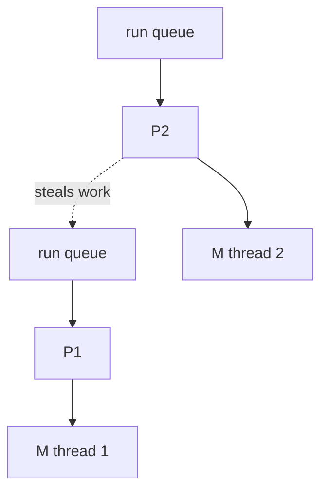

# The GMP Scheduler

Go runs many goroutines on a few OS threads. The scheduler uses three pieces:

- **G** -- a goroutine: a function plus a small, growable stack (starts at a few KB).
- **M** -- a machine: an OS thread that actually runs code.
- **P** -- a processor: a permission slot to run Go code, with its own run queue.
  There are `GOMAXPROCS` of them, usually one per CPU core.

An M must hold a P to run a G. When a goroutine blocks on a channel or a socket, it is parked
and the M picks another G. When a goroutine enters a slow syscall, the P is handed to another M
so other goroutines keep running. Idle Ps steal work from busy ones. Think of Ps as desks, Ms as
workers, and Gs as tasks in each desk's in-tray.

A goroutine that is ready but waiting for a free P is **runnable**. That wait is scheduling
delay, and under heavy CPU load it can be milliseconds or more.

## How swarm-net uses it

- **Goroutines are cheap, so the design uses many.** Two per connection in
  `backend/pkg/network/conn.go`, and up to 256 task goroutines per node
  (`maxInflightTasks` in `backend/pkg/cluster/tasks.go`).
- **One goroutine owns cluster state.** The event loop in `backend/pkg/cluster/node.go` must
  never block, or the whole node stops deciding while still looking alive.
- **Heartbeat timing includes scheduling delay.** With a 500 ms beat and 3 misses, a few ms of
  delay is noise. Very short intervals would cause false failovers under load.
- **Latency scores measure the scheduler too.** A probe's round trip includes both nodes'
  scheduling delay, so a CPU-throttled container scores worse. That is fine for choosing leaders.
- **Leak checks.** `backend/pkg/network/pool_test.go` compares `runtime.NumGoroutine()` before
  and after to catch leaked goroutines.

## Common pitfalls

- **Goroutines without an owner.** Each one needs a clear way to exit, or the count drifts up.
- **Long computation on the event loop.** Everything behind it waits.
- **`GOMAXPROCS` above the container CPU limit.** Recent Go versions read the cgroup limit, but
  check it if timings look odd.
- **Too-tight timers.** Budget for scheduling delay in every timeout.

## Further reading

- [The Netpoller](./go-netpoller)
- [CSP, Channels & The Memory Model](./csp-channels-and-memory-model)
- [Go source: runtime/proc.go](https://github.com/golang/go/blob/master/src/runtime/proc.go)
