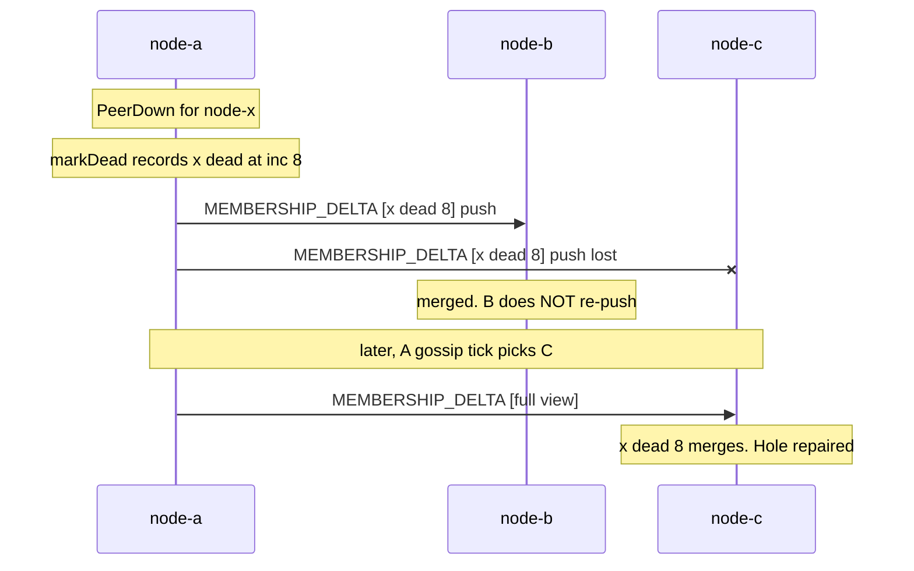
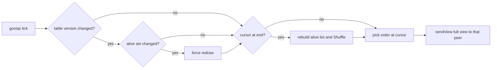

# Gossip and Anti-Entropy

No node holds the membership list. Every node holds its own *belief*, and the beliefs converge
because nodes keep telling each other what they know. That is gossip. It is what
`MEMBERSHIP_DELTA` carries, and it is why two nodes can hold different $N$ at the moment they
each run an election.

This page covers the two ways a record travels in Phase 3b, the repair bound, and the one thing
gossip does not give you. The merge rule that makes it all safe has its own page:
[Monotonic Merge and Incarnation](/concepts/monotonic-merge-and-incarnation).

---

## Core Mental Model

### Two paths, two jobs

| Path | Sends | To | When | Job |
|---|---|---|---|---|
| **Push** (`pushRecord`) | one record | every connected peer | this node saw a death or departure first-hand | fast |
| **Anti-entropy** (`gossipRound`) | the full view | ONE alive peer | every $T_{gossip}$ (default 2 s) | repair |

A push is fast but lossy: a dropped frame or a full send queue leaves a hole. Anti-entropy is
the slow, reliable sweep that fills holes. The name is literal: it reduces the disorder between
two views.



### Epidemics, and why they barely apply here

Classic gossip (Demers et al., 1987) assumes a node can only reach a few random peers per
round. A rumour then spreads like an infection, in about $\log_{1+f} N$ rounds for fanout $f$.

This swarm is a **full mesh** (every node holds a connection to every other). One broadcast
reaches everyone in one hop, so there is no infection curve to climb. What the full mesh does
*not* remove is loss. That is the only reason anti-entropy exists here: not to spread news,
but to repair news that did not arrive.

### Only first-hand deaths are pushed

`pushRecord` fires from `markDead` and `markLeft` only
(`pkg/cluster/node.go:696`, `pkg/cluster/node.go:717`). A record merged from someone else's
delta is not re-pushed.

| Rule | Frames per death |
|---|---|
| push on first-hand observation | about $N$ per observer |
| push on every receipt too | about $N^2$ per observer, most of them no-ops |

In a full mesh the original broadcast already reached everyone, so re-pushing buys nothing
except $N^2$ traffic. A crash that *every* node observes still costs about $N^2$ frames (each
observer broadcasts once), which the comment at `pkg/cluster/node.go:732` accepts because
deaths are rare.

### A full view is just a large delta

There is no snapshot message. `MembershipDeltaPayload` (`pkg/protocol/message.go:390`) is
the only membership payload, and its comment (`pkg/protocol/message.go:386`) says a delta
"asserts facts about the members it names and says nothing about members it omits". The
receiver merges; it never replaces.

That works because `Table.Upsert` (`pkg/cluster/member.go:212`) is per record and
idempotent. Merging a record you already hold returns `false`. So a full view of 50 is 50
independent upserts, most of them no-ops, and the welcome view (`pkg/cluster/node.go:639`),
the gossip view and a one-record push all run through the same code.

---

## Under the Hood

### One gossip round

```go
// pkg/cluster/node.go:799 (abridged)
func (n *Node) gossipRound(ctx context.Context) {
	view := n.table.Snapshot()
	if view.Version != n.gossipVersion {
		n.gossipVersion = view.Version
		if !n.sameGossipSet(view) {
			n.gossipNext = len(n.gossipOrder) // force a redraw below
		}
	}
	if n.gossipNext >= len(n.gossipOrder) {
		// rebuild gossipOrder from the alive peers, excluding self
		n.cfg.Shuffle(n.gossipOrder)
		n.gossipNext = 0
	}
	if len(n.gossipOrder) == 0 {
		return
	}
	peer := n.gossipOrder[n.gossipNext]
	n.gossipNext++
	n.sendView(ctx, peer, view)
}
```

It runs on the node's single event loop, from its own ticker
(`pkg/cluster/node.go:441`, handled at `pkg/cluster/node.go:481`). No lock is held across the
send, and there is no extra goroutine.

### Peer selection: shuffled round-robin, k = 1



| Choice | Why |
|---|---|
| one peer per round ($k = 1$) | a full view is $O(N)$ bytes. $k$ peers per round costs $k$ times that |
| a permutation, not a random pick | a random pick has no bound: by chance a peer can go unvisited for many rounds |
| shuffled, not ID order | ID order makes every node target the same peer on the same tick |
| redraw only when the *alive set* changes | most version bumps are score reports. Redrawing on each would keep resetting the cursor and quietly turn the permutation back into random selection |

`Shuffle` is a config seam (`pkg/cluster/node.go:101`), defaulting to `math/rand/v2`
(`pkg/cluster/node.go:143`). Tests inject a deterministic one.

### The repair bound

Let $P$ be the number of alive peers, so $P = N - 1$. One cycle of the permutation takes $P$
rounds, and every alive peer is visited once in it. A lost death push is repaired within

$$
t_{repair} \le N \times T_{gossip}
$$

The bound holds for a death because the death itself changes the alive set, which forces a
fresh permutation on the next tick. The peer that missed the push is then at most $P$ rounds
away, plus up to one tick of waiting for that first round.

Two caveats worth knowing:

- **A lost update that does not change the alive set** (for example a self-announcement) gets
  no fresh permutation. A peer visited first in one cycle and last in the next waits
  $2P - 1$ rounds, so its worst case is nearly $2N \times T_{gossip}$.
- **Continuous churn** keeps forcing redraws, and a peer can keep landing late in each new
  permutation. The bound assumes the alive set settles.

| $N$ | $T_{gossip}$ | $N \times T_{gossip}$ |
|---|---|---|
| 10 | 2 s | 20 s |
| 50 | 2 s | 100 s |
| 50 | 200 ms | 10 s |

This is a *repair* bound, not the normal path. Normally the push arrives in milliseconds.
Tune it with `SWARM_GOSSIP_INTERVAL` or `-gossip-interval` (`cmd/swarm-node/config.go:60`).

### Receiving a view: one snapshot, binary search

```go
// pkg/cluster/node.go:947, 971-977
before := n.table.Snapshot()
for _, rec := range p.Members {
	// ...
	role := RoleWorker
	if i, ok := slices.BinarySearchFunc(before.Members, rec.ID, compareMemberID); ok {
		role = before.Members[i].Role
	}
	if rec.ID == from {
		role = ParseRole(rec.Role)
	}
	// ... Upsert
}
```

Before commit `4012bf2`, the handler took a `Snapshot` (copy and sort of the whole table) *per
record*. Under anti-entropy every delta is a full view, so that was $O(N^2 \log N)$ on the event
loop. `BenchmarkHandleMembershipDelta` (`pkg/cluster/bench_test.go:184`), steady state:

| $N$ | before | after |
|---|---|---|
| 100 | 817 us, 100 allocs | 14.7 us, 1 alloc |
| 1000 | 125 ms, 1000 allocs | 211 us, 1 alloc |

The binary search is valid only because `Snapshot` sorts by ID
(`pkg/cluster/member.go:417`). `View.Get` scans instead, because it cannot assume an arbitrary
`View` is sorted.

### What gossip can and cannot repair

A receiver believes a **role** only from the member itself, that is when `rec.ID == from`
(`pkg/cluster/node.go:975`). Relayed roles are ignored. State, incarnation, address and score
merge from anyone.

| Field in a gossiped record | Repaired by anti-entropy? |
|---|---|
| death of a third node | yes |
| the *sender's own* role and score | yes, the view includes the sender's own record |
| a third node's role | **no** -- only that node's own announcement moves it |
| a third node's score | yes, relayed scores merge (`TestThreeNodesConvergeThroughGossipAlone`) |

---

## Why It Matters in This Swarm

### Gossip converges. It does not agree.

After enough rounds every view is the same. But at any given instant two views may differ, and
no node ever *knows* that everyone holds its view. Convergence is a property of the limit.
Agreement is a property of a moment, and gossip has no such moment.

`Elect` (`pkg/cluster/election.go:112`) runs on a `View` snapshot and sizes itself from
`view.Alive()` (`pkg/cluster/election.go:115`). Two nodes with different views can compute
different leader sets. `ELECTION_RESULT` (`pkg/protocol/message.go:85`) makes that visible,
and the next gossip round makes the views, and then the elections, converge. Quorum reasoning
needs an *agreed* $n$ -- see [Split-Brain and Quorum](/concepts/split-brain-and-quorum).

### Where the mechanism lives

| What | Where |
|---|---|
| gossip interval default (2 s) | `pkg/cluster/node.go:29` |
| config fields `GossipInterval`, `Shuffle` | `pkg/cluster/node.go:98`, `pkg/cluster/node.go:101` |
| welcome view on every `PeerUp` | `pkg/cluster/node.go:639` |
| first-hand death push | `pkg/cluster/node.go:735` |
| full view send | `pkg/cluster/node.go:753` |
| departure kept as a dead record | `pkg/cluster/node.go:712` |
| self-rumour refutation | `pkg/cluster/node.go:1044` |
| bootstrap seed list in `HELLO` | `pkg/protocol/message.go:264` |
| unknown message types are ignored, not fatal | `pkg/protocol/message.go:30` |

Tests: `pkg/cluster/gossip_test.go` covers one-visit-per-cycle, redraw-only-on-set-change,
push of first-hand deaths only, and the dropped-push repair over real nodes.

---

## Common Failure Modes & Edge Cases

### The immortal alive record

Symptom: a killed node keeps coming back to "alive" in every view, round after round. Cause: a
death recorded at the victim's *current* incarnation loses to a newer "alive" still circulating,
and anti-entropy re-asserts that record every round. Fixed by bumping the incarnation on death.
The full interleaving is on
[Monotonic Merge and Incarnation](/concepts/monotonic-merge-and-incarnation).

### The departed node that re-joins by echo

Symptom: a node that sent `LEAVE` reappears as alive a few seconds later, although its process
is gone. Cause: deleting the record on `LEAVE`. The next peer that had not heard the `LEAVE`
gossips its old "alive" record, and with nothing to outrank it, `Upsert` inserts it as new.
This is why `markLeft` keeps a dead record (`pkg/cluster/node.go:712`) and `Table.Remove`
(`pkg/cluster/member.go:390`) is no longer called by the node.

### Replace instead of merge

Symptom: a node's member count drops to 1 or 2 on every push, then recovers on a gossip tick.
Cause: treating `MEMBERSHIP_DELTA` as a complete view. A one-record push then evicts
everyone it did not name.

### Gossip that looks random

Symptom: under steady score reporting, some peer is occasionally not repaired for far longer
than $N \times T_{gossip}$. Cause: redrawing the permutation on every table version change
instead of on alive-set changes. `TestGossipRedrawsOnlyWhenAlivePeersChange` pins this.

### The event loop stalls on large views

Symptom: at a few hundred nodes, heartbeats and probe results queue up behind membership
handling, and nodes start timing each other out. Cause: per-record snapshots or linear
lookups in the delta handler. One `MEMBERSHIP_DELTA` at $N = 1000$ used to take 125 ms of loop
time.

### Interval too long for the swarm size

Symptom: after a partition heals, some nodes disagree on who is dead for minutes. Cause:
$N \times T_{gossip}$ grew with $N$ and nobody retuned. The cost of shortening $T_{gossip}$ is
one full view ($O(N)$ bytes) per node per tick, so total bytes per second grow as
$N^2 / T_{gossip}$.

---

## See Also

- [Monotonic Merge and Incarnation](/concepts/monotonic-merge-and-incarnation) -- the merge
  rule, and why death bumps the incarnation.
- [Failure Detectors](/concepts/failure-detectors) -- who decides a node is dead in the first
  place.
- [Split-Brain and Quorum](/concepts/split-brain-and-quorum) -- why a converging $n$ is not an
  agreed $n$.
- [Why Not Consensus](/architecture/why-not-consensus) -- the system-level consequence.
- [Wire Protocol Design](/concepts/wire-protocol-design) -- the framing `MEMBERSHIP_DELTA` rides
  on.
