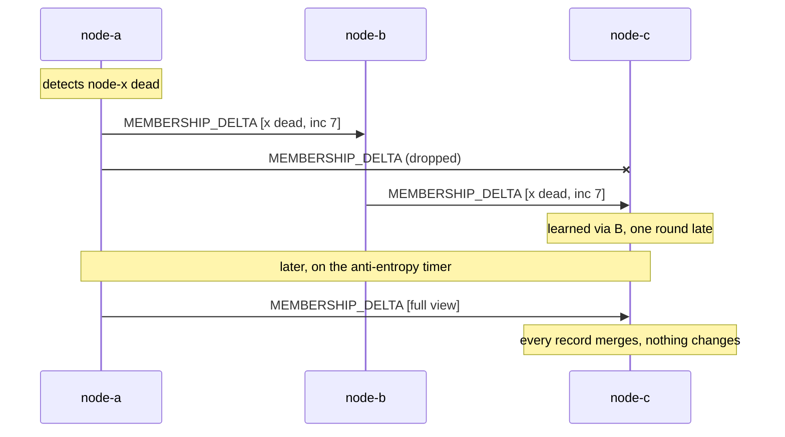

# Gossip and Anti-Entropy

Membership in this swarm is not stored anywhere. Every node holds its own belief about who is in
the swarm, and the beliefs converge because nodes tell each other what they know. That is
gossip. It is the discovery mechanism chosen in `docs/WORKLOG.md` section 2.2, it is what
`MEMBERSHIP_DELTA` carries, and it is the reason two nodes can hold different $N$ at the
instant they each run an election.

This page covers the mechanism, the arithmetic of how fast it converges, the merge rule that
makes it correct, and the one thing it does not do.

---

## Core Mental Model

### Epidemics

A rumour spreads through a population the way an infection does. Each round, every node that
knows the rumour tells $f$ random peers (the *fanout*). Nodes that already know it ignore the
repeat. With $N$ nodes and fanout $f$, the number of infected nodes grows roughly as
$(1+f)^r$ until saturation, so the number of rounds to reach everyone is

$$r \approx \log_{1+f} N + c$$

where $c$ is a small constant covering the tail (the last few uninfected nodes take longer,
because random peer selection keeps hitting nodes that already know). For $N = 20$ and $f = 3$,
that is about 3 rounds. For $N = 1000$, about 6. The point is not the exact number; it is that
the exponent is on $N$, so doubling the swarm adds one round, not double the rounds.

| $N$ | $f = 1$ | $f = 2$ | $f = 3$ |
|---|---|---|---|
| 10 | ~4 | ~3 | ~2 |
| 20 | ~5 | ~3 | ~3 |
| 100 | ~7 | ~5 | ~4 |
| 1000 | ~10 | ~7 | ~5 |

Rounds to reach every node, approximately. Real convergence is a distribution around these.

### Push deltas and pull repair

Two things travel over gossip, and they are different messages for different reasons:

| Mode | Carries | Triggered by | Purpose |
|---|---|---|---|
| **Push delta** | the records that just changed | an event: join, suspect, death, role change | fast propagation of new facts |
| **Anti-entropy** | the full local view | a timer | repair of anything a delta missed |

Deltas are fast but lossy: a dropped frame, a node that was partitioned when the delta went out,
or a queue that shed a message under backpressure all leave a hole. Anti-entropy is the
periodic full-view exchange that fills holes. Its name is literal: it reduces the disorder
between two views.



### Why a full view is just a large delta

`MembershipDeltaPayload` at `pkg/protocol/message.go:352` is the only membership message. There
is no separate snapshot type. The comment at `pkg/protocol/message.go:348` fixes the semantics:
a delta "asserts facts about the members it names and says nothing about members it omits", so
the receiver must *merge*, never *replace*.

That works only because the merge is per record and idempotent. `Table.Upsert` at
`pkg/cluster/member.go:165` applies one rule to every record regardless of how many arrive:

```go
// pkg/cluster/member.go:177
case m.Incarnation > existing.Incarnation:
	// full overwrite, including a return to alive
case m.Incarnation < existing.Incarnation:
	return false
default:
	// equal incarnation: state may only worsen
	if m.State < existing.State {
		m.State = existing.State
	}
	...
}
```

Merging a record you already hold returns `false` and changes nothing. Merging a full view is
therefore $N$ independent upserts, most of which are no-ops. A delta with one record and a
full view with fifty go through the same code path, and the sender never has to know which the
receiver needs.

---

## Under the Hood

### The merge rule as a lattice

The reason gossip converges rather than oscillates is that the merge is a *join* on a partial
order. For each node, the order is:

1. Higher `Incarnation` beats lower, unconditionally.
2. At equal `Incarnation`, `alive < suspect < dead`; the merge takes the max.

Any two views merged in any order, any number of times, reach the same result. That is the
property (associative, commutative, idempotent) that lets a node receive the same rumour from
five peers, in five different orders, interleaved with older rumours, and end up with one
answer.

The comment at `pkg/cluster/member.go:163` names what breaks without rule 2: two nodes with
different beliefs at the same incarnation would each "correct" the other forever. Rule 2 makes
one direction of correction impossible.

Defect 2 in `docs/WORKLOG.md` section 4.3 is the practical lesson: the clamp at
`pkg/cluster/member.go:187` runs *before* role and address are compared. A record that arrives
to change a role carries whatever `State` its sender believed, and if the clamp were after the
role comparison, that stale `alive` would resurrect a buried node. The order of the two checks
is the correctness argument, not a style choice.

### Incarnation: who is allowed to say "I am alive"

`Incarnation` (`pkg/cluster/member.go:81`, wire form at `pkg/protocol/message.go:334`)
increases when a node restarts. Only a higher incarnation can move a record from dead back to
alive, and only the node itself ever issues a higher incarnation for itself. So:

| Claim | Who can make it | How |
|---|---|---|
| "X is suspect" | anyone whose detector fired | delta at X's current incarnation, state suspect |
| "X is dead" | anyone whose suspicion expired | delta at X's current incarnation, state dead |
| "X is alive after all" | only X | delta at a *higher* incarnation |

This is SWIM's refutation mechanism (Das, Gupta, Motivala, 2002). A node hears a rumour that it
is suspect, bumps its own incarnation, and gossips itself alive. Every peer's `Upsert` accepts
the higher incarnation and drops the rumour. The accused clears its own name; nobody else needs
to vote.

The version counter in `View` (`pkg/cluster/member.go:94`) and `ViewVersion` on the wire
(`pkg/protocol/message.go:357`) are *not* part of this order. They are per-sender monotonic
counters for detecting a stale local snapshot, and the comment on the wire field says they
cannot be compared across nodes. Only `Incarnation` orders claims about a given node.

### Suspicion buys accuracy without a longer timeout

A detector that goes straight from alive to dead has to be conservative, because there is no
undo. SWIM inserts a *suspect* state between them (`pkg/cluster/member.go:44`), which is a
public accusation with a deadline. During that window the accused can refute. That lets the
detector fire *earlier* with the same false-positive cost, because a false positive is now
corrected by the victim in one gossip round instead of by the accuser waiting longer. The
trade is covered from the detector's side in [Failure Detectors](/concepts/failure-detectors).

### Voluntary departure is a removal, not a rumour

`LEAVE` (`pkg/protocol/message.go:95`) calls `Table.Remove` (`pkg/cluster/member.go:232`),
which deletes the record outright rather than marking it dead. A dead record has to stay in the
table so that a lower-incarnation rumour arriving late is recognised and dropped. A node that
left on purpose has no rumour to outlive, so its record can go.

---

## Why It Matters in This Swarm

### Gossip converges. It does not agree.

This is the sentence the whole page exists to justify. After enough rounds, every node's view is
the same. But at any given instant, two nodes may hold different views, and there is no moment
at which any node *knows* that everyone else holds the same view it does. Convergence is a
property of the limit; agreement is a property of a moment, and gossip has none.

`Elect` at `pkg/cluster/election.go:107` runs against a `View` snapshot
(`pkg/cluster/member.go:245`). Two nodes with different views compute different `Result.Size`
values and may compute different leader sets. Nothing reconciles those results; the
`ELECTION_RESULT` message (`pkg/protocol/message.go:84`) publishes them so the disagreement is
visible on the dashboard, and the next gossip round makes the views converge, after which the
next election converges too. That is eventually consistent leadership, and it is the reason
[Split-Brain and Quorum](/concepts/split-brain-and-quorum) is a separate page: quorum reasoning
needs an agreed $n$, and gossip only ever offers a converging one.

### Where the mechanism lives

- `HelloPayload.KnownPeers` (`pkg/protocol/message.go:263`) seeds a joining node's first
  view, so a node only needs one seed address to bootstrap into the rest.
- Unknown message types are ignored, not rejected (`pkg/protocol/message.go:29`). A rolling
  upgrade adds a message type; gossip must not fail on the old nodes.
- `Table.Snapshot` (`pkg/cluster/member.go:245`) returns an ID-sorted copy. Election
  determinism depends on this order, so the view a node gossips and the view it elects from are
  the same bytes.

---

## Common Failure Modes & Edge Cases

### The oscillating node

Symptom: a node flips alive/dead/alive/dead in every peer's log, indefinitely. Cause: a merge
rule that lets equal-incarnation state improve, or a node that does not bump its incarnation on
restart. `TestAtEqualIncarnationStateOnlyWorsens` in `pkg/cluster/member_test.go` pins the
first; the second presents as a restarted node that stays dead in everyone's view until they
happen to probe it.

### The immortal rumour

Symptom: a node that restarted is still marked dead by one peer, and no delta fixes it. Cause:
the restarted node's incarnation is *not higher* than the one the rumour carried. Incarnation
must be strictly monotonic per node across restarts, which is why it is a start timestamp
(`pkg/protocol/message.go:259`) and not a counter that resets to zero.

### Replace instead of merge

Symptom: a node's view shrinks to whatever the last delta named, and every other member vanishes
until anti-entropy repairs it. Cause: a receiver treated `MEMBERSHIP_DELTA` as a snapshot. The
payload comment at `pkg/protocol/message.go:348` forbids this. The tell is a membership count
that drops to 1 or 2 on every delta and recovers on the anti-entropy tick.

### Election on a half-converged view

Symptom: two leader sets announced for a few hundred milliseconds after a node joins or dies.
Cause: none, this is the design. The views differ for $O(\log N)$ rounds. What would be a bug
is a node acting *irreversibly* on that transient result, which is why tasks must be
re-issuable -- see [Idempotence and Hysteresis](/concepts/idempotence-and-hysteresis).

### Fanout too low for the loss rate

Symptom: membership converges in the demo but not under a chaos run that drops frames. Cause:
with $f = 1$ a single dropped delta breaks the only infection path from that sender. Anti-entropy
still repairs it, but at its timer period rather than in $O(\log N)$ rounds. Raise $f$ or
shorten the anti-entropy interval; both cost bandwidth proportional to $N \cdot f$.

---

## See Also

- [Failure Detectors](/concepts/failure-detectors) -- who decides a node is suspect in the first
  place.
- [Split-Brain and Quorum](/concepts/split-brain-and-quorum) -- why a converging $n$ is not an
  agreed $n$.
- [Why Not Consensus](/architecture/why-not-consensus) -- the system-level consequence.
- [Wire Protocol Design](/concepts/wire-protocol-design) -- the framing `MEMBERSHIP_DELTA` rides
  on.
