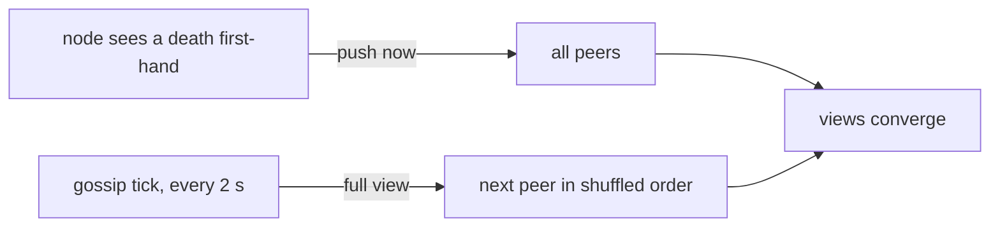

# Gossip and Anti-Entropy

**Gossip** spreads information the way rumours spread in an office: each person tells a few
others, and soon everyone knows. There is no central coordinator. **Anti-entropy** is the repair
half: nodes regularly compare what they know and fix any differences, so a lost message is
eventually made up for. Together they make every node's view of the cluster **converge**, even
though at any given moment two views may differ.

swarm-net uses two paths:

- **Push** is fast but best-effort. Only news a node observed itself is pushed. Relayed news is
  not re-pushed, which would multiply messages.
- **Anti-entropy** is slow but reliable. Each round sends the whole view to one peer. A full view
  is merged like any other update, so it simply fixes whatever differs.

## How swarm-net uses it

- **Gossip interval** is `DefaultGossipInterval` (2 s) in `backend/pkg/cluster/node.go`.
- **Round robin with shuffling.** `gossipRound` walks a shuffled list of alive peers, so every
  peer is visited once per cycle. The list is only redrawn when the set of peers changes.
- **First-hand deaths are pushed** by `pushRecord`, as a `MEMBERSHIP_DELTA` broadcast.
- **Dead records are kept for a while** (tombstones, 60 s by default) so an old "alive" copy
  still circulating cannot bring a dead node back.
- **Nodes defend themselves.** `refuteIfNeeded` answers a false rumour about this node.
- **Tests** are in `backend/pkg/cluster/gossip_test.go`.

## Common pitfalls

- **Replacing views instead of merging.** A newer local fact gets overwritten by an older copy.
- **Tombstones that expire too soon.** A departed node gets revived by an old echo.
- **Gossip interval too long for the swarm size.** One full cycle takes about $N \times 2$ s, so
  repair slows down as the swarm grows.
- **Treating convergence as agreement.** Two nodes can briefly compute different leaders. See
  [Split-Brain and Quorum](./split-brain-and-quorum).

## Further reading

- [Monotonic Merge & Incarnation](./monotonic-merge-and-incarnation)
- [Failure Detectors](./failure-detectors)
- [Demers et al., Epidemic Algorithms (1987)](https://dl.acm.org/doi/10.1145/41840.41841)
